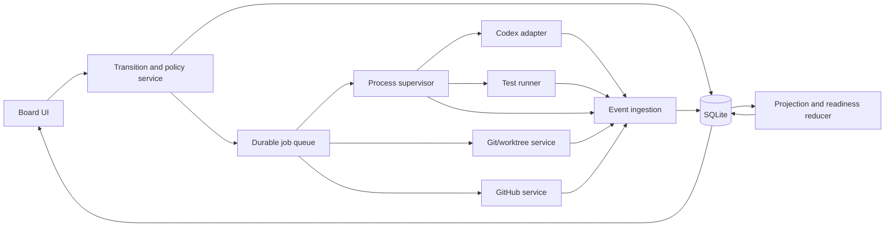

# Codex Task Board for macOS: Feasibility and Architecture Report

Research date: June 20, 2026

## 1. Executive summary

### Verdict

The product is technically feasible.

The difficult part is not the Kanban board or launching Codex. The difficult part is maintaining trustworthy state across:

- Human workflow intent
- Codex turns
- Operating-system processes
- Git worktrees and branches
- Local tests
- GitHub pull requests
- CI checks
- Reviews
- Merge state

The strongest product is not “Trello for Codex.” That positioning is easy to understand but weakly differentiated. The better definition is:

> A local-first delivery cockpit for supervising parallel coding-agent work, showing what is running, what needs intervention, and what is actually ready to ship.

The board should be an operational projection over real evidence, not a second project-management system.

### Recommended decisions

| Area | Recommendation |
|---|---|
| Product wedge | Evidence-first supervision of multiple local coding-agent tasks |
| Hackathon stack | Electron, React, TypeScript, static Vite frontend |
| Production macOS stack | SwiftUI/AppKit UI, signed local runner service, SQLite/GRDB |
| Cross-platform production alternative | Tauri 2, React, Rust runner, SQLite |
| MVP Codex integration | Stable `codex exec --json` child processes |
| Production Codex integration | Pinned Codex App Server over stdio, behind an adapter |
| Repository isolation | One task, one branch, one worktree |
| Production Git storage | App-managed bare anchor repository per onboarded repo |
| MVP GitHub auth | Existing `gh` CLI login; do not extract its token |
| Production GitHub auth | GitHub App with selected-repository access and webhook relay |
| Persistence | SQLite event log and projections; large artifacts on disk |
| Completion default | A PR-based task is delivered only when GitHub reports it merged |
| Distribution | Developer ID signing and notarization outside the Mac App Store |

### Critical product finding

Codex itself, Linear, Cursor, and Claude Code now cover substantial parts of agent-task execution. In particular:

- The Codex app already supports parallel threads, worktrees, diffs, Git actions, and automations.
- Linear supports coding sessions launched from issues.
- Cursor and Claude Code support parallel or automated agent workflows.

Therefore, a board UI is not a durable differentiator. The product must win on:

1. Local execution truth.
2. Evidence-based readiness.
3. Intervention management.
4. Safe isolation and recovery.
5. Integration with existing issue systems rather than replacing them.

### Critical technical finding

Current public Codex integration is stronger than the original premise assumed:

- `codex exec` is a stable non-interactive interface with JSONL events.
- Official TypeScript and Python Codex SDKs exist.
- Codex App Server is documented as the rich-client integration surface and is open source.
- App Server exposes threads, turns, streaming events, approvals, cancellation, and history.
- The installed Codex desktop app itself still does not expose a documented API for external control.

The product should integrate with Codex CLI, SDK, or App Server. It should not automate the Codex desktop UI or depend on private app internals.

---

## 2. Product definition and positioning

### One-sentence definition

A local-first agent delivery cockpit that converts engineering tasks into isolated, observable, human-gated Codex work ending in reviewable and verifiably delivered code.

### Target user

The initial user should be:

- A senior individual contributor, tech lead, indie developer, or small-team founder.
- Already comfortable delegating implementation work to coding agents.
- Managing at least three concurrent tasks.
- Working from local repositories where existing tools, credentials, and build environments matter.

Poor initial targets:

- Product managers who do not work in local repositories.
- Large teams needing shared roadmaps, reporting, and complex role controls.
- Developers who run one agent task at a time.
- Teams satisfied with agent sessions embedded directly in Linear or another issue tracker.

### Core job

The primary job is not moving cards. It is:

> Tell me what my coding agents are doing, what I can trust, and where I need to intervene.

The useful control loop is:

```text
Intent
  → isolated execution
  → observed evidence
  → human decision
  → delivery action
  → remote reconciliation
```

### Differentiation

| Existing product | What it already does | Remaining opportunity |
|---|---|---|
| Codex app | Parallel threads, local/worktree execution, diffs, Git actions, automations | Cross-task operational board, evidence reconciliation, intervention queues |
| Codex Automations | Scheduled background Codex work | User-driven delivery workflow and current technical truth |
| Codex CLI | Runs local coding tasks | Durable multi-task orchestration and visual evidence |
| GitHub Projects | Planning views tied to issues and PRs | Local processes, worktrees, uncommitted changes, local tests |
| Jira, Trello, Linear | Collaborative planning and workflow | Local agent runtime and repository state |
| GitHub Actions | Event-driven remote execution | Human supervision, local environment, and task-level decisions |
| Cursor/Claude Code | Agent sessions and automated workflows | Provider-neutral operational control and independent evidence |

### Why this is more than automation

It is more than automation only if it:

- Preserves task intent and prompt versions.
- Reconciles independent sources of truth.
- Detects stale and contradictory state.
- Requires evidence before delivery.
- Supports cancellation, retries, approvals, and rollback.
- Keeps an audit trail.

If a drag merely invokes a command and moves the card when exit code `0` is returned, the product is automation with a Kanban skin.

### Strongest use case

Well-scoped maintenance work in established repositories:

- Bug fixes
- Missing tests
- Localized refactors
- Documentation changes
- Dependency updates
- Lint, type, and CI repairs

These tasks have measurable outcomes and reviewable diffs.

### Weakest assumptions

- Users want another board to maintain.
- Agent work follows a clean linear lifecycle.
- Codex completion means engineering completion.
- A local application can become the team-wide source of truth.
- Users prefer manual dragging for every transition.
- Codex-specific orchestration creates a durable moat.

The product should import or link existing issues. It should not require duplicate task entry as a default.

---

## 3. macOS implementation feasibility

### Stack comparison

| Stack | UI and drag/drop | Local execution | Security/distribution | MVP speed | Production judgment |
|---|---|---|---|---|---|
| SwiftUI/AppKit | Best native behavior; complex board and diff UI take more work | Strong via `Process`, XPC, ServiceManagement | Best native signing and Keychain integration | Slowest | Best if macOS-only is strategic |
| Electron | Mature React board, terminal, diff, and virtualization libraries | Strong via Node main process | Larger bundle; renderer/main IPC must be tightly constrained | Fastest | Good after validation if footprint is acceptable |
| Tauri 2 | React UI using WKWebView | Strong typed Rust backend | Small bundle, capability model, signed updater | Medium | Best cross-platform compromise |
| React Native macOS | Adequate, but desktop controls often need native modules | Requires native bridges | Native Xcode pipeline | Medium-slow | Use only if an existing RN codebase makes sharing decisive |
| Next.js local server/wrapper | Good web UI | Requires server lifecycle and native bridge | Adds local HTTP attack surface and packaging complexity | Deceptively fast | Avoid unless a browser product is also required |
| Menu-bar/helper only | Poor fit for board UX | Good background supervision | Extra helper lifecycle and signing work | Not viable alone | Useful secondary production surface |

### MVP recommendation

Use:

- Electron Forge
- React and TypeScript
- Vite static renderer
- `dnd-kit`
- A narrow preload bridge
- Node `child_process.spawn`
- Atomic JSON for a two-day demo, or SQLite if setup is already available
- JSONL files for raw Codex events

Security requirements:

- `nodeIntegration: false`
- `contextIsolation: true`
- Renderer sandbox enabled
- No generic `runCommand` IPC
- Validate every IPC payload
- Keep Git, Codex, test, and filesystem access in the main process

### Production recommendation

If macOS remains the only strategic platform:

```text
SwiftUI/AppKit UI
    ↕ typed XPC
Signed local runner/helper
    ├─ Codex adapter
    ├─ Git/worktree service
    ├─ test runner
    ├─ process supervisor
    └─ artifact/log writer
        ↕
SQLite/GRDB
```

Use:

- SwiftUI for navigation, board, settings, notifications, and menus.
- Selective AppKit interop for advanced diff/log views.
- XPC or `SMAppService` for a private runner that survives UI window closure.
- GRDB over SwiftData for explicit schema migrations, event queries, and transactions.
- Sparkle with signed updates.
- Developer ID, hardened runtime, notarization, and stapling.

If Windows or Linux is likely:

- Keep the React UI.
- Move privileged execution into Rust.
- Adopt Tauri 2.
- Preserve the same database and runner protocol.

### Why not the Mac App Store first

This application must:

- Access repositories in arbitrary user-selected locations.
- Execute Git, Codex, package managers, compilers, and tests.
- Use developer caches, SDKs, credential helpers, and potentially SSH agents.

The App Sandbox can make these workflows fragile. The practical initial route is direct, signed, notarized distribution outside the Mac App Store with application-level repository trust and permission controls.

---

## 4. Recommended runtime architecture



### Component responsibilities

#### UI

- Sends typed commands.
- Displays persisted state and projections.
- Never launches shell commands directly.
- Never writes technical status fields.

#### Transition service

- Creates durable transition requests.
- Evaluates guards.
- Applies optimistic concurrency with `phase_version`.
- Schedules actions.
- Commits a board transition only at the defined success point.

#### Job queue

- Persists jobs and attempts.
- Survives app restarts.
- Enforces concurrency.
- Prevents blind retries of ambiguous side effects.

#### Process supervisor

- Owns process groups.
- Captures stdout and stderr separately.
- Persists PID, start identity, exit code, and signal.
- Performs graceful cancellation escalation.
- Reconciles orphaned jobs after a crash.

#### Codex adapter

- Supports an internal interface independent of the transport:

```ts
interface AgentRunner {
  preflight(): Promise<RunnerHealth>;
  start(request: RunRequest): Promise<RunHandle>;
  continue(request: ContinueRequest): Promise<RunHandle>;
  cancel(runId: string): Promise<void>;
}
```

- MVP implementation: `CodexExecRunner`.
- Production implementation: `CodexAppServerRunner`.
- Demo fallback: clearly labeled `ScenarioRunner`.

#### Git service

- Owns all Git commands.
- Uses machine-readable porcelain formats.
- Serializes shared Git metadata mutations per repository.
- Never uses generic shell strings.

#### Test runner

- Runs approved executable and argument arrays.
- Associates results with an exact Git generation.
- Distinguishes failed tests from execution errors.

#### GitHub service

- Uses `gh` for MVP operations.
- Polls active PRs.
- Later consumes GitHub App webhooks through a relay.
- Reconciles authoritative API state after every webhook.

#### Reducer

- Deterministically computes:
  - readiness
  - health
  - conflicts
  - stale state
  - recommended next actions

### Concurrency

Safe defaults:

- Global Codex concurrency: 2–4.
- One mutating agent or test workflow per worktree.
- Parallel read-only work only against immutable snapshots.
- Serialize these operations per repository:
  - fetch
  - worktree add/remove/repair/prune
  - branch creation/deletion
  - maintenance/GC
  - pushes to the same destination ref

---

## 5. Codex integration

### Verified integration options

| Interface | Maturity/use | Recommendation |
|---|---|---|
| `codex exec` | Stable, non-interactive, JSONL output | MVP default |
| TypeScript SDK | Programmatic wrapper suitable for Node helpers | Good Electron path |
| Python SDK | Controls local App Server; currently documented as beta | Useful for Python services |
| Codex App Server | Rich JSON-RPC client interface; CLI command is experimental | Production target with version pinning |
| Interactive TUI | Human terminal interface | Do not automate |
| Codex desktop app | Can be opened or deep-linked; no documented external run-control API | Optional handoff only |
| Codex GitHub Action | Hosted CI/review/fix workflows | Use for remote CI workflows |
| Responses API/custom runner | Maximum control, but requires rebuilding sandbox and agent runtime | Strategic fallback, not MVP |

### Open-source status

Officially documented open-source components include:

- Codex CLI
- Codex SDK
- Codex App Server
- Skills
- Universal cloud environment

The official inventory does not identify the installed Codex desktop application as open source. Do not depend on private desktop-app internals.

### MVP invocation

Spawn `codex` with an argument array. Pass the prompt through stdin:

```bash
codex --ask-for-approval never exec \
  --json \
  --sandbox workspace-write \
  --cd "$WORKTREE" \
  -
```

Do not interpolate a prompt into a shell command.

### Output handling

With `--json`, stdout is a JSONL event stream containing events such as:

- `thread.started`
- `turn.started`
- `item.started`
- `item.completed`
- `turn.completed`
- `turn.failed`
- `error`

Persist:

- Raw JSONL
- Raw stderr
- Parsed normalized events
- Thread/session ID
- PID and process-group ID
- Exit code or termination signal
- Last agent message

Use both provider and OS facts:

```text
Codex terminal event + process exit = execution outcome
Git snapshot + tests + delivery policy = engineering outcome
```

A failed command item does not necessarily mean the Codex turn failed; Codex may recover. Exit code `0` does not prove the task is correct.

### Authentication

Local `codex exec` reuses the saved CLI authentication by default.

Rules:

- Do not copy `~/.codex/auth.json`.
- Treat it as a password.
- Do not pass API keys to repository-controlled processes.
- Do not expose credentials as a broad job-level environment.
- Allow the user to select a Codex executable if a GUI launch cannot find the terminal `PATH`.

### Permissions

For unattended `codex exec`:

- Set `--ask-for-approval never`.
- Use `workspace-write` for implementation.
- Use `read-only` for review and PR description generation.
- Keep network disabled unless a workflow explicitly needs it.
- Do not grant the parent checkout with `--add-dir`.
- Treat denied actions as visible run failures or blockers.

`codex exec` cannot provide a rich approval conversation. Use App Server when the product needs to pause, explain an approval, and resume.

### Cancellation

1. Persist `CANCEL_REQUESTED`.
2. Send `SIGINT`.
3. Continue draining output for 10–20 seconds.
4. Send `SIGTERM` if still running.
5. Use `SIGKILL` only as the final fallback.
6. Reconcile Git state.
7. Mark completed, canceled, or orphaned based on observed outcome.

Never mark a task canceled at button-click time while the process may still write files.

### Resumption

Store the exact thread/session ID:

```bash
codex exec resume --json "$THREAD_ID" -
```

Do not use `--last` in a concurrent task board.

Resume when:

- Intent is unchanged.
- Worktree is unchanged.
- The user is supplying feedback or a localized repair.

Start a new thread when:

- Scope materially changed.
- Base/worktree changed.
- Repository instructions changed.
- Independent review is required.
- The prior context is dominated by failed assumptions.

### Production App Server

Start over stdio:

```bash
codex app-server --listen stdio://
```

Generate protocol bindings from the exact pinned Codex version:

```bash
codex app-server generate-json-schema --out ./schemas
codex app-server generate-ts --out ./schemas
```

Use stdio or a private Unix socket. WebSocket transport is documented as experimental and should not be exposed remotely.

Production topology:

```text
macOS UI
  → private runner
    → pinned Codex App Server
      → multiple threads
        → one isolated worktree per task
```

---

## 6. Repository and worktree model

### Core rule

Use one branch and one worktree per task.

```text
Task
  ├─ immutable base SHA
  ├─ task branch
  ├─ app-owned worktree
  ├─ Codex thread(s)
  └─ Git/test/delivery evidence
```

### MVP model

Attach linked worktrees to the user’s existing clone:

```bash
git -C "$REPO" worktree add \
  --lock \
  --reason "AgentBoard task $TASK_ID" \
  -b "$BRANCH" \
  "$WORKTREE" \
  "$BASE_OID"
```

Safeguards:

- Never run an agent in the primary checkout.
- Never use `--force` or `-B`.
- Never switch the primary checkout’s branch.
- Never automatically stash, reset, restore, or clean.
- Never run unscoped worktree prune.

### Production model

Use an app-managed bare anchor per repository:

```text
~/Library/Application Support/AgentBoard/
  anchors/<repo-id>.git
  worktrees/<repo-id>/<task-id>/
  artifacts/<task-id>/
  snapshots/<task-id>/
```

Benefits:

- Primary checkout is untouched.
- Dirty user files do not affect tasks.
- Stable location for worktree metadata.
- App controls locking and cleanup.
- User moving the original checkout does not orphan agent work.

Tradeoff: extra disk usage and separate dependency/LFS setup.

### Branch naming

```text
agentboard/<task-short-id>-<slug>
```

Example:

```text
agentboard/01JZ4K9M-fix-login-timeout
```

Validate with:

```bash
git check-ref-format --branch "$BRANCH"
```

Detect case-insensitive collisions on macOS.

### Repository onboarding

Use explicit folder selection. Do not scan the entire home directory.

Inspect:

```bash
git -C "$REPO" rev-parse --show-toplevel
git -C "$REPO" rev-parse --path-format=absolute --git-common-dir
git -C "$REPO" rev-parse HEAD
git -C "$REPO" worktree list --porcelain -z
git -C "$REPO" status --porcelain=v2 --branch -z
git -C "$REPO" remote -v
```

Base branch precedence:

1. `.agentboard.yml`
2. `origin/HEAD`
3. GitHub default branch
4. Explicit user selection
5. Current branch as a last-resort suggestion

Store both the base ref and immutable base SHA.

### Dirty source repositories

A dirty primary checkout does not block a task created from a committed SHA.

If uncommitted work must be included, require one of:

- Commit it.
- Explicitly import a reviewed patch/snapshot.
- Postpone the task.

Never stash automatically.

### Git state inspection

Use machine-stable formats:

```bash
git -C "$WORKTREE" status \
  --porcelain=v2 \
  --branch \
  --untracked-files=all \
  -z

git -C "$WORKTREE" diff \
  --no-ext-diff \
  --no-textconv \
  --name-status \
  "$BASE_OID"
```

Track separately:

- Base-to-HEAD committed delta.
- Staged changes.
- Unstaged changes.
- Untracked files.
- Conflicts.
- Ahead/behind counts.
- Merge/rebase/cherry-pick state.

### Cleanup

Normal cleanup requires:

- No active process.
- No unresolved Git operation.
- Clean worktree or an explicit snapshot/abandon decision.
- Commits pushed, merged, bundled, or knowingly abandoned.
- Final audit snapshot.

Never force-remove a dirty worktree automatically.

---

## 7. Status model

The complete model is documented in [STATUS_MODEL_REPORT.md](./STATUS_MODEL_REPORT.md).

### Core rule

Do not use one status field for everything.

Canonical task lifecycle:

```text
TaskLifecycle = {
  workflow_phase,
  resolution,
  current_iteration_id,
  phase_version
}
```

Independent technical vector:

```text
TechnicalState = {
  requested_action,
  codex_run,
  os_process,
  worktree,
  git,
  tests,
  github_issue,
  github_pull_request,
  ci_checks,
  reviews,
  merge
}
```

Readiness, health, conflicts, and recommended actions are derived projections.

### Source-of-truth matrix

| Dimension | Source of truth |
|---|---|
| Board phase | Local application database |
| Requested action | Durable transition/action record |
| Codex run | Codex event stream |
| OS process | Process supervisor |
| Worktree | Git worktree inventory and filesystem verification |
| Git | Fresh Git commands in the task worktree |
| Local tests | App-owned test runner |
| GitHub issue | GitHub API |
| Pull request | GitHub API |
| CI/checks | GitHub Checks and commit statuses for the current head SHA |
| Reviews | GitHub reviews, review requests, and merge requirements |
| Merge | GitHub merged fields/endpoint |

### Default workflow

Full internal phases:

```text
BACKLOG
READY
IN_PROGRESS
REVIEW
TESTING
PR_READY
IN_REVIEW
DONE
BLOCKED
CANCELED
ARCHIVED
```

The user-facing production board may simplify these to:

```text
Backlog → Ready → Running → Needs You → Shipping → Delivered
```

Technical badges retain the detailed state.

### Completion policy

Each task must declare one:

- `MERGED` — default for PR-based work.
- `MERGED_AND_VERIFIED`
- `LOCAL_ACCEPTANCE`
- `ARTIFACT_ACCEPTANCE`
- `ISSUE_CLOSED`
- `MANUAL`

The application must not silently change completion policy to permit a drag.

### Important conflict behavior

#### Codex completed, tests failed

- Codex remains `COMPLETED`.
- Tests are `FAILED`.
- Task is not ready to ship.
- Offer rerun, repair, override with reason, or block.

#### Codex completed, no diff

- Do not move to review automatically.
- Distinguish “no change needed” from “agent produced nothing.”
- Require evidence or user acceptance.

#### Local work ready, PR still open

- Board remains in remote review/shipping.
- Display “Locally ready; awaiting remote completion.”

#### PR merged manually

- GitHub merge observation is authoritative.
- Auto-complete under `MERGED`.
- Cancel or flag any still-running local mutation.

#### CI fails after merge

- Keep the irreversible merge fact.
- Show a late-failure finding.
- Create a follow-up task instead of pretending the merge was undone.

#### User drags against technical truth

- User controls workflow intent.
- The drag cannot rewrite GitHub, Git, tests, or process facts.
- Hard-reject an unmerged PR moved to Done under `MERGED`.
- Bind overrides to the exact Git generation and require a reason.

### Staleness

Every observation stores:

- source
- source event ID
- observed time
- received time
- generation key
- stale time

Test evidence is valid only for:

- The tested `HEAD`.
- The tested dirty-worktree fingerprint.

CI and reviews are valid only for the current PR head SHA.

---

## 8. Drag-and-drop transition behavior

A drag creates a durable transition request. It does not immediately mutate the canonical board state when side effects are involved.

| Transition | Action | Commit point | Failure |
|---|---|---|---|
| Backlog → Ready | Validate/refine prompt | Prompt/spec accepted | Stay Backlog |
| Ready → In Progress | Create worktree and start Codex | Worktree exists and process is running | Stay Ready if launch never starts |
| In Progress → Review | Stop mutation, inspect diff, optional read-only review | Current diff exists and review starts | Stay In Progress; show no-diff/error |
| Review → Testing | Run approved tests | Test process starts | Stay Review if launch fails |
| Testing → PR Ready | Generate delivery artifacts | Current-generation test policy passes | Stay Testing |
| PR Ready → In Review | Commit/push/create or locate PR | GitHub confirms matching open PR | Stay PR Ready and reconcile |
| In Review → Done | Usually reconciliation only | Completion policy is satisfied | Reject invalid manual completion |
| Any → Blocked | Record human reason, optionally cancel | Block decision accepted | Keep original phase if required cancellation is unresolved |

### Movement modes

- Optimistic: metadata-only and easily reversible.
- Pending: visually show `Starting…`; commit after action begins.
- Final-only: move only after evidence is verified.

Recommended:

- Reordering: optimistic.
- Starting Codex: pending.
- Starting tests: pending.
- Shipping after tests: final-only.
- Opening a PR: pending.
- Delivered: final-only.

### Auto-move policy

Auto-move only for objective or directly requested outcomes:

- Run successfully starts → Running.
- Matching PR is created → In Review/Shipping.
- PR is merged → Delivered.

Suggest rather than force:

- Codex finished with a diff → Review.
- Tests passed → PR preparation.
- Review approved → Merge readiness.

Never auto-move:

- Codex finished with no diff.
- Tests failed.
- PR closed without merge.
- Stale or unknown remote state.

---

## 9. GitHub integration

### MVP: `gh`

Use:

```bash
gh auth status --hostname github.com
git push --set-upstream origin HEAD
gh pr create --draft --title "..." --body-file pr-body.md
gh pr view --json number,state,isDraft,mergedAt,reviewDecision,statusCheckRollup,url,headRefOid
```

Rules:

- Do not call `gh auth token`.
- Do not import its token into the app.
- Use JSON output.
- Pin a minimum supported `gh` version.
- Require explicit hostname and repository.
- Treat SAML and missing permissions as recoverable states.

### Production: GitHub App

Use:

- Selected-repository installation.
- Installation tokens for background app operations.
- User access tokens for user-attributed operations.
- A backend webhook relay.
- Existing local Git/SSH credentials for branch pushes.

Never ship a GitHub App private key inside the desktop application.

Suggested permissions:

| Permission | Level |
|---|---|
| Metadata | Read |
| Pull requests | Read/write |
| Issues | Optional read/write |
| Checks | Read |
| Commit statuses | Read |
| Actions | Optional read |
| Projects | Optional later |
| Contents | None initially |

Do not request `Contents: write` until the product intentionally supports API-authenticated push or merge.

### Cards, issues, and Projects

Recommended relationship:

```text
Local task/card — canonical
  ├─ optional linked GitHub issue
  ├─ optional pull request
  └─ optional GitHub Project projection
```

Not every card should be an issue. Worktree paths, local logs, prompts, and uncommitted changes are local concerns.

Defer GitHub Projects synchronization. Later, make it opt-in and one-directional first. Never silently allow two systems to own the same workflow field.

### Sync model

MVP:

- Immediate refresh after a local mutation.
- Poll visible active PRs every 30–60 seconds.
- Poll background active cards every 2–5 minutes.
- Use ETags.
- Show last-synced timestamps.

Production:

- Webhook relay subscribes to PRs, reviews, checks, statuses, pushes, and installations.
- Verify signatures.
- Deduplicate delivery IDs.
- Process asynchronously.
- Periodically reconcile API state because webhooks are notifications, not final truth.

---

## 10. Prompt lifecycle

Use immutable layers:

```text
Raw request
  → refined task specification
  → composed execution prompt
```

### Raw request

Preserve exactly what the user entered or imported.

### Refined task specification

Store:

- Task type
- Goal
- Relevant paths
- Context and issue links
- Constraints
- Assumptions
- Definition of done
- Test plan
- Forbidden actions
- Unresolved questions

### Execution prompt

Compose from:

- Selected refined version
- Task-type template
- Repository context manifest
- Safety policy
- Definition of done
- Prior-run summary

Store exact rendered text and its hash.

### Refinement timing

1. Capture raw task.
2. Inspect repo read-only.
3. Discover instructions, candidate files, Git state, and test commands.
4. Classify task and risk.
5. Generate refined spec.
6. Ask for approval if ambiguity or risk is material.
7. Freeze the version and start execution.

Do not silently refine an active run. Corrections become new continuation prompt versions.

### `AGENTS.md`

Launch Codex from the correct worktree/subdirectory and let Codex perform its documented instruction discovery.

Do not concatenate `AGENTS.md` into the prompt manually.

Record:

- Working directory
- Applicable instruction files
- File hashes
- Global instruction hash
- Codex configuration/version

Treat repository instructions as untrusted repository input. They cannot override application permissions, sandboxing, or confirmation policies.

### Prompt templates

#### Implementation

```text
Goal
Implement: {{goal}}

Context
Working directory: {{working_directory}}
Relevant paths: {{relevant_paths}}
Starting commit: {{base_oid}}

Constraints
{{constraints}}

Definition of done
{{definition_of_done}}

Verification
Run only these approved checks:
{{test_commands}}

Safety
Do not commit, push, modify other worktrees, access secrets, or broaden scope.

Implement the smallest coherent change. Report changed files, checks run,
remaining risks, and unmet completion criteria.
```

#### Self-review

```text
Review the current diff against {{base_oid}}.

Check correctness, regressions, security, error handling, concurrency,
compatibility, test coverage, and the definition of done.

Do not edit files. Return actionable findings with severity, file, line,
evidence, and recommended correction.
```

#### Failed-test repair

```text
The approved check failed:
Command: {{command}}
Failure excerpt: {{failure_excerpt}}
Full log: {{log_path}}

Classify the failure. Repair only failures caused by the current task.
Do not weaken assertions or skip tests merely to get a passing result.
Re-run the smallest relevant check and report the root cause and evidence.
```

#### PR description

```text
Create a concise PR title and description from the task specification,
current diff, test results, and review artifacts.

Sections:
Summary
Why
Implementation
Testing
Risks or follow-ups

Do not claim tests passed without supporting artifacts.
Do not include secrets, local paths, internal prompts, or agent reasoning.
```

---

## 11. Local data model

### Storage decision

Use SQLite in WAL mode with:

- Foreign keys
- Explicit migrations
- A single writer actor/queue
- Immutable event records
- Materialized current projections

Store large logs, patches, and reports as files with content hashes and metadata in SQLite.

### Storage comparison

| Option | Judgment |
|---|---|
| SQLite | Best fit: transactional, queryable, durable, local |
| SwiftData/Core Data | Fine for simple UI state; less attractive for event log and cross-runtime portability |
| Local JSON | Suitable only for a hackathon; weak concurrency and migration model |
| Local Postgres | Operationally excessive |
| Filesystem-only task folders | Useful for artifacts, not canonical relational state |

### Core entities

#### Workspace

- `id`
- `name`
- `created_at`
- `settings_json`

#### Repository

- `id`
- `workspace_id`
- `display_name`
- `source_path`
- `git_common_dir`
- `anchor_path`
- `default_base_ref`
- `remote_name`
- `remote_url`
- `github_repository_id`
- `trust_state`
- `last_scanned_at`

#### Worktree

- `id`
- `repository_id`
- `task_iteration_id`
- `path`
- `branch_ref`
- `base_sha`
- `head_sha`
- `status`
- `locked`
- `created_at`
- `removed_at`

#### Task/Card

- `id`
- `board_id`
- `repository_id`
- `title`
- `workflow_phase`
- `resolution`
- `completion_policy`
- `current_iteration_id`
- `phase_version`
- `priority`
- `created_at`
- `updated_at`

#### TaskIteration

- `id`
- `task_id`
- `ordinal`
- `base_ref`
- `base_sha`
- `branch_ref`
- `worktree_id`
- `started_at`
- `completed_at`
- `supersedes_iteration_id`

#### PromptVersion

- `id`
- `task_id`
- `parent_id`
- `kind`
- `task_type`
- `content`
- `content_hash`
- `author_type`
- `change_reason`
- `created_at`

#### TransitionRequest

- `id`
- `task_id`
- `from_phase`
- `to_phase`
- `action_type`
- `status`
- `expected_phase_version`
- `idempotency_key`
- `requested_at`
- `last_error`

#### CodexRun

- `id`
- `task_iteration_id`
- `transition_request_id`
- `interface`
- `thread_id`
- `turn_id`
- `prompt_version_id`
- `status`
- `sandbox_mode`
- `approval_policy`
- `started_at`
- `last_event_at`
- `ended_at`

#### ProcessRun

- `id`
- `owner_type`
- `owner_id`
- `pid`
- `process_group_id`
- `process_start_identity`
- `executable`
- `argv_json`
- `cwd`
- `status`
- `exit_code`
- `termination_signal`

#### GitSnapshot

- `id`
- `task_iteration_id`
- `head_sha`
- `base_sha`
- `upstream_sha`
- `ahead_count`
- `behind_count`
- `staged_count`
- `unstaged_count`
- `untracked_count`
- `conflict_count`
- `operation_in_progress`
- `dirty_fingerprint`
- `captured_at`

#### TestRun

- `id`
- `task_iteration_id`
- `command_spec_id`
- `status`
- `tested_head_sha`
- `tested_worktree_fingerprint`
- `exit_code`
- `duration_ms`
- `log_artifact_id`

#### GitHubLink/PullRequest

- `repository_node_id`
- `issue_number`
- `pull_request_number`
- `head_sha`
- `state`
- `draft`
- `review_decision`
- `merge_state`
- `merged_at`
- `updated_at`
- `last_synced_at`

#### LogEvent/DomainEvent

- `id`
- `task_id`
- `dimension`
- `event_type`
- `source`
- `source_event_id`
- `generation_key`
- `occurred_at`
- `received_at`
- `payload_json`

#### Artifact

- `id`
- `task_id`
- `kind`
- `path`
- `content_hash`
- `byte_count`
- `created_at`
- `retention_policy`
- `redaction_state`

---

## 12. Security and safety

### Threat model

Treat these as untrusted:

- Repositories
- `AGENTS.md`
- Source code comments and docs
- Package scripts
- Git hooks and filters
- Issue and PR text
- Test output
- Codex output
- Downloaded dependencies

### Highest risks

1. Arbitrary host execution.
2. Credential or source exfiltration.
3. Compromised updater.
4. Destructive Git/GitHub actions.
5. Prompt injection.
6. Shell and argument injection.
7. Worktree escape through paths or symlinks.
8. Hidden Git execution through hooks, filters, textconv, signing, or submodules.
9. Local IPC abuse.
10. Secret leakage through logs and snapshots.

### Required controls

#### Process execution

- Use absolute executable paths where practical.
- Use argument arrays.
- Never use implicit `sh -c` or `zsh -c`.
- Sanitize the environment.
- Do not inherit tokens or `SSH_AUTH_SOCK` by default.
- Use an OS-enforced sandbox.
- Keep network off by default.
- Never use Codex full-access bypass flags.

#### Repository isolation

- App-owned worktree root.
- Canonical path checks.
- No writes to the primary checkout.
- No automatic stash, reset, clean, or force remove.
- Snapshot before destructive operations.

#### Credentials

- Use macOS Keychain for application-owned tokens.
- Do not ship GitHub App private keys.
- Prefer `gh` without extracting its token for MVP.
- Do not make application credentials available to repository-controlled tests.

#### IPC

Expose typed operations:

```text
startTask(taskID)
cancelRun(runID)
approveAction(actionID)
readLog(runID, cursor)
```

Never expose:

```text
runCommand(string)
executeShell(script)
readArbitraryFile(path)
```

#### Logs

- Restrictive file permissions.
- Redaction and secret scanning.
- Retention limits.
- Opt-in exports.
- No automatic cloud sync.
- Never record the full environment.

### Required confirmation gates

- First writable run in a repository.
- First or changed test/build/setup command.
- Shell/interpreter command.
- Network access.
- Dependency installation.
- Hooks, filters, signing, submodules, or LFS.
- Keychain or SSH-agent access.
- Staging untracked files.
- Commit.
- Push.
- PR creation or mutation.
- Rebase or force-with-lease.
- Merge, deletion, cleanup, or abandonment.
- Any write outside the task worktree.

Dragging a card starts an approval workflow. It does not implicitly approve all resulting side effects.

---

## 13. UI/UX recommendation

### Defining rule

> Card location communicates human workflow; badges communicate technical truth; delivery requires evidence.

### Main window

Three-region layout:

1. Sidebar
   - Needs You
   - Active Runs
   - Stale
   - Recently Delivered
   - Repositories

2. Board
   - Human workflow columns
   - Search and filters
   - WIP limits

3. Inspector
   - Primary warning
   - Evidence summary
   - Recommended action

### Card anatomy

```text
Fix login timeout
api-service · AB-142

⚠ Tests failed: 2

Agent: finished   Git: 7 files
Tests: failed     PR: none

Updated 3m ago
```

Do not make the whole card green when a Codex run succeeds.

### Detail window

Tabs:

- Overview
- Prompt
- Activity
- Changes
- Tests
- GitHub
- Timeline

### Logs

Provide:

- Structured activity timeline
- Raw console
- Source filters
- Search
- Follow-tail
- Copy/export
- Redaction indicators

### Diff viewer

Show:

- File navigator
- Unified/split view
- Base and head SHA
- Stats
- Binary placeholders
- Whitespace warnings
- Stale review warning

### Tests

Show:

- Exact command
- Local vs CI source
- Exit code
- Duration
- Tested SHA/fingerprint
- Required vs optional
- Logs

Local test success and GitHub CI success must remain separate.

### Conflict UX

Example:

```text
Workflow and evidence disagree

Board: PR Ready
Evidence: Required tests failed on current HEAD

Recommended action: Debug failed tests
```

The user can retain the workflow phase, but the warning remains.

### Accessibility

- Every drag action has a menu/keyboard equivalent.
- Do not use color alone.
- Provide VoiceOver labels and actions.
- Support Reduce Motion and Increased Contrast.
- Use system colors and SF Symbols.
- Provide text patch mode.

---

## 14. One-to-two-day hackathon MVP

### Goal

Prove:

```text
drag
  → isolated worktree
  → real Codex run
  → live events
  → real Git evidence
  → real tests
  → human delivery decision
```

### Four columns

```text
Queued → Running → Needs You → Delivered
```

### Must be real

- Select a local Git repository.
- Create and persist a card.
- Create a unique branch and locked worktree.
- Launch `codex exec`.
- Stream JSONL events.
- Capture thread ID, stderr, exit code, and signal.
- Cancel an active task.
- Detect changed files, no diff, untracked files, and conflicts.
- Run one explicit test command.
- Tie tests to the current Git generation.
- Generate a local PR description.

### Mock or defer

- GitHub OAuth/App.
- Real PR creation in the main demo.
- CI/review synchronization.
- Issues and Projects.
- Team collaboration.
- Automatic prompt improvement.
- Flexible workflows.
- Automatic commits, rebases, merges, cleanup.
- Notarization.
- Production crash recovery.

Mocked remote data must be visibly labeled.

### Build order

#### Day 1

1. Electron/Vite/React shell and board.
2. Card persistence and drag validation.
3. Repository selector and Git preflight.
4. Worktree creation.
5. `codex exec --json` runner.
6. Live event timeline.
7. Cancellation and exit handling.
8. Git refresh and Needs You state.

End-of-day cut line:

```text
drag → worktree → Codex → live events → diff evidence
```

#### Day 2

1. Test runner.
2. Diff stats and file list.
3. No-diff/conflict/error cards.
4. PR description generation.
5. Missing tool/auth handling.
6. Demo fallback runner.
7. Visual polish and rehearsal.

### Acceptance criteria

- Primary checkout remains unchanged.
- Run events appear live.
- Cancellation waits for actual process termination.
- No-diff is distinct from implementation success.
- Failed tests prevent silent delivery.
- Unknown Codex events do not crash the UI.
- No shell command is assembled from user input.
- The demo completes twice consecutively.

### Fallback

Provide a clearly labeled `ScenarioRunner` that:

1. Creates a real worktree.
2. Replays fixture events.
3. Applies a known patch.
4. Runs real tests.
5. Produces real Git evidence.

This proves the board, isolation, orchestration, and evidence pipeline without pretending to prove live Codex connectivity.

---

## 15. Technical proof of concept

### Start Codex from Node/Electron

```ts
import { spawn } from "node:child_process";
import * as readline from "node:readline";

function startCodex(worktreePath: string, prompt: string) {
  const args = [
    "--ask-for-approval", "never",
    "exec",
    "--json",
    "--sandbox", "workspace-write",
    "--cd", worktreePath,
    "-"
  ];

  const child = spawn("codex", args, {
    cwd: worktreePath,
    stdio: ["pipe", "pipe", "pipe"],
    detached: true,
    shell: false
  });

  child.stdin.end(prompt);

  const lines = readline.createInterface({ input: child.stdout });
  lines.on("line", (line) => {
    const event = JSON.parse(line);
    persistRawEvent(event);
    normalizeAndPublish(event);
  });

  child.stderr.on("data", (chunk) => {
    persistStderr(chunk);
    publishRawLog(chunk.toString());
  });

  child.on("close", async (code, signal) => {
    const git = await inspectGit(worktreePath);
    finalizeRun({ code, signal, git });
  });

  return child;
}
```

### Create a task worktree

```bash
git -C "$REPO" rev-parse --verify "$BASE_REF^{commit}"
git check-ref-format --branch "$BRANCH"
git -C "$REPO" worktree add \
  --lock \
  --reason "AgentBoard task $TASK_ID" \
  -b "$BRANCH" \
  "$WORKTREE" \
  "$BASE_OID"
```

### Inspect Git

```bash
git -C "$WORKTREE" status \
  --porcelain=v2 \
  --branch \
  --untracked-files=all \
  -z

git -C "$WORKTREE" diff \
  --no-ext-diff \
  --no-textconv \
  --stat \
  "$BASE_OID"
```

### Run tests

```ts
const test = spawn(spec.executable, spec.args, {
  cwd: worktreePath,
  stdio: ["ignore", "pipe", "pipe"],
  shell: false,
  env: approvedEnvironment
});
```

Persist:

- Executable
- Argument array
- Working directory
- Environment profile
- Start/end time
- Exit code/signal
- Tested SHA
- Dirty fingerprint
- Logs

### Cancel a process group

```ts
async function cancelRun(run: Run) {
  markCancelRequested(run.id);

  process.kill(-run.pid, "SIGINT");
  await wait(10_000);

  if (isStillRunning(run)) {
    process.kill(-run.pid, "SIGTERM");
    await wait(5_000);
  }

  if (isStillRunning(run)) {
    requireForceTerminationConfirmation();
    process.kill(-run.pid, "SIGKILL");
  }
}
```

### Derive the post-run recommendation

```ts
function recommendNext(run: Run, git: GitSnapshot, tests: TestSnapshot) {
  if (run.status === "canceled") return "inspect_partial_work";
  if (run.status !== "completed") return "retry_or_block";
  if (git.conflictedCount > 0) return "resolve_conflicts";
  if (!git.materialDeltaExists) return "inspect_no_change";
  if (tests.status === "failed") return "debug_failed_tests";
  if (tests.status === "stale") return "rerun_tests";
  return "review_changes";
}
```

This function recommends an action. It does not collapse the independent statuses.

---

## 16. Production roadmap

### Phase 0: validate the wedge

- Build the hackathon workflow.
- Test with developers managing at least three parallel tasks.
- Measure intervention discovery time and trust in evidence badges.

### Phase 1: harden local execution

- SQLite and migrations.
- Codex App Server adapter.
- Rich approvals and user input.
- Durable helper/XPC runner.
- Crash and sleep recovery.
- Managed bare anchors.
- Snapshot and cleanup lifecycle.
- Repository trust.

### Phase 2: GitHub delivery

- `gh` integration.
- Explicit branch push.
- Draft PR creation.
- PR/check/review polling.
- Manual GitHub change reconciliation.

### Phase 3: usable product

- Import GitHub/Linear issues.
- Prompt refinement and versioning.
- Test-command discovery.
- Diff comments and follow-up runs.
- Notifications.
- Stale/conflict smart views.
- Reusable workflows.

### Phase 4: team/platform

- GitHub App and webhook relay.
- Team views and role policy.
- Provider-neutral runners.
- Remote/background runners.
- Workflow marketplace/templates.
- Organization audit and retention.

---

## 17. Critical risks

### Product risks

1. Incumbents continue absorbing the workflow.
2. Users reject maintaining another board.
3. Most users do not run enough parallel tasks.
4. The product creates false confidence through visual workflow theater.
5. Codex-only integration limits durability.

### Technical risks

1. Process trees survive cancellation.
2. Jobs become ambiguous after crash, sleep, or reboot.
3. GUI environment differs from Terminal.
4. Repository scripts access credentials or escape intended scope.
5. Git state and board state diverge.
6. Retries duplicate pushes or PRs.
7. Test/CI evidence becomes stale after code changes.
8. Background helper signing and update compatibility become complex.
9. Git hooks, filters, LFS, submodules, and signing execute hidden code.
10. Logs and snapshots retain sensitive data.

### Biggest risk

The biggest risk is product differentiation, not technical feasibility.

The product is compelling only if users repeatedly prefer its evidence-and-intervention view over:

- Codex’s existing task/thread UI
- Several terminal windows
- Linear coding sessions
- Existing issue trackers with agent integrations

---

## 18. Open questions to validate

1. Do users regularly supervise at least three parallel coding tasks?
2. Is a board better than an intervention inbox plus list?
3. Should the product be Codex-first or provider-neutral from the data model onward?
4. Are six human workflow columns better than the requested eight technical columns?
5. Will users accept direct distribution outside the Mac App Store?
6. How often do tasks need network access or dependency installation?
7. Is local-only execution enough, or is a cloud runner necessary?
8. Should the app import issues from GitHub/Linear rather than create local tasks?
9. Which completion policies are needed beyond merged PR and local acceptance?
10. Does Electron remain acceptable after real memory, responsiveness, and distribution testing?

---

## 19. Concrete next steps

1. Build a command-line PoC before the UI:
   - create worktree
   - run `codex exec --json`
   - persist events
   - cancel
   - inspect diff
   - run tests

2. Prove the state model:
   - completed with diff
   - completed with no diff
   - tests failed
   - cancellation
   - process crash

3. Build the four-column Electron demo.

4. Test with three simultaneous cards.

5. Interview users specifically about:
   - intervention discovery
   - trust in evidence
   - duplicate task entry
   - desired GitHub/Linear linkage

6. Decide the production stack only after validation:
   - SwiftUI if macOS-first and native integration wins.
   - Tauri if cross-platform is probable.
   - Keep Electron if it meets real performance and security requirements.

7. Do not build GitHub Projects sync, team collaboration, or a custom OpenAI agent runner until the local control loop is validated.

---

## 20. Final evaluation

### Is it feasible?

Yes. Current Codex public surfaces make the implementation straightforward enough for a real local MVP.

### Is it meaningfully different?

Potentially, but not as “Trello for Codex.” It is differentiated only as an evidence-first control plane for parallel agent work.

### Best MVP

Electron board with:

- Real per-task worktrees
- Real `codex exec`
- Live structured events
- Real Git evidence
- Real tests
- No-diff and failure handling
- Human delivery gate

### macOS, web, or Tauri?

- Hackathon: Electron desktop.
- Production macOS-only: SwiftUI/AppKit plus helper.
- Production cross-platform: Tauri 2.
- Do not use a standalone local web server as the primary architecture.

### Codex CLI or OpenAI API?

Use Codex CLI/App Server. Do not build a custom Responses API runner until a concrete limitation requires it.

### How should statuses be modeled?

One human workflow phase plus independent, generation-bound technical facts. Derived readiness and health must never replace source observations.

### What should be built first?

The local execution spine:

```text
task → worktree → Codex → events → diff → tests → evidence
```

The board comes after that spine works reliably.

---

## Primary sources

### OpenAI Codex

- [Codex app features](https://developers.openai.com/codex/app/features)
- [Codex automations](https://developers.openai.com/codex/app/automations)
- [Codex App Server](https://developers.openai.com/codex/app-server)
- [Codex SDK](https://developers.openai.com/codex/sdk)
- [Codex non-interactive mode](https://developers.openai.com/codex/noninteractive)
- [Codex CLI reference](https://developers.openai.com/codex/cli/reference)
- [Codex GitHub Action](https://developers.openai.com/codex/github-action)
- [Codex worktrees](https://developers.openai.com/codex/app/worktrees)
- [Codex prompting](https://developers.openai.com/codex/prompting)
- [Codex best practices](https://developers.openai.com/codex/learn/best-practices)
- [Custom instructions with AGENTS.md](https://developers.openai.com/codex/guides/agents-md)
- [Codex approvals and security](https://developers.openai.com/codex/agent-approvals-security)
- [Codex open-source components](https://developers.openai.com/codex/open-source)

### Git and GitHub

- [Git worktree](https://git-scm.com/docs/git-worktree)
- [Git status](https://git-scm.com/docs/git-status)
- [Git rev-parse](https://git-scm.com/docs/git-rev-parse)
- [Git merge-tree](https://git-scm.com/docs/git-merge-tree)
- [Git push](https://git-scm.com/docs/git-push)
- [GitHub App versus OAuth App](https://docs.github.com/en/apps/creating-github-apps/about-creating-github-apps/deciding-when-to-build-a-github-app)
- [GitHub App security](https://docs.github.com/en/apps/creating-github-apps/about-creating-github-apps/best-practices-for-creating-a-github-app)
- [Pull requests REST API](https://docs.github.com/en/rest/pulls/pulls)
- [Check runs REST API](https://docs.github.com/en/rest/checks/runs)
- [Commit statuses REST API](https://docs.github.com/en/rest/commits/statuses)
- [Pull request reviews REST API](https://docs.github.com/en/rest/pulls/reviews)
- [GitHub webhook events](https://docs.github.com/en/webhooks/webhook-events-and-payloads)
- [GitHub Projects](https://docs.github.com/en/issues/planning-and-tracking-with-projects/learning-about-projects/about-projects)

### Product comparison

- [Linear agents](https://linear.app/docs/agents-in-linear)
- [Linear coding sessions](https://linear.app/docs/coding-sessions)
- [Cursor Automations](https://cursor.com/blog/automations)
- [Claude Code overview](https://code.claude.com/docs/en/overview)

### macOS and desktop frameworks

- [SwiftUI drag and drop](https://developer.apple.com/documentation/swiftui/view/dropdestination(for:action:istargeted:))
- [Foundation Process](https://developer.apple.com/documentation/foundation/process)
- [XPC](https://developer.apple.com/documentation/xpc)
- [SMAppService](https://developer.apple.com/documentation/servicemanagement/smappservice)
- [App Sandbox](https://developer.apple.com/documentation/security/app-sandbox)
- [Hardened Runtime](https://developer.apple.com/documentation/security/hardened-runtime)
- [Notarizing macOS software](https://developer.apple.com/documentation/security/notarizing-macos-software-before-distribution-with-notarytool)
- [Electron process model](https://www.electronjs.org/docs/latest/tutorial/process-model)
- [Electron security](https://www.electronjs.org/docs/latest/tutorial/security)
- [Tauri architecture](https://v2.tauri.app/concept/architecture/)
- [Tauri macOS signing](https://v2.tauri.app/distribute/sign/macos/)
