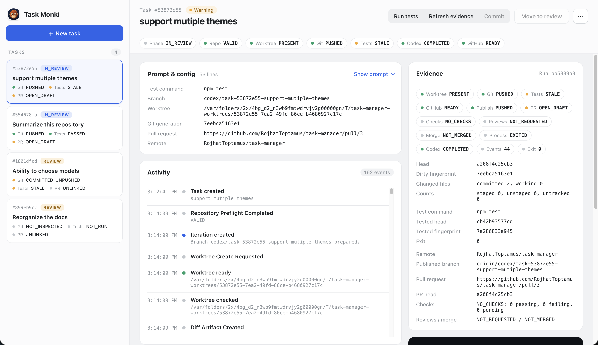

<p align="center">
  
</p>

<h1 align="center">Task Monki</h1>

<p align="center">
  An experimental local task board for running Codex work in isolated Git worktrees.
</p>

<p align="center">
  Built as part of the Codex Community Build.
</p>



> [!WARNING]
> Task Monki is experimental. It runs local commands and can create commits, push branches, and open draft pull requests. Use it only with repositories you can recover, and review every generated change before delivery.

## What it does

Task Monki turns implementation prompts into a visible local workflow. It keeps the human-facing task phase separate from technical evidence such as Git state, Codex execution, tests, GitHub publication, pull requests, checks, and reviews.

The app currently supports:

- creating and refining repository-aware task prompts;
- creating an isolated branch and Git worktree for each task;
- running the local Codex CLI inside that worktree;
- showing process output, changed files, Git state, and generated artifacts;
- running a repository-defined test command and tracking whether results are current;
- creating a delivery commit;
- detecting a GitHub remote, publishing the task branch, and creating a draft pull request;
- refreshing pull-request, check, review, and merge evidence.

## Local Git and Codex

Task Monki runs on your machine. Its development API binds to `127.0.0.1`, repository state stays in local task storage, and each implementation task receives a separate Git branch and worktree.

Implementation is delegated to your installed and authenticated Codex CLI. Task Monki starts Codex in the task worktree, captures its structured output, and records Git and process evidence independently. Codex connectivity and data handling still follow your Codex CLI configuration and account.

GitHub is optional. When enabled, Task Monki uses local Git and the authenticated `gh` CLI to publish a branch, create a draft pull request, and read delivery status.

## How the workflow works

1. Create a task with a repository path, prompt, and test command.
2. Prepare the worktree to create an isolated `codex/task-*` branch.
3. Start implementation. Codex runs with write access limited to that worktree.
4. Review the diff and execution evidence.
5. Run local tests explicitly.
6. Create a delivery commit, then rerun tests for the new Git generation.
7. Create a draft pull request when the branch and evidence are ready.
8. Continue reviewing locally and on GitHub. Task Monki does not merge the pull request.

Task data and execution artifacts are stored locally. The browser development server uses a temporary local store by default; the Electron app uses its application data directory.

## Requirements

- Node.js 20 or newer
- npm
- Git
- [Codex CLI](https://github.com/openai/codex) installed and authenticated
- Optional: [GitHub CLI](https://cli.github.com/) installed and authenticated for branch and pull-request features

The repository you manage must already be a valid local Git repository. GitHub delivery features additionally require a supported GitHub remote and:

```bash
gh auth login
```

## Run locally

Install dependencies:

```bash
npm install
```

### Browser development

Start the local API in one terminal:

```bash
npm run dev:api
```

Start the renderer in another terminal:

```bash
npm run dev:renderer
```

Open [http://127.0.0.1:5173](http://127.0.0.1:5173).

Default development ports:

| Service | Address |
| --- | --- |
| Renderer | `http://127.0.0.1:5173` |
| Local API and event stream | `http://127.0.0.1:3099` |

Useful development overrides:

```bash
TASK_MANAGER_API_PORT=3100 \
TASK_MANAGER_REPO_PATH=/path/to/repository \
TASK_MANAGER_STORE_DIR=/tmp/task-monki-store \
npm run dev:api
```

```bash
VITE_TASK_MANAGER_API_URL=http://127.0.0.1:3100 \
npm run dev:renderer -- --port 5174
```

### Electron app

Build and launch the desktop app:

```bash
npm start
```

## Verification

```bash
npm run typecheck
npm test
npm run build
```

## Experimental software and safety

Task Monki is experimental. It launches local processes and performs real Git operations on repositories you select.

- Codex implementation runs use `workspace-write` with approval policy `never` inside the task worktree.
- The worktree is an isolation mechanism for Git changes, not a complete security boundary.
- Test commands come from task configuration and execute locally.
- Commit, push, and draft pull-request actions modify Git or GitHub state when you trigger them.
- Review generated changes, commands, commits, and pull-request content before relying on them.
- Use repositories with clean working state, backups, and recoverable remotes.
- Do not use the app with untrusted prompts, repositories, dependencies, or test commands.

The project is not yet intended for unattended production automation.

## Project status

The current focus is a reliable local review loop: isolated implementation, inspectable evidence, explicit tests, and human-controlled GitHub delivery. Interfaces and persisted data formats may change while the project is experimental.
