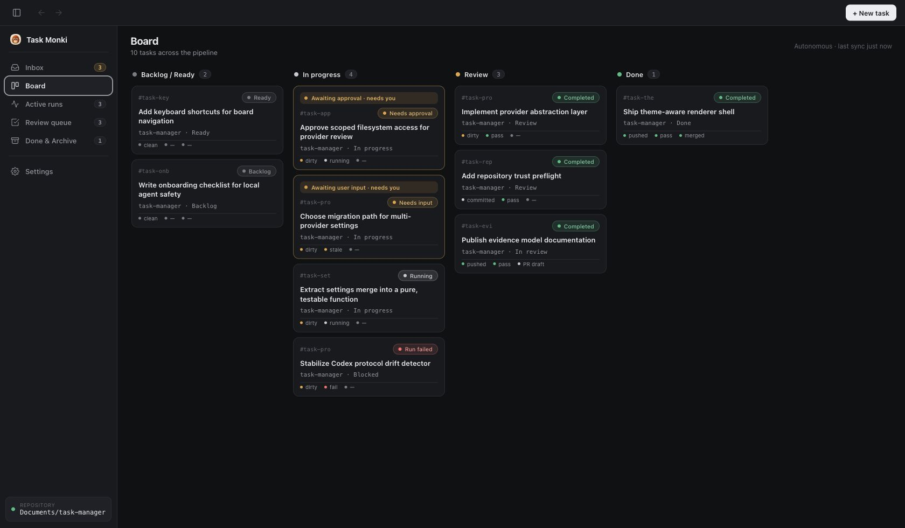

<p align="center">
  
</p>

<h1 align="center">Task Monki</h1>

<p align="center">
  A local task board for running AI coding agents in isolated Git worktrees.
</p>



> [!WARNING]
> Task Monki is experimental. It runs local commands and can create commits, push branches, and open draft pull requests. Point it only at repositories you can recover, and review every change before you ship it.

## What it is

You write a task prompt, Task Monki gives it an isolated branch and Git
worktree, and the selected coding-agent runtime implements inside it. You watch
the work happen, inspect the diff, review local Git evidence, and open a draft
pull request when it is ready—all from one board on your machine.

Task Monki keeps its task records, worktrees, attachments, and evidence store
on your machine. Agent work is delegated to an installed, authenticated runtime.
Codex App Server and OpenCode use their native protocols; supported ACP agents
use the stable Agent Client Protocol. Task Monki observes Git and GitHub
delivery evidence independently. It never merges a pull request for you.

Each supported agent has a first-class durable runtime identity with its own
models, permissions, and capability record. Codex and OpenCode are native
server integrations; Antigravity has a dedicated turn-scoped CLI integration;
Grok, Cursor, and the Claude bridge use registered ACP compatibility
integrations with explicitly documented limits.
Task Monki does not force any of them through a generic model-SDK loop. See the
current
[provider runtime compatibility matrix](docs/architecture/PROVIDER_RUNTIME_COMPATIBILITY.md).

A key principle: Task Monki keeps what an **agent reports** separate from what
it has **verified locally**. Runtime plans, usage, and completion claims are
always marked as such—only Task Monki's own Git inspection and GitHub sync count
as verified delivery evidence.

## How it works

1. **Create a task** — pick a repository, runtime, model, and prompt, with optional supported attachments.
2. **Prepare the worktree** — creates an isolated `task-monki/task-*` branch.
3. **Start implementation** — the selected agent runs against that worktree.
4. **Inspect** — review the diff, commands, file changes, and approvals.
5. **Review** — run an agent review, optionally with another runtime, or request follow-up changes.
6. **Commit** — create a delivery commit when the local diff is ready.
7. **Ship** — open a draft pull request once the branch and GitHub evidence are ready.

When the selected runtime supports it, you can steer or interrupt a run
mid-turn, follow up in the same session, retry, or fork an alternative attempt.

### Attachments

New tasks can include PNG, JPEG, or still WebP images and allowlisted UTF-8
text, data, configuration, and source-code files. Task Monki stores private
task-owned copies outside the repository worktree and reuses them for retries,
follow-ups, recovery, and review. Attachment runs require runtime-supported
restricted execution and disable network access. Codex additionally disables
web search, MCP servers, and apps for these turns. PDFs,
Office files, media, archives, databases, and arbitrary binaries are not
accepted. See the [attachment lifecycle](docs/architecture/ATTACHMENT_LIFECYCLE.md)
for storage, delivery, cleanup, and privacy behavior.

## Install

Download the latest desktop build from [GitHub Releases](https://github.com/RojhatToptamus/task-monki/releases/latest) and pick the asset for your platform (macOS, Windows, or Linux).

Builds are currently unsigned, so macOS and Windows may show a security warning on first launch. There's no auto-updater yet — to update, download and install the newer release.

**Prerequisites** (Task Monki does not bundle agent runtimes):

- Git
- At least one supported runtime installed and authenticated:
  - [Codex CLI](https://github.com/openai/codex)
  - [OpenCode](https://github.com/anomalyco/opencode)
  - [Antigravity CLI](https://antigravity.google/docs/cli-reference)
  - an available ACP agent profile such as Grok Build, Cursor Agent, or
    `claude-agent-acp`
- Optional — [GitHub CLI](https://cli.github.com/), authenticated, for branch and pull-request features (`gh auth login`)

Packaged apps probe supported runtimes and their capabilities instead of
assuming that a command name implies compatibility. Git, GitHub CLI, and every
registered agent-runtime path can be configured in Settings; environment
overrides are documented in the architecture and install guides.

## Run from source

Install a release unless you're developing Task Monki itself. Source builds need Node.js 20+ and npm.

```bash
npm install
```

**Desktop app:**

```bash
npm start
```

**Browser** (two terminals):

```bash
npm run dev:api        # local API on http://127.0.0.1:3099
npm run dev:renderer   # renderer on http://127.0.0.1:5173
```

Then open [http://127.0.0.1:5173](http://127.0.0.1:5173).
The renderer reaches the API through Vite's same-origin `/api` proxy. Start the
API before making requests; it rotates a private proxy token on each launch.
The token stays outside renderer JavaScript and direct browser access to port
3099 is rejected.

**Checks:**

```bash
npm run typecheck && npm test && npm run build && npm run check:codex-protocol
```

## Status

Task Monki is experimental and focused on one thing: a reliable local review loop with isolated implementation, inspectable evidence, and human-controlled GitHub delivery. It runs real local processes and Git operations, so use it only with repositories you can recover — never with untrusted prompts or repositories. Interfaces and stored data formats may still change.
