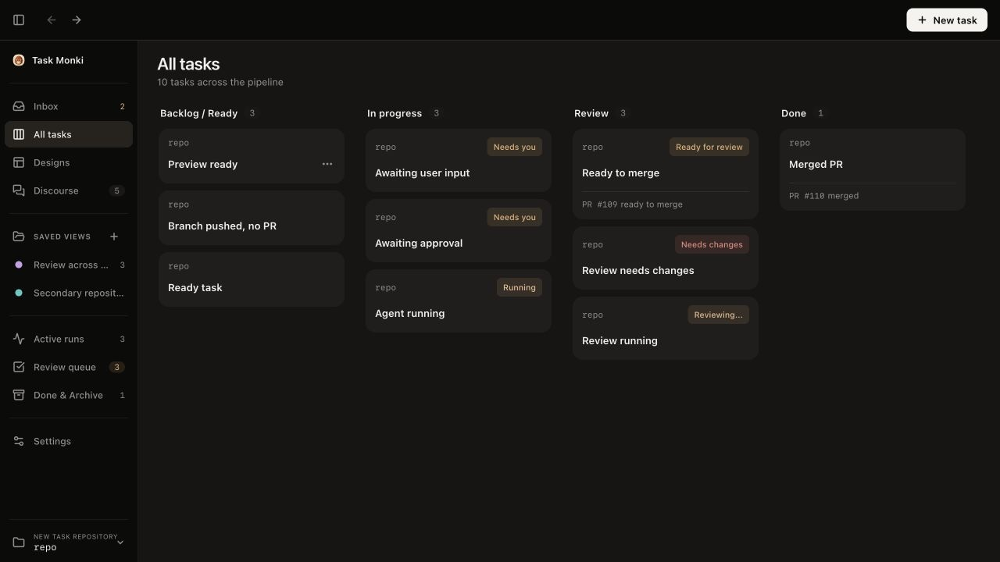

<p align="center">
  
</p>

<h1 align="center">Task Monki</h1>



<p align="center">
  <a href="https://youtu.be/guk2EJC5Jzw">
    
  </a>
</p>

## Why Task Monki

Task Monki is a local desktop app for managing several coding agents from one Kanban board. Each task keeps its agent run, code changes, Preview, review, fixes, and pull request together.

Create a task, let an agent work in an isolated branch and worktree, and follow its activity. Then run the implementation locally, request an independent review, send findings back for fixes, and deliver it through GitHub.

## Features

- Manage active, blocked, review, and completed tasks from one Kanban board.
- Run several coding agents on the same repository without mixing their changes.
- Preview each implementation in a separate local environment.
- Request an agent review and send findings back for fixes in the same task.
- Publish branches, open draft pull requests, and follow GitHub checks.
- Compare independent answers or structured multi-agent discussions in Discourse.
- Follow plans, messages, approvals, logs, file changes, and reported test output.
- Keep every task in its own Git branch and worktree.
- Read Git and GitHub evidence separately from agent reports.

## Local Previews

Task Monki can prepare dependencies, run jobs, start declared application services, workers, and supported containers, allocate ports, and wait for readiness.

When the recipe declares them, it can also run managed PostgreSQL or Redis and supported Docker Compose services. Each task gets a separate route and local environment, so you can compare full-stack changes without preparing every worktree by hand.

Preview starts only after you review and approve the repository's `.taskmonki/preview.yaml` file. See the [Preview guide](https://www.monki.work/docs/?page=preview) for details.

## Discourse

Direct asks one agent. Panel collects independent answers from two or three agents. Team starts with a Lead answer, then Skeptic and Verifier agents challenge its assumptions and evidence. The Lead can add one correction when their concerns are material.

## Design Mode

Design Mode turns a brief and reference files into a working interface Preview. Each Design has an isolated worktree, conversation, canvas, and version history.

Use Chat, Split, or Canvas view. Test desktop, tablet, and phone widths. Add references or editable assets, then restore or duplicate any version.

The interactive canvas currently works in the macOS desktop app.

## Supported Runtimes

- Native integrations: Codex App Server and OpenCode server.
- ACP compatibility integrations: Grok Build, Cursor Agent, and Claude Agent.

Capabilities differ by runtime. The Claude integration uses an experimental ACP bridge.

## Install

Download the latest build from [GitHub Releases](https://github.com/RojhatToptamus/task-monki/releases/latest).

- Git is required.
- One supported, installed, and authenticated coding-agent runtime is required for live work.
- GitHub CLI is optional for branch publishing, pull requests, and GitHub checks.
- Docker is optional for Previews that use managed services or Docker Compose.

Task Monki is developed and tested primarily on macOS. Windows and Linux builds are experimental.

macOS releases are signed and notarized. Windows and Linux releases are
currently unsigned. Read the [installation guide](https://www.monki.work/docs/?page=install)
before installation.

## Run from Source

Use Node.js 22.12 or newer, npm, and Git.

```sh
git clone https://github.com/RojhatToptamus/task-monki.git
cd task-monki
npm install
npm start
```

These commands build and open the desktop app.

## Status

Task Monki is experimental software. It runs real local processes and Git operations.

Use only repositories that you can recover. Do not use untrusted prompts or repositories.

Task records, worktrees, and evidence stay on your machine. The installed runtime controls its network use and upstream data handling.

## License

Task Monki is released under the [MIT License](LICENSE). Third-party software is listed in the [Third-Party Notices](THIRD_PARTY_NOTICES.md).
