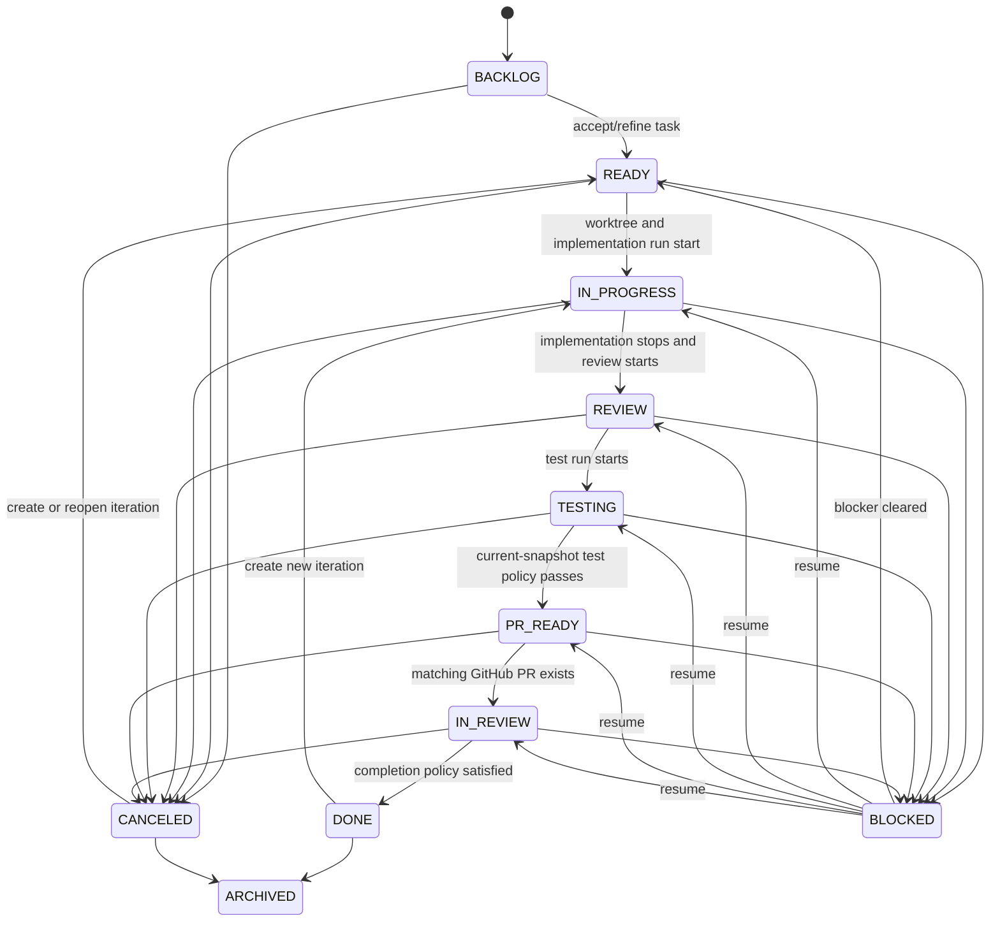
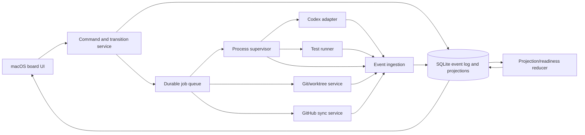

# Status Model Subagent Report

Research date: 2026-06-20

## Executive decision

The product must not have one “status” field that tries to represent workflow, agent execution, local code, tests, and GitHub delivery.

The canonical persisted task lifecycle is:

```text
TaskLifecycle = {
  workflow_phase,
  resolution,
  current_iteration_id,
  phase_version
}
```

The technical truth is a separate, versioned status vector:

```text
TechnicalState = {
  requested_action,
  codex_run,
  os_process,
  worktree,
  git,
  tests,
  github_issue,
  github_pull_request,
  ci_checks,
  reviews,
  merge
}
```

Readiness, health, conflict warnings, and recommended next actions are projections computed from that vector. They are not user-editable facts and must not be persisted as the only copy of truth.

The board column is therefore a human workflow phase, not a summary of every subsystem. A card can correctly be in `IN_REVIEW` while showing `Codex: completed`, `Git: pushed`, `Tests: passed`, `CI: failing`, `Reviews: changes requested`, and `Merge: not merged`.

For PR-based engineering tasks, the default completion policy should be `MERGED`. A Codex run completing, a local diff existing, tests passing, an issue closing, or a PR merely being open must not independently imply `DONE`.

## 1. Canonical lifecycle

### 1.1 Board phases

Use stable internal identifiers, independent of user-renamable column labels:

| Phase | Meaning |
|---|---|
| `BACKLOG` | Captured but not accepted for execution. |
| `READY` | Prompt, repository, acceptance criteria, and safety policy are sufficient to begin. |
| `IN_PROGRESS` | Implementation or another mutating task is actively being attempted. |
| `REVIEW` | Local diff/self-review is the current workflow focus. |
| `TESTING` | Local verification is the current workflow focus. |
| `PR_READY` | Local work is prepared for publication; a PR may not yet exist. |
| `IN_REVIEW` | A remote PR exists and is awaiting CI, review, merge, or author action. |
| `DONE` | The current task iteration satisfies its configured completion policy. |
| `BLOCKED` | Human attention or an external prerequisite is required. This is a workflow choice, not a synonym for every command failure. |
| `CANCELED` | Work on the current iteration was intentionally abandoned. |
| `ARCHIVED` | Hidden from active workflow without deleting history. |

Do not add a general `FAILED` lifecycle phase. Failures are usually retryable facts belonging to Codex, process, test, CI, Git, or action dimensions. If the UI needs a “Failed” column, implement it as a view over `BLOCKED` cards whose highest-severity blocker is a failure.

### 1.2 Resolution

`resolution` is independent of phase until terminal:

```text
NONE
COMPLETED
CANCELED
NOT_PLANNED
DUPLICATE
SUPERSEDED
```

Expected invariants:

- `DONE` requires `resolution = COMPLETED`.
- `CANCELED` requires one of `CANCELED`, `NOT_PLANNED`, `DUPLICATE`, or `SUPERSEDED`.
- Reopening a completed task creates a new `TaskIteration`; it does not erase the prior merge or completion evidence.
- `ARCHIVED` may contain any resolution and is a presentation concern.

### 1.3 Completion policy

Each task stores one explicit policy:

| Policy | Required evidence |
|---|---|
| `MERGED` | Linked PR has an authoritative GitHub merge observation. Default for PR-based coding tasks. |
| `MERGED_AND_VERIFIED` | PR is merged and the configured required-check policy for the merged PR head is satisfied. Use only when the organization wants late CI evidence to remain a completion-policy concern rather than only a health concern. |
| `LOCAL_ACCEPTANCE` | Current local snapshot satisfies configured test/evidence requirements and a user explicitly accepts it. Appropriate for prototypes or changes that will not be pushed. |
| `ARTIFACT_ACCEPTANCE` | Required report/design/document artifact exists and is explicitly accepted. |
| `ISSUE_CLOSED` | Linked issue is closed with an allowed state reason. Use only when the organization intentionally treats issue closure as delivery truth. |
| `MANUAL` | Authorized user completes with a reason. Always displays a manual-completion marker. |

`DONE` is evaluated against the task’s policy. The app must never silently switch policy to make a transition succeed.

## 2. State ownership and source-of-truth matrix

Every observation must contain `source`, `source_event_id`, `observed_at`, `received_at`, `generation_key`, and `stale_at`. `UNKNOWN`, `STALE`, and `UNAVAILABLE` are valid states; absence of data is not success.

| Dimension | Canonical source of truth | Recommended statuses | Generation key / binding |
|---|---|---|---|
| Board/task | Local database, changed by user or explicit policy engine event | Board phases above | `task.phase_version` |
| Intent/action | Durable local action request and attempts | `REQUESTED`, `QUEUED`, `STARTING`, `RUNNING`, `AWAITING_APPROVAL`, `SUCCEEDED`, `FAILED`, `CANCEL_REQUESTED`, `CANCELED`, `ORPHANED` | `action_request_id` and attempt number |
| Codex run | Codex event stream plus runner reconciliation | `QUEUED`, `STARTING`, `RUNNING`, `AWAITING_APPROVAL`, `COMPLETED`, `FAILED`, `INTERRUPTED`, `CANCELED`, `LOST`, `UNKNOWN` | Codex thread/session and turn/run ID |
| OS process | Process supervisor, not Codex prose | `CREATED`, `SPAWNING`, `RUNNING`, `EXITED`, `SIGNALED`, `CANCELING`, `ORPHANED`, `UNKNOWN` | Supervisor process ID plus PID/start identity |
| Worktree | `git worktree list --porcelain -z` plus filesystem verification | `CREATING`, `PRESENT`, `LOCKED`, `PRUNABLE`, `MISSING`, `REMOVING`, `REMOVED`, `ERROR` | Worktree ID, canonical path, Git common directory |
| Git | Fresh Git commands executed in the task worktree | Detailed snapshot; optional summary `CLEAN`, `DIRTY`, `COMMITTED_UNPUSHED`, `PUSHED`, `CONFLICTED`, `DIVERGED`, `UNAVAILABLE` | `HEAD`, base SHA, upstream SHA, dirty snapshot hash |
| Tests | App-owned test runner and parsed result | `NOT_CONFIGURED`, `NOT_RUN`, `QUEUED`, `RUNNING`, `PASSED`, `FAILED`, `ERROR`, `CANCELED`, `STALE`, `UNKNOWN` | Tested `HEAD` plus dirty worktree fingerprint |
| GitHub issue | GitHub API/webhook | `UNLINKED`, `OPEN`, `CLOSED_COMPLETED`, `CLOSED_NOT_PLANNED`, `CLOSED_DUPLICATE`, `UNKNOWN` | Repository node ID, issue number, GitHub `updated_at` |
| Pull request | GitHub API/webhook | `UNLINKED`, `NOT_CREATED`, `OPEN_DRAFT`, `OPEN_READY`, `CLOSED_UNMERGED`, `MERGED`, `UNKNOWN` | Repository node ID, PR number, PR head SHA |
| CI/checks | GitHub check runs and commit statuses for the PR head SHA, interpreted against branch policy | `NOT_APPLICABLE`, `NO_CHECKS`, `EXPECTED_NOT_REPORTED`, `PENDING`, `PASSING`, `FAILING`, `CANCELED`, `BLOCKED`, `STALE`, `UNKNOWN` | PR head SHA and check identity |
| Reviews | GitHub reviews, review requests, PR head SHA, and applicable merge rules | `NOT_APPLICABLE`, `NOT_REQUESTED`, `REQUESTED`, `PENDING`, `CHANGES_REQUESTED`, `APPROVED`, `SATISFIED`, `STALE`, `UNKNOWN` | PR number, head SHA, review IDs/commit IDs |
| Merge | GitHub merged endpoint/PR merged fields/webhook, reconciled by API | `NOT_APPLICABLE`, `NOT_MERGED`, `COMPUTING`, `MERGEABLE`, `BLOCKED`, `QUEUED`, `MERGED`, `UNKNOWN` | PR number, head SHA, base ref and merge observation |

### 2.1 Codex is not the delivery source of truth

Codex status answers “what happened to this agent turn,” not “is the engineering task delivered?”

For a rich integration, Codex app-server exposes streamed thread, turn, item, command, and file-change events. Its `turn/completed` notification contains a final turn status of `completed`, `interrupted`, or `failed`. For a simpler runner, `codex exec --json` emits JSONL events such as `thread.started`, `turn.started`, `turn.completed`, `turn.failed`, `item.*`, and `error`; the supervising process still owns process exit and signal facts.

Persist separately:

```text
provider_terminal_status   # completed / interrupted / failed
runner_terminal_status     # exited / signaled / lost
agent_outcome_claim        # implemented / no_change_needed / blocked / partial / unknown
postcondition_result       # independently evaluated by Git/tests/policy
```

An agent final message may inform `agent_outcome_claim`, preferably through a structured output schema, but it never directly changes Git, test, PR, CI, review, or merge truth.

`AWAITING_APPROVAL` is interface-dependent. A bidirectional app-server/SDK client can surface and resolve approvals. A non-interactive run that cannot surface a fresh approval should terminate as a failed/blocked attempt rather than remain indefinitely in `AWAITING_APPROVAL`; normalize that as an actionable `APPROVAL_UNAVAILABLE_NONINTERACTIVE` failure.

### 2.2 OS process and Codex run are separate

Examples:

- Process is `RUNNING`, Codex is `AWAITING_APPROVAL`.
- Process exits `0`, but no `turn.completed` event was captured: Codex becomes `UNKNOWN` until logs/session data reconcile it.
- Codex emits `failed`, then the wrapper exits `0`: the Codex run remains `FAILED`; wrapper exit is recorded independently.
- Cancellation is requested, but the turn completes before the signal wins: completion is retained and the cancellation request is recorded as a raced/no-op cancellation.

For production, the process supervisor should record PID, process group, executable, argv array, working directory, launch time, exit code, termination signal/reason, and last output/event time. Do not identify a recovered process by PID alone because PIDs can be reused.

### 2.3 Git state is a structured snapshot

Do not use only `git diff` or a boolean `has_changes`.

Capture at least:

```text
repo_root
git_common_dir
worktree_path
head_sha
head_ref or detached
base_ref
base_sha
upstream_ref
upstream_sha
ahead_count
behind_count
staged_count
unstaged_count
untracked_count
conflicted_count
operation_in_progress      # merge/rebase/cherry-pick/revert/bisect
commits_ahead_of_base
committed_diff_file_count
working_diff_file_count
diff_stat
dirty_fingerprint
captured_at
```

Use `git status --porcelain=v2 --branch -z` for machine-stable working-tree, branch, and ahead/behind data. Use `git worktree list --porcelain -z` for worktree ownership, detached state, locks, and prunability. Determine material task changes from both:

1. committed delta between the task base and `HEAD`, and
2. staged, unstaged, and untracked worktree changes.

This avoids declaring “no diff” after Codex committed its changes, and avoids declaring “clean” when commits have not been pushed.

### 2.4 Tests are valid only for an exact code generation

A passed test run becomes `STALE` whenever either of these changes:

- `HEAD` differs from `tested_head_sha`;
- the dirty worktree fingerprint differs from `tested_worktree_fingerprint`.

For committed clean worktrees, the SHA is sufficient. For dirty worktrees, compute a deterministic snapshot identifier from staged diff, unstaged diff, and relevant untracked file contents. If a complete fingerprint is too expensive, mark the result conservatively stale whenever any filesystem/Git change occurs after the test start.

Distinguish:

- `FAILED`: the test command ran and reported test/assertion failures;
- `ERROR`: the test command could not execute or its result could not be interpreted;
- `CANCELED`: user/system intentionally stopped it;
- `STALE`: the result was valid but no longer describes current code.

### 2.5 CI must include both Checks and legacy commit statuses

GitHub required status checks can be check runs or commit statuses. Query both for the exact PR head SHA. Do not treat GitHub’s legacy combined-status endpoint as the complete CI view because it aggregates commit statuses, not all check runs.

Maintain two rollups:

```text
all_observed_checks_rollup
required_merge_checks_rollup
```

The required rollup should be based on applicable branch protection/ruleset information when permissions allow it. If rule visibility is unavailable, set it to `UNKNOWN`, not `PASSING`. GitHub documents that required checks may satisfy protection with successful, skipped, or neutral results; encode this only for required checks. A neutral optional check may still be displayed as a warning according to product policy.

Any check attached to an older head SHA is historical and cannot change current readiness.

### 2.6 Reviews are not a simple approval count

Store each review and review request. Review states can include approval, requested changes, comment, dismissal, and pending review. Also store the review’s `commit_id`.

The rollup must account for:

- latest effective review per reviewer;
- dismissed reviews;
- requested reviewers/teams;
- current PR head SHA;
- stale-review dismissal policy;
- code-owner requirements;
- required approving review count;
- most-recent-push approval;
- unresolved-conversation requirements;
- bypass permissions, if known.

Use GitHub’s merge requirements as the final authority. A locally calculated `APPROVED` summary is useful UI, but it must not overrule a GitHub-reported blocked merge.

### 2.7 PR close and PR merge are different facts

`state = closed` is not sufficient. A closed PR is either:

- `MERGED`, if GitHub reports it merged; or
- `CLOSED_UNMERGED`.

Use the dedicated merged endpoint or the PR’s authoritative merged fields. Do not infer merge from branch reachability alone because squash/rebase merges and force-pushes make local ancestry heuristics unreliable.

## 3. Derived state

### 3.1 Readiness

Readiness answers whether a specific next action is currently justified. It is not a lifecycle phase.

Recommended fields:

```text
ready_to_start
ready_for_local_review
ready_to_test
ready_to_prepare_pr
ready_to_open_pr
ready_to_merge
completion_policy_satisfied
```

Each is tri-state:

```text
YES
NO
UNKNOWN
```

Each result also stores machine-readable reasons:

```json
{
  "value": "NO",
  "reasons": [
    {"code": "TESTS_FAILED_CURRENT_SNAPSHOT", "severity": "error"},
    {"code": "CI_STALE", "severity": "warning"}
  ],
  "computed_at": "2026-06-20T10:00:00Z",
  "input_versions": {
    "git": 41,
    "tests": 12,
    "pull_request": 8,
    "checks": 33
  }
}
```

Suggested default formulas:

```text
ready_to_start =
  repo_trusted
  AND prompt_accepted
  AND no_conflicting_action
  AND worktree_can_be_created

ready_for_local_review =
  no_mutating_run_active
  AND git_snapshot_fresh
  AND material_delta_exists
  AND no_unresolved_git_operation

ready_to_test =
  material_delta_exists
  AND test_command_configured
  AND no_mutating_run_active
  AND no_git_conflicts

ready_to_prepare_pr =
  material_delta_exists
  AND no_git_conflicts
  AND test_policy_satisfied_for_current_snapshot

ready_to_open_pr =
  ready_to_prepare_pr
  AND named_branch_exists
  AND branch_is_pushable
  AND remote_auth_available

ready_to_merge =
  pr_is_open_and_not_draft
  AND pr_head_generation_is_current
  AND required_checks_satisfied
  AND required_reviews_satisfied
  AND mergeability_is_not_blocked

completion_policy_satisfied =
  evaluate(task.completion_policy, current_dimension_vector)
```

### 3.2 Health

Health is a severity projection, not a phase:

```text
HEALTHY < INFO < WARNING < ERROR < BLOCKED
UNKNOWN is orthogonal
```

Examples:

- Current-snapshot test failure: `ERROR`.
- Awaiting a user approval: `BLOCKED`.
- GitHub data older than its freshness budget: `WARNING + STALE`.
- No configured test command where tests are optional: `INFO`.
- Worktree path missing while no task is active: `WARNING`; while a run is active: `ERROR`.
- PR merged with a later same-head CI failure: `WARNING` or `ERROR` according to policy, while phase remains `DONE`.

Store individual findings, not only a single color:

```text
finding_id
code
dimension
severity
message
generation_key
first_seen_at
last_seen_at
cleared_at
```

### 3.3 Conflict projection

Conflicts are cross-dimensional contradictions:

```text
BOARD_DONE_BUT_NOT_COMPLETE
CODEX_COMPLETED_WITHOUT_CHANGE
TEST_PASS_STALE_FOR_CURRENT_CODE
PR_HEAD_DIFFERS_FROM_LOCAL_HEAD
PR_CLOSED_UNMERGED
MERGED_WHILE_LOCAL_RUN_ACTIVE
CI_FAILED_AFTER_COMPLETION
REMOTE_STATE_STALE
WORKTREE_MISSING
ACTIVE_RUN_IN_NON_ACTIVE_PHASE
```

These findings should drive card badges and suggested actions. They should not mutate source observations.

## 4. Board state machine



The diagram is intentionally about workflow only. Codex, processes, Git, tests, CI, reviews, and merge evolve in parallel.

### 4.1 Transition execution model

A drag creates a durable `TransitionRequest`; it does not directly rewrite the task row for action-bearing transitions.

```text
REQUESTED
  -> guard evaluation
  -> QUEUED
  -> STARTING
  -> RUNNING
  -> SUCCEEDED | FAILED | CANCELED | ORPHANED
```

The UI may display a ghost/optimistic target column, but the canonical phase changes only at the transition’s documented commit point. Use compare-and-swap against `expected_phase_version` so two windows, automations, or reconciler events cannot silently overwrite each other.

### 4.2 Transition table

| Transition | Triggered action | Guards | Phase commit point | Failure behavior | Automation |
|---|---|---|---|---|---|
| `BACKLOG → READY` | Optional prompt refinement and validation | Nonempty task; repo link and definition of done present or explicitly waived | Refined/original prompt is accepted | Stay `BACKLOG`; show missing fields. User may use a recorded soft override | Manual |
| `READY → IN_PROGRESS` | Create/verify worktree, create task branch if policy requires it, start Codex implementation | Trusted repo; no conflicting mutating action; valid base; worktree capacity; runner/auth available | Worktree exists and Codex/process reaches running state | If launch never starts, stay `READY`. If it starts then fails, remain `IN_PROGRESS` with failure finding and Retry/Block actions | User drag initiates; commit is automatic |
| `IN_PROGRESS → REVIEW` | Reconcile Git and run read-only diff/self-review | No active mutating run; fresh Git snapshot; no unresolved Git operation; material delta unless no-change path is accepted | Review run starts or user explicitly chooses manual review | If no material delta, reject and surface `CODEX_COMPLETED_WITHOUT_CHANGE`; otherwise remain `IN_PROGRESS` if review cannot start | User drag; Codex completion only suggests |
| `REVIEW → TESTING` | Run configured test command or approved test workflow | Test command configured/approved; no mutating run; no Git conflicts | Test process starts | If process cannot start, remain `REVIEW`. Once started, remain `TESTING` even if tests fail | User drag; review completion may suggest |
| `TESTING → PR_READY` | Generate/update PR artifact and capture final Git snapshot | Material delta; no conflicts; current-snapshot test policy passes, or authorized soft override | PR description/artifact produced for current snapshot | Remain `TESTING`; failed/stale tests are visible and retryable | Suggest on pass; do not auto-move by default |
| `PR_READY → IN_REVIEW` | Commit if configured, push branch, create or find PR | Named branch; remote link; auth; no conflicts; branch/head consistency; publication confirmation if required | GitHub confirms an open PR whose head matches the intended branch/SHA | Remain `PR_READY`; reconcile before retrying ambiguous push/PR outcomes | User drag; commit automatic after confirmation |
| `IN_REVIEW → DONE` | Normally no command; reconcile completion evidence | Completion policy satisfied. Under default policy, GitHub reports PR merged | Authoritative completion observation is persisted | Reject manual drag unless an authorized completion override selects a different policy path | Auto on merge; otherwise guarded manual |
| `ANY → BLOCKED` | Optionally request cancellation of active action | User reason, or actionable blocker exists | Block request accepted; active process handling is explicit | If cancellation is required but fails, keep original phase and show blocker | Manual or suggestion; not automatic for ordinary failures |
| `BLOCKED → prior phase` | Resume/retry selected action | Named blocker cleared or explicit override | Resume action begins or phase is restored for manual-only move | Stay `BLOCKED` | Manual |
| `ANY → CANCELED` | Cancel active jobs; optionally retain worktree | Explicit user intent; external irreversible effects acknowledged | Cancellation policy completes; active process terminal or intentionally orphaned | Keep current phase until outcome known; never claim canceled while process may still mutate | Manual |
| `DONE → IN_PROGRESS` | Create a new task iteration | Prior completion immutable; new base/branch/worktree selected | New iteration committed | Stay `DONE` | Manual “Reopen as new iteration,” not plain drag |

### 4.3 Skipped and backward transitions

Default behavior:

- Non-adjacent forward drags are rejected with a proposed transition plan. One drag must not silently chain worktree creation, Codex, tests, push, and PR creation.
- Backward moves that only change human focus are allowed if no action is running, but technical facts remain unchanged.
- Moving a card with an active mutating process requires “cancel then move” or waiting for completion.
- Moving an open PR back to `BACKLOG` does not close the PR.
- Moving a merged task back to active work creates a new iteration; it cannot unmerge or rewrite history.
- Moving an unmerged task to `DONE` is a hard guard under `MERGED` policy. An authorized user may explicitly change to/manual-complete under another policy, with an audit record and persistent warning.

## 5. Auto-move versus suggestion policy

Auto-move only when the transition is either the direct completion of a user-requested action or an authoritative, unambiguous external fact.

| Event | Default policy |
|---|---|
| User requested start; worktree and Codex process successfully start | Auto-commit `IN_PROGRESS`. |
| Codex implementation completes and a material delta exists | Suggest `REVIEW`; do not auto-move in production. An MVP may opt in to auto-move. |
| Codex completes with no delta | Never auto-move. Show anomaly/no-change decision. |
| Local review completes | Suggest `TESTING`. |
| Current-snapshot tests pass | Suggest `PR_READY`. |
| Tests fail | Stay in `TESTING`; offer Retry, Ask Codex to Fix, or Block. |
| PR creation succeeds and head matches | Auto-commit `IN_REVIEW` because it is the confirmed result of the user’s transition request. |
| PR is merged on GitHub | Auto-commit `DONE` when completion policy is `MERGED`. |
| PR is closed without merge | Do not auto-move to Done. Suggest `BLOCKED`, `REVIEW`, or Cancel. |
| CI fails | Do not move automatically. Add a high-severity finding and suggest `TESTING`/Fix CI. |
| Review requests changes | Do not move automatically. Add blocker and suggest `IN_PROGRESS` or `REVIEW`. |
| Linked issue closes | Do not move by default; issue status is independent unless policy is `ISSUE_CLOSED`. |
| Worktree disappears | Do not move automatically. Mark error and block new local actions. |

Allow users to configure more aggressive automation per board, but preserve these constraints:

- no auto-transition based on stale/unknown data;
- no external fact may be overwritten by a board move;
- no automatic backward movement for ordinary failures;
- no automatic retry of actions with possible external side effects until reconciliation proves the prior attempt’s outcome.

## 6. Required conflict resolutions

### 6.1 Codex says done, but tests failed

Persist:

```text
codex_run = COMPLETED
os_process = EXITED(exit_code = 0 or provider-specific value)
tests = FAILED(current generation)
ready_to_prepare_pr = NO
completion_policy_satisfied = NO
health = ERROR
```

The card remains in `TESTING` if testing has started, or remains in its current phase with a failing-tests badge. Offer:

1. rerun tests;
2. start a Codex “fix current test failures” attempt in the same task iteration;
3. waive the test guard with an authorized, generation-bound override;
4. mark `BLOCKED`.

Do not change the Codex run to failed: the agent turn may have completed successfully even though its work did not satisfy engineering postconditions.

### 6.2 Codex finishes, but no diff exists

Compute material delta across committed and uncommitted state.

If no delta exists:

- If structured Codex output says `no_change_needed`, require the user to accept that outcome or attach evidence such as a reproduced/non-reproduced result. It may complete only under a policy that allows no-change resolution.
- Otherwise create `CODEX_COMPLETED_WITHOUT_CHANGE`, keep the phase, and offer Continue, Retry with a refined prompt, Inspect logs, or Cancel.

Never auto-move to `REVIEW` or `DONE` solely because the process exited successfully.

### 6.3 Local work is done, but the PR is still open

Represent local readiness and remote lifecycle separately:

```text
codex_run = COMPLETED
git = PUSHED
tests = PASSED(current generation)
pull_request = OPEN_READY
merge = NOT_MERGED or BLOCKED
workflow_phase = IN_REVIEW
completion_policy_satisfied = NO under MERGED policy
```

Display “Locally ready; awaiting remote completion.” Do not mark Done by default.

### 6.4 Local diff exists, but no PR is opened

Typical state:

```text
git = DIRTY or COMMITTED_UNPUSHED or PUSHED
pull_request = NOT_CREATED
workflow_phase = REVIEW / TESTING / PR_READY
```

This is not a conflict unless the board claims `IN_REVIEW` or `DONE`. `PR_READY` is precisely the phase for locally prepared, not-yet-opened work.

### 6.5 PR is merged manually on GitHub

The `pull_request` webhook should trigger immediate reconciliation; polling is the fallback. Once GitHub authoritatively reports merged:

- set PR to `MERGED`;
- set merge to `MERGED` with `merged_at`, merge actor, and merge commit if provided;
- auto-complete the current iteration under `MERGED` policy;
- preserve all local test, CI, and review history;
- if a local mutating run is active, mark `MERGED_WHILE_LOCAL_RUN_ACTIVE`, request safe cancellation, and treat subsequent local changes as unshipped/superseded evidence rather than part of the merged result;
- do not assume a linked issue is closed unless GitHub reports it.

### 6.6 CI fails after the card is moved to Done

First verify the check belongs to the completed PR head SHA.

If `DONE` resulted from an authoritative merge:

- keep `DONE`; merge is irreversible;
- record `CI_FAILED_AFTER_COMPLETION`;
- show “Merged with failing/late check”;
- offer creating a follow-up task;
- if the failed check was required but merge was bypassed, show a policy-violation finding;
- under `MERGED_AND_VERIFIED`, also mark current completion-policy satisfaction false. Preserve the historical completion event and merged fact; a strict board may create/reopen a follow-up iteration, but must not pretend the merge was undone.

If `DONE` was a manual/unmerged completion:

- revoke readiness and `completion_policy_satisfied` if the policy requires CI;
- keep the user’s board move visible but mark it invalid/overridden;
- suggest Reopen to `TESTING` or `IN_REVIEW`;
- a strict board may auto-reopen only if that explicit policy was configured in advance and no manual-lock override exists.

If the check belongs to an old head SHA, retain it as history and do not affect current health.

### 6.7 User drags against actual technical state

Examples and policy:

| Contradiction | Behavior |
|---|---|
| Unmerged PR dragged to `DONE` | Hard reject under `MERGED`; offer explicit manual completion with reason if authorized. |
| Merged task dragged to `IN_PROGRESS` | Require new iteration/follow-up. Preserve merge truth. |
| Open PR dragged to `BACKLOG` | Allow only as a human re-planning move after warning; PR remains open and card displays divergence. Never close PR implicitly. |
| Active Codex run dragged to `READY`/`BACKLOG` | Require cancel-then-move or wait. |
| Failing tests dragged to `PR_READY` | Soft or hard guard according to test policy; override must be reasoned and bound to current code generation. |
| Card dragged to `IN_REVIEW` with no PR | Reject action-bearing transition until a matching PR exists. |

The principle is: the user controls workflow intent, but cannot edit external facts through a board drag.

### 6.8 Stale or offline state

When GitHub is unreachable:

- retain last-known values;
- set remote freshness to `OFFLINE` or `STALE`;
- never convert stale data to success, absence, or closure;
- block auto-moves and hard remote transitions that require fresh evidence;
- permit local work and queue safe remote refreshes;
- show the observation timestamp on the card/detail view;
- run a full PR/check/review/merge reconciliation on reconnect before processing queued side effects.

If the app restarts while a process was active:

- ask the supervisor/helper whether it still owns the exact process identity;
- if verified alive, restore `RUNNING`;
- if verified terminal, ingest its exit;
- if not verifiable, mark process and action `ORPHANED`, reconcile Git/artifacts, and require user choice before launching another mutating attempt in the same worktree.

## 7. Manual override semantics

Overrides waive policy guards; they do not rewrite observations.

Recommended schema:

```text
Override {
  id
  task_id
  iteration_id
  scope                 # transition / readiness rule / completion
  rule_code
  from_phase
  to_phase
  actor_id
  actor_role
  reason
  created_at
  expires_at
  generation_key        # head SHA / dirty fingerprint / PR head SHA
  invalidated_at
  invalidation_reason
}
```

Rules:

- Require a nonempty reason for test, CI, review, no-diff, or completion overrides.
- Bind overrides to the exact relevant generation. A new commit, dirty-tree change, PR head change, or reopened PR invalidates the waiver.
- Expire temporary operational overrides.
- Display active overrides on the card and timeline.
- Never let an override mutate `MERGED`, check results, review states, process exit, or Git facts.
- Restrict high-impact overrides by role in team editions.
- A manual `DONE` under a non-satisfied default policy records `completion_policy = MANUAL` for that completion event; it must not pretend the original policy passed.

## 8. Reconciliation, ordering, and staleness

### 8.1 Event ingestion

All local and remote inputs become idempotent domain events:

```text
DomainEvent {
  id
  task_id
  iteration_id
  dimension
  event_type
  source
  source_event_id
  source_version
  generation_key
  occurred_at
  received_at
  correlation_id
  causation_id
  payload_json
  payload_hash
}
```

Use a uniqueness constraint on `(source, source_event_id)`. For GitHub webhooks, use the delivery ID. A webhook is a prompt to update quickly, not the final guarantee of consistency.

Projection rule:

```text
if duplicate(event): ignore
else append(event)

if event.generation_key != current_generation_for_dimension:
    retain as history; do not update current projection
else if event.source_version is older than current projection:
    retain as history; do not regress projection
else:
    update dimension projection transactionally
    recompute readiness, health, conflicts, and suggestions
```

Do not rely only on arrival time: webhooks can be retried, delayed, duplicated, or arrive around polling responses.

### 8.2 Freshness model

Every projection has:

```text
freshness = FRESH | AGING | STALE | OFFLINE | UNKNOWN
observed_at
stale_at
last_attempted_at
last_error
```

Suggested starting budgets, configurable by activity:

| Dimension | Reconciliation rule |
|---|---|
| Process | Event-driven. Supervisor heartbeat around 15 seconds; liveness check before declaring orphaned. Lack of log output alone is not failure. |
| Codex | Event-driven. If process terminates without a terminal Codex event, wait briefly for buffered events, then reconcile logs/session and mark `UNKNOWN` or `LOST`. |
| Git/worktree | Re-scan after every runner action; debounce filesystem hints; before every guarded transition; around 10 seconds while card is active and 60 seconds while idle. |
| Tests | Generation-based staleness immediately on code change. Optional time-age policy, such as rerun after 24 hours, is separate. |
| Active GitHub PR/checks/reviews | Webhook plus API reconciliation; poll approximately every 30–60 seconds while visible/active, then back off. Mark stale after roughly 2–5 minutes without a successful refresh. |
| Inactive open PR | Poll every 5–15 minutes. |
| Completed task | Refresh on app open/card open and infrequently in background; merged fact is terminal, but late checks/comments may still update health/history. |
| Issue | Webhook or periodic refresh; issue status normally has a looser budget than PR/checks. |

Timers are UX defaults, not source semantics. Transition guards must request a fresh observation when the existing one is outside the rule’s maximum age.

### 8.3 Head-generation changes

When PR head SHA changes:

1. create a new PR generation;
2. mark previous CI rollup historical/stale;
3. mark local comparison unknown until fetch/reconcile;
4. recompute review validity and applicable stale-review rules;
5. invalidate test/override evidence not bound to the new content;
6. cancel or supersede queued actions targeting the old SHA;
7. do not let late events from the old SHA update current readiness.

When local `HEAD` or dirty fingerprint changes, perform the analogous invalidation for local tests, review artifacts, and PR description artifacts.

### 8.4 GitHub webhook strategy

Subscribe only to needed events, validate webhook signatures, deduplicate by delivery ID, respond quickly, and process asynchronously. Because a local-only macOS app usually cannot receive public webhooks directly, production has two viable modes:

- a small authenticated cloud relay that forwards relevant events to the signed-in app; or
- polling only, with lower freshness and no claim of real-time status.

Even with a relay, periodic API reconciliation remains necessary for missed deliveries and offline periods.

## 9. Database model

SQLite is sufficient and appropriate. Use WAL mode, foreign keys, migrations, and a single writer actor/queue. Keep large raw logs and artifacts on disk with content hashes and database metadata.

### 9.1 Core entities

#### `task`

```text
id
board_id
repository_id
title
workflow_phase
resolution
completion_policy
current_iteration_id
phase_version
blocked_from_phase
blocked_reason
created_at
updated_at
archived_at
```

#### `task_iteration`

```text
id
task_id
ordinal
base_ref
base_sha
worktree_id
branch_ref
started_at
completed_at
completion_event_id
supersedes_iteration_id
```

#### `transition_request`

```text
id
task_id
iteration_id
from_phase
to_phase
action_type
status
requested_by
requested_at
expected_phase_version
idempotency_key
guard_snapshot_json
committed_phase_version
last_error_code
last_error_message
```

#### `action_attempt`

```text
id
transition_request_id
attempt_number
status
retry_class
started_at
ended_at
next_retry_at
process_id
codex_run_id
correlation_id
```

#### `codex_run`

```text
id
task_id
iteration_id
action_attempt_id
interface                 # exec / SDK / app-server
thread_id
turn_id
session_id
prompt_version_id
status
provider_terminal_status
agent_outcome_claim
sandbox_mode
approval_policy
started_at
last_event_at
ended_at
final_message_artifact_id
```

#### `process_run`

```text
id
owner_type
owner_id
supervisor_instance_id
pid
process_group_id
process_start_identity
executable
argv_json
cwd
status
launched_at
last_seen_at
exit_code
termination_signal
termination_reason
cancel_requested_at
stdout_artifact_id
stderr_artifact_id
```

#### `worktree`

```text
id
repository_id
canonical_path
git_common_dir
branch_ref
lifecycle_status
head_sha
is_detached
is_locked
lock_reason
is_prunable
prunable_reason
created_at
last_scanned_at
removed_at
```

#### `git_snapshot`

Use the fields listed in section 2.3, plus `id`, `task_id`, `iteration_id`, `worktree_id`, `generation_key`, and `source_event_id`.

#### `test_run`

```text
id
task_id
iteration_id
action_attempt_id
command_spec_id
status
tested_head_sha
tested_worktree_fingerprint
started_at
ended_at
exit_code
passed_count
failed_count
skipped_count
error_count
parser
result_artifact_id
log_artifact_id
```

#### GitHub projections

Use separate tables rather than one generic blob:

```text
github_issue_snapshot
pull_request_snapshot
check_run_snapshot
commit_status_snapshot
ci_rollup
pull_request_review
review_request
review_rollup
merge_snapshot
github_sync_cursor
```

Important fields include repository node ID, number/remote ID, head SHA, base ref/SHA, state, draft, merged flag/time, GitHub `updated_at`, ETag, observed/received times, freshness, and raw event/artifact reference.

#### `status_projection`

Optionally provide one generic current-projection index for fast UI:

```text
task_id
iteration_id
dimension
status
reason_code
generation_key
source
source_version
observed_at
stale_at
freshness
projection_version
raw_event_id
```

Domain-specific tables remain the detailed source.

#### `override`, `finding`, `artifact`, and `domain_event`

These supply auditability, derived conflicts, immutable logs/reports, and replay.

### 9.2 Invariants and constraints

- One current iteration per task.
- At most one active mutating action per task worktree.
- A branch may be owned by only one active worktree.
- One current projection per `(task, iteration, dimension)`.
- Action retries are immutable attempts, never row resets.
- `DONE` plus `COMPLETED` resolution must have a completion event.
- Merge completion must reference an authoritative GitHub observation.
- Test pass used by a guard must match current local generation.
- CI/review evidence used by a guard must match current PR head SHA.
- All manual overrides must reference actor, reason, and generation.

## 10. Runtime implications

### 10.1 Components



Recommended responsibilities:

- **UI:** sends commands and displays projections; never directly launches shell commands or mutates phase rows.
- **Transition service:** validates phase version, evaluates guards, records intent, and schedules actions.
- **Durable job queue:** persists attempts and retries across app restarts.
- **Process supervisor:** owns process groups, output streams, cancellation, and terminal status.
- **Codex adapter:** normalizes `codex exec`, SDK, or app-server events into one internal run model.
- **Git service:** owns all structured Git queries and serializes shared-repository metadata operations.
- **Test runner:** launches approved argv-based test specifications and parses results.
- **GitHub service:** webhook/poll ingestion, API reconciliation, ETag/rate-limit handling, and generation binding.
- **Reducer:** deterministically computes current projections, readiness, health, conflicts, and suggestions.

### 10.2 Long-running processes

For an MVP, the app process may own child processes, with an explicit warning that quitting the app cancels or orphans runs.

For production, use a supervised helper/XPC service or launch agent that:

- survives UI window closure;
- owns SQLite writes or communicates with a single database writer;
- owns process groups and log files;
- authenticates commands from the UI;
- can report exact process liveness after UI restart.

If both UI and helper can write SQLite independently, race risk increases. Prefer one authoritative service process and make the UI a client.

### 10.3 Concurrency

- Limit global Codex concurrency according to account/resource policy.
- Allow parallel tasks in separate worktrees.
- Enforce one active mutating job per worktree.
- Serialize repository-wide operations that touch shared Git metadata, including worktree add/remove/prune, fetch, and branch/ref management.
- Read-only review jobs may run concurrently only when they target an immutable snapshot; otherwise bind them to a generation and invalidate on mutation.

### 10.4 Cancellation

Cancellation is a workflow:

1. persist `CANCEL_REQUESTED`;
2. stop accepting new sub-actions;
3. request Codex interruption where the selected interface supports it;
4. signal the whole child process group, first gracefully and then with bounded escalation;
5. wait for terminal process observation;
6. reconcile Git and artifacts;
7. mark `CANCELED`, `COMPLETED`, or `ORPHANED` according to the race outcome.

Never mark canceled at button-click time while a process can still write files.

### 10.5 Logs and artifacts

Persist append-only, timestamped stdout/stderr and normalized events. Avoid placing unbounded logs in SQLite rows. Store:

```text
artifact_id
kind
path
content_hash
byte_count
created_at
retention_policy
redaction_state
```

Useful artifact kinds include prompt version, Codex final response, JSONL event stream, diff, review report, test report, PR description, and GitHub payload.

## 11. Failure and retry model

Classify every failure:

| Class | Examples | Retry policy |
|---|---|---|
| `TRANSIENT` | Network timeout, GitHub 5xx/429, Codex server overloaded, temporary lock | Exponential backoff with jitter; honor server retry hints; bounded attempts |
| `USER_ACTION_REQUIRED` | Codex approval needed, GitHub login expired, missing toolchain, repository trust required | No blind retry; move action to `AWAITING_APPROVAL`/blocked finding |
| `CONTENT_FAILURE` | Tests fail, review requests changes, merge conflict | No automatic identical retry; offer a new repair action |
| `VALIDATION` | Invalid transition, no repo, no test command, no diff for review | Fail before side effects; user corrects input |
| `PERMANENT` | Permission denied by policy, repository deleted | Stop and surface explicit remediation |
| `AMBIGUOUS_SIDE_EFFECT` | Timeout after push or PR-create request | Reconcile remote state before retry; never blindly duplicate |
| `ORPHANED` | App/helper crash with unknown child outcome | Reconcile process, Git, remote state, and artifacts before another mutating attempt |

Retry attempts are new immutable `action_attempt` rows linked to the original request. Preserve logs and errors for every attempt.

Use idempotency keys for local jobs and stable markers for remote operations. Before retrying PR creation, search for an existing open PR from the intended head branch and verify its head SHA. Before retrying push, fetch/inspect the remote ref. Before retrying worktree creation, inspect `git worktree list --porcelain`.

## 12. Implementation rules that prevent status corruption

1. Never write a technical dimension from user drag code.
2. Never write the board phase from a raw process callback; emit an event and let transition policy decide.
3. Never use an agent’s natural-language “done” as a postcondition.
4. Never reuse a passed test result after its code generation changes.
5. Never aggregate CI across multiple head SHAs.
6. Never equate closed PR with merged PR.
7. Never infer “no checks” from an API error or missing permission.
8. Never allow a stale webhook to regress a newer polled projection.
9. Never mark canceled until the process outcome is known or explicitly orphaned.
10. Never retry an ambiguous external side effect before reconciliation.
11. Never hide a manual override by converting it into normal success.
12. Never delete prior iteration evidence when work is reopened.

## 13. Recommended MVP subset

The MVP can implement the same shape with fewer dimensions:

- canonical board phase;
- durable transition request;
- Codex `exec --json` run;
- OS process;
- worktree/Git snapshot;
- test run;
- derived readiness/health;
- manual override audit;
- optional GitHub PR polling.

Minimum safe statuses:

```text
Codex: queued/running/completed/failed/canceled
Process: running/exited/signaled
Git: no-change/dirty/committed/conflicted
Tests: not-run/running/passed/failed/error/stale
PR: not-created/open/closed-unmerged/merged/unknown
```

The MVP may auto-move implementation completion with a real diff to `REVIEW` for demo value, but production should default to a suggestion because Codex completion does not prove review readiness.

Do not fake the multidimensional model by storing badges inside the card row. Even in a hackathon build, use separate run/snapshot records so the production model is an extension rather than a rewrite.

## 14. Primary sources

External semantics in this report were verified against primary documentation current on 2026-06-20.

### OpenAI Codex

- [Codex App Server](https://developers.openai.com/codex/app-server) — streamed JSON-RPC lifecycle, turn events/statuses, interruption, item events.
- [Codex non-interactive mode](https://developers.openai.com/codex/noninteractive) — `codex exec`, JSONL events, stdout/stderr behavior, sandboxing, session resume.
- [Codex SDK](https://developers.openai.com/codex/sdk) — programmatic thread/run integration.
- [Codex worktrees](https://developers.openai.com/codex/app/worktrees) — per-thread worktrees, detached HEAD behavior, one-worktree-per-branch constraint.
- [Codex approvals and security](https://developers.openai.com/codex/agent-approvals-security) — sandbox and approval behavior relevant to awaiting-approval and failure states.

### Git

- [git-status](https://git-scm.com/docs/git-status) — stable porcelain formats, branch/ahead-behind, staged/unstaged/untracked/conflict state.
- [git-worktree](https://git-scm.com/docs/git-worktree) — porcelain worktree records, locked and prunable states.
- [git-diff](https://git-scm.com/docs/git-diff) — diff exit semantics.
- [git-rev-parse](https://git-scm.com/docs/git-rev-parse) — canonical repository/worktree identity and object verification.

### GitHub

GitHub’s REST documentation identified API version `2026-03-10` as latest on the research date. A production client should explicitly pin a tested `X-GitHub-Api-Version` and upgrade deliberately.

- [Pull requests REST API](https://docs.github.com/en/rest/pulls/pulls) — open/closed state, draft/head data, merged fields, dedicated merged endpoint.
- [Issues REST API](https://docs.github.com/en/rest/issues/issues) — issue open/closed state and state reasons.
- [Check runs REST API](https://docs.github.com/en/rest/checks/runs) — check status/conclusion and check-run retrieval.
- [Commit statuses REST API](https://docs.github.com/en/rest/commits/statuses) — legacy commit status states and combined-status behavior.
- [Pull request reviews REST API](https://docs.github.com/en/rest/pulls/reviews) — chronological review records and review states.
- [Review requests REST API](https://docs.github.com/en/rest/pulls/review-requests) — requested reviewers and teams.
- [Protected branches REST API](https://docs.github.com/en/rest/branches/branch-protection) — required checks, review counts, stale approval, code-owner, last-push, and conversation-resolution rules.
- [About protected branches](https://docs.github.com/en/repositories/configuring-branches-and-merges-in-your-repository/managing-protected-branches/about-protected-branches) — required-check acceptance and review/merge behavior.
- [Webhook events and payloads](https://docs.github.com/en/webhooks/webhook-events-and-payloads) — PR, review, check, status, and issue event inputs.
- [Webhook best practices](https://docs.github.com/en/webhooks/using-webhooks/best-practices-for-using-webhooks) — signature/security, delivery IDs, quick acknowledgement, and missed-delivery handling.

### macOS process supervision

- [Foundation `Process`](https://developer.apple.com/documentation/foundation/process)
- [Foundation `Process.terminationStatus`](https://developer.apple.com/documentation/foundation/process/terminationstatus)
- [Foundation `Process.TerminationReason`](https://developer.apple.com/documentation/foundation/process/terminationreason)
- [Foundation `Process.terminationHandler`](https://developer.apple.com/documentation/foundation/process/terminationhandler)

## Final recommendation

Implement the card as an aggregate with one user-facing workflow phase and independent evidence dimensions. Back it with an append-only event log and current projections in SQLite. Bind all evidence to a content generation (`HEAD`/dirty fingerprint locally, PR head SHA remotely). Let users control intent, let subsystem APIs control facts, and let a deterministic policy engine compute readiness, health, suggestions, and narrowly scoped automatic transitions.

The critical product rule is:

> Agent completion is an execution event. Task completion is a policy decision supported by current, authoritative evidence.
