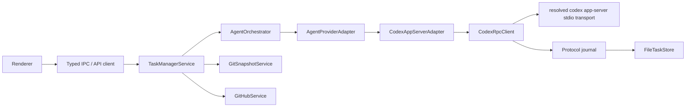

# Codex App Server Architecture

Date: 2026-07-02

This document describes the current architecture, not an old migration plan.

## Goal

Task Monki runs AI coding work through a long-lived Codex App Server while
keeping Task Monki authoritative for local evidence and workflow state.

Task Monki owns:

- task records and workflow phases;
- isolated task worktrees and branches;
- Git snapshots, dirty fingerprints, and diff artifacts;
- GitHub branch, PR, check, review, and merge evidence;
- local acceptance and Done transitions.

Codex owns:

- App Server lifecycle;
- provider threads and turns;
- provider items, approvals, plans, settings, usage, and subagent events;
- model catalog and supported reasoning efforts.

## Process topology

Task Monki uses one Codex App Server process per running app process.



Reasons:

- App Server already supports many provider threads.
- Authentication and model catalog are process-wide.
- Per-turn working directory, sandbox, approval, network, model, and reasoning
  settings keep task execution scoped.
- One process makes request correlation and recovery easier.

## Important records

- `Task`
  - User intent, workflow phase, current implementation-side run, worktree,
    projections, and evidence pointers.
- `RunRecord`
  - One implementation, follow-up, retry, review, or provider-origin child run.
    Fork alternatives are represented as a new `Task` with its own
    implementation run, not as a run inside the source task.
- `AgentSessionRecord`
  - Provider thread/session metadata. Primary sessions are used for
    implementation-side work. Review sessions use `role: "REVIEW"`.
- `AgentServerInstance`
  - Codex App Server process state, runtime version, schema hash, and status.
- `AgentProtocolJournal`
  - Append-only raw protocol messages for debugging and reconstruction.
- `StatusProjection`
  - Compact UI-facing state derived from Task Monki domain events.

## Provider adapter responsibilities

The adapter must:

- resolve, launch, and initialize a compatible App Server runtime;
- probe Codex App Server support by capability rather than rejecting runtimes
  solely because their version is newer than the generated protocol baseline;
- start the embedded App Server from Task Monki's core app settings. The default
  is local-only: apps disabled, web search disabled, and discovered MCP servers
  disabled through per-server runtime config overrides so local coding turns do
  not inherit unrelated user/plugin tool processes;
- allow explicit settings opt-in for cached or live Codex web search, all
  configured Codex MCP servers, and Codex apps/connectors when a task needs
  those external tools;
- avoid copying MCP environment values into stored App Server argv records when
  building those runtime config overrides;
- opt out of high-volume provider delta notifications that Task Monki does not
  use as verified evidence;
- discover account, models, supported reasoning efforts, and settings;
- create, attach, and read provider sessions;
- fork provider sessions only for detached Codex review when supported;
- start implementation, follow-up, retry, and review turns;
- correlate provider thread IDs, turn IDs, item IDs, and request IDs;
- materialize useful provider events into Task Monki records;
- keep raw protocol traffic in the journal;
- recover or locally reconcile when provider delivery is ambiguous.

The adapter must not:

- decide Task Monki workflow phase by trusting provider text;
- treat provider debug state as local evidence;
- let detached review runs replace the implementation run;
- expose experimental protocol features without explicit capability gates.

## Turn modes

- `IMPLEMENTATION`
  - First coding run for a task.
- `FOLLOW_UP`
  - Continuation with new instructions, including requested review changes.
- `RETRY`
  - Another attempt after a previous run.
- `REVIEW`
  - Detached read-only quality gate. It inspects the current diff and stores
    `projection.codexReview`.
- Provider-origin child runs
  - Observed child/subagent activity. These do not replace the task workflow.

Fork alternatives are intentionally not a `RunRecord.mode`. They are created by
Task Monki as a new task with a separate worktree, branch, iteration, fresh
provider session, and implementation run. The source task stores the alternative
task id, and the alternative stores its source task/run ids for traceability.
After creation, workflow and delivery actions on either task are independent.
If worktree or run startup fails after the alternative task is stored, Task
Monki leaves the alternative visible and blocked rather than silently hiding the
partial candidate.

Read `docs/workflows/CODEX_REVIEW_WORKFLOW_LIFECYCLE.md` before changing review
mode or follow-up behavior.

## Local preview control plane

Local previews are a separate Task Monki-owned domain. They are not Codex
turns, agent run modes, workflow transitions, or provider evidence. The
renderer can only call typed preview operations: resolve, approve, start, open,
stop, reset owned data, and read a recorded log artifact.

The preview runtime supports macOS task worktrees with bounded native jobs,
services, workers, routes, and managed OCI resources. Task Monki:

- reads only a bounded, regular `.taskmonki/preview.yaml` contained by the
  verified worktree, then parses it with the restricted v1 schema;
- records a normalized execution digest and task-scoped approval before any
  command can run; the approval surface enumerates every quoted argv, cwd,
  inherited/literal/generated environment rule, readiness check, route mapping,
  warning, and cleanup authority;
- captures tracked plus non-ignored untracked source into
  `preview-runtime/<task>/<generation>/source` using a double-observed content
  manifest, with production entry/path/aggregate/manifest limits, leaving the
  task worktree editable and unchanged;
- persists generation/resource intent before launcher or filesystem effects;
- probes a Docker-compatible engine through one explicit context, binds approval
  and every OCI record to its context/endpoint/engine identity, and treats an
  engine retarget as an ownership mismatch;
- supports typed preview-owned PostgreSQL and Redis; one preview environment
  owns the selected engine identity and shared labeled network, while each
  managed-resource record owns its exact container and volume;
- keeps generated database/cache credentials only in a main-process runtime
  credential host, delivers container secrets through runtime-mounted files,
  redacts credential values from native logs, and stores only safe binding
  identity, ports, username/database metadata, and digests;
- passes generated database/cache URLs only to nodes with explicit ready
  dependencies, runs selected migration/seed scenarios in dependency order,
  never automatically retries setup, and permits explicit setup retry only
  after current-plan/approval/exact-authority preflight when every selected
  setup job declares `retrySafe: true`; ambiguous completion remains blocked;
- attaches application generations to managed resources without giving those
  attachments cleanup authority; normal generation replacement reuses exact
  resource/container/volume/port/credential identities and runs no migration
  or seed;
- treats routed services as overlap-safe during candidate readiness while
  workers are exclusive by default; an exclusive worker stops before candidate
  activation and failed activation restores and reverifies the old worker
  within its declared readiness deadline unless `overlap: safe` was approved;
- schedules the declared dependency DAG with at most four concurrent native
  effects, so a shared monorepo install runs once while independent branches
  can progress in parallel;
- starts every native node through the bundled Node-mode launcher handshake,
  recording its ownership token, PID, process-group ID, OS start identity,
  command, and receipt before committing target spawn; the live launcher also
  removes verified group descendants when the target leader exits;
- supports HTTP, TCP, and finite argv readiness plus periodic liveness probes;
  HTTP/TCP readiness ports and every routed target are verified as
  loopback-only listeners owned by the recorded target process group;
- resolves only typed, non-secret service and stable-route origins into node
  environments; arbitrary secret or environment import remains unsupported;
- applies bounded restart policies per service or worker, and fails the
  generation only when a critical node exhausts its policy;
- aborts and joins graph-owned readiness, liveness, supervision, and restart
  operations during shutdown before releasing generated ports; marker-owned
  workspace cleanup begins only after graph stop settles;
- keeps the active generation routed while a candidate starts, atomically
  replaces the complete set of stable `.preview.localhost` hostnames only
  after all required nodes are ready, then stops the retired graph in reverse
  dependency order; failed or canceled candidates do not detach the active
  generation;
- preserves the stable gateway authority upstream and rewrites absolute
  target-origin redirects back to that authority;
- stores compact preview records in schema 13, retains at most 20 terminal
  generations per task and 20 completed argv probe attempts per live node,
  keeps live preview-environment and managed-resource authority outside
  generation pruning, and keeps each stdout/stderr artifact bounded;
- tails only the selected artifact through bounded byte-range reads rather
  than refreshing the full task snapshot for each log update;
- makes Reset destructive only after current-plan/approval and exact-authority
  preflight, stops the complete application, preserves unrelated managed
  resources, and replaces only the selected resource;
- labels Stop Preview **Stop Preview & Delete Data**, then detaches routes and
  stops/removes only exact verified processes, engine-bound labeled containers,
  volumes, the environment-owned network, and marker-owned workspaces;
  ambiguous cleanup remains `CLEANUP_INCOMPLETE` and is retryable.

Graceful app quit stops managed previews before the Codex provider. Restart
reconciliation does not adopt native services, workers, or managed OCI
resources: it stops every exact verified owner and records
`CLEANUP_INCOMPLETE` for ambiguous identities without broad deletion. Required
managed-resource death fails and detaches the complete active application but
preserves its volume until explicit Reset or destructive Stop. Preview events
do not update `Task.workflowPhase` or the agent projection.

## Settings

Task and review execution settings stored on task/run records include:

- model;
- reasoning effort;
- sandbox;
- approval policy;
- approval reviewer;
- network access.

Settings are validated against the live model catalog before a turn starts.
Renderer settings should update both implementation defaults and review defaults
so the app uses the configured reasoning level consistently.

App-level user preferences are separate from `FileTaskStore`. The Electron app
stores them in `app-settings.json` directly under `app.getPath('userData')`.
The development HTTP server uses `TASK_MANAGER_APP_SETTINGS_PATH` or an
`app-settings.json` file beside the dev store. These settings include:

- theme, sidebar, and mascot preferences;
- first-launch setup completion;
- default implementation, review, and prompt-refinement models;
- selected and known repositories;
- Codex external tool modes for web search, MCP servers, and apps;
- external executable path preferences for Git, Codex CLI, and GitHub CLI.
- the persisted high loopback port used by the local preview gateway.

Empty executable paths mean Auto-detect. The main process resolves and probes
executables live; resolved paths and detected versions are not persisted. Git
and Codex CLI are required, while GitHub CLI is optional. Environment variables
`TASK_MANAGER_GIT_PATH`, `TASK_MONKI_CODEX_BIN`, and `TASK_MANAGER_GH_PATH`
act as debug overrides ahead of saved settings.

Codex Auto-detect status may display the resolved `codex` path, but that
auto-discovered path is not passed as an explicit App Server runtime. In Auto
mode, App Server startup leaves the executable unset so capability-based
runtime resolution can scan all candidates and choose a compatible runtime.
Saved custom paths, constructor overrides, and `TASK_MONKI_CODEX_BIN` are
intentional and are passed explicitly.

## Runtime resolution

Task Monki resolves a Codex executable before launching the long-lived App
Server. Resolution checks explicit configuration first, then the
`TASK_MONKI_CODEX_BIN` environment override, then every `codex` found on `PATH`,
then known bundled runtimes such as Codex Desktop and the OpenAI Codex VS Code
extension.

Automatic discovery does not fail on the first stale binary. Each candidate is
probed with `--version`, `codex app-server --help`, an isolated temporary
`CODEX_HOME`, `initialize`, and the JSON-RPC methods Task Monki needs. The
newest compatible automatically discovered runtime is selected. An explicit
configured runtime is treated as intentional and must itself be compatible.
The selected runtime, all candidate versions, rejected candidates, missing
capabilities, and probe failures are persisted on the App Server instance and
shown only in provider diagnostics/debug surfaces.

The default transport is the documented local stdio App Server transport. Task
Monki prefers `codex app-server --stdio`, uses `--listen stdio://` when that is
the supported stdio form, and can fall back to `codex app-server` only when the
runtime documents default stdio but not a stdio flag.

Codex protocol detail:

- `turn/start` has a first-class `effort` field.
- `thread/start`, `thread/resume`, and `thread/fork` do not; they must pass
  `model_reasoning_effort` through the request `config` object.
- Reviews use `thread/fork` before `review/start`, so review latency depends on
  this config being set correctly.
- Task Monki starts `review/start` inline on that fork. Requesting a second
  detached review thread can lose the fork cwd and review unrelated local
  changes.

## Recovery rules

Provider delivery can be ambiguous. The app must handle:

- stale provider turn IDs;
- `no active turn to interrupt`;
- App Server exit during interrupt or review;
- late protocol errors after a server already reached a terminal state;
- missing terminal events after interruption.

Recovery must prefer a truthful local state over an endlessly running UI. If the
provider cannot confirm a terminal event, record the ambiguity and reconcile
locally when the evidence proves the run is no longer active.

## Verification

Use these before merging App Server or workflow changes:

```sh
npm run typecheck
npm test
npm run build
npm run check:codex-protocol
git diff --check
```
