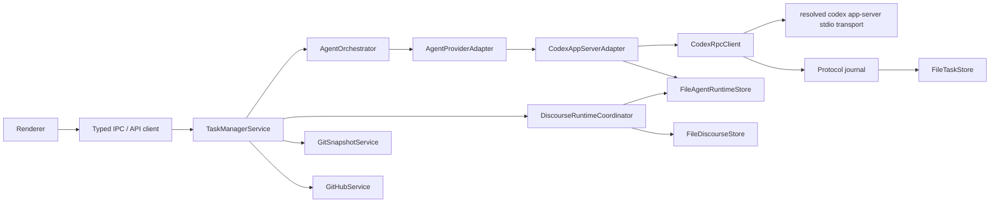

# Codex App Server Architecture

Date: 2026-07-13

This document describes the current runtime architecture and responsibility
boundaries.

## Goal

Task Monki runs AI coding work through a long-lived Codex App Server while
keeping Task Monki authoritative for local evidence and workflow state.

Task Monki owns:

- task records and workflow phases;
- isolated task worktrees and branches;
- Git snapshots, dirty fingerprints, and diff artifacts;
- GitHub branch, PR, check, review, and merge evidence;
- local acceptance and Done transitions.

Codex owns:

- App Server lifecycle;
- provider threads and turns;
- provider items, approvals, plans, settings, usage, and subagent events;
- model catalog and supported reasoning efforts.

## Process topology

Task Monki uses one Codex App Server process per running app process.



Reasons:

- App Server already supports many provider threads.
- Authentication and model catalog are process-wide.
- Per-turn working directory, sandbox, approval, network, model, and reasoning
  settings keep task execution scoped.
- One process makes request correlation and recovery easier.

## Important records

- `Task`
  - User intent, workflow phase, current implementation-side run, worktree,
    projections, and evidence pointers. Composer-created tasks may also retain
    an opaque creation token and normalized-request fingerprint so a lost create
    response resolves to the same durable task rather than consuming its draft
    twice.
- `RunRecord`
  - One implementation, follow-up, retry, review, or provider-origin child run.
    Fork alternatives are represented as a new `Task` with its own
    implementation run, not as a run inside the source task.
- `AgentSessionRecord`
  - Provider thread/session metadata. Primary sessions are used for
    implementation-side work. Review sessions use `role: "REVIEW"`.
- `AgentServerInstance`
  - App-level Codex process state, runtime version, schema hash, and status.
    New records live in `AgentRuntimeStore`, not in a task.
- `AgentProtocolJournal`
  - Private append-only raw protocol messages for debugging and
    reconstruction. Journals are owned by `AgentRuntimeStore`, bounded per
    process by message count, message size, and total bytes, and referenced by
    checksummed byte ranges from normalized records.
- `StatusProjection`
  - Compact UI-facing state derived from Task Monki domain events.
- `TaskAttachmentRecord`
  - Path-free durable metadata for one app-managed task input. Immutable
    task-owned files live outside Git worktrees and are reverified before
    provider delivery.
- `RunRecord.attachmentSubmissions`
  - Path-free evidence recorded only after `turn/start` succeeds. It identifies
    the verified bytes and submission mode, but does not assert that the model
    read or used them.
- `AgentRuntimeSessionRecord` / `AgentRuntimeRunRecord`
  - Owner-neutral provider execution records. An owner is explicitly either a
    task or a discourse participant; discourse records never fabricate task,
    iteration, or worktree ownership.
- `AgentSessionAccessEpoch`
  - Immutable hash of the full execution boundary for one provider session,
    including canonical roots, managed inputs, model settings, and permission
    profile. A changed execution boundary requires another epoch/session.
- `AgentSchedulerQueueEntry`
  - Durable, globally bounded queue/lease state. Start delivery and interrupt
    delivery are separate state machines so an uncertain interrupt is never
    mistaken for an uncertain start or replayed automatically.
- `FileDiscourseStore`
  - Dedicated curated conversation authority using per-conversation segmented
    event logs, bounded summary/index files, opaque pagination cursors, archive,
    and durable deletion tombstones. Conversation transcripts are not part of
    `TaskSnapshot`.

## Owner-neutral scoped runtime

Task Manager composition opens `FileAgentRuntimeStore` and
`FileDiscourseStore` before provider startup. Startup repairs cross-store links
and terminal-before-curated-message crashes before it can clear a prior
scheduler shutdown latch. A latch remains closed whenever a leased turn still
needs reconciliation.

For every provider turn, task and discourse work share one durable scheduler
and one App Server/process journal. Task foreground work retains priority while
bounded aging prevents queued discourse from starving. For a discourse job,
the durable ordering is:

1. persist the curated job and immutable context identity;
2. persist an owner-bearing runtime session, run, prompt/output/diagnostic
   artifacts, and scheduler entry;
3. lease capacity and persist `SENDING` before `thread/start`, `thread/resume`,
   or `turn/start` can mutate provider state;
4. reconcile an authoritative start notification/response without replaying an
   ambiguous mutation;
5. persist provider terminal output in the runtime store before creating the
   attributable curated message and settling the job/wave.

Every discourse provider session is fresh, offline, attachment-free, read-only,
and uses `approvalPolicy: never`. Live settings are checked against the exact
access-epoch permission scope. An unexpected approval, tool, or user-input
request is recorded in scoped diagnostics, declined, and terminalizes or marks
the scoped run for recovery; it cannot enter task interaction controls.

Queued cancellation persists wave/job stop intent before making the runtime run
provably not delivered and canceling its queue entry. Active cancellation
persists separate interrupt send intent before `turn/interrupt`; an ambiguous
interrupt becomes recovery-required and is never automatically retried.

Task workflow remains projected through `FileTaskStore`, but provider delivery,
queue ownership, execution epochs, raw artifacts, normalized telemetry, App
Server lifecycle, and protocol journals are persisted in `AgentRuntimeStore`
first. The task projection is retained for task workflow selectors and shipped
schema compatibility; it cannot create discourse activity or override generic
delivery evidence. Restart repair covers a task projection without a generic
run, a generic queued run without artifacts/queue linkage, a leased-but-unsent
turn, and a submitted turn whose delivery is ambiguous. None of these paths
replays provider mutation without proof that it was not delivered.

Provider-spawned child sessions are recorded with
`INHERITED_UNATTESTED` execution context. Their activity and child runs remain
auditable, but inherited scope is never reused as a fresh Task Monki access
attestation. Legacy runtime schema-v1 sessions are similarly migrated once as
`LEGACY_UNATTESTED`; the original runtime file is preserved before the v2
snapshot is published.

Task-store migrations preserve the original `store.json` before rewriting an
older supported schema. The development-only task-specific schema 12 is backed
up and refused explicitly; it is never silently reinterpreted as owner-neutral
runtime or conversation data. Newer schemas fail closed without rewriting the
source store.

The shipped task-runtime migration is idempotent and one-way: historical task
sessions, runs, artifacts, and normalized provider observations are copied into
the generic runtime without rewriting the task store. Active historical
provider delivery is quarantined as recovery-required instead of replayed.
Old task-owned protocol journals remain readable through the compatibility
fallback, while all new App Server traffic is journaled by the generic runtime.

The Discourse wave, context, review/correction, cancellation, and recovery state
machines are documented in
`docs/workflows/GENERAL_AGENT_DISCOURSE_LIFECYCLE.md`.

## Provider adapter responsibilities

The adapter must:

- resolve, launch, and initialize a compatible App Server runtime;
- probe Codex App Server support by capability rather than rejecting runtimes
  solely because their version is newer than the generated protocol baseline;
- start the embedded App Server from Task Monki's core app settings. The default
  is local-only: apps disabled, web search disabled, and discovered MCP servers
  disabled through per-server runtime config overrides so local coding turns do
  not inherit unrelated user/plugin tool processes;
- allow explicit settings opt-in for cached or live Codex web search, all
  configured Codex MCP servers, and Codex apps/connectors when a task needs
  those external tools in packaged Electron. Browser development forces all
  three modes off, rejects enable attempts, and aborts before App Server launch
  unless every enabled MCP entry can be discovered and explicitly disabled;
- validate settings reported by thread start/resume/fork responses before
  persistence or a subsequent turn/review operation. In browser development,
  an unsafe response or live settings notification latches the adapter closed
  and stops the process before any storage wait;
- avoid copying MCP environment values into stored App Server argv records when
  building those runtime config overrides;
- opt out of high-volume provider delta notifications that Task Monki does not
  use as verified evidence;
- discover account, models, supported reasoning efforts, and settings;
- create, attach, and read provider sessions;
- fork provider sessions only for detached Codex review when supported;
- start implementation, follow-up, retry, and review turns;
- correlate provider thread IDs, turn IDs, item IDs, and request IDs;
- materialize useful provider events into Task Monki records;
- keep raw protocol traffic in the journal;
- recover or locally reconcile when provider delivery is ambiguous;
- resolve attachment records only from Task Monki storage, reverify their
  immutable task-owned files, use native `localImage` inputs when appropriate,
  and persist path-free submission
  evidence on the run without claiming model consumption.

The adapter must not:

- decide Task Monki workflow phase by trusting provider text;
- treat provider debug state as local evidence;
- let detached review runs replace the implementation run;
- expose experimental protocol features without explicit capability gates;
- accept renderer-supplied or canonical task-store file paths, or claim generic
  App Server file or PDF support that the live protocol does not provide.

The complete attachment storage, delivery, cleanup, and security contract is in
`docs/architecture/ATTACHMENT_LIFECYCLE.md`.

## Attachment protocol boundary

The generated Codex protocol currently exposes `text`, `image`, `localImage`,
  `skill`, and `mention` user inputs. It does not expose a generic file or PDF
turn input. Task Monki therefore sends supported images through `localImage`
after reverifying the immutable task-owned file. It provides supported
text-like files through an untrusted-data prompt manifest containing the exact
read-only managed path. Task-owned files remain outside Git worktrees and are
reused across runs and reviews. PDFs, Office files, video, audio, archives,
databases, and arbitrary binaries remain unsupported because they require a
separately secured extraction or tool boundary.

The adapter supplies a complete, collision-resistant permission profile through
the existing thread-local config layer. It grants `:minimal`, the exact
worktree, and exact verified task attachment files. Multi-agent V1/V2
and memories are disabled in the same config. Runtime discovery proves this
surface with a disposable ephemeral thread before selecting a Codex binary.

Thread create, resume, fork, each ordinary turn, recovery, and the explicit
fork-plus-inline review path all require the returned active profile and sole
runtime workspace root before provider input. Live settings drift terminates
the provider and fails active runs. Attachment reads therefore need no separate
permission escalation or path expansion flow.

Full access remains available for attachment-free tasks but is rejected when
attachments are present. Attachment tasks also force network off and require
Codex web search, MCP servers, and apps to be disabled because filesystem rules
do not confine same-user external tools.

Codex serializes a submitted `localImage` into an image data URL in its
model-facing conversation history. Opaque delivery paths can still occur in
the outbound request, provider telemetry, and raw protocol journal, so Task
Monki makes no complete-erasure claim. Normal task snapshots, interaction
requests, approval decisions, and submission evidence remain path-free.
External provider permission paths are redacted and declined. The Debug view
shows the path-free submission record, not proof of model consumption.

Private managed storage, atomic synchronized writes, startup reconciliation,
the HTTP/Vite token boundary, Electron sender guards, and
transport resource limits are Task Monki responsibilities, not provider
capabilities. They are defined in the attachment lifecycle document rather
than inferred from Codex events.

## Turn modes

- `IMPLEMENTATION`
  - First coding run for a task.
- `FOLLOW_UP`
  - Continuation with new instructions, including requested review changes.
- `RETRY`
  - Another attempt after a previous run.
- `REVIEW`
  - Detached read-only quality gate. It inspects the current diff and stores
    `projection.codexReview`.
- Provider-origin child runs
  - Observed child/subagent activity. These do not replace the task workflow.

Fork alternatives are intentionally not a `RunRecord.mode`. They are created by
Task Monki as a new task with a separate worktree, branch, iteration, fresh
provider session, and implementation run. The source task stores the alternative
task id, and the alternative stores its source task/run ids for traceability.
After creation, workflow and delivery actions on either task are independent.
If worktree or run startup fails after the alternative task is stored, Task
Monki leaves the alternative visible and blocked rather than silently hiding the
partial candidate.

Read `docs/workflows/CODEX_REVIEW_WORKFLOW_LIFECYCLE.md` before changing review
mode or follow-up behavior.

## Settings

Task and review execution settings stored on task/run records include:

- model;
- reasoning effort;
- sandbox;
- approval policy;
- approval reviewer;
- network access.

Settings are validated against the live model catalog before a turn starts.
Renderer settings should update both implementation defaults and review defaults
so the app uses the configured reasoning level consistently.

App-level user preferences are separate from `FileTaskStore`. The Electron app
stores them in `app-settings.json` directly under `app.getPath('userData')`.
The development HTTP server uses `TASK_MANAGER_APP_SETTINGS_PATH` or an
`app-settings.json` file beside the dev store. These settings include:

- theme, sidebar, and mascot preferences;
- first-launch setup completion;
- default implementation, review, and prompt-refinement models;
- the selected repository ID;
- Codex external tool modes for web search, MCP servers, and apps;
- external executable path preferences for Git, Codex CLI, and GitHub CLI.

Known repository roots live in a separate versioned
`FileRepositoryRegistry`, not in app settings. The registry owns opaque IDs,
canonical real paths, path aliases, repository identity evidence, availability,
and the default repository. On the app-settings v3-to-v4 migration, Task Monki
registers the default, legacy configured, and task-derived roots first, saves a
pre-v4 settings backup, then publishes the selected repository ID. Registry
mutation is therefore durable before selection mutation; startup repairs a
selection that points to a removed record. Newer settings or registry schemas
fail closed rather than being silently reinterpreted.

Empty executable paths mean Auto-detect. The main process resolves and probes
executables live; resolved paths and detected versions are not persisted. Git
and Codex CLI are required, while GitHub CLI is optional. Environment variables
`TASK_MANAGER_GIT_PATH`, `TASK_MONKI_CODEX_BIN`, and `TASK_MANAGER_GH_PATH`
act as debug overrides ahead of saved settings.

Codex Auto-detect status may display the resolved `codex` path, but that
auto-discovered path is not passed as an explicit App Server runtime. In Auto
mode, App Server startup leaves the executable unset so capability-based
runtime resolution can scan all candidates and choose a compatible runtime.
Saved custom paths, constructor overrides, and `TASK_MONKI_CODEX_BIN` are
intentional and are passed explicitly.

## Runtime resolution

Task Monki resolves a Codex executable before launching the long-lived App
Server. Resolution checks explicit configuration first, then the
`TASK_MONKI_CODEX_BIN` environment override, then every `codex` found on `PATH`,
then known bundled runtimes such as Codex Desktop and the OpenAI Codex VS Code
extension.

Automatic discovery does not fail on the first stale binary. Each candidate is
probed with `--version`, `codex app-server --help`, an isolated temporary
`CODEX_HOME`, `initialize`, and the JSON-RPC methods Task Monki needs. The
newest compatible automatically discovered runtime is selected. An explicit
configured runtime is treated as intentional and must itself be compatible.
The selected runtime, all candidate versions, rejected candidates, missing
capabilities, and probe failures are persisted on the App Server instance and
shown only in provider diagnostics/debug surfaces.

The default transport is the documented local stdio App Server transport. Task
Monki prefers `codex app-server --stdio`, uses `--listen stdio://` when that is
the supported stdio form, and can fall back to `codex app-server` only when the
runtime documents default stdio but not a stdio flag.

Codex protocol detail:

- `turn/start` has a first-class `effort` field.
- `thread/start`, `thread/resume`, and `thread/fork` do not; they must pass
  `model_reasoning_effort` through the request `config` object.
- Reviews use `thread/fork` before `review/start`, so review latency depends on
  this config being set correctly.
- Task Monki starts `review/start` inline on that fork. Requesting a second
  detached review thread can lose the fork cwd and review unrelated local
  changes.

## Recovery rules

Provider delivery can be ambiguous. The app must handle:

- a provider mutation that is acknowledged before Task Monki can durably save
  the provider session, turn identity, or attachment submission evidence;
- stale provider turn IDs;
- `no active turn to interrupt`;
- App Server exit during interrupt or review;
- late protocol errors after a server already reached a terminal state;
- missing terminal events after interruption.

Recovery must prefer a truthful local state over an endlessly running UI. An
acknowledged mutation followed by local persistence failure is not safe to
replay as a new mutation: keep the run in recovery-required state for
reconciliation. Attachments remain immutable task-owned inputs and are reused
after reconciliation; there is no disposable run-specific attachment copy. If
the provider cannot confirm a terminal event, record the ambiguity and
reconcile locally when the evidence proves the run is no longer active.

## Verification

Use these before merging App Server or workflow changes:

```sh
npm run typecheck
npm test
npm run build
npm run check:codex-protocol
git diff --check
```
