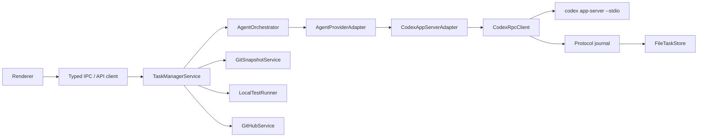

# Codex App Server Architecture

Date: 2026-06-25

This document describes the current architecture, not an old migration plan.

## Goal

Task Monki runs AI coding work through a long-lived Codex App Server while
keeping Task Monki authoritative for local evidence and workflow state.

Task Monki owns:

- task records and workflow phases;
- isolated task worktrees and branches;
- Git snapshots, dirty fingerprints, and diff artifacts;
- test execution and test artifacts;
- GitHub branch, PR, check, review, and merge evidence;
- local acceptance and Done transitions.

Codex owns:

- App Server lifecycle;
- provider threads and turns;
- provider items, approvals, plans, settings, usage, and subagent events;
- model catalog and supported reasoning efforts.

## Process topology

Task Monki uses one Codex App Server process per running app process.



Reasons:

- App Server already supports many provider threads.
- Authentication and model catalog are process-wide.
- Per-turn working directory, sandbox, approval, network, model, and reasoning
  settings keep task execution scoped.
- One process makes request correlation and recovery easier.

## Important records

- `Task`
  - User intent, workflow phase, current implementation-side run, worktree,
    projections, and evidence pointers.
- `RunRecord`
  - One implementation, follow-up, retry, fork, review, or provider-origin child
    run.
- `AgentSessionRecord`
  - Provider thread/session metadata. Primary sessions are used for
    implementation-side work. Review sessions use `role: "REVIEW"`.
- `AgentServerInstance`
  - Codex App Server process state, runtime version, schema hash, and status.
- `AgentProtocolJournal`
  - Append-only raw protocol messages for debugging and reconstruction.
- `StatusProjection`
  - Compact UI-facing state derived from Task Monki domain events.

## Provider adapter responsibilities

The adapter must:

- launch and initialize the App Server;
- discover account, models, supported reasoning efforts, and settings;
- create, attach, fork, and read provider sessions;
- start implementation, follow-up, retry, fork, and review turns;
- correlate provider thread IDs, turn IDs, item IDs, and request IDs;
- materialize useful provider events into Task Monki records;
- keep raw protocol traffic in the journal;
- recover or locally reconcile when provider delivery is ambiguous.

The adapter must not:

- decide Task Monki workflow phase by trusting provider text;
- treat provider debug state as local evidence;
- let detached review runs replace the implementation run;
- expose experimental protocol features without explicit capability gates.

## Turn modes

- `IMPLEMENTATION`
  - First coding run for a task.
- `FOLLOW_UP`
  - Continuation with new instructions, including requested review changes.
- `RETRY`
  - Another attempt after a previous run.
- `REVIEW`
  - Detached read-only quality gate. It inspects the current diff and stores
    `projection.codexReview`.
- Provider-origin child runs
  - Observed child/subagent activity. These do not replace the task workflow.

Read `docs/research/CODEX_REVIEW_WORKFLOW_LIFECYCLE.md` before changing review
mode or follow-up behavior.

## Settings

Task and review execution settings include:

- model;
- reasoning effort;
- sandbox;
- approval policy;
- network access;
- test command.

Settings are validated against the live model catalog before a turn starts.
Renderer settings should update both implementation defaults and review defaults
so the app uses the configured reasoning level consistently.

Codex protocol detail:

- `turn/start` has a first-class `effort` field.
- `thread/start`, `thread/resume`, and `thread/fork` do not; they must pass
  `model_reasoning_effort` through the request `config` object.
- Detached reviews use `thread/fork` before `review/start`, so review latency
  depends on this config being set correctly.

## Recovery rules

Provider delivery can be ambiguous. The app must handle:

- stale provider turn IDs;
- `no active turn to interrupt`;
- App Server exit during interrupt or review;
- late protocol errors after a server already reached a terminal state;
- missing terminal events after interruption.

Recovery must prefer a truthful local state over an endlessly running UI. If the
provider cannot confirm a terminal event, record the ambiguity and reconcile
locally when the evidence proves the run is no longer active.

## Verification

Use these before merging App Server or workflow changes:

```sh
npm run typecheck
npm test
npm run build
npm run check:codex-protocol
git diff --check
```
