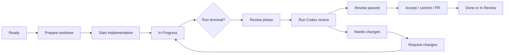

# Product Workflow

Date: 2026-06-25

Task Monki is a local task execution and evidence system for AI coding work. It
is not just an AI chat UI.

## Product model

1. User creates a task with a goal, repository, model, reasoning effort, and
   validation command.
2. Task Monki prepares an isolated Git worktree.
3. An AI provider runs in that worktree.
4. Task Monki records provider activity, approvals, Git evidence, test evidence,
   delivery evidence, and audit history.
5. User reviews, requests changes, continues, retries, forks, commits, opens a
   draft PR, accepts locally, or marks done.

## UI priority

Screens should prioritize:

1. user action required: approvals, input, permission requests;
2. safety or recovery risk: runtime lost, ambiguous mutation, stale request;
3. verified local evidence: Git, tests, PR, checks, reviews, merge;
4. available user actions: start, continue, retry, fork, review, commit, PR;
5. provider telemetry: plans, items, usage, raw protocol.

Provider telemetry is useful, but it should not visually dominate pending user
decisions or verified local evidence.

## Board phases

- Backlog / Ready
  - Task exists and can be prepared or started.
- In Progress
  - Implementation-side work is active or being corrected.
- Review
  - Implementation-side work has reached a terminal state and is ready for
    inspection, review gate, acceptance, commit, or PR creation.
- In Review
  - A PR or external review process exists.
- Done
  - Work is accepted locally, merged, or explicitly marked complete.

Other phases such as Blocked, Canceled, or Archived are exceptional states and
should explain what action is needed to recover.

## Main flow

## Review workflow

There are two separate review concepts:

- Review phase
  - Board workflow state. The work is ready to inspect or ship.
- Codex review gate
  - Detached AI quality check on the current diff.

Rules:

- Running Codex review keeps the task in Review.
- Requesting changes starts follow-up implementation work and moves the task to
  In Progress.
- The previous review becomes stale as soon as implementation changes continue.
- A stale review can remain visible as context, but its findings are not current
  actions.
- Delivery actions are paused while review-derived follow-up work is running.
- After follow-up completes, the task returns to Review and needs a fresh review.

The detailed source of truth is
`docs/research/CODEX_REVIEW_WORKFLOW_LIFECYCLE.md`.

## Action rules

Ready:

- Prepare worktree.
- Start implementation once the worktree exists.

In Progress:

- Show the active implementation-side run.
- Allow steering, approval/input responses, and interrupt controls.
- Do not show review completion actions.

Review:

- Show verified evidence prominently.
- Allow Run Codex review when no implementation-side run is active.
- Allow Request changes only when the current review result has actionable
  current findings.
- Allow Accept locally, Commit, and Create draft PR when not paused by an active
  run or review.

In Review:

- Prioritize PR, check, review, and merge evidence.
- Allow GitHub refresh actions.

Done:

- Show final evidence and completion route.
- Avoid active agent controls unless the task is explicitly reopened.

## Finish task actions

- Accept locally
  - Records local acceptance and can move the task to Done. It does not create a
    PR.
- Commit
  - Creates a local commit from task worktree changes.
- Create draft PR
  - Publishes the branch if needed and creates or opens a draft PR.
- Mark done
  - Only available when local policy says the task is complete enough.

If a review is running or a follow-up implementation run is active, finish
actions should be disabled with a clear reason.
