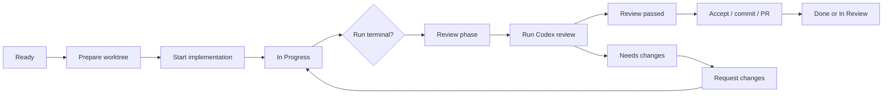

# Product Workflow

Date: 2026-06-28

Task Monki is a local task execution and evidence system for AI coding work. It
is not just an AI chat UI.

## Product model

1. User creates a task in the active repository with a goal, model, reasoning
   effort, and validation command.
2. Task Monki prepares an isolated Git worktree.
3. An AI provider runs in that worktree.
4. Task Monki records provider activity, approvals, Git evidence, test evidence,
   delivery evidence, and audit history.
5. User reviews, requests changes, follows up, continues unfinished runs,
   retries, forks alternatives, commits, opens a draft PR, or marks done.

## Repository context

The sidebar repository selector defines the active task context. It filters the
board, counts, settings summary, and new-task defaults to the selected
repository. Adding a repository opens the local folder picker and validates the
selected folder before it is saved as a selectable repository.

New tasks inherit the active sidebar repository automatically. The creation
flow should not ask for a repository path when a repository is already selected.

Task records remain bound to the repository path they were created with. Runs,
worktrees, Git evidence, tests, GitHub delivery, and provider sessions continue
to resolve through the task and iteration records rather than the currently
selected sidebar repository. Switching repositories must therefore close task
detail views from the previous repository instead of mutating those task
records.

## UI priority

Screens should prioritize:

1. user action required: approvals, input, permission requests;
2. safety or recovery risk: runtime lost, ambiguous mutation, stale request;
3. verified local evidence: Git, tests, PR, checks, reviews, merge;
4. available user actions: start, follow up, continue, retry, fork alternative,
   review, commit, PR;
5. provider telemetry: plans, items, usage, raw protocol.

Provider telemetry is useful, but it should not visually dominate pending user
decisions or verified local evidence.

## Board phases

- Backlog / Ready
  - Task exists and can be prepared or started.
- In Progress
  - Implementation-side work is active or being corrected.
- Review
  - Implementation-side work has reached a terminal state and is ready for
    inspection, review gate, acceptance, commit, or PR creation.
- In Review
  - A PR or external review process exists.
- Done
  - Work is marked done locally, merged, or explicitly marked complete.

Other phases such as Blocked, Canceled, or Archived are exceptional states and
should explain what action is needed to recover.

## Main flow

## Review workflow

There are two separate review concepts:

- Review phase
  - Board workflow state. The work is ready to inspect or ship.
- Codex review gate
  - Detached AI quality check on the current diff.

Rules:

- Running Codex review keeps the task in Review.
- Requesting changes starts follow-up implementation work and moves the task to
  In Progress.
- The previous review becomes stale as soon as implementation changes continue.
- A stale review can remain visible as context, but its findings are not current
  actions.
- Delivery actions are paused while review-derived follow-up work is running.
- After follow-up completes, the task returns to Review and needs a fresh review.

The detailed source of truth is
`docs/research/CODEX_REVIEW_WORKFLOW_LIFECYCLE.md`.

## Action rules

Ready:

- Prepare worktree.
- Start implementation once the worktree exists.

In Progress:

- Show the active implementation-side run.
- Allow steering, approval/input responses, and interrupt controls.
- Do not show review completion actions.

Review:

- Show verified evidence prominently.
- Allow Run Codex review when no implementation-side run is active.
- Allow Request changes only when the current review result has actionable
  current findings.
- Allow Mark done, Commit, and Create draft PR when not paused by an active
  run or review.
- Treat Mark done anyway as an explicit owner override when review, test, or Git
  evidence is missing, stale, failed, dirty, unavailable, canceled,
  inconclusive, or unresolved.

Post-run implementation controls:

- Follow up
  - Normal next implementation action after a completed run when the owner wants
    another pass in the same task, worktree, branch, and provider session.
- Continue
  - Recovery action for failed, interrupted, lost, or recovery-required runs.
    It resumes from the current local state in the same task/worktree.
- Retry in session
  - Secondary action that starts a retry in the same task, worktree, branch, and
    provider session.
- Fork alternative
  - Creates a separate task with its own worktree, branch, iteration, run, and
    fresh provider session.

In Review:

- Prioritize PR, check, review, and merge evidence.
- Allow GitHub refresh actions.

Done:

- Show final evidence and completion route.
- Avoid active agent controls unless the task is explicitly reopened.

## Archive and delete

Task menus expose both archive and delete.

Archive is a non-destructive workflow transition to `ARCHIVED`. It removes the task
from active workflow handling but keeps Task Monki records, evidence, worktree
records, artifacts, provider session references, and source/alternative links.
Archive is blocked while a task-owned run, test, or provider request is active.

Delete is permanent and applies only to the selected task. It deletes the
selected task record and Task Monki-owned records scoped to that task: task
iterations, runs, domain events, artifacts, provider session/item/plan/usage
records, interaction requests, Git snapshots, test runs, GitHub delivery
snapshots, pull request/check/review/merge evidence, and worktree records. It
also removes links in other tasks that point at the deleted task. Deleting a
source task never deletes fork alternatives; deleting a fork alternative never
deletes its source task or sibling alternatives.

Local worktree removal is explicit and separate from task deletion. It is never
enabled by default, and Task Monki blocks removal when the worktree has
uncommitted, untracked, or conflicted files. Deleting a task never deletes the
original repository, remote branch, pull request, commits, Git history, merge
history, or provider remote thread data.

## Finish task actions

- Mark done
  - Moves the task to Done in Task Monki without creating a commit or PR. It is
    only available as the clean local-completion path when local policy says the
    task is complete enough.
- Mark done anyway
  - Moves the task to Done in Task Monki despite missing or non-passing review,
    test, or Git evidence. It should be styled and confirmed as an owner
    override, not a review action.
- Create draft PR
  - Main delivery path. It may create a delivery commit if needed, publish the
    branch if needed, then create or open a draft PR.
- Commit
  - Secondary/manual delivery step for users who want local Git control before
    publishing or opening a PR.

A Task Monki delivery commit records the current task worktree into Git. It is
delivery progress, not follow-up implementation work. If the reviewed diff was
still current immediately before the delivery commit, the commit does not make
the Codex review stale by itself.

If a review is running or a follow-up implementation run is active, finish
actions should be disabled with a clear reason.

## Fork alternatives

Fork alternative creates a separate task and isolated worktree/branch for a
fresh alternative attempt. The source task records the alternative task id, and
the alternative task records its source task and source run. Provider session
history does not need to be reused.

If alternative setup fails after the alternative task is created, the partial
alternative remains visible as a blocked task with its worktree/setup error
recorded. It must not be hidden behind only the source task's failed action.

After creation, the source and alternative tasks are independent execution
units. Follow-up, retry, review, accept, commit, and PR actions on one task must
not mutate the other task. The source/alternative links are traceability
metadata only; comparison UI can use them later, but there is no shared workflow
state between the tasks.
