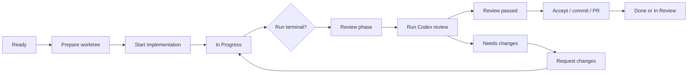

# Product Workflow

Date: 2026-07-02

Task Monki is a local task execution and evidence system for AI coding work. It
is not just an AI chat UI.

## Product model

1. User creates a task in the active repository with a goal, model, and
   reasoning effort.
2. Task Monki prepares an isolated Git worktree.
3. An AI provider runs in that worktree.
4. Task Monki records provider activity, approvals, Git evidence, GitHub
   delivery evidence, and audit history.
5. User reviews, requests changes, follows up, continues unfinished runs,
   retries, forks alternatives, commits, opens a draft PR, or marks done.

## Repository context

The sidebar repository selector defines the active task context. It filters the
board, counts, settings summary, and new-task defaults to the selected
repository. Adding a repository opens the local folder picker and validates the
selected folder before it is saved as a selectable repository.

On first launch, when no repository has been configured, the main workflow area
shows setup instead of an empty board. Adding a repository completes only the
repository step. The setup surface remains open so the user can review required
tool status and defaults, then explicitly finish setup before entering the
board and creating tasks. Finishing setup re-checks required Git and Codex
tool availability before the completion flag is saved; GitHub CLI remains
optional because it only affects PR delivery.

New tasks inherit the active sidebar repository automatically. The creation
flow should not ask for a repository path when a repository is already selected.

Task records remain bound to the repository path they were created with. Runs,
worktrees, Git evidence, GitHub delivery, and provider sessions continue
to resolve through the task and iteration records rather than the currently
selected sidebar repository. Switching repositories must therefore close task
detail views from the previous repository instead of mutating those task
records.

## UI priority

Screens should prioritize:

1. user action required: approvals, input, permission requests;
2. safety or recovery risk: runtime lost, ambiguous mutation, stale request;
3. verified delivery evidence: Git, PR, checks, reviews, merge;
4. available user actions: start, follow up, continue, retry, fork alternative,
   review, commit, PR;
5. provider telemetry: plans, items, usage, raw protocol.

Provider telemetry is useful, but it should not visually dominate pending user
decisions or verified local evidence.

## Activity Timeline

The Overview may show `Activity Timeline` below PR Status. It is a curated task
history, not a log viewer.

Activity Timeline should answer what changed, who or what caused it, whether
anything is blocked or stale, and what the next useful action is likely to be.
It is derived from stored Task Monki domain events, task projections, run
records, Git evidence, and GitHub delivery rollups. It must not treat raw
provider text or raw GitHub responses as workflow truth.

The timeline shows the latest bounded window of useful activity in chronological
order with stable absolute timestamps. It must not render relative labels such
as "now" for stored events, because reopening a task should not imply the event
just happened.

Tone is expressed by the row's single status dot. Timeline text stays neutral;
do not add colored chips, tinted row backgrounds, colored borders, or repeated
status labels. Supporting details should be collapsed behind an in-row
disclosure only when they name concrete evidence and the decision it affects,
such as the exact failed GitHub check that blocks PR readiness.

Main-history items should be consequence-bearing: terminal implementation or
review outcomes, current active runs, Git state changes, delivery commits,
branch publication results, first PR availability, check verdict changes,
GitHub review decisions, merge outcomes, blocked transitions, stale Codex
review state, and recovery risks.

No-op refreshes, repeated unchanged evidence captures, provider protocol
details, raw item traffic, goal/plan/usage telemetry, PR body artifact creation,
and healthy verification pings belong in Debug or supporting evidence surfaces,
not in Activity Timeline.

PR Status remains the current GitHub delivery surface. Activity Timeline can
summarize meaningful delivery verdict changes, but it must not duplicate PR
actions or become a second source of delivery truth.

The renderer should derive both Overview `Activity Timeline` and Debug `Task
activity` from the same task activity model. Overview is a compact projection
of the canonical activity ledger; Debug may show the fuller curated ledger plus
the raw domain-event audit. Do not maintain a second event-to-label switch for
Debug, because delivery/review facts such as exact failed checks, stale
evidence, blocked transitions, and merge state must be interpreted consistently
across surfaces.

## Board phases

- Backlog / Ready
  - Task exists and can be prepared or started.
- In Progress
  - Implementation-side work is active or being corrected.
- Review
  - Implementation-side work has reached a terminal state and is ready for
    inspection, review gate, acceptance, commit, or PR creation.
- In Review
  - A PR or external review process exists.
- Done
  - Work is marked done locally, merged, or explicitly marked complete.

Other phases such as Blocked, Canceled, or Archived are exceptional states and
should explain what action is needed to recover.

## Main flow

## Review workflow

There are two separate review concepts:

- Review phase
  - Board workflow state. The work is ready to inspect or ship.
- Codex review gate
  - Detached AI quality check on the current diff.

Rules:

- Running Codex review keeps the task in Review.
- Requesting changes starts follow-up implementation work and moves the task to
  In Progress.
- The previous review becomes stale as soon as implementation changes continue.
- A stale review can remain visible as context, but its findings are not current
  actions.
- Delivery actions are paused while review-derived follow-up work is running.
- After follow-up completes, the task returns to Review and needs a fresh review.

The detailed source of truth is
`docs/workflows/CODEX_REVIEW_WORKFLOW_LIFECYCLE.md`.

## Action rules

Ready:

- Prepare worktree.
- Start implementation once the worktree exists.

In Progress:

- Show the active implementation-side run.
- In Overview, keep the provider plan as the primary progress structure. For a
  running run, a compact activity tail may summarize recent provider telemetry
  such as reads, searches, file changes, verification commands, tool calls, and
  approval waits. This tail is context only; completed, failed, interrupted, and
  recovery-required runs should return to the plan plus local-evidence footer.
  The detailed data flow and invariants are documented in
  `docs/workflows/AGENT_PROGRESS_OVERVIEW.md`.
- Allow steering, approval/input responses, and interrupt controls.
- Do not show review completion actions.

Review:

- Show verified evidence prominently, with PR Status as the primary delivery
  surface.
- Allow Run Codex review when no implementation-side run is active.
- Allow Request changes only when the current review result has actionable
  current findings.
- Allow Mark done and Commit when not paused by an active run or review.
- Keep Create draft PR and Push update in PR Status, not duplicated in Finish.
- Treat Mark done anyway as an explicit owner override when review or Git
  evidence is missing, stale, failed, dirty, unavailable, canceled,
  inconclusive, or unresolved.

Post-run implementation controls:

- Follow up
  - Normal next implementation action after a completed run when the owner wants
    another pass in the same task, worktree, branch, and provider session.
- Continue
  - Recovery action for failed, interrupted, lost, or recovery-required runs.
    It resumes from the current local state in the same task/worktree.
- Retry in session
  - Secondary action that starts a retry in the same task, worktree, branch, and
    provider session.
- Fork alternative
  - Creates a separate task with its own worktree, branch, iteration, run, and
    fresh provider session.

In Review:

- Prioritize PR Status: one linked PR identity, one headline, exact check rows
  when available, review line when delivery-affecting, merge line when known,
  and freshness.
- For failed checks, show the `Investigate failure` action and expandable check
  rows instead of repeating a prose explanation of the failure.
- Allow GitHub refresh actions.
- Offer failing-CI investigation only when the selected PR Status state is
  `Checks failed`; stale, diverged, or locally unpublished work should surface
  its own next action instead. Investigation starts implementation-side work,
  not a GitHub state update.

Done:

- Show final evidence and completion route.
- Avoid active agent controls unless the task is explicitly reopened.

## Archive and delete

Task menus expose both archive and delete.

Archive is a non-destructive workflow transition to `ARCHIVED`. It removes the task
from active workflow handling but keeps Task Monki records, evidence, worktree
records, artifacts, provider session references, and source/alternative links.
Archive is blocked while a task-owned run or provider request is active.

Delete is permanent and applies only to the selected task. It deletes the
selected task record and Task Monki-owned records scoped to that task: task
iterations, runs, domain events, artifacts, provider session/item/plan/usage
records, interaction requests, Git snapshots, GitHub delivery
snapshots, pull request/check/review/merge evidence, and worktree records. It
also removes links in other tasks that point at the deleted task. Deleting a
source task never deletes fork alternatives; deleting a fork alternative never
deletes its source task or sibling alternatives.

Local worktree removal is explicit and separate from task deletion. It is never
enabled by default, and Task Monki blocks removal when the worktree has
uncommitted, untracked, or conflicted files. Deleting a task never deletes the
original repository, remote branch, pull request, commits, Git history, merge
history, or provider remote thread data.

## Finish task actions

- Mark done
  - Moves the task to Done in Task Monki without creating another commit or PR.
    It is only available as the clean local-completion path when the task
    completion policy says the task is complete enough.
  - New tasks start as `LOCAL_ACCEPTANCE`. When Task Monki records a linked PR
    for the task, that task moves to the `MERGED` completion policy. This is a
    task-scoped policy transition, not a provider verdict.
  - PR evidence must not downgrade stricter or explicit policies such as
    `MERGED_AND_VERIFIED` or `MANUAL`.
  - `LOCAL_ACCEPTANCE` remains the local-only path. If legacy or manually
    repaired state has PR evidence while still using `LOCAL_ACCEPTANCE`, Mark
    done records local acceptance and leaves that PR unchanged.
  - For `MERGED` tasks, GitHub merge evidence is a hard requirement. The Finish
    panel should show a Merge requirement and keep Mark done disabled until
    merge evidence is `MERGED`.
  - For `MERGED_AND_VERIFIED` tasks, GitHub merge evidence and passing GitHub
    checks for the same merged PR head are hard requirements before Done.
  - Merged PR evidence may move eligible merge-policy tasks to Done
    automatically. It must not auto-complete `MANUAL` tasks or
    `MERGED_AND_VERIFIED` tasks whose GitHub checks are missing, not passing,
    or passing for a different PR head than the merge evidence.
- Mark done anyway
  - Moves the task to Done in Task Monki despite missing or non-passing review,
    or Git evidence. It should be styled and confirmed as an owner
    override, not a review action. It must not override a `MERGED` completion
    policy that is still waiting on GitHub merge evidence.
- Commit
  - Secondary/manual delivery step for users who want local Git control before
    publishing or opening a PR.

A Task Monki delivery commit records the current task worktree into Git. It is
delivery progress, not follow-up implementation work. If the reviewed diff was
still current immediately before the delivery commit, the commit does not make
the Codex review stale by itself.

If a review is running or a follow-up implementation run is active, finish
actions should be disabled with a clear reason.

## PR Status

PR Status is the primary GitHub delivery surface. Task Monki creates or reuses
one draft PR for the Task Monki-owned branch, then records PR identity, check
details, GitHub review rollup, merge state, and whether the PR head is fresh
against the local worktree.

Create draft PR and Push update are shown only here. Create draft PR opens a
small confirmation dialog where the user can edit the default PR title before
creation. The title is request metadata for a new PR only; if Task Monki finds
an existing open PR for the task branch, it reuses the observed PR instead of
renaming it. The action must be disabled with a clear reason when local Git
evidence cannot satisfy the service publish guard, such as no task changes,
missing worktree, unresolved conflicts, branch divergence, or a rejected remote
push caused by newer remote commits. Recoverable publication failures, such as
GitHub authentication or transient network errors, should be shown as the last
failure while leaving the action retryable.

The UI should render one headline from those facts instead of separate
competing badges. Headline priority is:

1. Merged.
2. Closed without merge.
3. Branch diverged or stale.
4. Local changes not pushed.
5. PR has newer commits.
6. Checks failed.
7. Checks pending, canceled, or no required checks ran.
8. GitHub changes requested.
9. GitHub review waiting.
10. Ready to merge.
11. Draft PR.
12. Open PR.
13. Unknown.

Closed without merge is a terminal status for that PR snapshot, but it may
still offer Create draft PR when the task branch remains publishable. Merged PRs
do not offer Create draft PR or Push update.

GitHub checks are normalized into passed, failed, pending, skipped, and
canceled buckets from `gh pr checks`. Canceled checks are distinct from
failures, but they still block ready-to-merge status until GitHub reports merge
readiness. Ready to merge requires explicit current PR, check, review, and
merge evidence for the same PR head; absent check or review evidence must not
be treated as success. The PR number is the link to GitHub; do not add a
separate Open PR button when the number can be rendered as a link.

The detailed PR Status source of truth is
`docs/workflows/PR_STATUS_CARD_FLOW.md`.

## Fork alternatives

Fork alternative creates a separate task and isolated worktree/branch for a
fresh alternative attempt. The source task records the alternative task id, and
the alternative task records its source task and source run. Provider session
history does not need to be reused.

If alternative setup fails after the alternative task is created, the partial
alternative remains visible as a blocked task with its worktree/setup error
recorded. It must not be hidden behind only the source task's failed action.

After creation, the source and alternative tasks are independent execution
units. Follow-up, retry, review, accept, commit, and PR actions on one task must
not mutate the other task. The source/alternative links are traceability
metadata only; comparison UI can use them later, but there is no shared workflow
state between the tasks.
