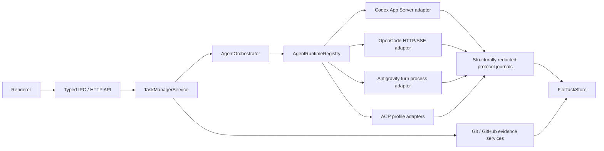

# Agent Runtime Architecture

Date: 2026-07-14

This document defines Task Monki's provider-neutral runtime architecture. It is
the source of truth for runtime identity, routing, capability preservation,
security, recovery, and model integration. Runtime-specific protocol details
belong beside their adapters.

## Decision

Task Monki owns a small static registry of complete coding-agent runtimes. It
does not implement a model loop over provider SDKs and does not route an
existing session through a different runtime as fallback.

Each entry is a vertical runtime driver: discovery, compatibility, process
ownership, native protocol or SDK client, streaming, permissions, sessions,
recovery, model integration, and native UI metadata stay together. The shared
contract covers Task Monki orchestration and durable ownership; it is not a
lowest-common-denominator agent implementation.

The initial runtime families are:

- Codex App Server, through its native JSON-RPC protocol;
- OpenCode, through its native authenticated loopback HTTP and SSE API;
- Antigravity, through one documented non-interactive CLI process per turn;
- registered ACP compatibility runtimes, through stable Agent Client Protocol
  v1 over stdio, with a separate durable runtime identity and exact launch
  profile for each agent product.

This design deliberately separates three identities:

1. runtime ID: the agent implementation that owns process/session semantics;
2. model-provider ID: the upstream model vendor reported by that runtime;
3. model ID: the runtime/provider model identifier.

For example, `opencode`, `anthropic`, and `claude-sonnet-*` are three different
identity layers. Treating all three as a single `provider` string makes durable
recovery and multi-provider selection ambiguous.

### Why runtime drivers instead of a provider SDK loop

Model SDKs provide inference, streaming, and tool-call primitives, but they do
not reproduce a mature coding agent's session semantics, command lifecycle,
permission policy, local tool implementation, compaction, resume behavior, or
recovery contract. Rebuilding those concerns once per model provider would
turn Task Monki into another coding-agent implementation and would still erase
provider-native behavior behind a synthetic common loop.

This does not forbid SDKs. A provider's official agent SDK can be the internal
implementation of a dedicated driver when it is that product's strongest
public integration surface. The invariant is that the SDK remains behind its
own runtime boundary and exposes additive native capabilities; it does not
define the semantics of other runtimes.

This shape follows established implementation patterns:

- T3 Code separates driver discovery/configuration from a per-session runtime;
- OpenCode normalizes model SDKs inside OpenCode's own full agent runtime,
  while its public server remains the integration boundary for clients;
- OpenClaw keeps host orchestration separate from native harness and ACP
  session authority.

## Responsibility boundary

Task Monki is authoritative for:

- tasks, phases, iterations, worktrees, and acceptance;
- local Git and GitHub evidence;
- durable runtime ownership and runtime-scoped correlation IDs;
- verified attachment bytes and path-free submission evidence;
- approval policy, user decisions, and browser/Electron trust boundaries.

Each runtime is authoritative only for its own:

- process and protocol health;
- sessions, turns, messages/items, and native tools;
- model/provider catalog and runtime-native configuration;
- approval or question requests;
- plans, usage, subagents, and other telemetry.

Runtime output is telemetry. It never becomes verified Git, test, GitHub, or
acceptance evidence without Task Monki observing the corresponding local or
remote system directly.

## Topology

The registry is static application composition, not a speculative plugin
platform. Adding a runtime is an intentional code/configuration change with a
tested adapter contract. This keeps security review, durable schemas, and
packaging understandable.

## Durable identity and routing

Store schema 12 persists `runtimeId` on tasks, sessions, runs, server
instances, interactions, settings observations, goals, plans, usage, and
subagent observations.

Rules:

- A task's runtime is its immutable primary implementation runtime.
- Primary implementation sessions and runs must match the task runtime.
- A fork alternative is a new task and may explicitly select another runtime.
- A detached review session/run may use a different runtime from the task.
- A continuation never changes runtime underneath an existing session.
- Provider session and turn IDs are unique only inside their owning runtime.
- A `TURN`-scoped runtime may materialize a local Task Monki session without a
  provider session ID when its public contract has no persistent session. Its
  per-run correlation ID is process ownership metadata, not a provider
  conversation that may be resumed, attached, or migrated.
- Interaction responses route through the runtime recorded on the interaction,
  run, and session; the current UI default is irrelevant.
- There is no automatic cross-runtime fallback after session creation.

The durable store accepts only its current schema. Older schemas and retired
provider-shaped records are rejected instead of carrying compatibility
migrations into the runtime. Invalid cross-record ownership is rejected on load
rather than silently reinterpreted.

## Adapter contract

Every `AgentRuntimeAdapter` provides:

- a stable descriptor: ID, display name, runtime kind, transport, and lifecycle
  scope;
- initialization, preflight, capability, and model discovery;
- execution resolution that returns one runtime-owned qualified model and
  normalized settings;
- session create/attach/read operations;
- turn start, interaction response, reconciliation, and shutdown;
- optional runtime operations such as steering, interruption, session fork,
  review, goal sync, and prompt refinement;
- optional typed session-control discovery and revision-checked mutation for
  provider-owned selectors that do not have universal semantics.

Task Monki's shared turn prompt keeps the worktree and Git-publication boundary
always applicable. Engineering and progress guidance is default behavior for
non-trivial repository work, not an override of task-specific no-tool,
read-only, or exact-output instructions. The authoritative goal and any current
user direction come after those defaults without trailing generic guidance.

The registry validates that advertised optional capabilities have matching
methods. One unavailable runtime degrades only its catalog row. Duplicate
runtime IDs, unqualified model IDs, cross-runtime models, and duplicate model
IDs are configuration errors.

## Typed readiness

Runtime availability is a staged contract, not a boolean inferred from a
version string or error message. Every preflight publishes a typed status,
machine-readable checks, structured diagnostics, and an optional next action.

- `NOT_INSTALLED` means no candidate was found.
- `INCOMPATIBLE` means a candidate was found but failed its provider-specific
  launch or protocol contract.
- `DISCOVERED` means passive discovery proved a launchable executable. It is
  startable, but live initialization, authentication, account access, and the
  native model catalog may still be unknown.
- `INITIALIZING` is not startable while negotiation is in progress.
- `READY` means the adapter completed the live proof required by that runtime.
  For on-demand ACP profiles this includes creating or resuming a provider
  session; executable discovery alone is never reported as ready.
- `AUTHENTICATION_REQUIRED` and `ACCOUNT_UNSUPPORTED` are distinct blocked
  states so setup can suggest the correct action without parsing prose.
- `DEGRADED` remains startable only when the adapter can safely attempt its
  runtime-owned recovery path.
- `UNSUPPORTED_SECURITY_POLICY` means the runtime cannot attest the execution
  boundary required by the current surface or operation; Task Monki fails
  closed instead of weakening it.
- `FAILED` and `DISABLED` are blocked.

Only `DISCOVERED`, `READY`, and `DEGRADED` have `canStart: true`. Product UI
consumes that discriminant and shows detailed diagnostics in the provider
inspector. It does not reconstruct health from provider text.

## Capabilities without a lowest common denominator

Common capabilities exist so product workflow can make safe decisions. Each
capability has a maturity (`stable`, `experimental`, `inferred`, or
`unsupported`) and a reason.

The common surface does not erase native features:

- `capabilities.extensions` retains named runtime features and support reasons;
- `AgentModel.native` retains schema-selected native model metadata;
- `AgentRuntimeState.native` exposes bounded, redacted native metadata for
  diagnostics only; workflow and actionable UI do not interpret this opaque
  value;
- `AgentRuntimeState.sessionControls` carries the safe actionable subset as
  semantic-neutral `BOOLEAN` or `SELECT` controls. IDs, labels, groups, values,
  and choices remain provider-owned, while each control set carries an
  optimistic revision for stale-write rejection;
- `AgentExecutionSettings.runtimeOptions[runtimeId]` stores runtime-owned
  settings without giving them false universal semantics;
- protocol messages remain in bounded, structurally redacted, append-only
  journal segments subject to explicit retention pruning.

Execution policy is runtime-owned too. Each runtime publishes the exact presets
it can enforce, including sandbox scope, approval behavior, reviewer, and
whether tool-network access is disabled, optional, or required. The composer
renders only those presets. Ordinary task capture fills the selected runtime's
default policy without starting or probing that runtime, so the local task
board remains usable while an agent is offline. Definitive model/catalog and
policy resolution happens before every turn. Attachment-backed task creation is
the exception: it resolves immediately because model modality and confinement
must be proven before Task Monki adopts the draft.

Adapters must not place credentials, bearer tokens, server passwords, or raw
attachment paths in native catalog metadata.

Session-control mutation is deliberately narrower than arbitrary native RPC.
The service validates task, session, runtime, control, and idle-run ownership;
the adapter then compares the submitted revision with its current safe control
projection and revalidates the exact value before sending a provider mutation.
The renderer renders the typed control contract and never parses
`AgentRuntimeState.native` to discover actions.

## Model selection

Model IDs used by Task Monki are runtime-qualified, for example
`opencode:anthropic/model-id`. Persisted execution settings retain `runtimeId`,
`modelProvider`, and the runtime's raw model ID separately.

UI selectors always choose runtime first, then show only models owned by that
runtime and optional model provider. Changing runtime deterministically resets
the model. Missing or stale model configuration is resolved only inside the
selected runtime; it never falls through to another runtime or provider. A task
captured while its runtime is unavailable may omit a model until start, when
the owning adapter selects or rejects its current default explicitly.

Catalog scope is part of model identity. Application catalogs contain only
models proven safe for application-wide selection. Worktree-, account-, or
provider-session-specific catalogs stay with that scope and are revalidated
before use. OpenCode resolves its authoritative catalog from the
worktree-scoped server before each turn. ACP has no stable global model-list
method, so its application catalog normally contains only the profile default;
exact models advertised only by a live ACP session remain in that session's
revisioned controls. Grok is the explicit exception: its versioned provider
contract advertises the account/runtime catalog in ACP initialize metadata, so
Task Monki exposes those exact choices and provider-selected default, then
revalidates the selected ID against the worktree session response before
submitting a prompt.

Antigravity preserves the exact ordered labels returned by `agy models`; every
entry is recorded with `isDefault: false` because the command does not declare
a default. The New Task selector may initially select the first displayed
entry, but execution still requires and durably records one exact advertised
label. The adapter never applies a hidden server-side first-model fallback.

## Runtime behavior

### Codex

Codex remains a full native integration. App Server owns authentication,
threads, turns, native review, approvals, goals, plans, model discovery,
subagents, and streaming events. Task Monki uses generated version-matched
bindings and the existing fail-closed permission-profile attestation. See
`docs/APP_SERVER_ARCHITECTURE.md` and
`docs/architecture/CODEX_PROTOCOL_AND_COUPLING_NOTES.md`.

### OpenCode

OpenCode uses its public native agent server, not ACP and not a model-provider
SDK. Task Monki allocates an explicit ephemeral loopback port, launches the
server with a high-entropy password passed only in the child environment, and
uses bounded retries under one startup deadline. Readiness proves
health/version, required endpoints, and a valid first `/event` SSE event before
the server is accepted. The adapter consumes bounded SSE and snapshots
sessions/messages, pending permissions, questions, plans, usage, and
provider/model data.

Both OpenCode execution presets truthfully report `DANGER_FULL_ACCESS` because
native permission rules do not confine the OpenCode process. The default
`on-request` preset asks before mutation and external-directory tools; the
`never` preset allows all permission names while later specific rules retain
their precedence. OpenCode permission replies are per request: Task Monki does
not offer session-wide grants because OpenCode's native `always` reply is
process-local and does not provide the durable scope that action promises.
Native task delegation is denied under `on-request`
because child permissions cannot be attested independently. Before each prompt
and after a history fork, Task Monki patches when necessary, re-reads the
session, and requires the exact effective permission-rule suffix. This approval
distinction remains useful, but it is not represented as a workspace sandbox.

The application-level provider catalog is discovery only. Before every turn,
the worktree-scoped server's `/provider` response is authoritative for model
selection, so repository-specific providers and models remain available and an
explicitly stale selection fails before prompt submission. Native catalog
change events are debounced, refreshed, and published to the renderer.

Task Monki prompt refinement is not exposed through OpenCode. The product
requires an attested read-only, network-isolated refinement boundary, which the
shared OpenCode process cannot provide.

HTTP mutation failures without an authoritative response are ambiguous. Task
Monki records recovery-required state and never resends the prompt
automatically. Reconnect first reconciles durable HTTP resources, then resumes
streaming. OpenCode's provider registry is retained so Anthropic, Google, xAI,
OpenAI, and other configured models remain first-class within that runtime.
If an inbound SSE write fails, one coalesced, generation-fenced snapshot restores
messages, parts, status, pending interactions, todos, and usage. An incomplete
or unpersistable snapshot quarantines that session process; it is never reduced
to telemetry while execution continues. Interaction-owned waiting states take
precedence over provider busy/idle telemetry until the interaction is resolved.

OpenCode interruption is a bounded control flow, not an unbounded wait for SSE.
Task Monki sends abort only through the exact session process that owns the run,
then reconciles native message and status snapshots without replaying the
prompt. The shared interrupt deadline covers outbound protocol journaling,
HTTP acknowledgement, response processing, and final snapshot reads. The
default post-acknowledgement window is six seconds; the abort control request
uses at most another 1.5 seconds, leaving room for the process supervisor's
bounded nine-second termination ladder within the normal cancellation budget.
A missing entry in `/session/status` is unknown during interruption; it is never
promoted to explicit idle. An aborted assistant snapshot, or an explicit
current-session idle status after abort acknowledgement, proves interruption.
If terminal SSE and snapshots remain inconclusive, Task Monki fences and stops
the owning session process. Confirmed process termination records a local
interruption; unconfirmed termination remains `RECOVERY_REQUIRED` behind the
session fence. Late timers and events are rejected by run, session, and
server-generation ownership checks.

Each Task Monki session owns at most one worktree-scoped OpenCode process and
SSE stream. Idle resources are evicted after a bounded grace period; continuing
the conversation lazily starts a new authenticated loopback process and
reattaches the durable provider session. Active or reconciling runs are never
idle-evicted. Exhausted automatic recovery unloads the process while preserving
the recovery-required run for an explicit later retry. Task deletion releases
inactive runtime resources before worktree removal.

Every returned OpenCode session directory must resolve to the same existing
filesystem directory as its Task Monki worktree. Canonical aliases such as
macOS `/var` and `/private/var` are accepted only when both paths resolve to the
same directory; unresolved paths and different directories fail closed.

Raw SSE messages remain append-only protocol evidence. Text and reasoning
parts begin with a full part record; native flat `message.part.delta` events are
folded into that record and coalesced in bounded, ordered per-run buffers for
output updates; normalized item records are materialized at part terminal, run
terminal, runtime loss, or shutdown. Assistant-message usage is accumulated
across every step in a tool-loop turn, while the last-step counters remain
separately available. This avoids rewriting the durable store once per token
without sacrificing native evidence or terminal state.

OpenCode executable overrides are resolved through the same version and
protocol probes as automatic discovery. A change is applied immediately when
no OpenCode work is active, or retained as a pending safe restart until active
work becomes terminal. If a lost ambiguous run is explicitly closed outside
the adapter, the pending configuration is applied before the next provider
start; recovery-required work that has not been closed still prevents the
restart. Failed discovery can be repaired by configuring a valid executable
and reinitializing the catalog.

OpenCode's native session-fork endpoint chooses the new session directory from
the request context; it does not inherit the source session directory. Task
Monki therefore sends native history-fork mutations through the target
worktree's directory-bound runtime and rejects a response for any other
directory. The native fork is a new root session with copied history, so Task
Monki records a fork origin but does not misclassify it as an OpenCode child
session. Product-level fork alternatives remain new tasks and may instead use a
different runtime, in which case they start a fresh provider session from the
explicit alternative prompt.
If Task Monki cannot publish ownership after OpenCode creates a fork, it deletes
the unowned native session and accepts only an authoritative deletion result.
Ambiguous cleanup quarantines the target runtime and disables automatic retry.

### Antigravity

Antigravity is a dedicated `TURN`-scoped runtime, not a Gemini ACP profile and
not a scraped TUI integration. Discovery probes `agy --help` for the documented
`models`, `--print`, `--model`, `--new-project`, `--sandbox`,
`--print-timeout`, and `--mode` contract. Model discovery parses bounded
`agy models` output as exact labels without inventing a provider default.
Successful model reads are cached for 60 seconds; concurrent catalog requests
share one bounded discovery process. An expired or forced refresh fails closed
without returning stale labels. A selected label missing from a fresh cache
gets one forced, coalesced refresh before execution rejects it, allowing
account and catalog changes to surface without restarting Task Monki.

Each supported Task Monki turn owns one process. Analysis uses `--mode plan`;
implementation, follow-up, and retry use `--mode accept-edits`. Every command
also includes `--new-project`, `--sandbox`, and a bounded print timeout. The
canonical Task Monki worktree is the child cwd, and both stored session
ownership and the requested worktree must resolve to that same directory.
`--new-project` is mandatory because Antigravity's documented conversations are
workspace-scoped and a reused project can retain provider context. Task Monki
never passes `--dangerously-skip-permissions`.

The public print contract accepts the prompt as `--print <prompt>` and exposes
no documented stdin or prompt-file alternative. The full prompt is therefore
present in the live Antigravity child argv and can be visible to same-user
process inspection or endpoint telemetry. Task Monki persists `<prompt>` in
the server argv and journals only the prompt artifact reference, but users must
not put secrets in Antigravity task prompts.

The print contract exposes bounded stdout/stderr and process exit, not typed
tool, plan, approval, question, usage, or subagent events. Task Monki therefore
persists assistant stdout and diagnostics as telemetry, uses exit code/process
interruption as terminal truth, and does not claim native feature support it
cannot observe. It does not use hidden APIs, OAuth interception, TUI/log
scraping, or another product's ACP identity.

Task Monki deliberately does not use Antigravity's interactive conversation
resume or fork commands. The managed local session has no provider session ID,
and every turn starts a new provider project. A lost process cannot be
reattached, so uncertain work becomes `RECOVERY_REQUIRED` and is never replayed
automatically. If process termination cannot be confirmed, Task Monki marks the
server lost, fences all later callbacks from that child, and permanently blocks
new Antigravity processes until the application restarts.

An exited or fenced turn retains its in-memory cleanup ownership until Task
Monki durably publishes either its terminal event or the complete
`RECOVERY_REQUIRED`/`REQUIRES_USER_ACTION` boundary. Recovery publication
errors are not suppressed. If that publication remains unavailable, the
adapter retains the turn handle, reports readiness failed, rejects new process
starts, and makes shutdown return without waiting on or re-canceling a child
whose exit is already confirmed. A new application instance completes any
persisted `RECONCILING` boundary during initialization without starting an
Antigravity turn or replaying provider work.

### ACP agents

ACP is an agent transport, not a model abstraction. Each executable profile is
a distinct runtime with its own descriptor, command, default model provider,
capability reasons, and extension metadata.

Task Monki negotiates stable ACP protocol version 1 and advertised
capabilities. It preserves session config options, structured stream updates,
tool calls/diffs, plans, usage, session resume, cancellation, and opaque
extension messages. Permission responses use the exact opaque `optionId`
reported by the agent; semantic actions never fabricate an ID from a label. If
an inbound permission's durable publication fails, Task Monki submits
`cancelled` when the same client generation is still writable, marks the prompt
no-replay recovery-required, unloads the session, and quarantines the
application-scoped process. A failed or ambiguously delivered cancellation is
resolved by the same process fence; it never falls back to approval or prompt
replay.

Task Monki advertises filesystem and terminal client capabilities as disabled,
and advertises the official v1.19 boolean config-option client capability. The
agent remains responsible for its tools; Task Monki does not become a generic
command-execution host through ACP. Unsupported client requests fail
explicitly.

ACP modes and configuration selectors are not flattened into common settings.
The stable v1.19 schema does not define initialize model metadata, a session
`models` field, or `session/set_model`; Grok's captured model contract is
therefore an experimental, profile-gated provider extension. It exposes the
runtime catalog through initialize `_meta.modelState` and revalidates it in
session setup. The application exposes one
semantic-neutral session-control operation: a provider-owned control ID,
typed boolean/select value, and the revision of the exact catalog the user saw.
The ACP adapter maps those controls internally to stable
`session/set_mode`/`session/set_config_option` or the Grok profile's versioned
`grok-build-acp/session-models@v1` mutation only after validating
task/session/runtime ownership, idle state, control type, choice membership,
and revision. The trusted Electron IPC and authenticated development HTTP API
never expose arbitrary JSON-RPC or ACP-specific request shapes. Updated native
state is redacted, while the provider inspector renders only the typed control
projection and does not infer actions from the opaque native blob.

The official ACP TypeScript SDK is ESM-only while Task Monki's Electron main
bundle is currently CommonJS. The adapter therefore uses a small typed,
bounded JSON-RPC v2 transport against the stable public schema instead of
adding an unsafe dynamic loader or changing the entire Electron module format.
This is a protocol implementation choice, not a provider/model SDK loop.

ACP profiles use on-demand process startup. Passive discovery must prove each
profile's non-mutating launch contract. A credential-bearing ACP process starts
only for a provider session operation, except that requesting Grok's
profile-owned application catalog starts its ACP process to read the initialize
catalog without creating a provider session.
Live `initialize` negotiation and successful session creation/resume advance
the staged readiness state. Current profiles expose a provider-controlled
full-access preset because ACP v1 does not attest an OS filesystem/network
sandbox.

Persisted ACP recovery is reconciled during adapter initialization without
starting a child process. Stale server ownership is marked lost and ambiguous
runs advance to explicit user action; initialization never attaches a provider
session or replays a prompt merely to determine status, because stable ACP v1
has no authoritative prompt-status read method.

A definitive `session/prompt` response is also a one-shot ownership boundary.
Final artifacts are idempotent and terminal events are appended only while the
run still owns the prompt. If any later local materialization step fails, Task
Monki preserves a terminal projection that was already published; otherwise it
marks the run recovery-required. In both cases it unloads the session and
quarantines the application-scoped ACP process. The consumed response and its
prompt are never replayed to repair local persistence.

Managed Task Monki attachments are unsupported for current ACP profiles and
are rejected before executable discovery or any provider/session mutation; ACP
image/resource capability metadata does not weaken that confinement rule.
Session/task release clears runtime-native and provisional state. If the live
agent advertises stable `sessionCapabilities.close`, Task Monki closes the idle
session before forgetting it; otherwise it never invents close support or
starts a process solely for cleanup. The shared ACP process stops when no local
session state remains.

The current ACP profiles are application-scoped: each runtime profile owns one
shared child process, and that process may carry several loaded provider
sessions. Stable ACP session updates do not identify a Task Monki prompt/run,
so an ambiguously delivered prompt, cancellation, permission response, or
session-control mutation quarantines that profile's whole process. Task Monki
invalidates the old client generation before shutdown, unloads every session
that was attached to it, moves affected active runs to explicit recovery, and
never replays the mutation. Idle sessions may attach again only through a new
process. This application-wide blast radius is an explicit limitation of the
current ACP compatibility layer, not evidence of a native per-session
integration. A future ACP profile may use session-scoped process ownership only
after that provider's exact lifecycle and recovery contract is implemented and
tested.

ACP raw updates remain individually journaled before dispatch. Its normalized
text projection follows the same terminal-materialization rule as OpenCode:
ordered output deltas flush on bounded byte/time thresholds, but message and
reasoning items are normally written once at prompt terminal, runtime loss, or
shutdown. A global byte bound and per-run part bound force oldest-part
materialization under exceptional volume, so provider traffic cannot create an
unbounded heap. Coalesced activity records retain the number of represented
wire events. This removes per-token item/run/event snapshot publication while
preserving every native message as protocol evidence.

## Streaming and materialization

Each adapter maps useful native events into provider-neutral records:

- agent/user messages and reasoning summaries;
- command, file, tool, web, MCP, review, and subagent items;
- plan revisions and usage snapshots;
- pending approvals and questions;
- run/session lifecycle and terminal output.

Normalized records are deliberately compact. Delta streams, native payloads,
and unsupported extensions stay in bounded, structurally redacted journals or
native metadata. UI workflow selectors consume projections and verified
evidence, not protocol messages.

### Raw protocol journal

Every runtime writes traffic to the same provider-neutral journal contract.
Before persistence, the journal recursively replaces credential-bearing JSON
fields, named environment/header values, authorization tokens, cookies, and URL
userinfo in both the message and metadata. Benign structure, event names, and
token-usage counters remain available for diagnostics, but the journal is not a
lossless copy of provider traffic. This redaction is defense in depth in
addition to private file permissions; callers must still avoid placing secrets
in provider payloads when possible.

Transport decoding and routing use the exact in-memory provider message;
redaction is applied only to separate journal, diagnostic, artifact, and
renderer-facing projections. If a provider returns an actionable session,
request, model, variant, modality, mode, configuration, or choice identifier
that contains an inherited runtime credential, the adapter fails closed or
omits that entry. It never substitutes a redaction marker into an identifier
that could be persisted or sent back to the provider. Structured native views
also omit credential-colliding object keys recursively.

Redaction is applied when a new entry is appended. Existing immutable segments
from a pre-redaction build are not rewritten because doing so would invalidate
their stored offsets and hashes. An operator who knows that an older runtime
emitted a credential must rotate that credential and continue to treat the old
private application data as sensitive.

Each server instance has monotonically numbered NDJSON segments and one global
message sequence. Segment zero uses `<server-instance-id>.ndjson` and omits the
segment field from its references. Rotated references persist their segment
number and never derive a path from provider-controlled input.

The production defaults bound a serialized entry to 24 MiB, a segment to
64 MiB, and retained segments to 256 MiB per server instance. Rotation happens
before an entry would cross the segment bound. Retention deletes only complete,
older segments after the current segment has been synced; the active segment is
never pruned. Reading a reference whose segment was retained works after a
restart. Reading one whose segment was pruned fails closed with an unavailable
segment error; compact Task Monki records and verified evidence remain intact.

Server-instance retention is separately bounded across all runtimes. Task Monki
keeps at most eight of the newest terminal server diagnostics that are not
referenced anywhere else in the durable snapshot. A server referenced by a run,
interaction, raw-message reference, event, or nested durable payload is never
collected, and nonterminal servers are never eligible. Task deletion removes
its references first; the resulting terminal server then participates in the
same global bound instead of accumulating forever.

Collection publishes the store without the selected `AgentServerInstance`
records before removing any journal segment. Journal removal drains the
per-server queue and closes its writer first. If file cleanup cannot finish,
the record remains durably absent and startup reconciliation retries the
orphan; this ordering never leaves a durable reference pointing at a journal
deleted by whole-server collection.

Appends for one server are serialized. Outbound messages sync before append
returns. Inbound stream traffic uses bounded byte/time batching, and any store
publication that can persist a raw-message reference flushes the journal first.
`FileTaskStore.close()` synchronously stops admitting mutations and managed
attachment or journal I/O, drains work already admitted, closes every owned
writer, and only then releases the store lease. Inactive handles also sync and
close automatically. The lease is published by hard-linking a complete,
token-bearing owner file to the canonical lease path. Stale reclamation must
atomically claim and revalidate that exact file identity and token, so a delayed
contender cannot remove a replacement owner's lease. Journal directories and
files use private `0700`/`0600` POSIX modes, reject unsafe IDs, symlinks,
non-regular files, wrong ownership, and hard links, and validate sequence,
direction, timestamp, segment, and content hash when a reference is read.

Startup reconciliation validates every managed journal filename and removes
private, current-user, single-link regular segments that no longer have a
server record. Unknown files are left untouched. Managed symlinks, hard links,
wrong-owner files, non-private files, directories, and malformed segment names
fail closed rather than being followed or silently deleted.

A crash-truncated final line can be removed during restart because it was never
a complete referenced entry. A complete malformed entry is an integrity error,
not a repair candidate. The journal assumes the application-wide single store
owner; it does not claim cross-process append locking.

Managed text artifacts are bounded, private, and append-only after publication.
The writer reserves space for the truncation marker before accepting content
and removes only an uncommitted tail when an append or snapshot publication
fails. Startup repairs recoverable private-mode drift through a verified file
handle before exposing the artifact again. Task deletion publishes the durable
record removal before best-effort file cleanup; startup removes a managed orphan
left by an interrupted cleanup.

## Permissions and interactions

Interaction requests persist their runtime, server, session, run, native
request ID, allowed semantic actions, warnings, and raw message reference.
Creating one is a single durable publication of the pending interaction, its
`AGENT_INTERACTION_REQUESTED` event and run/task projection, and the exact
owning session's `AWAITING_APPROVAL` or `AWAITING_USER_INPUT` state. There is no
separate non-actionable interaction-creation path.

Rules:

- unsafe paths, Task Monki-controlled Git/delivery commands, disallowed network
  access, and unsupported secret input fail closed;
- a decision must match the persisted interaction type and allowed actions;
- a granting response requires both the run and exact owning session to retain
  the interaction's matching awaiting state; decline and cancel remain
  available when stale state must be recovered;
- `DECLINE_FOR_SESSION` exists only when the runtime reports a persistent deny
  option;
- ACP keeps exact native option IDs in `providerOptions` and returns the chosen
  ID verbatim;
- runtime loss makes unanswered interactions stale or aborted; it does not
  auto-approve or synthesize a response.

## Review

Review is a Task Monki quality gate, not a Codex-only workflow. A same-runtime
adapter may use a native review feature. Otherwise the orchestrator creates a
read-only review session and starts the provider-neutral structured review
prompt as a normal turn only when the runtime advertises stable detached-review
isolation. Cross-runtime review is allowed without changing the task's
implementation runtime; runtimes with only inferred isolation are not eligible.

The durable projection field `projection.codexReview` retains its schema-12
name for store compatibility; its semantics and user-facing copy are
provider-neutral. See
`docs/workflows/AGENT_REVIEW_WORKFLOW_LIFECYCLE.md`.

## Attachments

Task Monki verifies immutable task-owned files immediately before every
submission. The adapter chooses a native delivery mode only when the runtime
also attests Task Monki's confidentiality boundary:

- Codex native local image input or managed prompt path reference;
- OpenCode native file parts remain a native protocol capability, but managed
  Task Monki attachments are disabled because the process cannot attest network
  isolation;
- Antigravity's public print contract has no Task Monki-attested managed
  attachment delivery path;
- ACP image/resource blocks remain a negotiated native capability, but managed
  attachments are disabled for current full-access profiles.

Submission records describe how verified bytes were sent; they never claim
that a model read or used them. A runtime that cannot deliver the selected
attachment types is disabled in the composer. See
`docs/architecture/ATTACHMENT_LIFECYCLE.md`.

## Recovery and no-resend rule

Recovery is runtime-owned but follows common invariants:

1. identify the runtime from the persisted run/session;
2. reconnect or start only that runtime;
3. reconcile provider snapshots and pending requests;
4. mark proven terminal work terminal;
5. mark uncertain submitted mutations `RECOVERY_REQUIRED`;
6. never replay an ambiguous prompt, approval, or command automatically.

An adapter may durably establish recovery or a terminal result before another
asynchronous writer finishes. Terminal, runtime-loss, and ambiguous-mutation
events are therefore appended through an atomic run-status guard; a stale
caller must never downgrade terminal evidence or replace a newer recovery
decision. The guarded event is the ownership claim. Only its winner may publish
terminal/recovery UI events or follow-on session state. A provider may prepare
an idempotent final artifact before that claim, but the artifact is telemetry
and does not itself make the run terminal.

The user may explicitly retry or continue after Task Monki closes the uncertain
run. Provider IDs from another runtime are never consulted.

Long-running prompt completion is not assigned the bounded control-RPC
deadline. A submitted prompt stays pending until the provider returns a
terminal response, the user cancels it, or the transport/process is lost. This
prevents ordinary long coding turns from being mislabeled as ambiguous solely
because they outlived a local timer. Discovery, initialization, configuration,
and other control operations remain bounded.

Every live transport is also fenced by its process/server generation. Codex
callbacks must belong to the currently bound App Server, OpenCode SSE/HTTP
events must match the session's current server, and ACP callbacks must match
both the bound client generation and server instance. An old runtime is stopped
and fenced before its session can be reused; ACP additionally invalidates its
client generation synchronously when quarantine starts. Late output, terminal
events, plans, permissions, questions, or usage from a replaced process are
ignored and cannot mutate a replacement run.

Generation replacement distinguishes late input from accepted input. A frame
that the old transport already parsed, journaled, and delivered to its adapter
must finish adapter-level materialization while that client remains
authoritative. Codex and ACP fence replacement binding on that exact inbound
tail; OpenCode stops the old SSE stream and awaits its accepted callbacks.
Only input arriving after the generation fence is discarded as late.

On POSIX, detached runtimes remain owned until their entire process group has
exited, even when the group leader exits first. Cancellation, terminal
publication, and replacement startup wait for that process-tree boundary.
If Task Monki cannot confirm that boundary, the process supervisor publishes a
distinct termination failure instead of a normal close or spawn error. The
runtime records the server as lost, moves active work to recovery, and fences
replacement startup until the application restarts.
Windows' `taskkill` interface cannot prove the fate of orphaned descendants
after their leader has already exited. Task Monki does not claim that guarantee
on Windows; reliable ownership there requires a native Job Object boundary and
native-platform verification before it can be enabled.

Antigravity has no reattachable transport generation. Its owned child process
is the complete turn lifecycle: a known exit terminalizes the run, cancellation
waits for that process to exit, and restart or loss without process ownership
requires explicit user recovery. No conversation or prompt is automatically
resubmitted.

## Security

- Runtime processes receive only the portable base environment; arbitrary
  application secrets are stripped. OpenCode, Antigravity, and ACP children
  additionally
  receive a versioned, exact provider environment contract covering supported
  provider credentials, cloud identity/config paths, and enterprise proxy/CA
  settings without using prefix or wildcard inheritance. OpenCode accepts its documented
  `OPENCODE_CONFIG`, `OPENCODE_CONFIG_DIR`, and `OPENCODE_CONFIG_CONTENT`
  inputs. Codex alone opts `CODEX_HOME` into its explicit environment contract;
  the portable base does not expose Codex configuration or authentication state
  to OpenCode, Antigravity, or ACP. ACP executable-override keys are owned by
  their provider profiles.
- Exact key lists and sensitive-key classifications are executable contracts,
  not prose conventions: OpenCode uses
  `task-monki/opencode-environment@v1` in
  `src/core/agent/opencode/OpenCodeEnvironmentPolicy.ts`; Codex uses
  `task-monki/codex-environment@v1` in
  `src/core/agent/codex/CodexEnvironmentPolicy.ts`; Antigravity uses
  `task-monki/antigravity-environment@v3` in
  `src/core/agent/antigravity/AntigravityEnvironmentPolicy.ts` and generates
  the exact reviewed macOS XPC service identity rather than inheriting it;
  Grok, Cursor, and
  Claude ACP use their corresponding `task-monki/*-acp-environment@v1` profile
  contracts in `src/core/agent/acp/AcpRuntimeProfiles.ts`. Changing an
  inherited key requires an explicit contract/version review and tests. Prefix
  and wildcard inheritance are forbidden.
- Generated server passwords and bearer credentials never appear in argv,
  durable records, diagnostics, or renderer state.
- Loopback servers bind only to `127.0.0.1` and require authentication.
- OpenCode network is reported as provider-controlled and required. Native
  permission rules can gate web tools and mutations, but they cannot prove that
  provider calls, plugins, MCP servers, or an approved shell stayed offline.
- Protocol lines, HTTP bodies, SSE lines/events, diagnostics, and journals have
  explicit bounds.
- Packaged Electron uses guarded IPC and renderer sender checks.
- Browser development additionally requires a stable
  `task-monki.browser-dev-isolation` attestation. Safe-looking settings alone
  are insufficient. Runtimes without an attested OS filesystem/process/network
  boundary are unavailable on that surface.
- Provider permissions never replace Task Monki's independent Git/GitHub
  evidence or explicit delivery actions.

## Deliberate non-goals

- A direct OpenAI/Anthropic/Google/xAI SDK model loop.
- A universal agent abstraction that drops native features.
- Mid-session provider fallback.
- An unreviewed dynamic runtime plugin marketplace.
- Automatic replay after uncertain delivery.
- Treating MCP as the coding-agent runtime protocol.

## Adding a runtime

1. Choose a stable runtime ID distinct from model-provider IDs.
2. Document the native protocol, executable resolution, license, and version
   compatibility policy.
3. Implement the complete adapter contract and truthful capability reasons.
4. Qualify model IDs and retain native catalog/configuration data.
5. Define process lifecycle, environment allowlist, transport bounds, and
   credential redaction.
6. Map streaming, terminal states, approvals, interruption, and recovery.
7. Prove runtime-scoped ID collision behavior and no-resend ambiguity handling.
8. Add attachment delivery only with truthful submission evidence.
9. Add settings/UI only for supported runtime features.
10. Test unavailable, disconnected, stale-ID, missing-terminal, and shutdown
    paths before registering it in application composition.

## Primary references

- [Codex App Server documentation](https://learn.chatgpt.com/docs/app-server)
- [OpenCode provider implementation](https://github.com/anomalyco/opencode/blob/cb8be9ba1217c2e7a2b93cf513eb21b41a7f5365/packages/opencode/src/provider/provider.ts)
- [OpenCode agent LLM runtime](https://github.com/anomalyco/opencode/blob/cb8be9ba1217c2e7a2b93cf513eb21b41a7f5365/packages/opencode/src/session/llm.ts)
- [Agent Client Protocol architecture](https://agentclientprotocol.com/get-started/architecture)
- [ACP stable protocol schema](https://github.com/agentclientprotocol/agent-client-protocol/tree/main/schema/v1)
- [T3 Code provider driver](https://github.com/pingdotgg/t3code/blob/c1ec1915fc16f3dc1ec5d47d9a97f6210a574526/apps/server/src/provider/ProviderDriver.ts)
- [T3 Code ACP session runtime](https://github.com/pingdotgg/t3code/blob/c1ec1915fc16f3dc1ec5d47d9a97f6210a574526/apps/server/src/provider/acp/AcpSessionRuntime.ts)
- [OpenClaw Codex harness runtime](https://github.com/openclaw/openclaw/blob/9bf994f399981fb8b52d4ed4ed28ab042c121609/docs/plugins/codex-harness-runtime.md)
- [OpenClaw ACP agents](https://github.com/openclaw/openclaw/blob/9bf994f399981fb8b52d4ed4ed28ab042c121609/docs/tools/acp-agents.md)
- [Antigravity CLI reference](https://antigravity.google/docs/cli-reference)
- [Antigravity execution modes](https://antigravity.google/docs/cli/modes)
- [Antigravity conversation lifecycle](https://antigravity.google/docs/cli-conversations)
- [Gemini CLI to Antigravity transition announcement](https://github.com/google-gemini/gemini-cli/discussions/27274)
