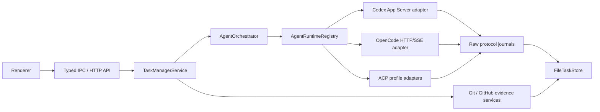

# Agent Runtime Architecture

Date: 2026-07-12

This document defines Task Monki's provider-neutral runtime architecture. It is
the source of truth for runtime identity, routing, capability preservation,
security, recovery, and model integration. Runtime-specific protocol details
belong beside their adapters.

## Decision

Task Monki owns a small static registry of complete coding-agent runtimes. It
does not implement a model loop over provider SDKs and does not route an
existing session through a different runtime as fallback.

The initial runtime families are:

- Codex App Server, through its native JSON-RPC protocol;
- OpenCode, through its native authenticated loopback HTTP and SSE API;
- ACP-native agents, through stable Agent Client Protocol v1 over stdio, with
  separate profiles for each agent product.

This design deliberately separates three identities:

1. runtime ID: the agent implementation that owns process/session semantics;
2. model-provider ID: the upstream model vendor reported by that runtime;
3. model ID: the runtime/provider model identifier.

For example, `opencode`, `anthropic`, and `claude-sonnet-*` are three different
identity layers. Treating all three as a single `provider` string makes durable
recovery and multi-provider selection ambiguous.

## Responsibility boundary

Task Monki is authoritative for:

- tasks, phases, iterations, worktrees, and acceptance;
- local Git and GitHub evidence;
- durable runtime ownership and runtime-scoped correlation IDs;
- verified attachment bytes and path-free submission evidence;
- approval policy, user decisions, and browser/Electron trust boundaries.

Each runtime is authoritative only for its own:

- process and protocol health;
- sessions, turns, messages/items, and native tools;
- model/provider catalog and runtime-native configuration;
- approval or question requests;
- plans, usage, subagents, and other telemetry.

Runtime output is telemetry. It never becomes verified Git, test, GitHub, or
acceptance evidence without Task Monki observing the corresponding local or
remote system directly.

## Topology

The registry is static application composition, not a speculative plugin
platform. Adding a runtime is an intentional code/configuration change with a
tested adapter contract. This keeps security review, durable schemas, and
packaging understandable.

## Durable identity and routing

Store schema 12 persists `runtimeId` on tasks, sessions, runs, server
instances, interactions, settings observations, goals, plans, usage, and
subagent observations.

Rules:

- A task's runtime is its immutable primary implementation runtime.
- Primary implementation sessions and runs must match the task runtime.
- A fork alternative is a new task and may explicitly select another runtime.
- A detached review session/run may use a different runtime from the task.
- A continuation never changes runtime underneath an existing session.
- Provider session and turn IDs are unique only inside their owning runtime.
- Interaction responses route through the runtime recorded on the interaction,
  run, and session; the current UI default is irrelevant.
- There is no automatic cross-runtime fallback after session creation.

Schema 11 records are migrated by deriving runtime identity from existing
session/provider ownership, then rewriting settings and dependent records. The
migration removes the legacy `provider` field. Older supported store migrations
run first. Invalid cross-record ownership is rejected on load rather than
silently reinterpreted.

## Adapter contract

Every `AgentRuntimeAdapter` provides:

- a stable descriptor: ID, display name, runtime kind, transport, and lifecycle
  scope;
- initialization, preflight, capability, and model discovery;
- execution resolution that returns one runtime-owned qualified model and
  normalized settings;
- session create/attach/read operations;
- turn start, interaction response, reconciliation, and shutdown;
- optional native operations such as steering, interruption, session fork,
  review, goal sync, prompt refinement, and exact session mode/configuration
  updates.

The registry validates that advertised optional capabilities have matching
methods. One unavailable runtime degrades only its catalog row. Duplicate
runtime IDs, unqualified model IDs, cross-runtime models, and duplicate model
IDs are configuration errors.

## Capabilities without a lowest common denominator

Common capabilities exist so product workflow can make safe decisions. Each
capability has a maturity (`stable`, `experimental`, `inferred`, or
`unsupported`) and a reason.

The common surface does not erase native features:

- `capabilities.extensions` retains named runtime features and support reasons;
- `AgentModel.native` retains lossless native model metadata;
- `AgentRuntimeState.native` exposes non-secret native catalog/configuration
  metadata to dedicated or debug UI;
- `AgentExecutionSettings.runtimeOptions[runtimeId]` stores runtime-owned
  settings without giving them false universal semantics;
- raw messages remain in bounded, append-only journal segments subject to
  explicit retention pruning.

Execution policy is runtime-owned too. Each runtime publishes the exact presets
it can enforce, including sandbox scope, approval behavior, reviewer, and
whether tool-network access is disabled, optional, or required. The composer
renders only those presets. Ordinary task capture fills the selected runtime's
default policy without starting or probing that runtime, so the local task
board remains usable while an agent is offline. Definitive model/catalog and
policy resolution happens before every turn. Attachment-backed task creation is
the exception: it resolves immediately because model modality and confinement
must be proven before Task Monki adopts the draft.

Adapters must not place credentials, bearer tokens, server passwords, or raw
attachment paths in native catalog metadata.

## Model selection

Model IDs used by Task Monki are runtime-qualified, for example
`opencode:anthropic/model-id`. Persisted execution settings retain `runtimeId`,
`modelProvider`, and the runtime's raw model ID separately.

UI selectors always choose runtime first, then show only models owned by that
runtime and optional model provider. Changing runtime deterministically resets
the model. Missing or stale model configuration is resolved only inside the
selected runtime; it never falls through to another runtime or provider. A task
captured while its runtime is unavailable may omit a model until start, when
the owning adapter selects or rejects its current default explicitly.

## Runtime behavior

### Codex

Codex remains a full native integration. App Server owns authentication,
threads, turns, native review, approvals, goals, plans, model discovery,
subagents, and streaming events. Task Monki uses generated version-matched
bindings and the existing fail-closed permission-profile attestation. See
`docs/APP_SERVER_ARCHITECTURE.md` and
`docs/architecture/CODEX_PROTOCOL_AND_COUPLING_NOTES.md`.

### OpenCode

OpenCode uses its public native agent server, not ACP and not a model-provider
SDK. Task Monki launches a loopback-only server with an ephemeral high-entropy
password passed only in the child environment, probes health/version and the
required endpoints, consumes bounded SSE, and snapshots sessions/messages,
pending permissions, questions, plans, usage, and provider/model data.

The application-level provider catalog is discovery only. Before every turn,
the worktree-scoped server's `/provider` response is authoritative for model
selection, so repository-specific providers and models remain available and an
explicitly stale selection fails before prompt submission. Native catalog
change events are debounced, refreshed, and published to the renderer.

Task Monki prompt refinement is not exposed through OpenCode. The product
requires an attested read-only, network-isolated refinement boundary, which the
shared OpenCode process cannot provide.

HTTP mutation failures without an authoritative response are ambiguous. Task
Monki records recovery-required state and never resends the prompt
automatically. Reconnect first reconciles durable HTTP resources, then resumes
streaming. OpenCode's provider registry is retained so Anthropic, Google, xAI,
OpenAI, and other configured models remain first-class within that runtime.

Each Task Monki session owns at most one worktree-scoped OpenCode process and
SSE stream. Idle resources are evicted after a bounded grace period; continuing
the conversation lazily starts a new authenticated loopback process and
reattaches the durable provider session. Active or reconciling runs are never
idle-evicted. Exhausted automatic recovery unloads the process while preserving
the recovery-required run for an explicit later retry. Task deletion releases
inactive runtime resources before worktree removal.

Raw SSE messages remain append-only protocol evidence. Text and reasoning
deltas are coalesced in bounded, ordered per-run buffers for output updates;
normalized item records are materialized at part terminal, run terminal,
runtime loss, or shutdown. This avoids rewriting the durable store once per
token without sacrificing native evidence or terminal state.

OpenCode executable overrides are resolved through the same version and
protocol probes as automatic discovery. A change is applied immediately when
no OpenCode work is active, or retained as a pending safe restart until active
work becomes terminal. If a lost ambiguous run is explicitly closed outside
the adapter, the pending configuration is applied before the next provider
start; recovery-required work that has not been closed still prevents the
restart. Failed discovery can be repaired by configuring a valid executable
and reinitializing the catalog.

OpenCode's native session-fork endpoint chooses the new session directory from
the request context; it does not inherit the source session directory. Task
Monki therefore sends native history-fork mutations through the target
worktree's directory-bound runtime and rejects a response for any other
directory. The native fork is a new root session with copied history, so Task
Monki records a fork origin but does not misclassify it as an OpenCode child
session. Product-level fork alternatives remain new tasks and may instead use a
different runtime, in which case they start a fresh provider session from the
explicit alternative prompt.

### ACP agents

ACP is an agent transport, not a model abstraction. Each executable profile is
a distinct runtime with its own descriptor, command, default model provider,
capability reasons, and extension metadata.

Task Monki negotiates stable ACP protocol version 1 and advertised
capabilities. It preserves session config options, structured stream updates,
tool calls/diffs, plans, usage, session resume, cancellation, and opaque
extension messages. Permission responses use the exact opaque `optionId`
reported by the agent; semantic actions never fabricate an ID from a label.

Task Monki advertises filesystem and terminal client capabilities as disabled.
The agent remains responsible for its tools; Task Monki does not become a
generic command-execution host through ACP. Unsupported client requests fail
explicitly.

ACP mode and configuration selectors are not flattened into common settings.
The typed `updateAgentNativeSession` application operation routes an exact
mode ID or advertised config ID/value to the owning adapter after validating
task/session/runtime ownership and proving the session is idle. The adapter
validates the provider-advertised option type and value before mutation. The
trusted Electron IPC and authenticated development HTTP API expose only these
two operations, never arbitrary JSON-RPC. Updated state is redacted before it
returns to the renderer; a dedicated visual editor can consume the same typed
operation without changing the runtime contract.

The official ACP TypeScript SDK is ESM-only while Task Monki's Electron main
bundle is currently CommonJS. The adapter therefore uses a small typed,
bounded JSON-RPC v2 transport against the stable public schema instead of
adding an unsafe dynamic loader or changing the entire Electron module format.
This is a protocol implementation choice, not a provider/model SDK loop.

ACP profiles use on-demand process startup. Passive executable/version
discovery can populate the catalog, but a credential-bearing ACP process is
started only when that runtime is selected for a provider session operation.
Current profiles expose a provider-controlled full-access preset because ACP v1
does not attest an OS filesystem/network sandbox.

Persisted ACP recovery is reconciled during adapter initialization without
starting a child process. Stale server ownership is marked lost and ambiguous
runs advance to explicit user action; initialization never attaches a provider
session or replays a prompt merely to determine status, because stable ACP v1
has no authoritative prompt-status read method.

Managed Task Monki attachments are unsupported for current ACP profiles and
are rejected before executable discovery or any provider/session mutation; ACP
image/resource capability metadata does not weaken that confinement rule.
Session/task release clears runtime-native and provisional state. If the live
agent advertises stable `sessionCapabilities.close`, Task Monki closes the idle
session before forgetting it; otherwise it never invents close support or
starts a process solely for cleanup. The shared ACP process stops when no local
session state remains.

ACP raw updates remain individually journaled before dispatch. Its normalized
text projection follows the same terminal-materialization rule as OpenCode:
ordered output deltas flush on bounded byte/time thresholds, but message and
reasoning items are normally written once at prompt terminal, runtime loss, or
shutdown. A global byte bound and per-run part bound force oldest-part
materialization under exceptional volume, so provider traffic cannot create an
unbounded heap. Coalesced activity records retain the number of represented
wire events. This removes per-token item/run/event snapshot publication while
preserving every native message as protocol evidence.

## Streaming and materialization

Each adapter maps useful native events into provider-neutral records:

- agent/user messages and reasoning summaries;
- command, file, tool, web, MCP, review, and subagent items;
- plan revisions and usage snapshots;
- pending approvals and questions;
- run/session lifecycle and terminal output.

Normalized records are deliberately compact. Delta streams, raw native
payloads, and unsupported extensions stay in bounded journals or native
metadata. UI workflow selectors consume projections and verified evidence, not
raw protocol messages.

### Raw protocol journal

Every runtime writes raw traffic to the same provider-neutral journal contract.
Each server instance has monotonically numbered NDJSON segments and one global
message sequence. Segment zero retains the historical
`<server-instance-id>.ndjson` name, so schema-12 references without a segment
continue to resolve. Rotated references persist their segment number and never
derive a path from provider-controlled input.

The production defaults bound a serialized entry to 24 MiB, a segment to
64 MiB, and retained segments to 256 MiB per server instance. Rotation happens
before an entry would cross the segment bound. Retention deletes only complete,
older segments after the current segment has been synced; the active segment is
never pruned. Reading a reference whose segment was retained works after a
restart. Reading one whose segment was pruned fails closed with an unavailable
segment error; compact Task Monki records and verified evidence remain intact.

Server-instance retention is separately bounded across all runtimes. Task Monki
keeps at most eight of the newest terminal server diagnostics that are not
referenced anywhere else in the durable snapshot. A server referenced by a run,
interaction, raw-message reference, event, or nested durable payload is never
collected, and nonterminal servers are never eligible. Task deletion removes
its references first; the resulting terminal server then participates in the
same global bound instead of accumulating forever.

Collection publishes the store without the selected `AgentServerInstance`
records before removing any journal segment. Journal removal drains the
per-server queue and closes its writer first. If file cleanup cannot finish,
the record remains durably absent and startup reconciliation retries the
orphan; this ordering never leaves a durable reference pointing at a journal
deleted by whole-server collection.

Appends for one server are serialized. Outbound messages sync before append
returns. Inbound stream traffic uses bounded byte/time batching, and any store
publication that can persist a raw-message reference flushes the journal first.
`FileTaskStore.close()` flushes queued input and closes all writer handles.
Inactive handles also sync and close automatically. Journal directories and
files use private `0700`/`0600` POSIX modes, reject unsafe IDs, symlinks,
non-regular files, wrong ownership, and hard links, and validate sequence,
direction, timestamp, segment, and content hash when a reference is read.

Startup reconciliation validates every managed journal filename and removes
private, current-user, single-link regular segments that no longer have a
server record. Unknown files are left untouched. Managed symlinks, hard links,
wrong-owner files, non-private files, directories, and malformed segment names
fail closed rather than being followed or silently deleted.

A crash-truncated final line can be removed during restart because it was never
a complete referenced entry. A complete malformed entry is an integrity error,
not a repair candidate. The journal assumes the application-wide single store
owner; it does not claim cross-process append locking.

## Permissions and interactions

Interaction requests persist their runtime, server, session, run, native
request ID, allowed semantic actions, warnings, and raw message reference.

Rules:

- unsafe paths, Task Monki-controlled Git/delivery commands, disallowed network
  access, and unsupported secret input fail closed;
- a decision must match the persisted interaction type and allowed actions;
- `DECLINE_FOR_SESSION` exists only when the runtime reports a persistent deny
  option;
- ACP keeps exact native option IDs in `providerOptions` and returns the chosen
  ID verbatim;
- runtime loss makes unanswered interactions stale or aborted; it does not
  auto-approve or synthesize a response.

## Review

Review is a Task Monki quality gate, not a Codex-only workflow. A same-runtime
adapter may use a native review feature. Otherwise the orchestrator creates a
read-only review session and starts the provider-neutral structured review
prompt as a normal turn only when the runtime advertises stable detached-review
isolation. Cross-runtime review is allowed without changing the task's
implementation runtime; runtimes with only inferred isolation are not eligible.

The durable projection field `projection.codexReview` retains its schema-12
name for store compatibility; its semantics and user-facing copy are
provider-neutral. See
`docs/workflows/AGENT_REVIEW_WORKFLOW_LIFECYCLE.md`.

## Attachments

Task Monki verifies immutable task-owned files immediately before every
submission. The adapter chooses a native delivery mode only when the runtime
also attests Task Monki's confidentiality boundary:

- Codex native local image input or managed prompt path reference;
- OpenCode native file parts remain a native protocol capability, but managed
  Task Monki attachments are disabled because the process cannot attest network
  isolation;
- ACP image/resource blocks remain a negotiated native capability, but managed
  attachments are disabled for current full-access profiles.

Submission records describe how verified bytes were sent; they never claim
that a model read or used them. A runtime that cannot deliver the selected
attachment types is disabled in the composer. See
`docs/architecture/ATTACHMENT_LIFECYCLE.md`.

## Recovery and no-resend rule

Recovery is runtime-owned but follows common invariants:

1. identify the runtime from the persisted run/session;
2. reconnect or start only that runtime;
3. reconcile provider snapshots and pending requests;
4. mark proven terminal work terminal;
5. mark uncertain submitted mutations `RECOVERY_REQUIRED`;
6. never replay an ambiguous prompt, approval, or command automatically.

The user may explicitly retry or continue after Task Monki closes the uncertain
run. Provider IDs from another runtime are never consulted.

## Security

- Runtime processes receive a minimal environment plus explicitly allowlisted
  runtime credentials; arbitrary application secrets are stripped.
- Generated server passwords and bearer credentials never appear in argv,
  durable records, diagnostics, or renderer state.
- Loopback servers bind only to `127.0.0.1` and require authentication.
- OpenCode network is reported as provider-controlled and required. Native
  permission rules can gate web tools and mutations, but they cannot prove that
  provider calls, plugins, MCP servers, or an approved shell stayed offline.
- Protocol lines, HTTP bodies, SSE lines/events, diagnostics, and journals have
  explicit bounds.
- Packaged Electron uses guarded IPC and renderer sender checks.
- Browser development additionally requires a stable
  `task-monki.browser-dev-isolation` attestation. Safe-looking settings alone
  are insufficient. Runtimes without an attested OS filesystem/process/network
  boundary are unavailable on that surface.
- Provider permissions never replace Task Monki's independent Git/GitHub
  evidence or explicit delivery actions.

## Deliberate non-goals

- A direct OpenAI/Anthropic/Google/xAI SDK model loop.
- A universal agent abstraction that drops native features.
- Mid-session provider fallback.
- An unreviewed dynamic runtime plugin marketplace.
- Automatic replay after uncertain delivery.
- Treating MCP as the coding-agent runtime protocol.

## Adding a runtime

1. Choose a stable runtime ID distinct from model-provider IDs.
2. Document the native protocol, executable resolution, license, and version
   compatibility policy.
3. Implement the complete adapter contract and truthful capability reasons.
4. Qualify model IDs and retain native catalog/configuration data.
5. Define process lifecycle, environment allowlist, transport bounds, and
   credential redaction.
6. Map streaming, terminal states, approvals, interruption, and recovery.
7. Prove runtime-scoped ID collision behavior and no-resend ambiguity handling.
8. Add attachment delivery only with truthful submission evidence.
9. Add settings/UI only for supported runtime features.
10. Test unavailable, disconnected, stale-ID, missing-terminal, and shutdown
    paths before registering it in application composition.

## Primary references

- [Codex App Server documentation](https://learn.chatgpt.com/docs/app-server)
- [OpenCode repository](https://github.com/anomalyco/opencode/tree/dev)
- [Agent Client Protocol architecture](https://agentclientprotocol.com/get-started/architecture)
- [ACP stable protocol schema](https://github.com/agentclientprotocol/agent-client-protocol/tree/main/schema/v1)
- [T3 Code repository](https://github.com/pingdotgg/t3code)
- [OpenClaw repository](https://github.com/openclaw/openclaw)
