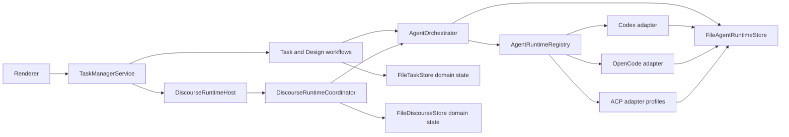

# Agent Runtime Architecture

Date: 2026-08-29

Status: Provider milestones 1 and 2 are implemented. The milestone 3 plan is final and ready to implement. Later milestones are approved but not implemented.

This document is the provider architecture source of truth.
It records current behavior and the approved target direction.

## Outcome

Task Monki must keep one adapter for each provider runtime.
It must also keep one implementation of each product workflow.

The first investigation found a split below the workflows.
Task and Design used one runtime lifecycle.
Discourse used another lifecycle and another runtime store.

Provider milestone 1 removed this split.
Task, Design, Discourse, and review now use one runtime coordinator and one runtime store.
Provider milestone 2 moved review, prompt refinement, and Discourse to one shared read-only turn path.
Each workflow still owns its product state and rules.

Provider adapters translate these items:

- sessions and turns.
- provider events.
- models and model input types.
- instructions and skills.
- attachments.
- permissions.
- cancellation and recovery.
- optional live steering.
- optional native session operations.
- app-owned tool transport.

Task Monki keeps ownership of these items:

- Tasks, Designs, and Discourse conversations.
- worktrees and managed repositories.
- Git, test, review, and delivery evidence.
- attachment bytes and lifetime.
- Design source capture and candidate identity.
- Preview, canvas, and browser verification.
- exact tool grants.
- runtime records and recovery state.
- local process and file cleanup.

Do not require every provider to copy the Codex sandbox.
Use the strongest native policy that each provider offers.
Show its real limits to the user.

An attached file is an input that the user chose to send to the selected provider.
It is not a secret from that provider.
Task Monki must protect file ownership, integrity, selection, and lifetime.
It must not claim that a provider forgets bytes after delivery.

## Firm decisions

1. Keep `AgentRuntimeRegistry` as the only runtime registry.
2. Keep one adapter implementation for each native protocol family.
3. Use one registered ACP adapter instance for each ACP agent product.
4. Keep all provider sessions and runs in `FileAgentRuntimeStore`.
5. Keep domain state in `FileTaskStore` and `FileDiscourseStore`.
6. Use `AgentOrchestrator` as the shared runtime coordinator.
7. Do not add another scoped-turn runtime lifecycle.
8. Keep one provider-neutral turn model across the current workflow entry points.
9. Let each adapter qualify and translate that request.
10. Use normal turns for review and prompt refinement.
11. Do not expose workflow-specific review or prompt-refinement methods on adapters.
12. Use a new session with bounded Task Monki context when native fork is absent.
13. Queue a later message when live steering is absent.
14. Keep `AttachmentFileStore` as the only Task Monki attachment byte owner.
15. Store the exact workflow-selected attachment set on each runtime run before delivery.
16. Keep attachment transport inside each provider adapter.
17. Do not add a generic path fallback for OpenCode or ACP attachments.
18. Keep one `inspect_design` handler and one Design browser system.
19. Keep the working Codex dynamic-tool transport.
20. Add one packaged stdio MCP bridge for OpenCode and ACP Design sessions.
21. Select workflow support by operations, effective model input types, and applied policy.
22. Never select a workflow by provider name.
23. Do not keep old development-store formats during this change.

## Evidence method

This investigation followed the current call paths.
It also checked relevant Git history and current provider documents.

The main repository commits were:

- `fc230108`, which added the shared runtime registry and multi-provider Task support.
- `e54d6925`, which added Discourse and its separate scoped runtime path.
- `0b75e09a`, which added the first Codex-only Design slice.
- `5160c6b1`, which added the first Codex review path.
- `b2d3edfb`, which added the current Design browser workflow.
- `2779d246`, which added secure attachment storage and Codex delivery.
- `598f25b0`, which refined trusted Codex attachment access.
- `a5227164`, which added the shared provider runtime lifecycle.

The order explains the current coupling.
The registry came first.
Discourse and Design then added separate Codex paths instead of extending one runtime owner.

Attachment history shows a different result.
The secure store, staging, adoption, and cleanup remain correct.
The multi-provider work added transport blocks because shared policy was still Codex-shaped.
Milestone 3 must change transport and run evidence, not attachment byte ownership.

### Main files inspected

| Area | Current owners and callers |
| --- | --- |
| Composition | `src/core/app/AgentRuntimeComposition.ts`, `src/core/app/TaskManagerService.ts` |
| Registry and adapter contract | `src/core/agent/AgentRuntimeRegistry.ts`, `src/core/agent/AgentRuntimeAdapter.ts` |
| Shared runtime | `src/core/agent/AgentOrchestrator.ts`, `src/core/agent/AgentRuntimeCoordinator.ts`, `src/core/storage/FileAgentRuntimeStore.ts` |
| Task and Design domain | `src/core/storage/FileTaskStore.ts`, `src/core/design/DesignUpdateCoordinator.ts` |
| Discourse domain | `src/core/discourse/DiscourseRuntimeHost.ts`, `src/core/discourse/DiscourseRuntimeCoordinator.ts`, `src/core/storage/FileDiscourseStore.ts` |
| Codex | `src/core/agent/codex/CodexAppServerAdapter.ts`, `CodexPermissionProfile.ts`, `CodexRpcClient.ts` |
| OpenCode | `src/core/agent/opencode/OpenCodeAdapter.ts`, `OpenCodeHttpClient.ts`, `OpenCodeServerSupervisor.ts` |
| ACP | `src/core/agent/acp/AcpRuntimeAdapter.ts`, `AcpProtocol.ts`, `AcpRuntimeProfiles.ts`, `AcpPermissionPolicy.ts` |
| Review | `src/core/agent/AgentOrchestrator.ts`, `src/core/review`, `docs/workflows/AGENT_REVIEW_WORKFLOW_LIFECYCLE.md` |
| Prompt refinement | `src/core/prompt/PromptRefinementService.ts`, `src/core/app/TaskManagerService.ts` |
| Design | `src/core/design/DesignUpdateCoordinator.ts`, `DesignSourceService.ts`, `DesignSkillPack.ts` |
| Design browser | `src/core/design/AgentBrowserRuntime.ts`, `src/core/agent/journal/AgentProtocolRedaction.ts` |
| Preview | `src/core/preview/PreviewManager.ts`, `PreviewSourcePreparer.ts`, `ManagedDesignStaticPreview.ts` |
| Attachments | `src/core/storage/AttachmentFileStore.ts`, `src/core/design/FileDesignDraftStore.ts`, `src/core/agent/AgentAttachmentDelivery.ts`, `src/shared/attachments.ts` |
| Durable contracts | `src/shared/contracts.ts`, `src/shared/agentRuntime.ts`, `src/shared/design.ts`, `src/shared/agent.ts` |
| Execution support | `src/shared/agentExecutionSupport.ts` and its core and renderer callers |
| Renderer support | `src/renderer/model/designs.ts`, `src/renderer/model/discourse.ts`, `src/renderer/ui/useTaskAttachments.ts`, `src/renderer/ui/AgentControlPanel.tsx`, `src/renderer/ui/SettingsView.tsx` |

The investigation also read adapter, store, workflow, renderer, recovery, and protocol tests beside these files.

## Runtime identity and readiness

Keep three identities separate:

1. Runtime ID identifies the installed agent and its session protocol.
2. Model-provider ID identifies the upstream model vendor reported by that runtime.
3. Model ID identifies one model inside that runtime and model provider.

For example, `opencode`, `anthropic`, and a Claude model ID are different values.
Combining them into one provider string makes recovery and model selection unclear.

A Task keeps one primary runtime for its implementation life.
A continuation never changes the runtime behind an existing session.
A review can use another explicit runtime because it owns another session.
There is no silent cross-runtime fallback.

The registry remains static application composition.
Adding a runtime requires one adapter, one descriptor, packaging rules, and contract tests.
Task Monki does not need a plugin framework for provider registration.

Keep the current typed readiness states.
Discovery, live initialization, authentication, account access, and model access are different readiness facts.
The UI must not parse provider error text to rebuild readiness.

Every model ID remains runtime-qualified.
Model input types must come from the runtime or a tested profile contract.
Do not infer image or file support from a model name.

Each adapter keeps ownership of its process supervisor, transport, and protocol generation.
Late events from a replaced process cannot update a current run.
Shutdown stops admission, drains owned work, revokes tool grants, and closes provider processes.

## Verified current architecture

Task Monki creates every adapter in `AgentRuntimeComposition`.
It registers all adapters in `AgentRuntimeRegistry`.
`TaskManagerService` creates one `FileAgentRuntimeStore` and one `AgentOrchestrator`.
The Discourse host receives that same orchestrator and runtime store.


```mermaid
flowchart LR
  UI[Renderer] --> Service[TaskManagerService]
  Service --> TaskFlow[Task and Design workflows]
  Service --> DiscourseFlow[DiscourseRuntimeHost]
  TaskFlow --> Orchestrator[AgentOrchestrator]
  DiscourseFlow --> DiscourseCoordinator[DiscourseRuntimeCoordinator]
  DiscourseCoordinator --> Orchestrator
  Orchestrator --> Registry[AgentRuntimeRegistry]
  Registry --> Codex[Codex adapter]
  Registry --> OpenCode[OpenCode adapter]
  Registry --> ACP[ACP adapter profiles]
  Orchestrator --> RuntimeStore[FileAgentRuntimeStore]
  Codex --> RuntimeStore
  OpenCode --> RuntimeStore
  ACP --> RuntimeStore
  TaskFlow --> TaskStore[FileTaskStore domain state]
  DiscourseCoordinator --> DiscourseStore[FileDiscourseStore domain state]
```

`FileAgentRuntimeStore` owns provider sessions, runs, queue entries, artifacts, telemetry, and recovery state.
Its owner scope separates Task records from Discourse records.

`FileTaskStore` and `FileDiscourseStore` own product state and links to runtime records.
`FileTaskStore` can expose a joined runtime projection to existing callers.
It does not persist provider records in the Task snapshot.

The old scoped router and its separate runtime owner no longer exist.
Codex keeps different request contracts for Task work and owner-neutral turns.
Both contracts use the same private thread and turn transport.
They persist provider state in the same runtime store.
One resolver routes provider notifications by runtime owner.
One server-loss sweep reconciles all runs in the runtime store.
Review, refinement, and Discourse availability use `projectAgentExecutionSupport`.
The projection requires a qualified native mutation-denial policy with no approval exceptions.
The provider process can still use its model transport and normal user permissions.
`DiscourseRuntimeHost` also requires the common runtime operations.
Codex, OpenCode, and Cursor ACP meet these requirements.
Grok ACP and Claude Agent ACP remain available for normal Tasks only.

### Current normal Task path

1. Task creation stores `runtimeId` and execution settings as Task domain state.
2. `AgentOrchestrator` resolves the adapter from the registry.
3. It verifies the Task, session, run, worktree, and selected attachments.
4. The orchestrator creates the local session and run in `FileAgentRuntimeStore`.
5. The adapter creates or resumes its provider session and starts the turn.
6. The adapter maps provider events into runtime items and interactions.
7. Task Monki observes Git and tests independently.
8. Stop calls the adapter interrupt operation.
9. Recovery reconciles the stored local run with the provider session.

### Current Discourse path

1. `DiscourseRuntimeCoordinator` schedules a participant turn.
2. `DiscourseContextSnapshotService` resolves exact context roots.
3. The shared support projection selects a compatible runtime.
4. The adapter builds its provider-native read-only execution context.
5. `AgentOrchestrator` records the repository fingerprint.
6. `AgentOrchestrator` prepares and starts the turn in `FileAgentRuntimeStore`.
7. The shared runtime event path reports progress and terminal state.
8. The orchestrator compares repository state before it accepts completion.
9. The coordinator turns valid terminal output into a Discourse message.

The Discourse scheduler, budget, prompt, and message logic are sound.
They do not own a second provider lifecycle.

### Current Design path

`DesignUpdateCoordinator` already uses the normal Task orchestrator.
Its source, Git, Preview, browser, candidate, and Ready work is provider-neutral.

However, Design creation and validation hardcode `CODEX_RUNTIME_ID`.
`TaskManagerService.requireDesignUpdates()` also requires Codex extensions.
Only `CodexAppServerAdapter` receives the Design tool handler.

The renderer appears provider-neutral.
It can show a runtime that passes capability filters.
The create request does not contain the selected runtime.
Core therefore creates a Codex Design.

### Current review path

The review workflow can choose a runtime that differs from the implementation runtime.
It creates a Task-owned review session and sends a normal read-only turn.
The workflow owns its prompt, parser, Git target, budget, and review state.
The adapter owns only its native permission and protocol mapping.

`AgentOrchestrator` compares the repository before and after the turn.
A changed or unreadable repository fails the review.
Task Monki leaves detected changes in place as evidence.

### Current prompt-refinement path

`PromptRefinementService` owns the exact-output prompt, parser, evidence checks, and fallback result.
`TaskManagerService` creates one short-lived runtime session and normal read-only turn.
It cancels through the common interrupt path and releases the session after settlement.

`AgentOrchestrator` compares the repository before and after the turn.
The original request remains unchanged when the turn fails or changes repository state.

## Current provider and workflow matrix

This table describes current code, not provider protocol potential.

| Workflow or operation | Codex | OpenCode | Grok ACP | Cursor ACP | Claude ACP |
| --- | --- | --- | --- | --- | --- |
| Text Task | Yes | Yes | Yes | Yes | Yes |
| Stop active turn | Yes | Yes | Yes | Yes | Yes |
| Queue next message | Yes | Yes | Yes | Yes | Yes |
| Live steering | Yes | No | No | No | No |
| Managed attachments | Yes | Blocked in adapter | Blocked in adapter | Blocked in adapter | Blocked in adapter |
| Prompt refinement | Yes | Yes, no attachments | No | Yes, no attachments | No |
| Review provider | Yes | Yes, no attachments | No | Yes, no attachments | No |
| Discourse participant | Yes | Yes | No | Yes | No |
| Design | Yes | No | No | No | No |
| Provider resume | Yes | Yes | Negotiated | Negotiated | Negotiated |
| Native provider fork | Yes | Yes | No | No | No |
| User-facing fork alternative | Yes | Yes | Yes | Yes | Yes |
| Provider history deletion | Partial | Partial | Not exposed | Not exposed | Not exposed |

The user-facing fork alternative creates a new Task and worktree.
It does not use native provider fork.

Provider-neutral managed attachment delivery belongs to milestone 3.
Milestone 2 does not widen file delivery for OpenCode or ACP profiles.

## Why current combinations fail

| Current failure | Root cause | Classification |
| --- | --- | --- |
| Non-Codex Design creation | The request, service, store, and validation require Codex. | Historical coupling and unnecessary restriction |
| Non-Codex `inspect_design` | Tool registration exists only inside the Codex adapter. | Adapter transport responsibility |
| Non-Codex Design instructions | Only Codex maps the app-owned instruction and skill pack. | Adapter responsibility |
| OpenCode attachments | The adapter rejects them and sends text-only parts. | Missing adapter feature |
| ACP attachments | The adapter rejects them and sends one text block. | Missing adapter feature |
| Attachment plus provider network | Shared code requires network-off execution. | Unnecessary Codex-shaped restriction |
| Attachment plus full process access | Shared code rejects the run. | Unnecessary universal restriction |
| Selected Codex attachment in a shared read-only turn | The current adapter grants the parent attachment directory. This exposes unselected sibling files. | Incorrect Codex path mapping |
| Grok ACP read-only workflows | Plan mode still permits mutation through shell, MCP, or subagent work. | Provider policy limit |
| Claude ACP read-only workflows | Its plan mode has not passed the packaged mutation qualification test. | Unqualified provider profile |
| Preview recipe model selection | UI can select another runtime, while core always runs Codex. | Historical coupling |
| Design provider-history cleanup | Design qualification expects provider deletion semantics. | Unnecessary restriction |

## Codex-specific dependency classification

| Dependency | Owner after the change | Reason |
| --- | --- | --- |
| App Server thread IDs, turn IDs, and resume cursors | Codex adapter | These values belong to the Codex protocol. |
| App Server permission profiles | Codex adapter | This is Codex's strongest native execution policy. |
| Additional readable paths | Codex adapter | Other providers do not need paths for current Task Monki attachment types. |
| `localImage` input | Codex adapter | This is a native Codex content type. |
| Thread fork on changed read roots or exact file grants | Codex adapter | Current OpenCode and ACP delivery is turn-local. |
| Dynamic tool request and response | Codex adapter | This is one transport for a shared Task Monki tool. |
| Codex developer instructions and skill inputs | Codex adapter | The instruction and skill content remains app-owned. |
| Codex read-only permission profile | Codex adapter | It maps the shared read-only request to an attested Codex scope. |
| Codex goals, plans, usage, and subagents | Codex adapter | These are provider telemetry, not workflow truth. |
| Exact Design source and Ready requirements | Design workflow | They do not depend on Codex. |
| Browser actions and screenshots | Design workflow | `AgentBrowserRuntime` already owns them. |
| Design runtime hardcoding | Delete | No product rule requires it. |
| Codex-only prompt-refinement entry point | Deleted | The shared runtime runs prompt refinement. Preview recipe generation still uses its existing Codex ephemeral runner. |
| Scoped Codex Discourse lifecycle | Delete | The shared runtime coordinator owns it after the cutover. |
| Codex sandbox as attachment gate | Delete | Selection authorizes delivery to the provider. |
| Provider-history deletion as Design gate | Delete | Task Monki cannot promise remote erasure. |

## Real provider limits

Provider-neutral behavior does not mean identical behavior.
These limits are real and must remain visible.

- OpenCode and current ACP agents do not prove an OS sandbox to Task Monki.
- OpenCode has no public live-steering operation.
- Stable ACP has no native session-fork operation.
- ACP resume and load depend on negotiated agent capabilities.
- ACP image and embedded-resource inputs depend on negotiated prompt capabilities.
- An ACP resource link does not deliver bytes.
- The pinned ACP code does not yet implement current structured elicitation.
- Codex has native image inputs but no generic text-file input.
- OpenCode session history can retain resolved file-part content.
- A model can reject image input even when its runtime supports images.
- A provider can retain prompts, files, tool results, or screenshots after local cleanup.
- Provider session deletion can remove a session view without erasing related files.
- Provider processes can use network access for model calls.
- A provider-native permission rule is not the same as an OS sandbox.
- Task Monki cannot revoke bytes that a provider already received.

These limits must narrow an operation, not disable unrelated workflows.

## Target provider and workflow matrix

This table describes the approved target.
Every cell requires a compatible packaged runtime and selected model.

| Workflow or operation | Codex | OpenCode | Grok ACP | Cursor ACP | Claude ACP |
| --- | --- | --- | --- | --- | --- |
| Text Task | Yes | Yes | Yes | Yes | Yes |
| Stop active turn | Yes | Yes | Yes | Yes | Yes |
| Active conversation | Live steer | Queue fallback | Queue fallback | Queue fallback | Queue fallback |
| Text attachment | Exact managed path after qualification; bounded inline fallback | `data:` file part | Embedded text resource | Bounded text block | Embedded text resource after qualification |
| Image attachment | `localImage`, model-gated | `data:` file part, model-gated | No: profile advertises false | Image block, model-gated | Image block after qualification |
| Prompt refinement | Shared short turn | Shared short turn | Disabled by read-only policy | Shared short turn | Disabled until qualified |
| Review | Shared read-only turn | Shared read-only turn | Disabled by read-only policy | Shared read-only turn | Disabled until qualified |
| Discourse | Shared read-only turn | Shared read-only turn | Disabled by read-only policy | Shared read-only turn | Disabled until qualified |
| Design | Native tool transport | Milestone 4 | Milestone 4 | Milestone 4 | Milestone 4 |
| Resume | Native | Native | Negotiated or new session | Negotiated or new session | Negotiated or new session |
| Fork product state | New Task session | New Task session | New Task session | New Task session | New Task session |
| Provider cleanup | Best effort | Best effort | Best effort | Best effort | Best effort |

`Native-policy qualified` has one exact meaning.
The adapter must deny repository mutation through the provider's documented tool policy.
Task Monki must also verify that the repository did not change.

This rule does not claim OS confinement.
If an installed profile cannot deny mutation, that profile cannot run a read-only workflow.
Normal Task work remains available.
Later Design support has its own qualification rules.

Design also needs a model that can consume image tool results.
Each packaged adapter must pass the same real Design behavior tests before the UI enables it.

The attachment rows describe milestone 3.
They do not enable a read-only workflow or Design by themselves.

## Shared runtime boundary

### One runtime coordinator

Extend `AgentOrchestrator` into the single owner of provider sessions and runs.
Do not add a generic workflow engine.

The coordinator owns only common runtime work:

- local session and run identity.
- runtime selection.
- idempotent turn admission.
- delivery state.
- event ingestion.
- interaction routing.
- cancellation.
- recovery and no-resend rules.
- bounded provider telemetry.
- provider process release.

Each workflow remains a direct caller.
The workflow owns prompts, queues, messages, checkpoints, source, and user-visible state.

### Target execution path

1. The workflow builds one concrete turn request.
2. The coordinator resolves the owner and stable operation ID.
3. Core resolves the selected IDs to path-free attachment metadata.
4. The adapter qualifies the model, access, attachment metadata, and tool request.
5. The coordinator creates or finds its local session.
6. The coordinator stores a pending run and its attachment selection.
7. The adapter calls the shared verifier and requests bytes only for its qualified inline mapping.
8. The adapter builds and size-checks the complete provider payload.
9. The coordinator checks cancellation and records `NOT_DELIVERED` when it stops here.
10. The coordinator enters `SENDING` immediately before its existing adapter turn-submission call.
11. The adapter sends the prepared prompt, instructions, attachments, permissions, and client tools.
12. The coordinator records delivery progress and provider IDs.
13. The adapter emits normalized events for that local run.
14. The coordinator stores bounded items, interactions, usage, and terminal state.
15. For a read-only turn, the coordinator compares the repository with its before-turn fingerprint.
16. The workflow consumes the valid terminal result and verifies its own evidence.
17. The coordinator revokes turn tools and releases idle provider resources.

Milestone 3 does not move provider session materialization between the two current entry points.
Normal Task can materialize it before step 10.
The shared runtime entry point can materialize it inside step 11.
Attachment mapping and size checks must finish before the existing turn-submission call.
A proven session-setup failure that submits no prompt remains `NOT_DELIVERED`.
A mapping error is a definite `NOT_DELIVERED` result.

An error before delivery is retry-safe with the same operation ID.
An error after possible delivery is ambiguous.
Task Monki reconciles it and never resends it automatically.

### One provider-neutral turn request

Every workflow uses the same small request concepts.
The request contains these concepts:

| Part | Purpose |
| --- | --- |
| Owner | Task, Discourse conversation, or ephemeral refinement operation |
| Intent | Implement, Design, Discourse, review, or refine |
| Operation ID | Stable retry and recovery identity |
| Instructions | App-owned priority text and selected skills |
| User input | The exact user message for this turn |
| Workspace | Working directory and approved extra read paths |
| Access request | Read or write intent, approval policy, and provider-tool network intent |
| Model settings | Runtime-qualified provider, model, and reasoning values |
| Attachments | Exact attachment IDs selected by the workflow for this run |
| Client tools | Exact app-owned tools granted to this run |
| Resume context | Stored session identity or bounded Task Monki context |

Do not put Preview, Git, Design revision, or Discourse round data in this request.
Those values belong to their workflow owners.

Milestone 3 does not rewrite the two current adapter turn entry points.
Normal Task and Design use `StartAgentTurn`.
Shared read-only workflows use `StartAgentRuntimeTurn`.
Both already use the same runtime lifecycle and store.

Widen their existing attachment descriptor and result contracts together.
Each adapter must call one private attachment mapper from both entry points.
Do not duplicate mapping or migrate unrelated lifecycle code in milestone 3.

### Adapter contract

Every adapter must provide these operations:

- discover and qualify the installed runtime.
- list runtime-qualified models and input types.
- qualify one requested execution before turn submission.
- create or attach a provider session.
- start one turn.
- stream normalized events.
- interrupt or cancel one turn.
- answer supported interactions.
- reconcile uncertain or lost work.
- release local session resources.
- shut down owned processes.

Optional operations remain small:

- live steering.
- native session fork.
- native session delete.
- structured user input.
- native session controls.
- provider-specific telemetry such as goals or subagents.

Do not add optional `review` or `refinePrompt` workflow implementations.
The common turn intent covers both.

### Execution qualification

Do not build a large list of workflow flags.
The workflow creates a concrete turn request.
The selected adapter qualifies that request.

Qualification verifies only current needs:

- model input types.
- read or write policy support.
- provider-native repository mutation denial for read-only work.
- exact extra path support.
- attachment transport.
- app-owned tool transport.
- resume or new-session behavior.
- current runtime readiness.

Attachment qualification receives a path-free descriptor.
It contains the attachment ID, kind, media type, byte count, and hash.
The adapter does not receive a managed path until core verifies the file.

The existing `attachmentDelivery` capability stays small.
It says whether the runtime has any qualified attachment path.
`AgentModel.inputModalities` contains the effective runtime and model intersection.
For example, Grok stays text-only while its ACP profile advertises `image: false`.
The adapter uses the concrete attachment descriptors for size and media checks.
Do not add transport capability flags to shared contracts.
Do not mark delivery stable from a schema check alone.
The packaged content-use test must pass first.

Stable ACP reports image support for the agent, not for each model.
Each ACP runtime profile therefore owns one small code-defined image qualification table.
Its keys are the exact packaged runtime version and provider model ID.
Add an entry only after that exact pair passes a real image content-use test.
The adapter intersects this table with the negotiated ACP image capability.
A dynamic catalog entry is image-capable only when its exact model ID is in the table.
An unlisted model and Cursor `Auto` remain text-only.
Do not add a persistent qualification cache or infer image support from a model name.

Core does the final live verification before turn submission.
For read-only work, core also compares repository state before it accepts completion.
The renderer uses a safe projection of the same result.
The renderer result never becomes security authority.

## Stored contract

### One runtime store

`FileAgentRuntimeStore` is the only owner of provider sessions, runs, interactions, items, plans, usage, and recovery state.

`FileTaskStore` keeps Task and Design domain state.
`FileDiscourseStore` keeps Discourse domain state.
Each domain record stores only local runtime session or run links when needed.

Do not dual-write provider state.
Do not keep a compatibility reader for old development data.
Use one schema cutover and reset old development stores.

### Runtime session record

A session record needs these values:

- local session ID.
- Task, Discourse participant, or prompt-refinement owner identity.
- immutable runtime ID.
- provider session ID and resume cursor when the provider supplies them.
- working directory and approved extra roots.
- applied execution policy.
- current provider generation.
- lifecycle status.
- bounded timestamps and recovery state.

Design is a Task subtype.
It does not need a separate runtime owner kind.
Review also remains Task-owned.

### Runtime run record

A run record needs these values:

- local run ID and session ID.
- stable workflow operation ID.
- turn intent.
- delivery phase.
- provider turn or message ID when known.
- terminal status.
- ordered path-free attachment selection stored before provider prompt submission.
- path-free submission evidence stored at the adapter's transport-admission boundary.
- exact app-owned tool grants.
- repository fingerprints and integrity status for applicable read-only turns.
- cancellation and reconciliation state.
- bounded start and finish times.

Provider protocol messages stay in the existing bounded redacted journal.
Do not copy raw provider payloads into domain stores.

The run selection contains attachment ID, ordinal, kind, media type, byte count, and hash.
It is historical input evidence, not a second byte owner.
The request fingerprint includes this ordered selection.
An idempotent retry must use the same selection.

`AgentExecutionContext.managedAttachments` has a different, narrower purpose.
It is the path-free identity of files granted to a restricted provider session.
In milestone 3, only a restricted Codex session with qualified exact-file access populates it.
OpenCode, ACP, Codex inline delivery, and Codex full access keep it empty.
`AgentRuntimeOwnership` includes this derived grant identity in the session access-epoch hash.
Reuse is valid only when the grant identity matches.
A different grant forks or replaces the provider thread and creates a new local Codex session with its own immutable access epoch.
Do not mutate the access epoch of the existing local session.
The field is not per-turn delivery evidence and never replaces the ordered run selection.

Transport submission evidence must match the run selection exactly.
It must contain no missing, extra, reordered, or changed attachment.

Submission evidence uses a typed delivery correlation:

- `provider-turn` for a native turn acknowledgement.
- `provider-message` for a native message acknowledgement.
- `client-request` when the protocol has no admission acknowledgement.

ACP uses its JSON-RPC request ID as `client-request` correlation after the complete prompt is written to stdin.
This evidence proves Task Monki's transport action.
It does not prove that the provider or model read the content.

Codex records submission after `turn/start` acknowledgement.
OpenCode records it after `prompt_async` acknowledgement.
ACP records it after the complete JSON-RPC prompt write.

### Recovery rules

Persist a provider resume identity only when the provider supplies one.
Do not invent resume support.

If resume is unavailable, start a new session with bounded Task Monki context.
Do not replay an uncertain prompt automatically.

The no-resend rule remains absolute.
An ambiguous delivery requires reconciliation or a user decision.

## Instructions and skills

Task Monki owns instruction content.
Each workflow selects one instruction profile and the required app-owned skills.

The adapter delivers the same content through its strongest native channel:

- Codex uses developer instructions and native skill inputs.
- OpenCode uses its system instruction field and supported skill or instruction configuration.
- ACP uses a bounded trusted instruction block before the user content.

Do not write app instructions into the user's repository.
Do not register global user skills.
Do not create a second skill router.

`DesignSkillPack` remains the only Design skill-content owner.
Provider adapters only map its selected content.

Behavior tests must prove that instructions work.
String injection tests are not enough.

## Attachment contract

`AttachmentFileStore` remains the only byte owner.
The current staging, adoption, hash, retry, draft, delete, and quota rules remain.

Task Monki keeps one immutable managed copy for each owning Task.
A duplicated Task or Design gets an independent copy and lifetime.
Do not add a global blob pool or a copy for each provider run.

Each workflow owns its selection rule:

- A normal Task sends its task-level input files on each normal Task turn.
- A Design sends only the references selected for that Design message.
- A new Design message starts with no selected references.
- Prompt refinement sends only its current staged draft files.
- Review sends the Task input files selected by the current review flow.
- Discourse has no attachment input in milestone 3.

Prompt refinement keeps only safe attachment metadata in its workflow prompt and evidence.
It does not put a managed path in that prompt.
The runtime run owns the exact staged selection, and the adapter decides its transport.
The refinement result derives `providedAsImage` from qualified submission evidence.
It must not use filename relevance or another workflow heuristic to decide native image delivery.
The refinement runner returns one transient `{ output, attachmentSubmissions }` value.
`TaskManagerService` snapshots this path-free value from the terminal run before it deletes the ephemeral runtime records.
`PromptRefinementService` validates its result from that value and never reads the runtime store directly.

The runtime run stores the exact ordered selection before delivery.
This run record is the delivery authority during retry and recovery.
It does not change the workflow's product rules.

Immediately before delivery, core must:

1. resolve only the selected records.
2. reject arbitrary renderer or provider paths.
3. open each file without following links.
4. verify root containment and regular-file identity.
5. verify size and SHA-256.
6. verify the selected model input type.
7. compare the records with the stored run selection.
8. return bytes from the same verified file handle only when the adapter needs inline content.
9. map the verified result through one adapter-private mapper.

The adapter selects one explicit delivery method for each record:

| Runtime or profile | Text | Image |
| --- | --- | --- |
| Codex App Server | Exact managed path when qualified; otherwise bounded inline text | `localImage` on every turn that selects the image |
| OpenCode 1.18.21 | `data:text/plain` file part with the safe display name | `data:` file part with the admitted image media type |
| Grok ACP 1.0.5 | Embedded text resource | Unsupported while `image: false` is negotiated |
| Cursor ACP 2026.07.16 | Bounded text block with the safe display name | Native ACP image block for an exact profile-qualified model |
| Claude Agent ACP | Embedded text resource after packaged qualification | Native ACP image block after packaged qualification |

OpenCode receives a bounded base64 `data:` URL, not a managed `file:` URL.
This avoids another filesystem read by an unconfined provider process.
It also binds the provider input to the bytes that Task Monki verified.

ACP does not use `resource_link` for attachment delivery.
A resource link does not contain bytes or grant access.
ACP also does not use attachment directories or exact-path fallback in milestone 3.
Current text and image inputs do not need that machinery.

The ACP adapter uses the negotiated prompt capabilities.
It uses an embedded text resource when `embeddedContext` is true.
It uses a bounded text block when embedded context is false.
It uses an image block only when both ACP and the selected model accept images.
It never sends an embedded blob for current Task Monki images.
Each inline text input includes the safe name and an untrusted-data marker.

The shared verifier reads an inline file and hashes it through one open handle.
Do not verify the full file and then reopen it for encoding.
Codex path delivery still performs its exact pre-send file check.
Adapters must build and size-check the complete payload before the turn-submission call.

Use a global 32 MiB limit for each raw ACP JSON-RPC frame.
Use the same limit while OpenCode assembles each raw SSE line and event.
The parser cannot classify attachment content before JSON parsing.
Apply the same limit to every outbound request on those connections.
This limit covers the current 20 MiB attachment quota and base64 overhead.
Reject an oversized outbound payload before delivery.
Reject any larger inbound frame before JSON parsing.

OpenCode 1.18.21 stores resolved file parts and publishes them through SSE.
An ACP agent can also echo an image or embedded resource in a session update.
Sanitize these known content fields immediately after parsing.
Do not pass their bytes into the journal, normalized events, or runtime store.
After sanitization, apply the existing smaller journal and normalized-event limits.

Use the same 32 MiB outbound limit for a Codex inline-text fallback.
Apply a global 32 MiB Codex inbound line limit because App Server can echo user input.
Redact the marked inline attachment block before journaling or event storage.

Only Codex can use a managed attachment path in milestone 3.
First, qualify individual file roots with the packaged App Server.
Restricted Codex profiles grant the exact selected files, never their parent directory.
Attachment paths stay separate from repository `readRoots`.
If individual file roots fail, send bounded text inline in restricted mode.
Do not add a parent directory or a temporary attachment copy.
If `localImage` then requires a wider root, keep restricted-mode image delivery disabled.
Full-access Codex can still use the selected managed path without a narrow grant.
A restricted Codex inline fallback records `text-block` transport evidence.

If the restricted exact-file grant changes, fork or replace that Codex thread before delivery.
Seed a replacement with bounded Task Monki context.

This action does not erase data that the provider already received.
It only prevents Task Monki from granting the old path again.

Submission evidence stays path-free.
It records attachment ID, hash, size, transport, delivery correlation, and delivery time.

Use this small provider-neutral transport set:

- `native-image`.
- `native-file`.
- `embedded-resource`.
- `text-block`.
- `managed-path`.

The evidence validator must verify kind, media type, transport, order, and exact selection.

### Attachment persistence and cleanup

Staging remains draft-owned until adoption or discard.
Task and Design records own adopted files until Task deletion.
Archive keeps the files.
Startup reconciliation removes abandoned staging and orphan Task directories.

A definite pre-delivery failure can retry the same operation and managed file.
An ambiguous delivery must not resend the attachment.
Cancellation observed before prompt submission records `NOT_DELIVERED`.
Cancellation stops work but cannot retract bytes that the provider admitted.
Provider restart follows the same no-resend recovery rule.

Do not add cancellation machinery around short local reads or encoding without measured need.
Check the current cancellation fence before the existing turn-submission call.

OpenCode and ACP encoding is turn-scoped.
Release raw and base64 buffers after serialization and the protocol write complete.
The pending request keeps only its small correlation and resolver state.
Do not create adapter temporary files.
Provider-owned history or temporary files remain the provider's responsibility.
Task Monki session deletion is best effort and does not promise remote erasure.

The protocol journal must not store attachment bytes, base64 data, data URLs, or managed paths.
Extend the existing adapter journal redaction for outbound and echoed inbound fields.
Keep only attachment ID, hash, size, media type, and transport metadata.

### Attachment renderer behavior

Reuse `useTaskAttachments` and the current Task and Design composers.
Do not add a provider-specific picker or upload path.

The existing support projection enables attachments only for a qualified runtime.
The effective model input types control image selection.
Concrete media and encoded-size failures use the adapter's clear unsupported reason.
The renderer does not infer support from a provider name.

### Attachment security rule to remove

Remove the universal rule that requires a restricted sandbox and disabled network.
It belongs to the current Codex policy, not the shared attachment boundary.

Provider access is an explicit trust decision.
The provider process can receive the selected bytes and can call its model service.

Task Monki still blocks unsupported file types, secret-like names, arbitrary paths, stale files, and unselected records.

## Shared client-tool contract

Task Monki needs one small app-owned tool contract.
It is not a general browser or MCP API.

A client-tool definition contains:

- a stable tool name.
- one validated input schema.
- bounded text and image result types.
- one run-bound handler.
- one short-lived grant.
- one cleanup callback.

Every call must prove the current runtime session, run, workflow owner, worktree, and provider generation.
The model cannot supply those authority values.

Adapters translate only the transport.
They do not implement the tool behavior.

## `inspect_design` transport

Keep `DesignUpdateCoordinator.inspectDesign` as the only handler.
Keep `AgentBrowserRuntime` as the only browser-action owner.
Keep `DesignSourceService` as the only source-capture owner.
Keep Preview as the only canvas process owner.

Use these transports:

- Codex keeps the working App Server dynamic-tool path.
- OpenCode receives one packaged local stdio MCP server for its Design session.
- ACP receives the same packaged stdio MCP server through `mcpServers`.

Do not replace the Codex path only to make all transports look equal.
That change adds an extra process without a product benefit.

The MCP bridge exposes only `inspect_design`.
It forwards an authenticated call to the one Task Monki handler.
It must not implement browser automation.

The bridge uses a short-lived session credential.
Task Monki revokes it on turn completion, cancellation, process loss, release, shutdown, and restart.
The bridge accepts no path, URL, Task ID, Run ID, or browser configuration from the model.

The current screenshot rules remain:

- screenshot files are temporary.
- the journal receives a redacted result.
- output count and bytes stay bounded.
- local scratch files are deleted after response creation.
- screenshots never become attachments, assets, revisions, or Preview records.

A provider can retain the tool result in its own conversation history.
Task Monki must state this limit clearly.

## Provider-specific behavior that remains

### Codex App Server

Keep native threads, resume, fork, permission profiles, additional readable roots, dynamic tools, skills, and interaction mapping.
Keep current generation fences and no-resend recovery.

Use the current managed-path transport for text only when the packaged profile qualifies it.
Otherwise, use the bounded restricted-mode inline fallback defined above.
Send every image selected for the current turn as `localImage`.
Do not limit native image input to the first turn.

Restricted profiles receive exact attachment file paths.
Do not add an attachment parent directory to `readRoots`.
Full-access mode keeps its honest native meaning.
The user's network choice also remains unchanged.
Selection controls what Task Monki sends, not what an unconfined process can discover.

Thread fork copies provider history.
It can establish a different exact-file grant for future turns.
It cannot revoke content already present in the copied history.

### OpenCode

Keep the authenticated loopback server, SSE stream, sessions, abort, question queue, permission rules, model variants, and native fork.

Use native prompt `system`, `tools`, and file parts.
Use bounded `data:` file parts for managed attachments.
Map every admitted text file to `text/plain` and keep its safe display name.
Use the admitted media type for an image.
Do not send a managed `file:` URL.
Register the app-owned MCP bridge only for Design sessions.

Before Design enablement, test the packaged OpenCode version with external plugins disabled.
Also test exact config precedence and MCP cleanup.

### ACP profiles

Keep one ACP adapter implementation.
Keep a distinct registered runtime identity and launch profile for Grok, Cursor, and Claude.

Use stable ACP content blocks, cancellation, permission choices, and stdio MCP.
Use resume or load only when negotiated.

Add the exact typed embedded-resource shape from stable ACP v1.
Use `task-monki-attachment:<attachment-id>` as its required resource URI.
This opaque URI is path-free and is not resolvable as a local file.
Include the safe display name in the marked untrusted text content, not in a local URI.
The packaged content-use test must also prove that the agent accepts this opaque URI.
Use no `resource_link`, attachment path, or additional directory for current attachments.

Keep profile mapping inside the ACP adapter:

- Grok uses embedded text and keeps images disabled.
- Cursor uses bounded text blocks and image blocks only for profile-qualified runtime and model pairs.
- Claude uses embedded text and image blocks only for profile-qualified runtime and model pairs after installation tests.

Provider-specific model and mode extensions remain inside their profile mapping.
Do not expose them as universal settings.

Stable ACP does not provide session fork.
Use the existing new-session fallback for normal session recovery.
Attachment delivery does not add an ACP path-access epoch.

## Workflow end-to-end behavior

### Normal Task

The Task workflow creates a write-capable turn request.
The runtime coordinator starts or resumes the selected provider session.
The adapter applies its native permission policy.
The workflow selects all immutable task-level input files for each normal Task turn.
Task Monki observes Git, tests, and delivery evidence independently.

### Active conversation

When a runtime supports live steering, the UI can show **Add instruction**.
When it does not, the same composer queues the message for the next turn.

The UI must label the behavior correctly.
It must not call a later queue operation live steering.

### Discourse

The Discourse scheduler and prompt builder remain unchanged.
They send a read-only turn request to the common runtime coordinator.

The adapter denies mutation through its native policy.
Task Monki captures repository state before and after the turn.
A detected mutation fails that participant turn.
Task Monki leaves the detected changes in place as evidence.

The provider process remains a trusted installed agent.
Task Monki does not claim OS sandbox isolation unless the adapter proves it.

### Review

Review uses a new Task-owned runtime session and a read-only turn request.
The workflow supplies the review prompt and required Git context.
The current review flow selects the Task input files.
The orchestrator validates repository state.
The workflow validates review output and updates the review domain state.

### Prompt refinement

Refinement uses one ephemeral runtime session and a bounded exact-output instruction.
The workflow parses the final result and cleans the session.
The orchestrator validates repository state before it returns the result.

Refinement selects only the files in its staged composer draft.
The composer keeps ownership of that draft after refinement.
Later Task creation adopts the same immutable staging bytes.
No Codex-specific runner remains.

### Design

Design creation stores the selected runtime and qualified model.
Every Design turn uses the common runtime coordinator.

The workflow supplies:

- permanent Design instructions.
- selected Design skills.
- exact turn references.
- the Design worktree.
- write access to that worktree.
- one `inspect_design` grant.
- the current bounded conversation context when a new session is required.

The adapter maps instructions, references, permissions, and tool transport.
`DesignUpdateCoordinator` keeps all source and Ready rules.

Each Design turn keeps its exact reference IDs.
A later turn does not receive an earlier reference unless the user selects it again.

Final source must still match the final verified candidate.
The last Ready canvas stays safe during work and failure.

## Security model

### Rules that remain

- Keep Electron context isolation, renderer sandboxing, and typed IPC.
- Reject arbitrary file paths from renderer and provider input.
- Keep attachment admission, hashes, exact selection, and no-follow verification.
- Keep attachment bytes and managed paths out of durable runtime records and journals.
- Keep per-user managed storage and bounded staging cleanup.
- Keep provider child environment allowlists and credential redaction.
- Keep runtime generation fences and no-resend recovery.
- Keep worktree ownership and Task Monki Git verification.
- Keep generated Preview content in its isolated origin.
- Keep Preview network, navigation, popup, download, and permission blocks.
- Keep exact Design candidate identity and Ready cutover rules.
- Keep browser processes, sockets, profiles, and screenshots bounded and owned.
- Keep app-owned tool grants exact, short-lived, and revocable.
- Treat provider output as telemetry, not verified evidence.

### Rules to remove

- Do not require Codex sandbox parity for every provider.
- Do not force provider process network off when sending an attachment.
- Do not reject selected attachments only because the provider process has user-level access.
- Do not add a generic attachment path or directory fallback.
- Do not require native session fork for workflow support.
- Do not require live steering when a queue preserves the product behavior.
- Do not require provider history deletion for Design.
- Do not require one dynamic-tool protocol for every provider.
- Do not use a provider name as a workflow security rule.

### Honest trust boundary

Task Monki launches installed coding agents as the local user.
Native permission rules reduce accidental or model-directed actions.
They do not always confine the provider process.

The user trusts the selected provider with the prompt, selected files, and in-scope repository.
Task Monki protects its own records and generated-content boundary.

This model is simpler and more accurate than claiming universal OS isolation.

## Completed and planned removals

Provider milestone 1 removed these parts:

- persisted Task and Design provider records from `FileTaskStore`.
- `AgentScopedTurnRouter` and `AgentScopedRuntimeAdapter`.
- the separate Codex scoped run owner and transport.
- duplicated renderer workflow support rules.

Provider milestone 2 removed these parts:

- the Codex-only prompt-refinement runner path.
- workflow-specific `refinePrompt` and detached-review capability gates.

Later milestones remove these parts:

- Design `CODEX_RUNTIME_ID` validation and creation defaults.
- the universal attachment sandbox and network rule.
- Codex product names in provider-neutral Design copy.
- capability extensions that exist only to repeat method presence.

Do not remove protocol journals, generation fences, attachment verification, or Preview isolation.
Each protects a current failure or trust boundary.

## Smallest implementation sequence

### Provider milestone 1: one runtime lifecycle

Status: implemented on 2026-08-28.

This milestone changed ownership without adding provider features.

1. `FileAgentRuntimeStore` now owns every provider session and run.
2. `AgentOrchestrator` now uses that store for all runtimes.
3. Adapters emit normalized events without storing provider state in domain stores.
4. Discourse uses the same orchestrator.
5. Discourse scheduling and domain storage remain unchanged.
6. Existing Task, Codex Design, review, and refinement behavior remains available.
7. The scoped router and separate runtime owner are removed.
   The Codex request contracts use one private transport and one correlation path.
8. The Task schema does not persist old provider state.
9. Core and renderer use one shared execution-support projection.
10. The shared projection controls steering, review, refinement, Design, and Discourse availability.

Acceptance:

- Every current provider still completes, stops, resumes, and recovers a normal Task.
- Codex Design and `inspect_design` still work without behavior changes.
- Codex Discourse, review, and refinement still work.
- Task and Discourse use the same runtime session and run owner.
- No adapter writes `FileTaskStore` or `FileDiscourseStore` provider records.
- No provider state is dual-written.
- Uncertain delivery is never resent automatically.
- Process release and shutdown leave no active subscriptions or child processes.
- Renderer availability comes from one support projection.

### Provider milestone 2: shared read-only workflows

Status: implemented on 2026-08-29.

1. Express review, refinement, and Discourse as common read-only turn requests.
2. Map provider-native mutation denial in Codex, OpenCode, and qualified ACP profiles.
3. Add a repository comparison before and after each turn.
4. Enable only profiles that pass real read-only behavior tests.
5. Remove the special Codex refinement and review entry points.

Current profile results:

- Codex uses an attested read-only permission profile with network and external tools disabled.
- OpenCode uses a dedicated `--pure` session and native deny rules.
- Cursor ACP uses native Ask mode and rejects every permission request during the turn.
- Grok ACP stays disabled because plan mode can still mutate through shell, MCP, or subagents.
- Claude Agent ACP stays disabled because its plan mode has not passed the packaged mutation test.

OpenCode and ACP processes still run with normal user permissions.
Their native policies are not operating-system sandboxes.

Acceptance:

- Review, prompt refinement, and Discourse use `AgentOrchestrator` and `FileAgentRuntimeStore`.
- Workflow prompts, parsing, budgets, and domain state remain with their existing owners.
- The repository fingerprint is stored before provider delivery and compared after terminal output.
- A changed or unverifiable repository fails the turn and keeps detected changes as evidence.
- Cancellation, process loss, no-resend recovery, and late-event fences remain in the common lifecycle.
- Refinement sessions release after completion, failure, or cancellation.
- One failed Discourse participant does not erase successful sibling results.
- The shared support projection shows unsupported profiles with one clear reason.
- Normal Tasks remain available when a profile cannot run read-only work.

### Provider milestone 3: provider-neutral attachments

Status: final implementation plan. Codex is the working baseline, but milestone 3 corrects its path grants, fallback, later-turn image delivery, and journal limits. The cross-provider change is not implemented.

Goal: send the workflow-selected files through each provider's real prompt protocol.
Keep one Task Monki byte owner and one runtime lifecycle.

#### Implementation sequence

1. Make the run selection authoritative.
   - Add an ordered path-free attachment selection to `AgentRuntimeRunRecord`.
   - Store it before provider prompt submission.
   - Include it in the existing request fingerprint.
   - Pass kind, media type, byte count, and hash to execution qualification.
   - Reject an idempotent retry that changes the selection.
   - Use one development-store schema cutover. Do not add a compatibility reader.
2. Separate shared integrity from Codex transport.
   - Keep storage resolution, no-follow open, regular-file checks, mode, size, and hash in `AgentAttachmentDelivery`.
   - Add one bounded verifier that returns bytes from the same open handle for inline content.
   - Keep the metadata-only pre-send check for Codex managed paths.
   - Move the prompt manifest and `localImage` mapping into the Codex adapter.
   - Delete the shared full-access and network gate.
   - Remove attachment directories from shared `readRoots`.
3. Correct Codex delivery.
   - Qualify individual file roots and `localImage` access with the packaged App Server.
   - Use an exact managed path for text when that test passes.
   - Use bounded inline text in restricted mode when individual file roots fail.
   - Send every currently selected image as `localImage`.
   - Grant exact files in restricted profiles.
   - Keep restricted images disabled if `localImage` needs a wider root.
   - Fork or replace a restricted thread whenever its exact-file grant changes.
   - Keep the selected full-access and network settings unchanged.
   - Apply the 32 MiB cap and journal omission to any inline text fallback.
4. Add OpenCode delivery.
   - Build one native file part for each verified record.
   - Use a bounded base64 `data:` URL and the safe display name.
   - Map admitted text files to `text/plain`.
   - Keep admitted image media types.
   - Do not send a managed `file:` URL or create a temporary copy.
   - Align SSE line and event limits with the 32 MiB wire cap.
   - Sanitize echoed file-part data before journaling or event publication.
5. Add ACP delivery.
   - Add the typed stable-v1 embedded-resource content shape.
   - Map Grok text to an embedded text resource.
   - Map Cursor text to a bounded text block.
   - Map qualified images to native ACP image blocks.
   - Apply the same mapping to Claude after packaged qualification.
   - Keep Grok images disabled while its profile advertises `image: false`.
   - Keep the code-defined profile image qualification table keyed by exact packaged version and model ID.
   - Treat unlisted models and Cursor `Auto` as text-only.
   - Apply the 32 MiB cap to outbound prompts and inbound JSON-RPC frames.
   - Sanitize echoed content bytes before journaling or event publication.
   - Do not add resource-link, path, or additional-directory fallback.
6. Complete evidence, recovery, and projection.
   - Replace Codex-shaped submission names with the small transport set in this document.
   - Replace the submission record's required provider turn ID with the typed delivery correlation.
   - Require transport submission evidence to match the run selection exactly.
   - Redact outbound payloads and echoed inbound file parts in the existing journals.
   - Preserve current cancellation, no-resend, late-event, and process-loss behavior.
   - Derive effective image input from both runtime transport and model support.
   - Remove managed paths and image-relevance transport choices from prompt refinement.
   - Derive refinement attachment evidence from the runtime run and its qualified submission evidence.
   - Show one clear unsupported reason in the existing renderer projection.
7. Qualify the packaged profiles.
   - Extend the existing provider smoke harness.
   - Test exact content use, not only protocol acceptance.
   - Enable only the content path that passes for the installed profile and selected model.
   - Add an ACP image table entry only for the exact runtime-version and model pair that passes.
   - Update current operational documents after the behavior ships.

#### Expected implementation surface

| Owner | Existing modules to change |
| --- | --- |
| Durable selection and evidence | `src/shared/agentRuntime.ts`, `src/shared/attachments.ts`, `AgentRuntimeAdapter.ts`, `FileAgentRuntimeStore.ts`, `AgentRuntimeCoordinator.ts` |
| Shared verification and access identity | `AgentAttachmentDelivery.ts`, `AgentRuntimeOwnership.ts`, `AgentOrchestrator.ts` |
| Refinement selection and evidence | `PromptRefinementService.ts`, `TaskManagerService.ts` |
| Codex mapping | `CodexAppServerAdapter.ts`, `CodexPermissionProfile.ts`, `CodexRpcClient.ts` |
| OpenCode mapping | `OpenCodeAdapter.ts`, `OpenCodeHttpClient.ts`, OpenCode protocol types |
| ACP mapping | `AcpRuntimeAdapter.ts`, `AcpProtocol.ts`, `AcpRpcClient.ts`, `AcpRuntimeProfiles.ts` |
| Support projection | `agentExecutionSupport.ts` and its existing core and renderer consumers |
| Packaged qualification | `providerSmoke.ts`, its tests, and `PROVIDER_SMOKE_TESTING.md` |

Do not add a store, transport registry, attachment service, or workflow adapter.
Do not change the shared composer or `AttachmentFileStore` ownership model.

#### Milestone 3 acceptance criteria

1. A runtime run stores its exact ordered attachment selection before provider prompt submission.
2. Normal Task, Design, refinement, and review keep the selection rules in this document.
   Refinement contains no managed path and derives image evidence from the runtime submission.
3. Core rejects a stale, replaced, unselected, oversized, or unsupported file before prompt submission.
4. A selected Codex file never grants its parent attachment directory or an unselected sibling.
   Restricted text uses inline delivery if individual file roots fail qualification.
   Restricted images stay disabled if `localImage` requires a wider root.
5. Codex sends every enabled and qualified later-turn image as native image input.
6. OpenCode sends verified text and images as bounded `data:` file parts.
7. Grok sends verified text as embedded context and rejects images before prompt submission.
8. Cursor sends verified text as a bounded text block.
   It sends an image only when negotiated ACP support and its exact profile table entry both allow it.
9. Claude attachment delivery remains disabled until its installed profile passes the same packaged tests.
10. No ACP attachment uses `resource_link`, a managed path, or an added directory.
11. Network and full-access choices do not cause a shared attachment rejection.
12. A changed restricted Codex exact-file grant forks or replaces the provider thread and local session before delivery.
    `managedAttachments` identifies only this session grant; the run selection remains the delivery authority.
13. Native OpenCode and ACP attachments reuse the current session.
14. Submission evidence matches the run selection and contains no path or bytes.
15. Protocol journals contain no attachment bytes, base64 data, data URLs, or managed paths.
   OpenCode and ACP wire readers accept admitted payloads up to 32 MiB and reject larger frames.
16. A definite pre-delivery failure can retry without another managed copy.
17. Cancellation before prompt submission records `NOT_DELIVERED`.
   Cancellation after possible admission follows the no-resend rule.
18. An ambiguous delivery, process loss, or late event never causes a resend.
19. Task Monki-managed staging and Task-owned files keep their current discard, delete, restart, archive, and duplicate lifetimes.
20. The renderer shows effective provider and model support without provider-name checks.
    ACP image support comes from the adapter's negotiated capability and exact profile qualification.
21. Existing Codex Design, normal Task, and milestone 2 read-only behavior still passes.
22. Every enabled path passes a real packaged-provider content-use test.

### Provider milestone 4: provider-neutral Design

1. Add `runtimeId` to Design creation and persistence.
2. Add the shared instruction and skill bundle to each adapter.
3. Extract the current `inspect_design` tool contract from Codex.
4. Add the one packaged stdio MCP bridge.
5. Register it through OpenCode and ACP session creation.
6. Run the complete Design behavior suite for each packaged runtime.
7. Enable a provider only after its runtime and selected model pass.

### Provider milestone 5: hardening and cleanup

1. Run long-session and crash recovery tests across every adapter.
2. Verify process, subscription, MCP credential, and provider-session cleanup.
3. Verify bounded journals, transcripts, attachments, and tool output.
4. Remove stale capability fields and provider-specific UI copy.
5. Update current operational documents after behavior ships.

## Required tests

### Adapter contract suite

Run the same suite against Codex, OpenCode, Grok ACP, Cursor ACP, and Claude ACP.

- create and resume a text session.
- start and complete a turn.
- stop an active turn.
- map terminal failure correctly.
- reject a stale session or run ID.
- reconcile process loss.
- preserve no-resend behavior after ambiguous delivery.
- release subscriptions and processes.
- keep provider-native IDs inside the adapter boundary.

### Workflow suite

For every eligible provider and implemented milestone, test:

- a normal Task with Git evidence.
- a queued active-conversation message.
- a live steer only where supported.
- prompt refinement with exact output.
- a read-only review and mutation detection.
- a Discourse turn with bounded context.
- Codex Design creation and refinement as a milestone 3 regression.
- cancellation and restart.
- deletion and cleanup.

### Attachment suite

- store the ordered selection before provider prompt submission.
- reject a retry that changes the selection.
- one admitted text file and one admitted image.
- one unique content question that proves the provider used each file.
- different Design selections on consecutive Codex turns.
- no Design reference after an attached Codex turn.
- queued and draft Design references.
- normal Task input files remain task-level context.
- refinement uses its exact staged draft.
- review uses its current Task input set.
- retry without another managed copy.
- hash, link, inode, mode, size, and path race rejection.
- reject an unselected sibling before provider mapping.
- model and runtime input mismatch.
- encoded payload limit before provider prompt submission.
- resume with unchanged Codex file access.
- Codex fork or replacement whenever exact restricted file access changes.
- native OpenCode and ACP content without session replacement.
- exact path-free durable selection and submission evidence.
- outbound and echoed inbound journal payload redaction.
- cancellation, process loss, uncertain delivery, and late acknowledgement without resend.
- draft, Task, duplicate, archive, restart, and delete cleanup.

### Design tool suite

- the same tool schema for every provider.
- invalid or stale run rejection.
- exact candidate identity.
- final Ready source equality.
- screenshot byte and count limits.
- journal redaction.
- temporary screenshot cleanup.
- MCP credential revocation.
- cancellation during a tool call.
- provider restart during a tool call.
- last Ready preservation on every failure.

### Real application tests

Run each installed provider through its packaged runtime.
Mocks cannot prove instruction priority, native permissions, attachment parts, MCP behavior, or cleanup.

At minimum, verify one normal Task for every installed provider. Verify one
read-only workflow for every installed profile that advertises read-only
support, and record an explicit unsupported result for the other profiles.
Verify one attachment turn for every enabled content path.
Verify the full Design browser loop before enabling Design for that runtime.

Milestone 3 requires these packaged checks:

- Codex restricted text by the qualified exact-path result or its bounded inline fallback.
- Codex full-access text by exact path.
- Codex image by `localImage` when its selected access profile qualifies.
- A Codex image selected on a later turn.
- OpenCode 1.18.21 text and image `data:` file parts.
- Grok 1.0.5 embedded text and an explicit unsupported image result.
- Cursor 2026.07.16 text and a model-visible image for each exact model entered in its profile qualification table.
- Cursor `Auto` and an unlisted Cursor model with a clear text-only result.
- Claude text and image only after an installed packaged version is available.
- one cancellation before provider prompt submission for each enabled runtime family.
- one cancellation after possible provider admission for each enabled runtime family.
- one provider restart or process-loss recovery without resend.
- no-attachment normal Task regressions for every installed provider.
- milestone 2 review, refinement, and Discourse regressions for qualified profiles.

Inspect the native request or provider session as evidence for the transport.
Ask about a unique file fact as evidence that the selected model consumed it.
Do not accept a final answer alone as proof of the native transport.

Record the packaged version, negotiated capabilities, selected model, payload size, and result.

Run these repository checks for milestone 3:

```sh
npm run typecheck
npm run check:architecture
npm run test:agent-workflow
npm test
npm run test:renderer:dom
npm run build
npm run check:codex-protocol
npm run dist:dir
npm run verify:packaged-runtime
npm run verify:packaged-owned-process
npm run smoke:providers
git diff --check
```

The smoke command must use its real-provider attachment mode.
Mock-only results do not satisfy milestone 3.

## Unresolved provider limits

These items need implementation-time conformance tests.
They do not require another architecture decision.

### Milestone 3 uncertainties

1. Confirm that the packaged Codex App Server enforces an individual file as a readable root.
2. Confirm whether Codex `localImage` uses readable roots.
3. Confirm that a later Codex turn can replace any changed exact-file grant through the existing fork path.
4. Confirm OpenCode 1.18.21 consumption of every admitted text extension through a `text/plain` data file part.
5. Confirm image consumption for each packaged OpenCode model that reports image input.
6. Confirm Cursor image consumption for each candidate model before adding its exact packaged-version and model ID to the profile table.
7. Confirm Grok embedded-text consumption and provider-owned temporary-file cleanup.
8. Confirm the largest accepted OpenCode and ACP request, up to Task Monki's 32 MiB cap.
9. Install and qualify Claude Agent ACP before enabling either attachment kind.
10. Measure provider-side attachment retention where the provider exposes it.

Do not add a managed-path fallback when OpenCode or ACP inline delivery fails.
Disable only the failed content kind, model, or encoded-size range with a clear reason.

### Later milestone uncertainties

1. Confirm OpenCode `--pure` and configuration precedence for the Design MCP bridge.
2. Confirm image MCP results for each packaged ACP agent and selected model.
3. Qualify Grok or Claude read-only support only after its packaged profile denies every repository mutation path.
4. Record the exact provider-session deletion meaning for each adapter.
5. Measure provider-side screenshot retention where documentation allows it.

If a test fails, disable only the affected operation or model.
Do not disable unrelated workflows for that provider.

## External implementation lessons

### T3 Code

The inspected T3 Code revision was `053affbed2659f90cd1b1efaaa7a75865c4131c7`.

Useful patterns:

- one registry routes provider-neutral operations.
- each provider instance has an explicit lifecycle scope.
- adapters keep protocol mapping local.
- attachment staging and cleanup remain app-owned.
- app-owned MCP access uses short-lived session credentials.
- idle providers and credentials have explicit cleanup.

Do not copy its shared prompt path fallback.
T3 adds attachment paths to shared prompt text and can also send native parts.
This can deliver one file twice and hides transport outside the adapter.

T3 also copies a pending upload when a thread claims it.
Task Monki already has immutable staging and task ownership.
Another copy adds disk writes without a current benefit.

T3 has a large mandatory adapter contract.
Task Monki must keep optional behavior explicit.

### OpenCode

The current inspected OpenCode revision was `dc4449df0d52199704ea4989a5a993ebbc605612`.
Milestone 3 targets the installed `1.18.21` protocol.

Useful patterns:

- model input types qualify content delivery.
- instructions and skills stay outside workflow code.
- file parts carry media type, safe name, and URL.
- `data:` file parts deliver bytes without another Task Monki file.
- cancellation settles active jobs and tools.
- MCP lifecycle has one owner.

OpenCode's managed `file:` path handler bypasses its current-directory check.
Task Monki will use a verified `data:` file part instead.

OpenCode is not a direct template for Task Monki.
OpenCode owns its full model loop and transcript.
Task Monki integrates several external agent runtimes with provider-owned sessions.

### Continue

The inspected Continue revision was `5522c6f44ca0ac3528b37244818fbfa39b5af470`.

Continue keeps a small content union.
Each provider converter owns its wire mapping.
Its model capability has a real input-routing consumer.

Task Monki will keep the same narrow principle.
It will not copy Continue's LLM registry or model-name heuristics.

### Official protocol findings

Codex App Server accepts text, remote image, and `localImage` turn inputs.
It has no generic native text-file input.
It also supports thread start, resume, fork, interrupt, and restricted readable roots.

ACP v1 makes text universal.
It gates image and embedded-resource blocks through negotiated prompt capabilities.
A resource link only names a resource that the agent can already access.

The installed Cursor profile advertises image input but no embedded context.
The installed Grok profile advertises embedded context but no image input.
Current Claude Agent ACP source advertises both, but no packaged Claude profile is installed.

OpenCode 1.18.21 accepts native file parts with `file:` or `data:` URLs.
Provider-owned session history can retain the resolved content.

These protocol features support one shared workflow layer with adapter-specific transport.

## Primary references

- [Codex App Server](https://developers.openai.com/codex/app-server)
- [ACP content](https://agentclientprotocol.com/protocol/v1/content)
- [ACP initialization and capabilities](https://agentclientprotocol.com/protocol/v1/initialization)
- [ACP session setup](https://agentclientprotocol.com/protocol/v1/session-setup)
- [ACP prompt turns](https://agentclientprotocol.com/protocol/v1/prompt-turn)
- [ACP cancellation](https://agentclientprotocol.com/protocol/v1/cancellation)
- [ACP session delete](https://agentclientprotocol.com/protocol/v1/session-delete)
- [OpenCode server](https://opencode.ai/docs/server/)
- [OpenCode 1.18.21 file-part source](https://github.com/anomalyco/opencode/blob/v1.18.21/packages/opencode/src/session/prompt.ts)
- [OpenCode current revision inspected](https://github.com/anomalyco/opencode/tree/dc4449df0d52199704ea4989a5a993ebbc605612)
- [Cursor ACP](https://cursor.com/docs/cli/acp)
- [Grok Build ACP source](https://github.com/xai-org/grok-build/blob/bc7f02eddd3d84085849dc19ed216f11c23b0571/crates/codegen/xai-grok-shell/src/agent/mvp_agent/acp_agent.rs)
- [Claude Agent ACP source](https://github.com/agentclientprotocol/claude-agent-acp/tree/c3ff3438844f5249d6a7f5c297906e2cd3d5fa7f)
- [T3 Code provider source used](https://github.com/pingdotgg/t3code/tree/053affbed2659f90cd1b1efaaa7a75865c4131c7/apps/server/src/provider)
- [Continue source used](https://github.com/continuedev/continue/tree/5522c6f44ca0ac3528b37244818fbfa39b5af470)

## Final recommendation

Keep the single runtime coordinator and runtime store from provider milestones 1 and 2.
Milestone 3 is ready to implement with the sequence and acceptance criteria above.
Implement provider-neutral attachment delivery next.
Then add the shared Design tool transport.

This is the smallest clean path to broad provider support.
It keeps lifecycle code in one place.
It keeps file ownership in `AttachmentFileStore`.
It keeps each wire transport inside its provider adapter.
