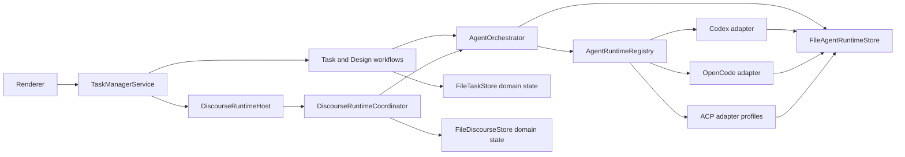

# Agent Runtime Architecture

Date: 2026-08-28

Status: Provider milestone 1 is implemented. Later milestones are approved but not implemented.

This document is the provider architecture source of truth.
It records current behavior and the approved target direction.

## Outcome

Task Monki must keep one adapter for each provider runtime.
It must also keep one implementation of each product workflow.

The first investigation found a split below the workflows.
Task and Design used one runtime lifecycle.
Discourse used another lifecycle and another runtime store.

Provider milestone 1 removed this split.
Task, Design, Discourse, and review now use one runtime coordinator and one runtime store.
Prompt refinement remains a later workflow cutover.
Each workflow still owns its product state and rules.

Provider adapters translate these items:

- sessions and turns.
- provider events.
- models and model input types.
- instructions and skills.
- attachments.
- permissions.
- cancellation and recovery.
- optional live steering.
- optional native session operations.
- app-owned tool transport.

Task Monki keeps ownership of these items:

- Tasks, Designs, and Discourse conversations.
- worktrees and managed repositories.
- Git, test, review, and delivery evidence.
- attachment bytes and lifetime.
- Design source capture and candidate identity.
- Preview, canvas, and browser verification.
- exact tool grants.
- runtime records and recovery state.
- local process and file cleanup.

Do not require every provider to copy the Codex sandbox.
Use the strongest native policy that each provider offers.
Show its real limits to the user.

An attached file is an input that the user chose to send to the selected provider.
It is not a secret from that provider.
Task Monki must protect file ownership, integrity, selection, and lifetime.
It must not claim that a provider forgets bytes after delivery.

## Firm decisions

1. Keep `AgentRuntimeRegistry` as the only runtime registry.
2. Keep one adapter implementation for each native protocol family.
3. Use one registered ACP adapter instance for each ACP agent product.
4. Keep all provider sessions and runs in `FileAgentRuntimeStore`.
5. Keep domain state in `FileTaskStore` and `FileDiscourseStore`.
6. Use `AgentOrchestrator` as the shared runtime coordinator.
7. Do not add another scoped-turn runtime lifecycle.
8. Send one provider-neutral turn request from every workflow.
9. Let each adapter qualify and translate that request.
10. Use normal turns for review and prompt refinement.
11. Keep native review as an adapter detail when it gives equal semantics.
12. Use a new session with bounded Task Monki context when native fork is absent.
13. Queue a later message when live steering is absent.
14. Keep one attachment store and one exact per-turn attachment selection.
15. Keep one `inspect_design` handler and one Design browser system.
16. Keep the working Codex dynamic-tool transport.
17. Add one packaged stdio MCP bridge for OpenCode and ACP Design sessions.
18. Select workflow support by operations, model input types, and applied policy.
19. Never select a workflow by provider name.
20. Do not keep old development-store formats during this change.

## Evidence method

This investigation followed the current call paths.
It also checked relevant Git history and current provider documents.

The main repository commits were:

- `fc230108`, which added the shared runtime registry and multi-provider Task support.
- `e54d6925`, which added Discourse and its separate scoped runtime path.
- `0b75e09a`, which added the first Codex-only Design slice.
- `5160c6b1`, which added the first Codex review path.
- `b2d3edfb`, which added the current Design browser workflow.

The order explains the current coupling.
The registry came first.
Discourse and Design then added separate Codex paths instead of extending one runtime owner.

### Main files inspected

| Area | Current owners and callers |
| --- | --- |
| Composition | `src/core/app/AgentRuntimeComposition.ts`, `src/core/app/TaskManagerService.ts` |
| Registry and adapter contract | `src/core/agent/AgentRuntimeRegistry.ts`, `src/core/agent/AgentRuntimeAdapter.ts` |
| Shared runtime | `src/core/agent/AgentOrchestrator.ts`, `src/core/agent/AgentRuntimeCoordinator.ts`, `src/core/storage/FileAgentRuntimeStore.ts` |
| Task and Design domain | `src/core/storage/FileTaskStore.ts`, `src/core/design/DesignUpdateCoordinator.ts` |
| Discourse domain | `src/core/discourse/DiscourseRuntimeHost.ts`, `src/core/discourse/DiscourseRuntimeCoordinator.ts`, `src/core/storage/FileDiscourseStore.ts` |
| Codex | `src/core/agent/codex/CodexAppServerAdapter.ts`, `CodexPermissionProfile.ts`, `CodexRpcClient.ts` |
| OpenCode | `src/core/agent/opencode/OpenCodeAdapter.ts`, `OpenCodeHttpClient.ts`, `OpenCodeServerSupervisor.ts` |
| ACP | `src/core/agent/acp/AcpRuntimeAdapter.ts`, `AcpProtocol.ts`, `AcpRuntimeProfiles.ts`, `AcpPermissionPolicy.ts` |
| Review | `src/core/agent/AgentOrchestrator.ts`, `src/core/review`, `docs/workflows/AGENT_REVIEW_WORKFLOW_LIFECYCLE.md` |
| Prompt refinement | `src/core/prompt/PromptRefinementService.ts`, `src/core/agent/codex/CodexEphemeralReadOnlyRunner.ts` |
| Design | `src/core/design/DesignUpdateCoordinator.ts`, `DesignSourceService.ts`, `DesignSkillPack.ts` |
| Design browser | `src/core/design/AgentBrowserRuntime.ts`, `src/core/agent/journal/AgentProtocolRedaction.ts` |
| Preview | `src/core/preview/PreviewManager.ts`, `PreviewSourcePreparer.ts`, `ManagedDesignStaticPreview.ts` |
| Attachments | `src/core/storage/AttachmentFileStore.ts`, `src/core/agent/AgentAttachmentDelivery.ts`, `src/shared/attachments.ts` |
| Durable contracts | `src/shared/contracts.ts`, `src/shared/agentRuntime.ts`, `src/shared/design.ts`, `src/shared/agent.ts` |
| Execution support | `src/shared/agentExecutionSupport.ts` and its core and renderer callers |
| Renderer support | `src/renderer/model/designs.ts`, `src/renderer/model/discourse.ts`, `src/renderer/ui/AgentControlPanel.tsx`, `src/renderer/ui/SettingsView.tsx` |

The investigation also read adapter, store, workflow, renderer, recovery, and protocol tests beside these files.

## Runtime identity and readiness

Keep three identities separate:

1. Runtime ID identifies the installed agent and its session protocol.
2. Model-provider ID identifies the upstream model vendor reported by that runtime.
3. Model ID identifies one model inside that runtime and model provider.

For example, `opencode`, `anthropic`, and a Claude model ID are different values.
Combining them into one provider string makes recovery and model selection unclear.

A Task keeps one primary runtime for its implementation life.
A continuation never changes the runtime behind an existing session.
A review can use another explicit runtime because it owns another session.
There is no silent cross-runtime fallback.

The registry remains static application composition.
Adding a runtime requires one adapter, one descriptor, packaging rules, and contract tests.
Task Monki does not need a plugin framework for provider registration.

Keep the current typed readiness states.
Discovery, live initialization, authentication, account access, and model access are different readiness facts.
The UI must not parse provider error text to rebuild readiness.

Every model ID remains runtime-qualified.
Model input types must come from the runtime or a tested profile contract.
Do not infer image or file support from a model name.

Each adapter keeps ownership of its process supervisor, transport, and protocol generation.
Late events from a replaced process cannot update a current run.
Shutdown stops admission, drains owned work, revokes tool grants, and closes provider processes.

## Verified current architecture

Task Monki creates every adapter in `AgentRuntimeComposition`.
It registers all adapters in `AgentRuntimeRegistry`.
`TaskManagerService` creates one `FileAgentRuntimeStore` and one `AgentOrchestrator`.
The Discourse host receives that same orchestrator and runtime store.

```mermaid
flowchart LR
  UI[Renderer] --> Service[TaskManagerService]
  Service --> TaskFlow[Task and Design workflows]
  Service --> DiscourseFlow[DiscourseRuntimeHost]
  TaskFlow --> Orchestrator[AgentOrchestrator]
  DiscourseFlow --> DiscourseCoordinator[DiscourseRuntimeCoordinator]
  DiscourseCoordinator --> Orchestrator
  Orchestrator --> Registry[AgentRuntimeRegistry]
  Registry --> Codex[Codex adapter]
  Registry --> OpenCode[OpenCode adapter]
  Registry --> ACP[ACP adapter profiles]
  Orchestrator --> RuntimeStore[FileAgentRuntimeStore]
  Codex --> RuntimeStore
  OpenCode --> RuntimeStore
  ACP --> RuntimeStore
  TaskFlow --> TaskStore[FileTaskStore domain state]
  DiscourseCoordinator --> DiscourseStore[FileDiscourseStore domain state]
```

`FileAgentRuntimeStore` owns provider sessions, runs, queue entries, artifacts, telemetry, and recovery state.
Its owner scope separates Task records from Discourse records.

`FileTaskStore` and `FileDiscourseStore` own product state and links to runtime records.
`FileTaskStore` can expose a joined runtime projection to existing callers.
It does not persist provider records in the Task snapshot.

The old scoped router and its separate runtime owner no longer exist.
Codex keeps different request contracts for Task work and owner-neutral turns.
Both contracts use the same private thread and turn transport.
They persist provider state in the same runtime store.
One resolver routes provider notifications by runtime owner.
One server-loss sweep reconciles Task and Discourse runs.
Discourse availability uses `projectAgentExecutionSupport`.
The projection requires a stable Discourse extension and a read-only, offline, no-approval policy.
`DiscourseRuntimeHost` also requires the common runtime operations.
Only Codex meets these requirements today.

### Current normal Task path

1. Task creation stores `runtimeId` and execution settings as Task domain state.
2. `AgentOrchestrator` resolves the adapter from the registry.
3. It verifies the Task, session, run, worktree, and selected attachments.
4. The orchestrator creates the local session and run in `FileAgentRuntimeStore`.
5. The adapter creates or resumes its provider session and starts the turn.
6. The adapter maps provider events into runtime items and interactions.
7. Task Monki observes Git and tests independently.
8. Stop calls the adapter interrupt operation.
9. Recovery reconciles the stored local run with the provider session.

### Current Discourse path

1. `DiscourseRuntimeCoordinator` schedules a participant turn.
2. `DiscourseContextSnapshotService` resolves exact context roots.
3. The shared support projection selects a compatible runtime.
4. The adapter builds its read-only and offline execution context.
5. `AgentOrchestrator` prepares and starts the turn in `FileAgentRuntimeStore`.
6. The shared runtime event path reports progress and terminal state.
7. The coordinator turns terminal output into a Discourse message.

The Discourse scheduler, budget, prompt, and message logic are sound.
They do not own a second provider lifecycle.

### Current Design path

`DesignUpdateCoordinator` already uses the normal Task orchestrator.
Its source, Git, Preview, browser, candidate, and Ready work is provider-neutral.

However, Design creation and validation hardcode `CODEX_RUNTIME_ID`.
`TaskManagerService.requireDesignUpdates()` also requires Codex extensions.
Only `CodexAppServerAdapter` receives the Design tool handler.

The renderer appears provider-neutral.
It can show a runtime that passes capability filters.
The create request does not contain the selected runtime.
Core therefore creates a Codex Design.

### Current review path

The review workflow can choose a runtime that differs from the implementation runtime.
Codex supports native and detached review.
Other adapters do not expose a stable detached review path.

The core review rules are provider-neutral.
The current adapter contract makes review a special provider operation.
That special operation is not required.
A detached review is a normal read-only turn with a review instruction profile.

### Current prompt-refinement path

The shared adapter contract has an optional `refinePrompt` operation.
Only Codex implements it.
The implementation uses `CodexEphemeralReadOnlyRunner` directly.

Refinement is also a normal short turn.
Its workflow owns the exact-output prompt and parser.
The provider only needs normal instruction, attachment, and turn delivery.

## Current provider and workflow matrix

This table describes current code, not provider protocol potential.

| Workflow or operation | Codex | OpenCode | Grok ACP | Cursor ACP | Claude ACP |
| --- | --- | --- | --- | --- | --- |
| Text Task | Yes | Yes | Yes | Yes | Yes |
| Stop active turn | Yes | Yes | Yes | Yes | Yes |
| Queue next message | Yes | Yes | Yes | Yes | Yes |
| Live steering | Yes | No | No | No | No |
| Managed attachments | Yes | Blocked in adapter | Blocked in adapter | Blocked in adapter | Blocked in adapter |
| Prompt refinement | Yes | No | No | No | No |
| Review provider | Yes | No | No | No | No |
| Discourse participant | Yes | No | No | No | No |
| Design | Yes | No | No | No | No |
| Provider resume | Yes | Yes | Negotiated | Negotiated | Negotiated |
| Native provider fork | Yes | Yes | No | No | No |
| User-facing fork alternative | Yes | Yes | Yes | Yes | Yes |
| Provider history deletion | Partial | Partial | Not exposed | Not exposed | Not exposed |

The user-facing fork alternative creates a new Task and worktree.
It does not use native provider fork.

## Why current combinations fail

| Current failure | Root cause | Classification |
| --- | --- | --- |
| Non-Codex Design creation | The request, service, store, and validation require Codex. | Historical coupling and unnecessary restriction |
| Non-Codex `inspect_design` | Tool registration exists only inside the Codex adapter. | Adapter transport responsibility |
| Non-Codex Design instructions | Only Codex maps the app-owned instruction and skill pack. | Adapter responsibility |
| OpenCode attachments | The adapter rejects them and sends text-only parts. | Missing adapter feature |
| ACP attachments | The adapter rejects them and sends one text block. | Missing adapter feature |
| Attachment plus provider network | Shared code requires network-off execution. | Unnecessary Codex-shaped restriction |
| Attachment plus full process access | Shared code rejects the run. | Unnecessary universal restriction |
| Non-Codex Discourse | Only Codex declares stable Discourse support and maps the required execution policy. | Missing adapter feature |
| Non-Codex review | Review uses a special adapter method and Codex isolation assumptions. | Workflow coupling and adapter gap |
| Non-Codex refinement | Refinement calls a Codex-only ephemeral runner. | Historical workflow coupling |
| Preview recipe model selection | UI can select another runtime, while core always runs Codex. | Historical coupling |
| Design provider-history cleanup | Design qualification expects provider deletion semantics. | Unnecessary restriction |

## Codex-specific dependency classification

| Dependency | Owner after the change | Reason |
| --- | --- | --- |
| App Server thread IDs, turn IDs, and resume cursors | Codex adapter | These values belong to the Codex protocol. |
| App Server permission profiles | Codex adapter | This is Codex's strongest native execution policy. |
| Additional readable paths | Codex adapter | Other providers grant file access differently. |
| `localImage` input | Codex adapter | This is a native Codex content type. |
| Thread fork on changed read roots | Codex adapter | Other providers need another session fallback. |
| Dynamic tool request and response | Codex adapter | This is one transport for a shared Task Monki tool. |
| Codex developer instructions and skill inputs | Codex adapter | The instruction and skill content remains app-owned. |
| Native Codex review mode | Codex adapter | It is an optional mapping of the shared review intent. |
| Codex goals, plans, usage, and subagents | Codex adapter | These are provider telemetry, not workflow truth. |
| Exact Design source and Ready requirements | Design workflow | They do not depend on Codex. |
| Browser actions and screenshots | Design workflow | `AgentBrowserRuntime` already owns them. |
| Design runtime hardcoding | Delete | No product rule requires it. |
| Codex-only refinement runner | Delete | The shared runtime can run the same short turn. |
| Scoped Codex Discourse lifecycle | Delete | The shared runtime coordinator owns it after the cutover. |
| Codex sandbox as attachment gate | Delete | Selection authorizes delivery to the provider. |
| Provider-history deletion as Design gate | Delete | Task Monki cannot promise remote erasure. |

## Real provider limits

Provider-neutral behavior does not mean identical behavior.
These limits are real and must remain visible.

- OpenCode and current ACP agents do not prove an OS sandbox to Task Monki.
- OpenCode has no public live-steering operation.
- Stable ACP has no native session-fork operation.
- ACP resume and load depend on negotiated agent capabilities.
- The pinned ACP code does not yet implement current structured elicitation.
- A model can reject image input even when its runtime supports images.
- A provider can retain prompts, files, tool results, or screenshots after local cleanup.
- Provider session deletion can remove a session view without erasing related files.
- Provider processes can use network access for model calls.
- A provider-native permission rule is not the same as an OS sandbox.
- Task Monki cannot revoke bytes that a provider already received.

These limits must narrow an operation, not disable unrelated workflows.

## Target provider and workflow matrix

This table describes the target after the planned adapter work.
Every cell still requires a compatible installed runtime and model.

| Workflow or operation | Codex | OpenCode | Grok ACP | Cursor ACP | Claude ACP |
| --- | --- | --- | --- | --- | --- |
| Text Task | Yes | Yes | Yes | Yes | Yes |
| Stop active turn | Yes | Yes | Yes | Yes | Yes |
| Active conversation | Live steer | Queue fallback | Queue fallback | Queue fallback | Queue fallback |
| Text attachment | Yes | Native file part | Embedded content or exact path | Embedded content or exact path | Embedded content or exact path |
| Image attachment | Model-gated | Model-gated | Negotiated and model-gated | Negotiated and model-gated | Negotiated and model-gated |
| Prompt refinement | Shared short turn | Shared short turn | Shared short turn | Shared short turn | Shared short turn |
| Review | Shared read-only turn | Shared read-only turn | Shared read-only turn | Shared read-only turn | Shared read-only turn |
| Discourse | Shared read-only turn | Native-policy qualified | Native-policy qualified | Native-policy qualified | Native-policy qualified |
| Design | Native tool transport | MCP bridge | MCP bridge | MCP bridge | MCP bridge |
| Resume | Native | Native | Negotiated or new session | Negotiated or new session | Negotiated or new session |
| Fork product state | New Task session | New Task session | New Task session | New Task session | New Task session |
| Provider cleanup | Best effort | Best effort | Best effort | Best effort | Best effort |

`Native-policy qualified` has one exact meaning.
The adapter must deny repository mutation through the provider's documented tool policy.
Task Monki must also verify that the repository did not change.

This rule does not claim OS confinement.
If an installed profile cannot deny mutation, that profile cannot run a read-only workflow.
Normal Task and Design work can still remain available.

Design also needs a model that can consume image tool results.
Each packaged adapter must pass the same real Design behavior tests before the UI enables it.

## Shared runtime boundary

### One runtime coordinator

Extend `AgentOrchestrator` into the single owner of provider sessions and runs.
Do not add a generic workflow engine.

The coordinator owns only common runtime work:

- local session and run identity.
- runtime selection.
- idempotent turn admission.
- delivery state.
- event ingestion.
- interaction routing.
- cancellation.
- recovery and no-resend rules.
- bounded provider telemetry.
- provider process release.

Each workflow remains a direct caller.
The workflow owns prompts, queues, messages, checkpoints, source, and user-visible state.

### Target execution path

1. The workflow builds one concrete turn request.
2. The coordinator creates or finds its local session and stable operation ID.
3. The selected adapter qualifies the model, access, content, and tool request.
4. Core verifies the exact selected attachment records.
5. The coordinator stores a pending run before provider delivery.
6. The adapter creates, resumes, or replaces its provider session.
7. The adapter maps instructions, attachments, permissions, and client tools.
8. The coordinator records delivery progress and provider IDs.
9. The adapter emits normalized events for that local run.
10. The coordinator stores bounded items, interactions, usage, and terminal state.
11. The workflow consumes the terminal result and verifies its own evidence.
12. The coordinator revokes turn tools and releases idle provider resources.

An error before delivery is retry-safe with the same operation ID.
An error after possible delivery is ambiguous.
Task Monki reconciles it and never resends it automatically.

### One provider-neutral turn request

Every workflow sends the same small request shape to the runtime coordinator.
The request contains these concepts:

| Part | Purpose |
| --- | --- |
| Owner | Task, Discourse conversation, or ephemeral refinement operation |
| Intent | Implement, Design, Discourse, review, or refine |
| Operation ID | Stable retry and recovery identity |
| Instructions | App-owned priority text and selected skills |
| User input | The exact user message for this turn |
| Workspace | Working directory and approved extra read paths |
| Access request | Read or write intent, approval policy, and provider-tool network intent |
| Model settings | Runtime-qualified provider, model, and reasoning values |
| Attachments | Exact verified records selected for this turn |
| Client tools | Exact app-owned tools granted to this run |
| Resume context | Stored session identity or bounded Task Monki context |

Do not put Preview, Git, Design revision, or Discourse round data in this request.
Those values belong to their workflow owners.

### Adapter contract

Every adapter must provide these operations:

- discover and qualify the installed runtime.
- list runtime-qualified models and input types.
- qualify one requested execution before provider mutation.
- create or attach a provider session.
- start one turn.
- stream normalized events.
- interrupt or cancel one turn.
- answer supported interactions.
- reconcile uncertain or lost work.
- release local session resources.
- shut down owned processes.

Optional operations remain small:

- live steering.
- native session fork.
- native session delete.
- structured user input.
- native session controls.
- provider-specific telemetry such as goals or subagents.

Do not add optional `review` or `refinePrompt` workflow implementations.
The common turn intent covers both.

An adapter can map review intent to a native review method.
It must preserve the shared read-only and output contract.

### Execution qualification

Do not build a large list of workflow flags.
The workflow creates a concrete turn request.
The selected adapter qualifies that request.

Qualification verifies only current needs:

- model input types.
- read or write policy support.
- exact extra path support.
- attachment transport.
- app-owned tool transport.
- resume or new-session behavior.
- current runtime readiness.

Core does the final live verification before provider mutation.
The renderer uses a safe projection of the same result.
The renderer result never becomes security authority.

## Stored contract

### One runtime store

`FileAgentRuntimeStore` is the only owner of provider sessions, runs, interactions, items, plans, usage, and recovery state.

`FileTaskStore` keeps Task and Design domain state.
`FileDiscourseStore` keeps Discourse domain state.
Each domain record stores only local runtime session or run links when needed.

Do not dual-write provider state.
Do not keep a compatibility reader for old development data.
Use one schema cutover and reset old development stores.

### Runtime session record

A session record needs these values:

- local session ID.
- domain owner kind and owner ID.
- immutable runtime ID.
- provider session ID and resume cursor when the provider supplies them.
- working directory and approved extra roots.
- applied execution policy.
- current provider generation.
- lifecycle status.
- bounded timestamps and recovery state.

Design is a Task subtype.
It does not need a separate runtime owner kind.
Review also remains Task-owned.

### Runtime run record

A run record needs these values:

- local run ID and session ID.
- stable workflow operation ID.
- turn intent.
- delivery phase.
- provider turn or message ID when known.
- terminal status.
- exact attachment IDs and path-free submission evidence.
- exact app-owned tool grants.
- cancellation and reconciliation state.
- bounded start and finish times.

Provider protocol messages stay in the existing bounded redacted journal.
Do not copy raw provider payloads into domain stores.

### Recovery rules

Persist a provider resume identity only when the provider supplies one.
Do not invent resume support.

If resume is unavailable, start a new session with bounded Task Monki context.
Do not replay an uncertain prompt automatically.

The no-resend rule remains absolute.
An ambiguous delivery requires reconciliation or a user decision.

## Instructions and skills

Task Monki owns instruction content.
Each workflow selects one instruction profile and the required app-owned skills.

The adapter delivers the same content through its strongest native channel:

- Codex uses developer instructions and native skill inputs.
- OpenCode uses its system instruction field and supported skill or instruction configuration.
- ACP uses a bounded trusted instruction block before the user content.

Do not write app instructions into the user's repository.
Do not register global user skills.
Do not create a second skill router.

`DesignSkillPack` remains the only Design skill-content owner.
Provider adapters only map its selected content.

Behavior tests must prove that instructions work.
String injection tests are not enough.

## Attachment contract

`AttachmentFileStore` remains the only byte owner.
The current staging, adoption, hash, retry, draft, delete, and quota rules remain.

Every turn stores its exact attachment selection.
The next turn starts with no inherited selection.
An old attachment remains in history but is not sent again unless selected.

Immediately before delivery, core must:

1. resolve only the selected records.
2. reject arbitrary renderer or provider paths.
3. open each file without following links.
4. verify root containment and regular-file identity.
5. verify size and SHA-256.
6. verify the selected model input type.
7. pass verified records to the selected adapter.

The adapter selects the best native delivery:

- Codex uses `localImage` for supported images and exact managed paths for text.
- OpenCode uses native file parts without creating another managed copy.
- ACP uses image blocks or embedded content when negotiated.
- ACP can use an exact managed path when native content is unavailable.

When a provider session cannot narrow old readable paths, create a new session.
Seed it with bounded Task Monki conversation context.

This action does not erase data that the provider already received.
It only prevents Task Monki from granting the old path again.

Submission evidence stays path-free.
It records attachment ID, hash, size, transport, provider turn ID, and delivery time.

### Attachment security rule to remove

Remove the universal rule that requires a restricted sandbox and disabled network.
It belongs to the current Codex policy, not the shared attachment boundary.

Provider access is an explicit trust decision.
The provider process can receive the selected bytes and can call its model service.

Task Monki still blocks unsupported file types, secret-like names, arbitrary paths, stale files, and unselected records.

## Shared client-tool contract

Task Monki needs one small app-owned tool contract.
It is not a general browser or MCP API.

A client-tool definition contains:

- a stable tool name.
- one validated input schema.
- bounded text and image result types.
- one run-bound handler.
- one short-lived grant.
- one cleanup callback.

Every call must prove the current runtime session, run, workflow owner, worktree, and provider generation.
The model cannot supply those authority values.

Adapters translate only the transport.
They do not implement the tool behavior.

## `inspect_design` transport

Keep `DesignUpdateCoordinator.inspectDesign` as the only handler.
Keep `AgentBrowserRuntime` as the only browser-action owner.
Keep `DesignSourceService` as the only source-capture owner.
Keep Preview as the only canvas process owner.

Use these transports:

- Codex keeps the working App Server dynamic-tool path.
- OpenCode receives one packaged local stdio MCP server for its Design session.
- ACP receives the same packaged stdio MCP server through `mcpServers`.

Do not replace the Codex path only to make all transports look equal.
That change adds an extra process without a product benefit.

The MCP bridge exposes only `inspect_design`.
It forwards an authenticated call to the one Task Monki handler.
It must not implement browser automation.

The bridge uses a short-lived session credential.
Task Monki revokes it on turn completion, cancellation, process loss, release, shutdown, and restart.
The bridge accepts no path, URL, Task ID, Run ID, or browser configuration from the model.

The current screenshot rules remain:

- screenshot files are temporary.
- the journal receives a redacted result.
- output count and bytes stay bounded.
- local scratch files are deleted after response creation.
- screenshots never become attachments, assets, revisions, or Preview records.

A provider can retain the tool result in its own conversation history.
Task Monki must state this limit clearly.

## Provider-specific behavior that remains

### Codex App Server

Keep native threads, resume, fork, permission profiles, additional readable roots, dynamic tools, skills, and interaction mapping.
Keep current generation fences and no-resend recovery.

Thread fork copies provider history.
It can narrow future file access.
It cannot revoke content already present in the copied history.

### OpenCode

Keep the authenticated loopback server, SSE stream, sessions, abort, question queue, permission rules, model variants, and native fork.

Use native prompt `system`, `tools`, and file parts.
Register the app-owned MCP bridge only for Design sessions.

Before Design enablement, test the packaged OpenCode version with external plugins disabled.
Also test exact config precedence and MCP cleanup.

### ACP profiles

Keep one ACP adapter implementation.
Keep a distinct registered runtime identity and launch profile for Grok, Cursor, and Claude.

Use stable ACP content blocks, cancellation, permission choices, and stdio MCP.
Use resume or load only when negotiated.

Provider-specific model and mode extensions remain inside their profile mapping.
Do not expose them as universal settings.

Stable ACP does not provide session fork.
Use the new-session fallback.

## Workflow end-to-end behavior

### Normal Task

The Task workflow creates a write-capable turn request.
The runtime coordinator starts or resumes the selected provider session.
The adapter applies its native permission policy.
Task Monki observes Git, tests, and delivery evidence independently.

### Active conversation

When a runtime supports live steering, the UI can show **Add instruction**.
When it does not, the same composer queues the message for the next turn.

The UI must label the behavior correctly.
It must not call a later queue operation live steering.

### Discourse

The Discourse scheduler and prompt builder remain unchanged.
They send a read-only turn request to the common runtime coordinator.

The adapter denies mutation through its native policy.
Task Monki captures repository state before and after the turn.
A detected mutation fails that participant turn.

The provider process remains a trusted installed agent.
Task Monki does not claim OS sandbox isolation unless the adapter proves it.

### Review

Review uses a new Task-owned runtime session and a read-only turn request.
The workflow supplies the review prompt and required Git context.
It validates repository state and review output.

An adapter can use a native review method internally.
The product result and safety rules stay the same.

### Prompt refinement

Refinement uses one ephemeral runtime session and a bounded exact-output instruction.
The workflow parses the final result and cleans the session.

The selected attachments use the same attachment delivery contract.
No Codex-specific runner remains.

### Design

Design creation stores the selected runtime and qualified model.
Every Design turn uses the common runtime coordinator.

The workflow supplies:

- permanent Design instructions.
- selected Design skills.
- exact turn references.
- the Design worktree.
- write access to that worktree.
- one `inspect_design` grant.
- the current bounded conversation context when a new session is required.

The adapter maps instructions, references, permissions, and tool transport.
`DesignUpdateCoordinator` keeps all source and Ready rules.

Final source must still match the final verified candidate.
The last Ready canvas stays safe during work and failure.

## Security model

### Rules that remain

- Keep Electron context isolation, renderer sandboxing, and typed IPC.
- Reject arbitrary file paths from renderer and provider input.
- Keep attachment admission, hashes, exact selection, and no-follow verification.
- Keep per-user managed storage and bounded staging cleanup.
- Keep provider child environment allowlists and credential redaction.
- Keep runtime generation fences and no-resend recovery.
- Keep worktree ownership and Task Monki Git verification.
- Keep generated Preview content in its isolated origin.
- Keep Preview network, navigation, popup, download, and permission blocks.
- Keep exact Design candidate identity and Ready cutover rules.
- Keep browser processes, sockets, profiles, and screenshots bounded and owned.
- Keep app-owned tool grants exact, short-lived, and revocable.
- Treat provider output as telemetry, not verified evidence.

### Rules to remove

- Do not require Codex sandbox parity for every provider.
- Do not force provider process network off when sending an attachment.
- Do not reject selected attachments only because the provider process has user-level access.
- Do not require native session fork for workflow support.
- Do not require live steering when a queue preserves the product behavior.
- Do not require provider history deletion for Design.
- Do not require one dynamic-tool protocol for every provider.
- Do not use a provider name as a workflow security rule.

### Honest trust boundary

Task Monki launches installed coding agents as the local user.
Native permission rules reduce accidental or model-directed actions.
They do not always confine the provider process.

The user trusts the selected provider with the prompt, selected files, and in-scope repository.
Task Monki protects its own records and generated-content boundary.

This model is simpler and more accurate than claiming universal OS isolation.

## Completed and planned removals

Provider milestone 1 removed these parts:

- persisted Task and Design provider records from `FileTaskStore`.
- `AgentScopedTurnRouter` and `AgentScopedRuntimeAdapter`.
- the separate Codex scoped run owner and transport.
- duplicated renderer workflow support rules.

Later milestones remove these parts:

- the Codex-only prompt-refinement runner path.
- workflow-specific `refinePrompt` and detached-review capability gates.
- Design `CODEX_RUNTIME_ID` validation and creation defaults.
- the universal attachment sandbox and network rule.
- Codex product names in provider-neutral Design copy.
- capability extensions that exist only to repeat method presence.

Do not remove protocol journals, generation fences, attachment verification, or Preview isolation.
Each protects a current failure or trust boundary.

## Smallest implementation sequence

### Provider milestone 1: one runtime lifecycle

Status: implemented on 2026-08-28.

This milestone changed ownership without adding provider features.

1. `FileAgentRuntimeStore` now owns every provider session and run.
2. `AgentOrchestrator` now uses that store for all runtimes.
3. Adapters emit normalized events without storing provider state in domain stores.
4. Discourse uses the same orchestrator.
5. Discourse scheduling and domain storage remain unchanged.
6. Existing Task, Codex Design, review, and refinement behavior remains available.
7. The scoped router and separate runtime owner are removed.
   The Codex request contracts use one private transport and one correlation path.
8. The Task schema does not persist old provider state.
9. Core and renderer use one shared execution-support projection.
10. The shared projection controls steering, review, refinement, Design, and Discourse availability.

Acceptance:

- Every current provider still completes, stops, resumes, and recovers a normal Task.
- Codex Design and `inspect_design` still work without behavior changes.
- Codex Discourse, review, and refinement still work.
- Task and Discourse use the same runtime session and run owner.
- No adapter writes `FileTaskStore` or `FileDiscourseStore` provider records.
- No provider state is dual-written.
- Uncertain delivery is never resent automatically.
- Process release and shutdown leave no active subscriptions or child processes.
- Renderer availability comes from one support projection.

### Provider milestone 2: shared read-only workflows

1. Express review, refinement, and Discourse as common read-only turn requests.
2. Map provider-native mutation denial in OpenCode and each ACP profile.
3. Add a repository comparison before and after each turn.
4. Enable only profiles that pass real read-only behavior tests.
5. Remove the special Codex refinement and review entry points.

### Provider milestone 3: provider-neutral attachments

1. Remove the universal Codex-shaped attachment policy.
2. Add OpenCode native file-part delivery.
3. Add ACP image and embedded-content delivery.
4. Add exact-path fallback only when the provider needs it.
5. Start a new session when old path grants cannot be narrowed.
6. Keep one copy of each Task Monki attachment.

### Provider milestone 4: provider-neutral Design

1. Add `runtimeId` to Design creation and persistence.
2. Add the shared instruction and skill bundle to each adapter.
3. Extract the current `inspect_design` tool contract from Codex.
4. Add the one packaged stdio MCP bridge.
5. Register it through OpenCode and ACP session creation.
6. Run the complete Design behavior suite for each packaged runtime.
7. Enable a provider only after its runtime and selected model pass.

### Provider milestone 5: hardening and cleanup

1. Run long-session and crash recovery tests across every adapter.
2. Verify process, subscription, MCP credential, and provider-session cleanup.
3. Verify bounded journals, transcripts, attachments, and tool output.
4. Remove stale capability fields and provider-specific UI copy.
5. Update current operational documents after behavior ships.

## Required tests

### Adapter contract suite

Run the same suite against Codex, OpenCode, Grok ACP, Cursor ACP, and Claude ACP.

- create and resume a text session.
- start and complete a turn.
- stop an active turn.
- map terminal failure correctly.
- reject a stale session or run ID.
- reconcile process loss.
- preserve no-resend behavior after ambiguous delivery.
- release subscriptions and processes.
- keep provider-native IDs inside the adapter boundary.

### Workflow suite

For every eligible provider, test:

- a normal Task with Git evidence.
- a queued active-conversation message.
- a live steer only where supported.
- prompt refinement with exact output.
- a read-only review and mutation detection.
- a Discourse turn with bounded context.
- Design creation and refinement.
- cancellation and restart.
- deletion and cleanup.

### Attachment suite

- one text file and one image.
- different selections on consecutive turns.
- no attachment after an attached turn.
- queued and draft attachments.
- retry without another managed copy.
- hash or path race rejection.
- model input mismatch.
- resume with unchanged access.
- new session when access cannot narrow.
- path-free durable submission evidence.

### Design tool suite

- the same tool schema for every provider.
- invalid or stale run rejection.
- exact candidate identity.
- final Ready source equality.
- screenshot byte and count limits.
- journal redaction.
- temporary screenshot cleanup.
- MCP credential revocation.
- cancellation during a tool call.
- provider restart during a tool call.
- last Ready preservation on every failure.

### Real application tests

Run each installed provider through its packaged runtime.
Mocks cannot prove instruction priority, native permissions, attachment parts, MCP behavior, or cleanup.

At minimum, verify one normal Task and one read-only workflow for every provider.
Verify one attachment turn for every supported content path.
Verify the full Design browser loop before enabling Design for that runtime.

## Unresolved provider limits

These items need implementation-time conformance tests.
They do not require another architecture decision.

1. Confirm the packaged OpenCode file-part shape and storage behavior.
2. Confirm OpenCode `--pure` and configuration precedence for the Design MCP bridge.
3. Confirm image MCP results for each packaged ACP agent and selected model.
4. Confirm a native read-only tool policy for each ACP profile.
5. Confirm ACP resume and load behavior for each installed version.
6. Decide whether to update the pinned ACP schema for structured elicitation.
7. Record the exact provider-session deletion meaning for each adapter.
8. Measure provider-side attachment and screenshot retention where documentation allows it.

If a test fails, disable only the affected operation or model.
Do not disable unrelated workflows for that provider.

## External implementation lessons

### T3 Code

The inspected T3 Code revision was `018d7f2775daabd2ef07898af29586915a0b7f67`.

Useful patterns:

- one registry routes provider-neutral operations.
- each provider instance has an explicit lifecycle scope.
- adapters keep protocol mapping local.
- attachment staging and cleanup remain app-owned.
- app-owned MCP access uses short-lived session credentials.
- idle providers and credentials have explicit cleanup.

Do not copy one pattern.
T3 Code has a large mandatory adapter contract.
The same rollback method can mean native rollback, local transcript truncation, or no support.
Task Monki must keep optional behavior explicit.

### OpenCode

The inspected OpenCode revision was `df35e842f59bc115bb7c0479a8e11f017d443f2c`.

Useful patterns:

- model input types qualify content delivery.
- instructions and skills stay outside workflow code.
- file parts and MCP resources use one message path.
- cancellation settles active jobs and tools.
- MCP lifecycle has one owner.

OpenCode is not a direct template for Task Monki.
OpenCode owns its full model loop and transcript.
Task Monki integrates several external agent runtimes with provider-owned sessions.

### Official protocol findings

Codex App Server supports thread start, resume, fork, local images, skills, permissions, and dynamic client tools.
ACP v1 supports content blocks, cancellation, session setup, and stdio MCP servers.
Current ACP resume and content features remain capability-gated.
OpenCode exposes sessions, prompt parts, abort, native fork, skills, and local MCP servers.

These protocol features support one shared workflow layer with adapter-specific transport.

## Primary references

- [Codex App Server](https://learn.chatgpt.com/docs/app-server)
- [ACP content](https://agentclientprotocol.com/protocol/v1/content)
- [ACP session setup](https://agentclientprotocol.com/protocol/v1/session-setup)
- [ACP prompt turns](https://agentclientprotocol.com/protocol/v1/prompt-turn)
- [ACP cancellation](https://agentclientprotocol.com/protocol/v1/cancellation)
- [ACP session delete](https://agentclientprotocol.com/protocol/v1/session-delete)
- [OpenCode server](https://opencode.ai/docs/server/)
- [OpenCode MCP servers](https://opencode.ai/docs/mcp-servers/)
- [OpenCode skills](https://opencode.ai/docs/skills/)
- [T3 Code provider source used](https://github.com/pingdotgg/t3code/tree/018d7f2775daabd2ef07898af29586915a0b7f67/apps/server/src/provider)
- [OpenCode revision used](https://github.com/anomalyco/opencode/tree/df35e842f59bc115bb7c0479a8e11f017d443f2c)
- [OpenCode prompt and file-part source used](https://github.com/anomalyco/opencode/blob/df35e842f59bc115bb7c0479a8e11f017d443f2c/packages/opencode/src/session/prompt.ts)

## Final recommendation

Keep the single runtime coordinator and runtime store from provider milestone 1.
Next, add provider mappings for read-only turns, attachments, and the shared Design tool.

This is the smallest clean path to broad provider support.
It keeps lifecycle code in one place and preserves each workflow owner.
