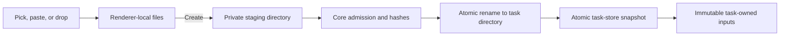

# Task Attachment Lifecycle

Date: 2026-07-11

Attachments are immutable task inputs. They are neither provider artifacts nor
repository files, and they never live in a Git worktree.

## Supported input

Task Monki accepts:

- PNG, JPEG, and still WebP images;
- UTF-8 text, Markdown, JSON, CSV, SQL, YAML, TOML, and XML; and
- allowlisted source-code and plaintext configuration extensions.

The filename allowlist rejects `.env` variants and common credential, private
key, package-registry credential, and service-account filenames even when their
contents are text. SVG is accepted only as UTF-8 text, not as an image input.

PDFs, Office documents, video, audio, archives, databases, and arbitrary
binaries are unsupported. Codex App Server provides `text`, `image`, and
`localImage` inputs but no generic file or PDF input. Supporting those formats
requires a separately secured extraction or rendering pipeline.

The renderer performs inexpensive filename and size checks. Before submission,
Chromium's native image decoder bounds dimensions and re-encodes images so
pixel-irrelevant metadata is not copied. Core remains authoritative for
admission and storage: it checks count, aggregate and per-file sizes, normalized
names, UTF-8, control bytes, image signatures and container structure,
still-image status, dimensions, media type, and SHA-256. Core does not perform a
second pixel decode; the trusted renderer and Electron clipboard path supply
native-decoder-normalized image bytes before core admission.

Limits are:

- 10 files and 20 MiB total per task;
- 10 MiB per image and 2 MiB per text file;
- 16 megapixels per selected image and 12 megapixels per native clipboard image;
- 32 staging batches and 100 MiB of staged bytes;
- 1 GiB of managed attachment storage; and
- a 50-MiB free-disk reserve.

## Composer and creation

Picked, pasted, and dropped files remain renderer-local while the task is being
edited. The renderer uses object URLs only for local previews and revokes them
when a file or the panel is closed.

Pressing Create performs one bounded batch operation. Electron uses guarded IPC
with aggregate byte accounting. Browser development uses one authenticated JSON
request with an endpoint-specific limit that includes base64 overhead. Core
validates the entire batch and removes the staging directory if any member
fails.



The renderer uses one task-creation token for retries. A response lost after a
durable create resolves to the existing task. The staged batch is retained only
for that unchanged ambiguous retry. Ordinary validation or create failures
discard it.

## Storage

Managed files live under the Task Monki data root:

```text
attachments/
  staging/<draft-id>/
  tasks/<task-id>/<attachment-id>.<safe-extension>
```

Directories are `0700`, staging manifests and task state are `0600`, and
immutable attachment files are `0400` on POSIX. Node does not provide equivalent
owner/group/other mode enforcement on Windows, and Task Monki does not treat
Windows `chmod` as an ACL boundary. Packaged Windows storage instead lives under
the app's per-user data directory and inherits that managed root's Windows ACLs.
This protects the normal per-user installation boundary but does not protect
against another process running as the same OS user or against a user who has
weakened the inherited ACLs. Names use opaque ids; original absolute paths are
never stored. Durable records contain task id, attachment id, ordinal, display
name, kind, media type, byte count, SHA-256, and creation time. The storage path
is derived internally and is absent from snapshots, events, API responses, and
submission evidence.

File data is flushed before publication on every platform. Directory metadata
is also synchronized on POSIX filesystems that support directory `fsync`.
Node's directory-handle synchronization is unsupported on Windows, so Windows
keeps the atomic temporary-write/link-or-rename publication boundary without
claiming the additional POSIX directory-flush guarantee.

Task creation verifies the staging directory and atomically renames it to the
task id before publishing `store.json`. If publication fails before becoming
visible, the directory is renamed back so the request can be retried. If the
snapshot is visible but final manifest cleanup is interrupted, startup verifies
the task-owned files and removes the stale manifest. An adopted directory with
no durable task record is an orphan and is removed at startup.

Schema 10 content-addressed records migrate once to schema 11. Migration copies
each legacy blob into its owning task directory, verifies the resulting bytes,
and removes `storageKey` from durable metadata. Task Monki durably publishes and
synchronizes the schema 11 store snapshot before removing the legacy managed
directories. An already-verified task-owned copy makes an interrupted migration
safe to repeat even if the corresponding legacy blob is no longer present.

Fork alternatives receive independent task-owned copies. This intentionally
avoids shared-reference accounting and garbage collection at the small bounded
attachment sizes. Archiving retains attachments. Deleting a task publishes the
record deletion first, then removes only that task's directory; startup removes
an orphan left by interrupted cleanup. Deletion is not secure erasure.

## Run, reload, review, and debugging

Every implementation, follow-up, retry, recovery, and review reuses the same
immutable task-owned files. Core reopens with no-follow semantics and verifies
managed-root containment, regular-file and non-symlink status, stable file
identity, byte count, and SHA-256 immediately before provider delivery. It also
verifies current-user ownership and the exact private mode on POSIX. Windows
retains the path, regular-file/non-symlink checks exposed by Node, stable file
identity, size, and hash checks while relying on the inherited per-user ACL
boundary described above. No run cache or second physical representation
exists.

Images are sent as Codex `localImage`. Text-like files are listed by exact
managed read-only path in a compact prompt manifest that labels their contents
as untrusted task data. The selected model must report image support.

After Codex acknowledges a turn, Task Monki records path-free submission
evidence: attachment id, ordinal, kind, media type, size, hash, submission mode,
verification time, provider turn id, and submission time. This proves what Task
Monki submitted, not that the model read or used it. Raw protocol journals can
still contain provider-visible paths and belong only in Debug.

## Confidentiality boundary

An attachment task requires a managed Codex sandbox. Full access remains
available for attachment-free tasks but is rejected when attachments are
present. Attachment task profiles grant only the runtime minimum, the exact
worktree, and the exact verified files. Network is forced off.

Codex web search, external MCP servers, and apps must also all be disabled
before an attachment task is created or submitted. Filesystem read rules do not
confine a same-user MCP process and do not prevent an allowed network tool from
transmitting content. This restriction is fail-closed until Task Monki has a
stronger external-tool isolation or explicit trust model.

The development API remains loopback-only and uses an Origin/Host/Fetch-Metadata
boundary plus a private rotating token held by the Vite proxy. It has strict
content types, body/header/time limits, bounded attachment concurrency,
structured path-free errors, `no-store`, and `nosniff`. Packaged Electron uses
context isolation, renderer sandboxing, disabled Node integration, typed IPC,
main-frame sender checks, and navigation, popup, webview, and permission guards.
No attachment surface accepts an arbitrary filesystem path or exposes a generic
App Server bridge.

These controls do not protect against compromise of the trusted renderer or a
different malicious process already running as the same OS user.

## Portability and retention

Managed copies make tasks independent of their selected source files. Any
backup or export must keep `store.json` and `attachments/tasks` together while
Task Monki is closed. Staging is disposable and is removed on restart. Task
attachments last for the task lifetime.

Codex conversation history and Task Monki protocol journals may retain image
bytes, managed paths, hashes, or derived discussion after local task deletion.
Task Monki must not claim that deleting its task directory erases provider
history.
