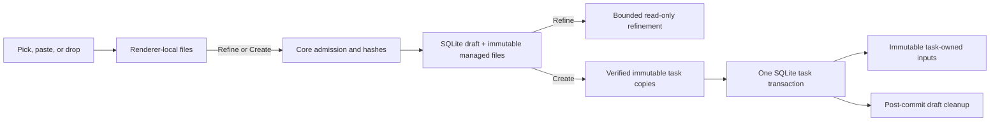

# Task Attachment and Design Reference Lifecycle

Date: 2026-08-29

Attachments are immutable task inputs or Design references. They are neither
provider artifacts nor repository files. They never live in a Git worktree.

This document describes current implemented behavior.
Task Monki owns the files and the selected file set.
Each provider adapter owns its wire format.

## Supported input

Task Monki accepts:

- PNG, JPEG, and still WebP images;
- UTF-8 text, Markdown, JSON, CSV, SQL, YAML, TOML, and XML; and
- allowlisted source-code and plaintext configuration extensions.

The filename allowlist rejects `.env` variants and common credential, private
key, package-registry credential, and service-account filenames even when their
contents are text. SVG is accepted only as UTF-8 text, not as an image input.

PDFs, Office documents, video, audio, archives, databases, and arbitrary
binaries are unsupported. Runtime-native generic file parts do not make an
unsupported format safe to parse; those formats still require a separately
secured extraction or rendering pipeline.

The renderer performs inexpensive filename and size checks. Before submission,
Chromium's native image decoder bounds dimensions and re-encodes images so
pixel-irrelevant metadata is not copied. Core remains authoritative for
admission and storage: it checks count, aggregate and per-file sizes, normalized
names, UTF-8, control bytes, image signatures and container structure,
still-image status, dimensions, media type, and SHA-256. Core does not perform a
second pixel decode; the trusted renderer and Electron clipboard path supply
native-decoder-normalized image bytes before core admission.

Limits are:

- 10 files and 20 MiB total per task;
- 10 MiB per image and 2 MiB per text file;
- 16 megapixels per selected image and 12 megapixels per native clipboard image;
- 32 staging batches and 100 MiB of staged bytes;
- 1 GiB of managed attachment storage; and
- a 50-MiB free-disk reserve.

## Composer and creation

Picked, pasted, and dropped files first remain in the renderer. The renderer
uses object URLs only for local previews. It revokes each URL when the file or
composer closes. Pressing Refine stages the same bounded batch used by Create,
but does not adopt it. If the selection is unchanged, Create reuses that draft
instead of uploading or validating the bytes a second time.

Pressing Refine or Create performs one bounded batch operation when files have
not already been staged at the current composer revision. Electron uses guarded IPC
with aggregate byte accounting. Browser development uses one authenticated JSON
request with an endpoint-specific limit that includes base64 overhead. Core
validates the entire batch and removes the staging directory if any member
fails.


```mermaid
flowchart LR
  Input["Pick, paste, or drop"] --> Local["Renderer-local files"]
  Local -->|"Refine or Create"| Validate["Core admission and hashes"]
  Validate --> Stage["SQLite draft + immutable managed files"]
  Stage -->|"Refine"| Inspect["Bounded read-only refinement"]
  Stage -->|"Create"| Copy["Verified immutable task copies"]
  Copy --> Store["One SQLite task transaction"]
  Store --> Task["Immutable task-owned inputs"]
  Store --> Cleanup["Post-commit draft cleanup"]
```

The renderer uses one task-creation token for retries. A response lost after a
durable create resolves to the existing task. The staged batch is retained only
for that unchanged ambiguous retry. Ordinary validation or create failures
discard it.

Blank Design creation uses the same staging and retry rules. One store
publication adopts the files and creates the Design, active references, and
seeded first turn. That first turn selects all initial references.

Prompt refinement re-verifies the staged manifest and immutable files before
provider submission. Its runtime run stores the exact ordered file selection.
The workflow prompt contains safe metadata, not managed paths or transport
choices. The provider adapter selects the wire format. The refinement result
can claim inspection only when the runtime stored matching submission evidence.
The attachment draft remains composer-owned. Only successful task creation
adopts it.

## Design messages and drafts

The same attachment composer is available for every Design message. This
includes later refinements, queued messages, and reopened conversations.

An unsent Design draft stores its text, selected existing reference ids, and
one attachment staging id. File bytes remain in the existing staging store.
The draft file does not copy attachment metadata or file bytes.

Task Monki keeps only staging that a valid Design draft owns during startup.
It verifies the retained manifest and each file. It removes all other staging.
One staging id cannot belong to two Design drafts.

If a durable Design turn already owns the staging id, startup removes the stale
composer draft and its remaining staging. This covers a stop after turn
publication but before the renderer clears the sent draft.

A Design send first saves the current draft. One store publication then adopts
new files, creates active references, and creates the message turn. The turn
stores the exact existing and new references for that message.

The next message starts with no selected references. It does not inherit old
references. A user can select an active reference again in the Files drawer.

Each send uses one stable message id and the same staging id for an unchanged
retry. A confirmed retry returns the stored turn. A failed publication keeps
the private staging data and does not publish partial message state.

## Storage

SQLite owns attachment drafts, task attachment records, and managed-file
reachability. Immutable bytes live below the shared Task Monki managed-file
root:

```text
storage/files/task/attachments/
  staging/<draft-id>/<attachment-id>.<safe-extension>
  tasks/<task-id>/<attachment-id>.<safe-extension>
```

Directories are private and immutable attachment files are `0400` on POSIX.
Attachment metadata is stored only in SQLite. Node does not provide
equivalent owner/group/other mode enforcement on Windows, and Task Monki does
not treat Windows `chmod` as an ACL boundary. Packaged Windows storage instead
lives under the app's per-user data directory and inherits that managed root's
Windows ACLs. This protects the normal per-user installation boundary but does
not protect against another process that runs as the same OS user. It also does
not protect against a user who weakens the inherited ACLs. Names use opaque ids.
Original absolute paths are never stored. Durable records contain task id,
attachment id, ordinal, display name, kind, media type, byte count, SHA-256, and
creation time. The storage key is internal and absent from snapshots, events,
API responses, and submission evidence.

File data is flushed before publication on every platform. Directory metadata
is also synchronized on POSIX filesystems that support directory `fsync`.
Node's directory-handle synchronization is unsupported on Windows, so Windows
keeps the atomic temporary-write/link-or-rename publication boundary without
claiming the additional POSIX directory-flush guarantee.

Store shutdown stops admitting attachment operations synchronously, drains
every operation already admitted, closes the attachment store, and only then
releases the application-wide profile lease. A caller cannot begin attachment
I/O against a closing or closed store.

Task and blank Design creation verify each staged database reference and its
immutable bytes, then publish verified immutable copies under task-owned keys.
One SQLite transaction publishes the task, attachments, Design references or
turn, and domain events. A transaction failure removes the unpublished task
copies and leaves the draft retryable. After commit, draft rows and staged
managed-file references are removed. Physical byte deletion happens only after
that reference deletion commits. Startup reconciles interrupted or failed
physical cleanup.

The attachment store validates the complete draft or task selection against
SQLite size, digest, ownership, order, and storage-key metadata before exposing
verified paths or bytes.

Fork alternatives receive independent task-owned copies. This intentionally
avoids shared-reference accounting and garbage collection at the small bounded
attachment sizes. Archiving retains attachments. Deleting a task publishes the
record deletion first, then removes only that task's directory; startup removes
an orphan left by interrupted cleanup. Deletion is not secure erasure.

## Run, reload, review, and debugging

Normal task runs reuse all immutable task-owned files. Each Design turn uses
only its stored reference selection. The first turn selects the references
adopted during Design creation.

A restricted Codex session binds its first exact file grant before its first
provider prompt. At that point, the local session has no provider history.
After materialization, the access identity is immutable. A changed grant uses
the existing replacement or fork path. An unchanged grant reuses the session.
This rule does not apply to turn-local OpenCode or ACP content.

Core reopens files with no-follow semantics immediately before provider
delivery. It verifies managed-root containment, regular-file and non-symlink
status, stable file identity, byte count, and SHA-256. It also verifies
current-user ownership and the exact private mode on POSIX. Windows retains the
path, regular-file and non-symlink checks exposed by Node, stable file identity,
size, and hash checks. It relies on the inherited per-user ACL boundary
described above. No run cache or second physical representation exists.

Delivery is selected by the owning runtime:

- Codex uses `localImage` for images. It uses an exact managed path for text
  when the runtime supports exact files. Older restricted runtimes use bounded
  inline text.
- OpenCode uses bounded native file parts with verified `data:` URLs. It uses
  `text/plain` for admitted text and the admitted media type for images.
- Grok ACP uses an embedded text resource. The exact Grok Build 1.0.13 and
  Grok 4.6 pair also sends qualified PNG input as a native ACP image block.
  Its handshake reports no image support, so Task Monki shows capability drift.
- Cursor ACP uses a bounded text block. Cursor 2026.08.25-3e8eec8 sends
  qualified PNG images to Composer 2.5 as native ACP image blocks. Other
  versions, models, and image formats remain text-only. Cursor `Auto` remains
  text-only.
- Claude Agent ACP uses an embedded text resource. Version 0.70.0 sends
  qualified PNG images to Sonnet as native ACP image blocks. Other versions,
  models, and image formats remain unqualified.

The selected model and runtime must have qualified effective image support.
ACP negotiation is the default transport fact. An exact provider-local row can
override a false flag only after a real packaged test. The adapter must report
that mismatch as capability drift.

Before submission, the run stores the exact ordered path-free selection.
After admission, it stores matching path-free submission evidence. The evidence
contains transport, verification time, correlation, and submission time. It
proves Task Monki's transport action. It does not prove model use.

The transport values are `native-image`, `native-file`, `embedded-resource`,
`text-block`, and `managed-path`. Protocol journals remove attachment bytes,
data URLs, marked inline text, and managed paths before durable storage.

## Confidentiality boundary

Attachment selection authorizes Task Monki to send those files to the selected
provider. It does not claim to confine that provider process.

Codex restricted profiles grant exact selected files, not their parent
directory. Codex full access keeps its normal meaning. The user's network and
external-tool choices also keep their normal meaning.

OpenCode and ACP receive verified bytes through their native prompt protocols.
Their processes run as the current OS user and use provider network access.
Task Monki does not describe their native tool policies as OS sandboxes.

For Codex submission in packaged Electron, web search, external MCP servers,
and apps follow the user's app settings and do not make attachments ineligible.
Enabling one of these integrations is an explicit decision to trust it with
task content, including attachment content the agent supplies to it. Task
Monki's exact file permissions, path checks, and network setting still apply to
the Codex turn, but they do not confine a same-user integration process or
prevent an enabled external tool from transmitting content. Browser development
retains its independent fail-closed rule that forces web search, MCP servers,
and apps off.

The development API remains loopback-only and uses an Origin/Host/Fetch-Metadata
boundary plus a private rotating token held by the Vite proxy. It has strict
content types, body/header/time limits, bounded attachment concurrency,
structured path-free errors, `no-store`, and `nosniff`. Packaged Electron uses
context isolation, renderer sandboxing, disabled Node integration, typed IPC,
main-frame sender checks, and navigation, popup, webview, and permission guards.
No attachment surface accepts an arbitrary filesystem path or exposes a generic
App Server bridge.

These controls do not protect against compromise of the trusted renderer or a
different malicious process already running as the same OS user.

## Portability and retention

Managed copies make tasks independent of their selected source files. Use the
complete backup service. A copy of only the SQLite file or attachment directory
is not a valid backup. A verified backup takes one SQLite snapshot and includes
every live managed attachment that snapshot references. It also preserves
Design draft rows and their retained staged files. Other staging is disposable
and is removed on restart. Task attachments last for the task lifetime.

Provider conversation history can retain files, paths, or derived discussion
after local task deletion. Task Monki cannot erase that provider history.
Task Monki protocol journals keep only bounded, redacted protocol evidence.
A pruned raw-message reference fails closed. Task deletion unsubscribes the
current live Codex thread but does not delete its stored provider history.
