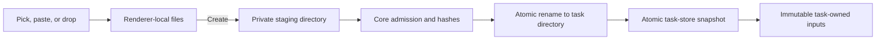

# Task Attachment and Design Reference Lifecycle

Date: 2026-07-11

Attachments are immutable task inputs or Design references. They are neither
provider artifacts nor repository files. They never live in a Git worktree.

## Supported input

Task Monki accepts:

- PNG, JPEG, and still WebP images;
- UTF-8 text, Markdown, JSON, CSV, SQL, YAML, TOML, and XML; and
- allowlisted source-code and plaintext configuration extensions.

The filename allowlist rejects `.env` variants and common credential, private
key, package-registry credential, and service-account filenames even when their
contents are text. SVG is accepted only as UTF-8 text, not as an image input.

PDFs, Office documents, video, audio, archives, databases, and arbitrary
binaries are unsupported. Runtime-native generic file parts do not make an
unsupported format safe to parse; those formats still require a separately
secured extraction or rendering pipeline.

The renderer performs inexpensive filename and size checks. Before submission,
Chromium's native image decoder bounds dimensions and re-encodes images so
pixel-irrelevant metadata is not copied. Core remains authoritative for
admission and storage: it checks count, aggregate and per-file sizes, normalized
names, UTF-8, control bytes, image signatures and container structure,
still-image status, dimensions, media type, and SHA-256. Core does not perform a
second pixel decode; the trusted renderer and Electron clipboard path supply
native-decoder-normalized image bytes before core admission.

Limits are:

- 10 files and 20 MiB total per task;
- 10 MiB per image and 2 MiB per text file;
- 16 megapixels per selected image and 12 megapixels per native clipboard image;
- 32 staging batches and 100 MiB of staged bytes;
- 1 GiB of managed attachment storage; and
- a 50-MiB free-disk reserve.

## Composer and creation

Picked, pasted, and dropped files first remain in the renderer. The renderer
uses object URLs only for local previews. It revokes each URL when the file or
composer closes.

Pressing Create performs one bounded batch operation. Electron uses guarded IPC
with aggregate byte accounting. Browser development uses one authenticated JSON
request with an endpoint-specific limit that includes base64 overhead. Core
validates the entire batch and removes the staging directory if any member
fails.


```mermaid
flowchart LR
  Input["Pick, paste, or drop"] --> Local["Renderer-local files"]
  Local -->|"Create"| Stage["Private staging directory"]
  Stage --> Validate["Core admission and hashes"]
  Validate --> Rename["Atomic rename to task directory"]
  Rename --> Store["Atomic task-store snapshot"]
  Store --> Task["Immutable task-owned inputs"]
```

The renderer uses one task-creation token for retries. A response lost after a
durable create resolves to the existing task. The staged batch is retained only
for that unchanged ambiguous retry. Ordinary validation or create failures
discard it.

Blank Design creation uses the same staging and retry rules. One store
publication adopts the files and creates the Design, active references, and
seeded first turn. That first turn selects all initial references.

## Design messages and drafts

The same attachment composer is available for every Design message. This
includes later refinements, queued messages, and reopened conversations.

An unsent Design draft stores its text, selected existing reference ids, and
one attachment staging id. File bytes remain in the existing staging store.
The draft file does not copy attachment metadata or file bytes.

Task Monki keeps only staging that a valid Design draft owns during startup.
It verifies the retained manifest and each file. It removes all other staging.
One staging id cannot belong to two Design drafts.

If a durable Design turn already owns the staging id, startup removes the stale
composer draft and its remaining staging. This covers a stop after turn
publication but before the renderer clears the sent draft.

A Design send first saves the current draft. One store publication then adopts
new files, creates active references, and creates the message turn. The turn
stores the exact existing and new references for that message.

The next message starts with no selected references. It does not inherit old
references. A user can select an active reference again in the Files drawer.

Each send uses one stable message id and the same staging id for an unchanged
retry. A confirmed retry returns the stored turn. A failed publication keeps
the private staging data and does not publish partial message state.

## Storage

Managed files live under the Task Monki data root:

```text
attachments/
  staging/<draft-id>/
  tasks/<task-id>/<attachment-id>.<safe-extension>
```

Directories are `0700`, staging manifests and task state are `0600`, and
immutable attachment files are `0400` on POSIX. Node does not provide equivalent
owner/group/other mode enforcement on Windows, and Task Monki does not treat
Windows `chmod` as an ACL boundary. Packaged Windows storage instead lives under
the app's per-user data directory and inherits that managed root's Windows ACLs.
This protects the normal per-user installation boundary but does not protect
against another process running as the same OS user or against a user who has
weakened the inherited ACLs. Names use opaque ids; original absolute paths are
never stored. Durable records contain task id, attachment id, ordinal, display
name, kind, media type, byte count, SHA-256, and creation time. The storage path
is derived internally and is absent from snapshots, events, API responses, and
submission evidence.

File data is flushed before publication on every platform. Directory metadata
is also synchronized on POSIX filesystems that support directory `fsync`.
Node's directory-handle synchronization is unsupported on Windows, so Windows
keeps the atomic temporary-write/link-or-rename publication boundary without
claiming the additional POSIX directory-flush guarantee.

Store shutdown stops admitting attachment operations synchronously, drains
every operation already admitted, closes the attachment store, and only then
releases the application-wide store lease. A caller cannot begin attachment I/O
against a closing or closed store.

Task and blank Design creation verify the staging directory. They atomically
rename it to the task id, then synchronize both parent directories before
publishing `store.json`. A synchronization or store-publication failure renames
the directory back. It synchronizes that rollback before reporting a retry-safe
failure. If rollback cannot be proven, adoption fails explicitly as ambiguous.
It must not be retried automatically. If final manifest cleanup is interrupted,
startup verifies the task-owned files and removes the stale manifest. Startup
also removes an adopted directory that has no durable task record.

The attachment store contains only task-owned records and one blob authority.
Its complete current durable shape is validated before records are published
to the task store.

Fork alternatives receive independent task-owned copies. This intentionally
avoids shared-reference accounting and garbage collection at the small bounded
attachment sizes. Archiving retains attachments. Deleting a task publishes the
record deletion first, then removes only that task's directory; startup removes
an orphan left by interrupted cleanup. Deletion is not secure erasure.

## Run, reload, review, and debugging

Normal task runs reuse all immutable task-owned files. Each Design turn uses
only its stored reference selection. The first turn selects the references
adopted during Design creation.

A Codex thread cannot replace its active permission-profile identity during
resume. If a Design turn changes the exact reference selection, Task Monki
forks the existing provider thread with a new attested profile. The provider
history continues, but the new thread can read only the current turn's selected
managed files. The same Task Monki primary session owns the new provider thread.
Task Monki unsubscribes the replaced thread so the App Server can unload it.
An unchanged selection resumes the current thread without a fork.

Core reopens files with no-follow semantics immediately before provider
delivery. It verifies managed-root containment, regular-file and non-symlink
status, stable file identity, byte count, and SHA-256. It also verifies
current-user ownership and the exact private mode on POSIX. Windows retains the
path, regular-file and non-symlink checks exposed by Node, stable file identity,
size, and hash checks. It relies on the inherited per-user ACL boundary
described above. No run cache or second physical representation exists.

Delivery is selected by the owning runtime:

- Codex sends supported images as `localImage` and lists text-like files by
  exact managed read-only path in an untrusted-data prompt manifest.
- Other runtimes must advertise and negotiate the required content type before
  the composer enables attachments.

OpenCode native file parts are intentionally not a Task Monki managed delivery
mode. Its provider, plugin, MCP, and tool execution share a credential-bearing
process without an attested network or filesystem confinement boundary.
Task Monki therefore reports attachment delivery as unsupported for OpenCode
and rejects attachments before starting or mutating provider state.

The selected model must report image support whenever images are present.

After the owning runtime acknowledges a turn, Task Monki records path-free submission
evidence: attachment id, ordinal, kind, media type, size, hash, submission mode,
verification time, provider turn id, and submission time. This proves what Task
Monki submitted, not that the model read or used it. Raw protocol journals can
still contain provider-visible paths and belong only in Debug.

Submission modes are truthful transport evidence: `localImage` for a native
image input, `prompt-file-reference` for a managed path described in text, and
`nativeFile` only for a future runtime whose native file-part boundary is
explicitly supported and attested. OpenCode does not produce `nativeFile`
submission evidence.

## Confidentiality boundary

An attached task or Design requires a runtime-supported restricted execution
mode. Full access remains available for attachment-free tasks. Task Monki
rejects full access when attachments are present. Network is forced off. Codex
also attests a complete permission profile. It contains only the runtime
minimum, exact worktree, and exact verified files. Other runtimes must enforce
and document their native tool and permission boundaries.

For Codex submission, web search, external MCP servers, and apps must also all
be disabled. Filesystem read rules do not
confine a same-user MCP process and do not prevent an allowed network tool from
transmitting content. This restriction is fail-closed until Task Monki has a
stronger external-tool isolation or explicit trust model.

The development API remains loopback-only and uses an Origin/Host/Fetch-Metadata
boundary plus a private rotating token held by the Vite proxy. It has strict
content types, body/header/time limits, bounded attachment concurrency,
structured path-free errors, `no-store`, and `nosniff`. Packaged Electron uses
context isolation, renderer sandboxing, disabled Node integration, typed IPC,
main-frame sender checks, and navigation, popup, webview, and permission guards.
No attachment surface accepts an arbitrary filesystem path or exposes a generic
App Server bridge.

These controls do not protect against compromise of the trusted renderer or a
different malicious process already running as the same OS user.

## Portability and retention

Managed copies make tasks independent of their selected source files. A backup
or export must keep `store.json` and `attachments/tasks` together while Task
Monki is closed. It must also keep Design draft files and their owned staging
together. Other staging is disposable and is removed on restart. Task
attachments last for the task lifetime.

Runtime conversation history and Task Monki protocol journals may retain image
bytes, managed paths, hashes, or derived discussion after local task deletion.
Journal data remains only until its bounded per-server segment retention prunes
it; a pruned raw-message reference fails closed. Task Monki must not claim that
deleting its task directory erases provider history. Task deletion unsubscribes
the current live Codex thread but does not delete its stored provider history.
