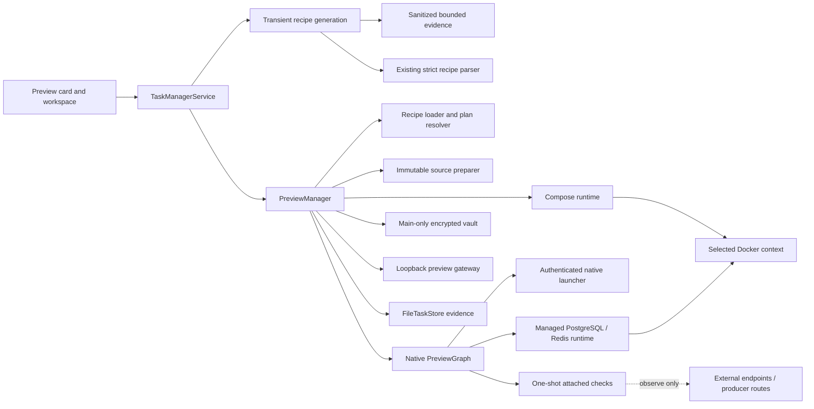

# Preview Architecture

Date: 2026-07-14

This document is the canonical technical description of Task Monki Preview as
implemented today. For repository authors and users, read the
[Preview Guide](../PREVIEW_GUIDE.md). The implementation, especially
[`src/shared/preview.ts`](../../src/shared/preview.ts) and
[`PreviewRecipeLoader.ts`](../../src/core/preview/PreviewRecipeLoader.ts), is
the final authority when this document and code differ.

## Purpose and scope

Preview turns one approved repository recipe into a locally reachable
application while Task Monki retains independent evidence for what source,
capabilities, processes, containers, routes, dependencies, and cleanup
authority were used.

The current implementation includes:

- review-first agent assistance for authoring a missing repository recipe;
- a restricted versioned recipe and explicit capability approval;
- immutable source captures and evidence-bearing application generations;
- native jobs, services, workers, routes, readiness, liveness, restart, and
  replacement;
- preview-owned PostgreSQL and Redis resources with setup scenarios and
  destructive reset;
- encrypted private inputs and non-owned HTTP, TCP, PostgreSQL, and Redis
  attachments, including another task's preview route;
- a conservative adapter for an existing repository Compose application.

Preview is intentionally not a universal development-environment system. An
agent may propose evidence-backed authoring configuration, but Task Monki does
not silently infer or execute it. Preview does not adopt surviving runtime objects,
compose multiple repositories, start producer tasks automatically, or provide
a generic dependency/plugin framework.

## Authority boundaries

Task Monki remains authoritative for the complete Preview control plane:

- recipe parsing, plan resolution, approval, source capture, and generation
  state;
- exact native process, captured workspace, gateway route, managed OCI object,
  and Compose project identity;
- startup/readiness evidence, bounded logs, replacement, cancellation,
  shutdown, reconciliation, and cleanup results;
- public local attachment bindings and encrypted private-input revision
  retention.

Subprocess output is telemetry, not authority. Docker and Compose report object
state, but Task Monki decides whether the observed identity matches the exact
recorded authority before it mutates anything.

External attachment targets remain authoritative for themselves. Task Monki
may resolve a public endpoint, deliver it to a declared recipient, or perform a
single bounded check. It never creates, starts, stops, resets, deletes, adopts,
migrates, configures, or reconciles an attached target.

The current boundaries are:



Preview state never changes `Task.workflowPhase` and never replaces Git,
GitHub, local-test, or provider authority.

## Two execution adapters

Every plan resolves to exactly one adapter.

### Native adapter

The native adapter is Task Monki's own execution graph. Application jobs,
services, and workers run as local processes from an immutable captured
workspace. PostgreSQL and Redis may run as preview-owned OCI resources. Public
attachments and encrypted private inputs may be delivered to explicitly named
recipients.

Native replacement uses distinct application generations. A candidate can be
prepared and checked while the old active generation continues serving stable
routes. Managed data has a longer, task-preview lifetime and is referenced by
multiple generations rather than recreated on every source change.

### Compose adapter

The Compose adapter operates one existing repository Compose application as a
stable, task-scoped project. Compose remains authoritative for file merge,
profiles, interpolation, service dependencies, and normalized configuration;
Task Monki adds conservative inspection, approval, loopback publication,
readiness, routing, exact project ownership, and cleanup.

A Compose recipe cannot mix native nodes, managed resources, attachments, or
Task Monki private inputs. Replacement is serialized against the same project,
so there is an explicit route-downtime window after activation starts. Task
Monki never claims ready-before-cutover rollback for Compose.

## Recipe, resolution, and approval

The only repository entry point is `.taskmonki/preview.yaml` with `version: 1`.
The loader accepts a bounded regular file inside the worktree, uses YAML's core
schema, and rejects duplicate keys, aliases, anchors, merge keys, custom tags,
non-string mapping keys, unknown fields, unbounded commands, escaping paths,
invalid references, graph cycles, and unsupported mixed authority.

When that file is missing, a separate main-process authoring workflow may
prepare a transient agent draft from sanitized bounded evidence. The complete
YAML and structured generation report stay reviewable until explicit
acceptance. Acceptance exclusively creates only the recipe and then returns to
this same loader/resolver path; it cannot approve or start Preview. Agent
generation has no durable task-store record and no parallel parser or runtime
lifecycle. See [Preview Recipe Generation](PREVIEW_RECIPE_GENERATION.md).

For the bounded Next.js/npm profile, trusted authoring facts include a safely
reduced root lockfile record. A compatible draft must declare one exact generic
`npm ci` job and an explicit success edge before using the repository script or
local Next.js binary. Generated commands cannot acquire missing packages
implicitly. These are ordinary recipe jobs and graph edges, so they remain
visible approval authority rather than becoming a second dependency lifecycle.

Parsing produces two hashes:

- `recipeDigest` identifies the normalized source recipe;
- `executionDigest` identifies the selected scenario's execution authority.

The plan resolver then adds authority that cannot safely come from YAML:

- task-local public attachment targets;
- the selected Docker context and exact engine capability when OCI is needed;
- a sanitized, two-pass Compose inspection and trust/config digests.

The resulting `PreviewPlanRecord` is immutable. It includes commands, working
directories, dependencies, recipients, public targets, routes, probes,
restart/overlap policy, images, limits, engine identity, source input classes,
and exact cleanup scope. Labels do not affect approval.

Approval is task-scoped and keyed by the final execution digest. A changed
authority requires review and a new approval. Ordinary source changes,
generated ports, generated managed credentials, private-value presence or
rotation, dynamic gateway authority, and a producer generation changing behind
the same task/route identity do not.

Private values may be missing while a plan is resolved and approved. Missing,
locked, corrupt, or unavailable protected values are execution-readiness
blockers checked before source capture, generation persistence, native launch,
or OCI mutation.

## Source capture and generations

[`PreviewSourcePreparer`](../../src/core/preview/PreviewSourcePreparer.ts)
captures tracked and non-ignored untracked repository content into a private
generation workspace outside the task worktree. It records Git HEAD, dirty
fingerprint, a bounded source manifest, file modes and hashes, and a workspace
ownership marker. Absolute or escaping symlinks, submodules, special files,
oversized inputs, or source changes during capture fail safely.

Ignored dependency directories such as `node_modules` are never copied from
the live worktree. An approved generic installation job may create them inside
the captured generation workspace. The job runs once for that generation,
before explicit consumers, and the generated files share the generation's
exact cleanup boundary.

A `PreviewGenerationRecord` is immutable execution evidence plus a state
machine. It binds:

- task, iteration, worktree, plan, approval, adapter, and execution digest;
- source Git evidence, manifest artifact, and captured workspace;
- candidate/active/retired routing state;
- stable routes and their current attachment state;
- one-shot attachment readiness evidence;
- failure, cleanup, freshness, replacement, and timestamps.

Application generations change with source. Preview-owned managed data does
not. The relationship is:

```text
Task preview
  ├── managed environment and network
  ├── managed PostgreSQL / Redis resources
  ├── native generation A1 -> attachment records
  └── native generation A2 -> attachment records
```

Generation history is bounded. Plans referenced by retained generations remain
available so historical authority is not reinterpreted.

## Native graph and process ownership

[`PreviewGraph`](../../src/core/preview/PreviewGraph.ts) builds one acyclic graph
from the selected scenario's jobs and resources plus all services, workers, and
active attachments.

- Jobs are finite commands. Generic jobs always participate; migration and seed
  jobs are scenario-selected.
- Lockfile-backed dependency installation, when present, is one generic job
  with explicit `needs: succeeded` consumers; the runtime does not infer or add
  installation outside the approved recipe.
- Services are long-running, have at least one generated loopback port, and
  require readiness.
- Workers are long-running and may have zero ports. They are exclusive across
  replacement unless `overlap: safe` is approved.
- `needs: succeeded` waits for a job.
- `needs: ready` waits for a service, worker, managed resource, or attachment
  that can establish readiness.

Native commands run as the local user and are not an OS sandbox. They receive a
minimal inherited environment, declared literals/references, and generated
ports. The authenticated launcher records command digests, ownership tokens,
launcher and target process identities, receipts, and process groups. Cleanup
requires those exact identities; a PID or command name alone is insufficient.

Each node attempt owns bounded stdout and stderr artifacts. The renderer reads
one attempt/stream through range reads while the log dock is open; normal task
snapshot refresh is not a log transport.

## Readiness, liveness, restart, and overlap

Native readiness can be HTTP, TCP, or an argv probe. HTTP/TCP probes reference
a declared generated port. Argv probes have their own declared environment and
do not inherit the owning node's full environment.

Liveness is optional and continuous only for a native node. It reuses the same
probe forms with an interval and failure threshold. Bounded restart policy may
be `never`, `on-failure`, or `always`; attempts and backoff are capped. Restart
reuses the generation's exact bindings and does not rerun setup or attachment
checks.

Readiness is required before a candidate can become active. Critical-node exit
or failed liveness after readiness fails and detaches the complete active
application; Task Monki does not advertise partial subgraph availability.

During native replacement:

1. prepare and start the candidate's safe-overlap portion;
2. resolve bindings and complete all readiness needed before an exclusive
   handoff;
3. stop verified old exclusive workers;
4. start and check candidate exclusive workers;
5. atomically replace gateway routes and generation routing records;
6. retire and clean the old application generation.

If the candidate fails before cutover, the old active route remains. If an
exclusive handoff already happened, Task Monki uses the existing bounded old
graph restoration path; it never reports the old application healthy without
verification.

## Stable routes and gateway

[`PreviewGateway`](../../src/core/preview/PreviewGateway.ts) binds only
`127.0.0.1` on a high local port. Routes use stable hostnames of the form
`tm-<route-identity>.localhost`, with exactly one label before `.localhost`.
One centralized, versioned derivation hashes the stable task and route IDs into
a bounded DNS label. Generation, process, workspace, and gateway-port identity
are excluded, so replacement generations retain one truthful browser,
application, HTTP, and WebSocket origin. The gateway accepts only this exact
Task Monki hostname shape, records the generation that owns it, and forwards
traffic only to recorded loopback ports.

Native route replacement is atomic inside the gateway. A target that is absent
returns a bounded 503/502 response. Startup, stop, failure, shutdown, and
restart reconciliation detach owned routes before claiming the application is
unavailable. A preferred gateway port may relocate when occupied; dynamic port
choice is not approval authority.

## Preview-owned PostgreSQL and Redis

The native adapter supports typed PostgreSQL and Redis resources on the
selected Docker-compatible context. One managed environment record owns the
preview network. Each resource record owns one exact container and one exact
volume plus non-secret binding identity, setup/health state, and cleanup
authority. Generation attachment records explain which generation consumed a
resource without transferring ownership.

All published resource ports bind to `127.0.0.1`. Object names are diagnostic;
mutation requires the recorded engine identity, exact object ID/name, exact
reserved labels, and ownership marker digest. Images are not owned. The
runtime never prunes images or build cache.

Resource credentials are volatile main-process credentials:

- only the verified `postgres:17-alpine` and `redis:7-alpine` entrypoint
  contracts are accepted;
- PostgreSQL and Redis receive the password once through a bounded Docker stdin
  attachment while their entrypoint reads a single line;
- the attachment is raced with authenticated readiness, then terminated and
  joined on success, failure, cancellation, or shutdown;
- authenticated PostgreSQL `SELECT 1` and Redis `PING` checks use the published
  loopback endpoints and the in-memory credential;
- values and generated connection URLs are delivered only to declared native
  recipients and are redacted from managed output;
- values are not stored in `FileTaskStore`, plans, approvals, renderer state,
  events, general IPC, host files, Docker argv/configured environment, bind
  mounts, logs, or inspection data.

There is no file, environment-value, argv, shell-interpolation, or tmpfs
fallback. A Task Monki main-process restart cannot adopt surviving managed
resources because their credentials are no longer available; restart
reconciliation cleans verified owners instead.

Migration and seed setup is tied to resource creation, not application source
replacement. Initial creation or explicit reset may run approved setup.
Ordinary A1 -> A2 replacement reuses the resource and does not rerun it.

Managed resource health has a bounded task-owned supervisor after readiness.
Required resource death fails/detaches the consumer application but preserves
the volume. It does not authorize data deletion.

## Attached dependencies and public bindings

Attachments use one model for literal endpoints and task-local public targets:

- HTTP endpoint or another task's stable preview route;
- TCP endpoint;
- PostgreSQL endpoint with optional private password;
- Redis endpoint with optional private password.

A literal `target: endpoint` is repository authority. A `target: local`
declaration is a public configuration slot stored as a
`PreviewLocalAttachmentBindingRecord`. Active local slots must resolve before a
plan exists because the public capability and approval authority would
otherwise be unknown. An HTTP slot may bind to `{targetTaskId, routeId,
basePath}`; TCP/PostgreSQL/Redis slots accept only their matching endpoint
shape. Self-bindings are rejected.

Missing local slots return execution-derived configuration requirements rather
than a generic resolver error. Each requirement identifies the selected
scenario and exact active process, readiness-probe, liveness-probe, environment
key, or startup-check recipient. The desktop writes through the existing
task-scoped binding operation and re-resolves that same scenario; it does not
create a renderer-owned binding authority or bypass approval.

Cross-task identity deliberately excludes producer generation, process, port,
and worktree. Environment-only delivery derives the producer's stable preview
hostname even when its route is absent. Task Monki never starts the producer or
builds a cross-task lifecycle graph.

The route picker is based on declared current task plans, not running
generations. A stopped producer remains selectable; current availability is
display information and becomes authority only for an explicit readiness
check.

Attachment environment references do not imply availability checks. A check
runs only when an active node explicitly declares `needs: { attachment:
ready }`, and the attachment must declare a bounded check. HTTP uses a single
GET without redirects and discards the body; TCP connects; PostgreSQL runs
`SELECT 1`; Redis sends `PING`. Multiple dependents share one check promise per
generation.

Checks are startup observations, not ongoing health. After the generation is
ready, no attachment timer, socket, database client, Redis client, or listener
remains. Later target loss does not change the generation state or stop the
consumer. Attached targets are excluded from ownership records, reverse stop
order, reset, cleanup, shutdown mutation, and reconciliation.

Migration and seed jobs cannot use attachments. This prevents Task Monki's
explicit managed-data setup path from being aimed at a non-owned database or
cache.

## Private inputs and encrypted revisions

Private inputs are capability declarations, never values. A plan records the
logical input ID and exact node/probe/environment recipients. Plaintext,
ciphertext, hashes, revision IDs, presence, import source, and vault status are
excluded from plans and approval digests.

Production protection is currently macOS-only and main-process-only through
Electron `safeStorage`. Encryption must be available after Electron is ready.
There is no plaintext, machine-key, password-derived, Linux `basic_text`, argv,
or temporary-host-file fallback. Public-only previews continue to work when
protection is unavailable; a private recipient is blocked before execution.

The renderer may transiently hold a manually typed value in an uncontrolled
password field. Submission uses purpose-specific trusted-frame IPC with no
read/export/decrypt operation. The field is cleared after the operation.
General task state, events, development HTTP, and normal renderer IPC never
carry the value.

Single-key `.env` import keeps the picker, path, bounded file read, and parser in
the trusted main process. The caller names one key before the picker opens. The
selected file must be a current-user-owned, no-follow regular file with safe
permissions and stable identity. The narrow parser supports a single physical
`KEY=VALUE` line, optional literal `export `, comments, whitespace, and matching
outer quotes. It does not evaluate shell syntax, interpolation, escapes,
continuations, or multiline values. Only the selected value is sealed. The
renderer receives no path, content, candidate key list, or plaintext.

The vault stores a private atomic index, its last-known-good backup, and one
immutable ciphertext blob per revision. Both index publications flush file and
directory metadata. On an interrupted primary publication, a validated backup
is restored. Missing indexes mean first use only when the private vault root is
empty; existing blobs or metadata instead require recovery and are preserved.
Current pointers, durable generation references, and memory-only leases prevent
collection while any live or cleanup-incomplete generation still needs a
revision. Rotation publishes a new current revision while old generations keep
their exact revision. Deletion removes the current pointer but does not
invalidate a live generation's retained revision.

A revision is collectible only when it is neither current, durably referenced,
nor leased. Generation references release only after every recipient process
and captured workspace is verified clean. `CLEANUP_INCOMPLETE` and
`RECOVERY_REQUIRED` retain encrypted material.

Vault cleanup debt does not make a runtime-cleaned task undeletable. Once the
task record is gone, stale vault metadata cannot resolve its inputs. Startup and
explicit retry sweeps reconcile task/generation authority and retry exact
orphan deletion. Unsafe ownership, symlinks, or corrupt index state fail secret
access closed and expose recovery status; cleanup never guesses ownership from
a broad prefix and does not need to decrypt ciphertext.

## Compose inspection and runtime

A Compose plan names explicit relative Compose files, one project directory,
profiles, root services, exposed target ports, bounded HTTP/TCP readiness, and
routes. Every routed service needs a declared Task Monki readiness check.

Before approval, the inspector:

1. pre-scans only enough YAML to bound host-read authority;
2. requires feature-probed `docker compose config --no-env-resolution`;
3. uses an empty explicit env file, `COMPOSE_DISABLE_ENV_FILE=1`, a clean helper
   environment, and explicit context/project/file/profile arguments;
4. runs structural and materialized normalized passes;
5. produces sanitized service/volume/network/input records and trust/config
   digests.

Repository `env_file` and file-backed secrets must be static, bounded,
non-symlink files contained by captured source. Their paths and recipient names
are approval authority, but their values are transient main-process data and
must not enter plans or general state. Task Monki vault values are never
delivered to Compose.

The adapter rejects unsupported broad authority, including source host ports,
bind mounts, environment-backed or external secrets, build secrets/SSH,
include/extends/provider, custom host namespaces, scaling/watch/restart policy,
privileged/device access, and interpolation outside supported service
environment values.

One `PreviewComposeProjectRecord` per task owns the selected engine, stable
project name, reserved marker, exact containers, owned networks, and active or
retained owned volumes. External networks and read-only external volumes are
recorded references and are never mutated.

Change classification has exactly three outcomes:

- `IN_PLACE_UPDATE` for compatible stateless changes;
- `RESTART_PRESERVE_DATA` when the project must restart but verified volumes
  remain compatible;
- `DESTRUCTIVE_RESET_REQUIRED` when data compatibility cannot be guaranteed.

Build and inspection happen while old routes remain attached. Immediately
before project mutation, routes detach. The runtime updates/restarts the stable
project, verifies Compose running/healthy state and Task Monki loopback
readiness, then reattaches routes. Failure after mutation cleans exact failed
containers, preserves verified volumes, and records recovery required; it does
not claim automatic restoration.

Removed owned volumes remain retained project data until explicit destructive
stop. Cleanup never uses `compose down -v`, `--remove-orphans`, project-name
prefix deletion, image pruning, or build-cache pruning. One bounded project
health watch detaches/fails the complete Compose application when a recorded
container stops or ownership becomes unverifiable, and it is canceled and
joined on stop/shutdown.

## Lifecycle flows

### Resolve and approve

1. Load and validate the recipe without executing it.
2. Select a scenario and resolve task-local public targets.
3. Probe OCI capability and inspect Compose when required.
4. save/reuse the immutable plan and match approval by execution digest.
5. derive live private-input readiness beside the plan.
6. show exact authority and advisories; approval still performs no execution.

### Start a native preview

1. Re-resolve and require matching approval.
2. Atomically acquire all required private revisions; fail with zero runtime
   effects if any is unavailable.
3. bind the generation's durable revision references.
4. capture and re-observe Git/source evidence.
5. ensure selected preview-owned resources and run setup only where required.
6. execute the native graph, one-shot attachment checks, and readiness.
7. attach stable routes and atomically commit candidate/active routing state.
8. start managed-resource supervision and retire the replaced application.

### Replace or update

Source changes produce a candidate under the current approved authority.
Native replacement preserves the old active route until cutover. Compose
replacement preserves routes through inspection/build, then has serialized
downtime during stable-project activation. A changed execution digest requires
approval before either path mutates runtime state.

### Cancel

Canceling startup aborts the candidate controller, joins graph work, stops
verified candidate processes/containers, releases ports and leases, removes the
captured workspace when exact ownership verifies, and preserves the old active
generation. If exact cleanup cannot be verified, state becomes
`CLEANUP_INCOMPLETE` rather than guessing.

### Retry setup

Retry Setup is available only for failed setup evidence when every selected
migration/seed job is explicitly `retrySafe: true`, the current plan and
approval still match, and exact resource authority verifies. It reuses the
same resource and data. Ambiguous or non-retry-safe completion is not replayed.

### Reset data

Reset is target-specific and destructive. Task Monki re-resolves and approves,
verifies the selected resource and engine, stops the complete active/failed
consumer application, deletes only that exact managed container/volume, then
starts a fresh generation that recreates and sets up it. If recreation fails,
the deleted data cannot be restored. Attached dependencies are never reset.

For Compose, a reset-required change is satisfied only by explicit **Stop
Preview & Delete Data**, followed by a fresh start; there is no partial Compose
volume reset action.

### Stop Preview & Delete Data

Stop is terminal for the current preview runtime and destructive for
Task-Monki-owned data. It cancels candidates, detaches routes, stops verified
native/Compose processes, deletes exact managed containers, active and retained
owned volumes, owned networks, and captured workspaces, and then records
terminal state. It leaves images, build cache, external Compose objects,
attachments, producer tasks, repository files, and user-owned `.env` files
unchanged.

### Shutdown

Shutdown first fences new work, aborts every startup, and joins initialization,
generation locks, graph operations, health watches, Compose watches, vault
work, and gateway sockets. It then applies the same exact cleanup authority as
stop. Any unverifiable residue is persisted and surfaced; shutdown does not
fall through to a broad kill or deletion path.

### Relaunch and crash recovery

Initialization clears routes, sweeps inaccessible vault debt, and runs
stop-only reconciliation. Recorded native receipts, workspaces, managed OCI
objects, and Compose projects are verified against exact identity and cleaned.
Nothing is adopted or restarted. Uncertainty becomes `CLEANUP_INCOMPLETE` or
`RECOVERY_REQUIRED`, preserving the evidence and data needed for a retry.

## Failure semantics

- Recipe, plan, approval, private-input, source, or engine preflight failure
  occurs before runtime mutation at that boundary.
- Native candidate failure cleans the candidate and preserves the old active
  generation unless an exclusive handoff requires verified restoration.
- Compose failure before activation preserves the current route/project;
  failure after activation leaves routes detached and verified volumes
  preserved.
- Setup failure distinguishes retry-safe evidence from ambiguous mutation.
- Managed resource loss fails the dependent application but preserves data.
- Attachment check failure uses candidate startup failure; post-ready
  attachment loss causes no Task Monki transition.
- Cleanup uncertainty never upgrades to success and never authorizes wider
  deletion.

## Exact ownership and cleanup rules

Every mutable runtime class has one owner and one cleanup path:

| Runtime object | Owner | Cleanup authority |
| --- | --- | --- |
| Native launcher/target | Generation resource receipt | Ownership token, command digest, process identity/group |
| Captured workspace | Generation | Store/task/generation ownership marker and exact path |
| Gateway route | Generation | Exact route hostname and generation ID |
| Managed network | Managed environment | Engine identity, object identity, reserved labels/digest |
| Managed container/volume | Managed resource | Engine, exact IDs/names, labels/digest |
| Compose project objects | Compose project | Engine, stable project, exact recorded objects and markers |
| Vault ciphertext revision | Private vault | Exact index entry, current/reference/lease reachability |
| Attached target | External owner | No Task Monki mutation authority |

Normal stop, failure cleanup, reset, shutdown, and restart reconciliation call
the same underlying identity-verification seams. No path searches by a guessed
name, label prefix, PID, port, or directory prefix and then assumes ownership.

## Security and non-leakage model

The security boundary is precise:

- repository recipes and plans contain public capability, never private
  values;
- the store and renderer may hold public endpoints, safe status, recipient
  identity, and readiness codes;
- plaintext private values exist transiently only during entry/import,
  protected decryption, recipient environment materialization, or an exact
  runtime lease;
- native delivery is recipient-scoped, and argv readiness/liveness probes have
  explicit independent environments;
- secrets are prohibited from durable store/snapshot, plans/approvals/digests,
  events, general IPC/dev HTTP, logs, errors, artifacts/receipts, source
  manifests, Docker/Compose argv and inspection, nonrecipient launcher
  messages, and general renderer state/DOM after submission;
- trusted authoring analysis may parse a bounded lockfile but exposes only
  fixed package-manager/version facts, never raw lockfile contents, resolved
  URLs, or unrelated dependency records;
- redaction covers raw and URL-encoded managed credentials at runtime.

Recipient scoping is a delivery guarantee, not an OS isolation guarantee.
Approved native code runs under the user's account and can use normal same-user
OS capabilities. Compose repository files may contain repository-owned
plaintext such as an `env_file`; Task Monki validates and limits its use but
does not convert it into a vault secret. Users must not place secrets directly
in `preview.yaml`.

## Durable records and schema

`FileTaskStore` schema 17 contains these Preview collections alongside
repository identities and saved views:

- `previewPlans` and `previewApprovals`;
- `previewGenerations`, `previewNodeAttempts`, and native `previewResources`;
- `previewManagedEnvironments`, `previewManagedResources`, and
  `previewGenerationAttachments`;
- `previewLocalBindings`;
- `previewComposeProjects`.

Logs and source manifests are bounded artifacts, not embedded snapshot text.
Private ciphertext and revision reachability live in a separate main-only vault
format, never in the task-store schema.

Only the complete current schema is accepted. Older Preview, attachment, and
repository/path schemas are unsupported and are neither migrated nor
reinterpreted; local data using an older schema must be discarded.

## Renderer model and user experience

The renderer consumes stored Task Monki projections, never raw runtime claims.
The Overview Preview card gives one status, stable primary route, recommended
action, and a Details entry. The full Preview workspace shows:

- status, scenario, primary/secondary actions, and a guarded overflow menu;
- approval-time execution topology, authority, advisories, and cleanup
  contract;
- application/setup attempt rows and bounded log dock;
- stable routes and active/candidate generation evidence;
- managed/Compose data identity and retention;
- public attachment targets and one-shot startup-check evidence;
- private-input readiness, exact recipient names, set/replace/import/delete
  controls, and hidden values;
- technical generation/resource evidence in secondary disclosures.

Destructive stop and reset use explicit confirmation text that distinguishes
Task-Monki-owned data from attached/external resources. Candidate cancellation
is separate from destructive stop and keeps the current active preview.

## Implementation map

| Concern | Source |
| --- | --- |
| Contracts and durable shapes | [`src/shared/preview.ts`](../../src/shared/preview.ts), [`src/shared/contracts.ts`](../../src/shared/contracts.ts) |
| Parser and approval digest | [`PreviewRecipeLoader.ts`](../../src/core/preview/PreviewRecipeLoader.ts), [`PreviewApprovalPolicy.ts`](../../src/core/preview/PreviewApprovalPolicy.ts) |
| Plan resolution | [`PreviewPlanResolver.ts`](../../src/core/preview/PreviewPlanResolver.ts) |
| Orchestration/lifecycle | [`PreviewManager.ts`](../../src/core/preview/PreviewManager.ts), [`PreviewGraph.ts`](../../src/core/preview/PreviewGraph.ts) |
| Source, gateway, reconciliation | [`PreviewSourcePreparer.ts`](../../src/core/preview/PreviewSourcePreparer.ts), [`PreviewGateway.ts`](../../src/core/preview/PreviewGateway.ts), [`PreviewReconciler.ts`](../../src/core/preview/PreviewReconciler.ts) |
| Native/managed/attached runtimes | [`src/core/preview/runtime`](../../src/core/preview/runtime) |
| Private inputs | [`src/core/preview/private`](../../src/core/preview/private) |
| Compose adapter | [`src/core/preview/compose`](../../src/core/preview/compose) |
| Storage and migrations | [`FileTaskStore.ts`](../../src/core/storage/FileTaskStore.ts) |
| Service/Electron boundary | [`TaskManagerService.ts`](../../src/core/app/TaskManagerService.ts), [`main.ts`](../../src/electron/main.ts), [`preload.ts`](../../src/electron/preload.ts) |
| Renderer projection and UI | [`preview.ts`](../../src/renderer/model/preview.ts), [`PreviewPanel.tsx`](../../src/renderer/ui/PreviewPanel.tsx) |

## Verification expectations

Changes to Preview require focused coverage for the affected parser, planning,
approval, manager/graph, runtime, storage, and renderer seams, followed by the
repository's full verification commands:

```sh
npm run typecheck
npm test
npm run build
npm run check:codex-protocol
git diff --check
```

Mocks do not prove process identity, Keychain relaunch, authenticated database
behavior, Docker context identity, Compose cleanup, or plaintext absence. Use
the opt-in packaged launcher and `safeStorage` relaunch verifiers plus the
managed-credential and real-Compose matrices for those boundaries.

The recorded Compose release gate passed on Docker Desktop 4.81.0 with Engine
29.6.1 (API 1.55), Compose 5.2.0, and Linux arm64. It covered initial start,
data-preserving update/restart, explicit reset with a new volume identity,
readiness failure/retry, cancellation before and after activation, exact
cleanup, external-resource noninterference, loopback publication, and zero
reserved-label residue. Broader context/platform support requires equivalent
evidence rather than inference from CLI compatibility.

## Current limitations and deferred work

- Private-input protection is production-supported only on macOS with
  available Electron `safeStorage`.
- The desktop workspace displays task-local attachment bindings but does not
  yet provide a general public-target editor. Literal endpoints are configured
  in the recipe; task-local binding operations exist on the trusted service
  API for integrated clients.
- Managed PostgreSQL/Redis credentials are volatile. Durable adoption and a
  managed-container restart after main-process loss are not implemented;
  stop-only reconciliation cleans verified owners instead.
- Native process ownership and OCI support are validated primarily on the
  current macOS support matrix; broader Windows/Linux and alternative-engine
  claims require their own evidence.
- Attached dependencies have startup-only checks, never continuous health.
- Agent-generated dependency preparation currently supports only a root npm
  project with a safely validated `package-lock.json`; other package managers,
  ambiguous lockfiles, and unproven custom setup remain fail-closed.
- Compose has serialized activation rather than ready-before-cutover, cannot
  receive Task Monki vault values, and intentionally rejects broad Compose
  authority.
- Multi-repository source composition, automatic producer startup, generic OCI
  resources, stronger native sandboxes, idle suspension/retention policy, and
  AI-assisted recipe discovery are deferred.

These limitations may be addressed by later bounded capabilities. They must not
create a second lifecycle, weaken approval, transfer attachment ownership, or
replace exact cleanup authority.

## Invariants for future changes

1. Preview remains independent of task workflow and provider telemetry.
2. Nothing executes before a matching capability approval.
3. Start uses immutable captured source and re-observed Git evidence.
4. Application generations and persistent preview-owned data keep separate
   lifetimes.
5. Stable routes attach only to verified ready targets.
6. Private values never enter public/durable authority surfaces.
7. Attached targets remain strictly non-owned.
8. Cleanup mutates only exact verified owners and records uncertainty.
9. Cancellation and shutdown join all owned work and leave no orphaned timer,
   listener, socket, process, or restart path.
10. New adapters reuse the plan, approval, generation, evidence, routing, and
    cleanup model instead of inventing parallel authority.
