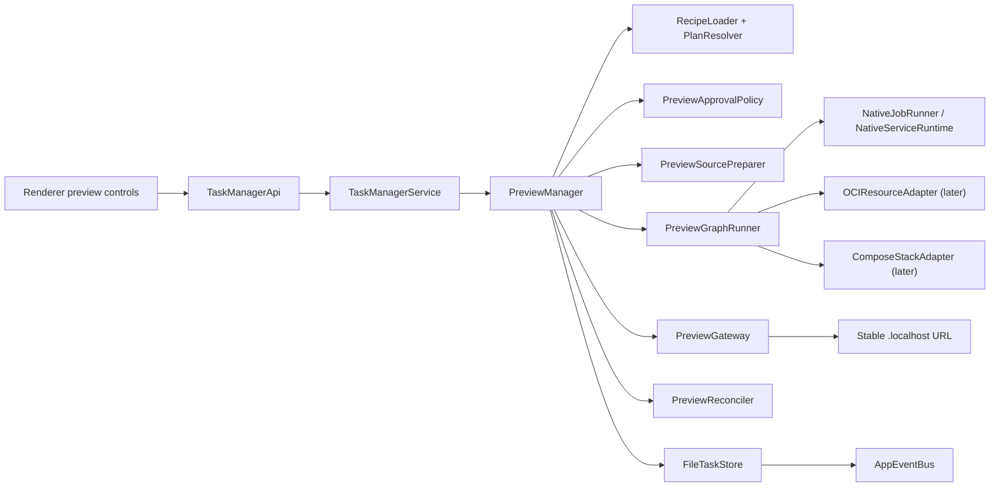

# Task Monki local preview implementation plan

Status: Phase 0 and Phase 1 complete; Phase 2/3 prototype code exists, but the Phase 3 managed-data lifecycle is approved for replacement before shipping
Date: 2026-07-12
Technical direction: [`../private/task-preview-local-execution-architecture.md`](../private/task-preview-local-execution-architecture.md)

## Recommendation

Build preview as a new Task Monki-owned domain beside agent runs, Git evidence, and GitHub delivery—not as a special Codex turn, renderer feature, or external sidecar product.

The first product milestone should run a **single-repository native preview graph** containing finite preparation jobs and one routed web service. It must already use the durable generation, approval, source-manifest, resource-ledger, readiness, gateway, and reconciliation foundations that later phases extend. It should intentionally omit managed databases, secrets, Compose, and multiple repositories until those foundations survive failure testing.

The first user-visible loop is:

```text
Completed task
  → resolve .taskmonki/preview.yaml without executing it
  → show and approve its canonical plan
  → capture current Git evidence
  → prepare a content-identified source copy outside the worktree
  → run preparation jobs in that copy
  → start one native web service on a dynamic loopback port
  → pass an HTTP readiness check
  → route a stable .localhost URL to it
  → open, stop, and clean up only recorded resources
```

This milestone is deliberately smaller than the technical report's suggested “native plus PostgreSQL/Redis” first implementation. The repository already has safe worktree and evidence primitives, but it does not yet have durable native-process ownership, a source-copy mechanism, a recipe parser, a proxy, or preview records. Adding a container control plane at the same time would make failures impossible to attribute and would not test the hardest existing-code integration seams first.

## 1. What exists in Task Monki today

### 1.1 Application control plane

`src/core/app/TaskManagerService.ts` is the application service behind both Electron IPC and the development HTTP API. It owns:

- task-scoped action serialization through `withTaskAction`;
- repository validation and worktree preparation;
- agent orchestration;
- Git and GitHub evidence actions;
- task workflow guards;
- the in-memory `AppEventBus` used to notify renderer clients.

This is the correct public orchestration boundary for preview actions. The renderer should call typed `TaskManagerApi` methods; it should never load recipes, spawn processes, inspect Docker, or allocate ports.

Important behavior for preview:

- The service can prevent a preview source capture from racing another Task Monki action on the same task.
- A task action lock is held only in memory. It is not a durable job queue or lease.
- Long-running preview services must not hold this lock for their entire lifetime.
- Agent work can safely continue after a preview generation has captured its own source copy; that should make the existing generation stale, not mutate it.
- `shutdown()` currently stops only the agent provider. Preview shutdown must be added explicitly.

### 1.2 Task and worktree lifecycle

`src/core/worktree/WorktreeService.ts` already provides the correct task source anchor:

- a task-specific branch and worktree path;
- exact canonical-path verification against `git worktree list`;
- safe refusal to remove the original repository;
- refusal to remove dirty or locked worktrees;
- a durable `WorktreeRecord` tied to task and iteration.

Preview should reuse the current `WorktreeRecord`; it should not create a second Git worktree for the same task. A preview generation copies the intended current task source out of that worktree into a private preview root.

The task worktree remains editable and continues to be the implementation source of truth. The preview copy is an execution input/output workspace whose **initial manifest** is immutable evidence, even if install/build commands later write caches or generated files inside the copy.

### 1.3 Git snapshots and dirty state

`src/core/git/GitSnapshotService.ts` records:

- HEAD, branch, base, upstream, and divergence;
- staged, unstaged, untracked, and conflict counts;
- committed and working diff evidence;
- a `dirtyFingerprint` covering status, staged/unstaged binary diffs, and untracked file content up to a size threshold.

This is the right attribution link for a preview generation, but it is not a source-export implementation:

- ignored files are intentionally absent;
- large untracked files use metadata rather than full content in the dirty fingerprint;
- it does not copy files;
- it does not prove that a long filesystem copy observed one coherent instant;
- there is no repository filesystem watcher, so external edits are not observed until evidence refresh.

Every generation should therefore reference a `GitSnapshotRecord` **and** its own complete source manifest. A start operation must detect changes during preparation and fail/retry rather than claim that a mixed copy is coherent.

### 1.4 Process supervision

`src/core/process/ProcessSupervisor.ts` is a useful primitive:

- explicit executable, argv, cwd, stdin, and environment;
- separate stdout/stderr events;
- portable Windows batch-file launch through `portableChildProcess.ts`;
- a detached process group on non-Windows;
- SIGINT → SIGTERM → SIGKILL cancellation.

It is not yet a durable preview runtime:

- child handles exist only in memory;
- no process start fingerprint or ownership token is persisted;
- no inspect/adopt/reconcile operation exists;
- no bounded log handling exists;
- no restart or readiness policy exists;
- the spawn-to-ledger-write interval can leave an unrecorded child if the app dies;
- the generic environment sanitizer was designed for Codex, not application recipes.

Preview should extend these primitives through a dedicated `NativePreviewRuntime`; it should not change Codex process semantics or make `ProcessSupervisor` itself know about preview records. Phase 0 proved that the runtime also needs a small Task Monki-owned launcher handshake between the main process and each native node; direct `ProcessSupervisor.start()` cannot close the spawn-before-ledger crash window by itself.

### 1.5 Persistence and recovery

`src/core/storage/FileTaskStore.ts` is the durable Task Monki store:

- schema version 9;
- atomic `store.json.tmp` → `store.json` writes;
- mode-0600 store and artifact files;
- serialized writes;
- direct record updates plus appended domain events;
- load-time normalization/repair for selected provider states;
- a tested schema-8-to-9 migration;
- task deletion that explicitly removes task-owned records and artifact files.

Preview records belong here because Task Monki is authoritative for them. A separate preview JSON store would introduce non-atomic cross-store transitions and a second task ownership model.

The store has two constraints to preserve:

1. `TaskSnapshot` is sent to the renderer as one large snapshot. Keep preview summaries and ledgers compact; put logs and large manifests in artifacts/private files.
2. The current loader rejects unknown schema versions. Adding preview collections requires a tested schema 9 → 10 migration that supplies empty collections and preserves every existing task record.

### 1.6 Domain events and renderer updates

`src/core/runner/AppEventBus.ts` carries typed `AppUpdateEvent`s. The renderer subscribes in `src/renderer/ui/App.tsx` and currently reloads the complete `TaskSnapshot` on every event. The development server mirrors updates over SSE.

Preview lifecycle transitions should use this path, but process output must not become one domain event per chunk. Otherwise a noisy dev server would repeatedly reload the entire application state.

The first milestone should:

- persist consequential preview domain events;
- store bounded output in artifact files;
- emit `preview.updated` only for state/readiness changes and throttled log-cursor changes;
- let the renderer read a log artifact explicitly;
- leave a later optimization for partial snapshot queries if measurement shows the full refresh is too expensive.

Preview lifecycle must remain orthogonal to `Task.workflowPhase`. Starting or failing a preview does not move a task into `IN_PROGRESS`, `REVIEW`, or `BLOCKED`. Preview status is a separate projection derived from preview records/events.

### 1.7 Electron and development API boundaries

The desktop boundary is well-defined:

```text
Renderer (sandboxed, no Node)
  → TaskManagerApi
  → preload IPC bridge
  → TaskManagerService in Electron main
```

The same service is exposed by `src/dev/server.ts` and `src/renderer/api/taskManagerClient.ts` for development.

Every preview operation must be added to all four contracts/transport implementations. Recipe and process authority remains in core/main. The renderer receives normalized records, never a filesystem path it can execute.

`OpenTargetService` validates and opens recorded filesystem paths. It should not be overloaded for preview URLs. Add a small main-process URL opener that accepts a preview route identity, re-reads the current ready route from the store/manager, verifies it is a Task Monki loopback URL, and then calls Electron `shell.openExternal`. The renderer must not submit an arbitrary URL to the main process.

The development HTTP API is a testing/development surface with permissive CORS. It must not be reused as the preview gateway or exposed to preview applications.

### 1.8 Current security boundaries and missing capabilities

Existing relevant protections:

- context-isolated, sandboxed renderer;
- canonical path checks for worktree file actions;
- explicit argv-based child process launch;
- allowlisted Codex environment;
- mode-0600 stores, journals, and artifacts;
- explicit command/permission approval policies for provider interactions;
- secret provider input is disabled because there is no safe secret channel.

Missing preview capabilities:

- no YAML parser or preview schema;
- no native application approval record;
- no private secret store;
- no source preparation service;
- no preview runtime root or ownership markers;
- no readiness probes or port allocator;
- no local reverse proxy;
- no OCI/Compose adapter;
- no repository watcher or automatic preview freshness observation;
- no preview seed scenarios.

These absences determine the phase order.

### 1.9 Repository and workspace abstractions

Repository selection and task ownership are intentionally different today:

- `Task.repositoryPath` is the durable repository binding for the task.
- `Task.currentWorktreeId` / `Task.currentIterationId` select the actual isolated source.
- `AppSettingsStore.repositories.selectedPath` is only the current sidebar/UI context.
- `knownPaths` is a user preference/catalog, not authority to read or execute any path for a task.
- Worktree roots are configurable and currently default to a temporary directory; product preview runtime should instead receive an explicit durable root from Electron/dev composition.

Preview must always resolve the primary source through the task and verified current worktree. Switching the sidebar repository must not retarget a preview. Later multi-repository resolution may use registered repository paths as candidate local caches, but it must match repository identity and resolve an exact revision before use; a selected path alone is insufficient.

## 2. Reuse, extend, and avoid

### Reuse unchanged where possible

| Existing component | Use in preview |
|---|---|
| `WorktreeRecord` / `WorktreeService.verify` | Identify and verify the task source before resolving or capturing a generation. |
| `GitSnapshotService` | Bind the generation to HEAD/dirty evidence and observe later staleness. |
| `portableChildProcess` | Preserve Windows `.cmd`/`.bat` launch behavior for native commands. |
| `ProcessSupervisor` cancellation semantics | Reuse its signal-escalation behavior inside the native launcher/runtime; do not directly spawn a committed preview node from main. |
| `FileTaskStore` write queue and artifact handling | Persist compact preview records and bounded logs/manifests. |
| `AppEventBus` | Notify state changes through the existing renderer/dev-server path. |
| `TaskManagerService.withTaskAction` | Serialize only recipe resolution/source capture against conflicting task actions. |
| `AppSettingsStore` | Store per-install gateway/runtime preferences, not generation evidence or secrets. |
| deterministic `seedData` workflow | Add preview states when the first UI control is introduced. |
| `taskMonkiScenario` integration fixture | Extend with injectable preview dependencies for service-level lifecycle tests. |

### Extend behind preview-specific abstractions

| Existing component | Extension |
|---|---|
| `FileTaskStore` | Schema-10 preview collections, events, deletion handling, load-time reconciliation markers. |
| `TaskSnapshot` | Compact preview plans/approvals/generations/node attempts/resources; no log contents. |
| `DomainEvent` | Optional `previewGenerationId` and preview lifecycle event types/source. |
| `AppUpdateEvent` | `preview.updated` and optional `preview.log.updated`. |
| `TaskManagerApi` | Resolve, approve, start, stop, open, reset later, and read preview logs. |
| `TaskManagerService.init/shutdown/deleteTask` | Initialize/reconcile the preview manager; stop/clean previews before graceful quit or task deletion. |
| `ProcessSupervisor` usage | Wrap with persisted identity, readiness, bounded logging, and runtime-specific environment. |
| `AppSettingsStore` schema | Persist the chosen gateway port and, later, an explicit OCI executable/context preference. |

### Avoid

- Do not model preview as an `AgentRunMode`; Codex is not the runtime authority.
- Do not reuse `InteractionRequestRecord` for preview-plan approval. It is provider-session-specific and cannot represent repository recipe authority cleanly.
- Do not add preview state to `StatusProjection.agentRun` or let preview events change task workflow phase.
- Do not run from the original worktree by default.
- Do not inherit the entire Electron environment.
- Do not store PID-only ownership or delete by name/prefix.
- Do not put raw logs, source manifests, container inspect payloads, or secrets in `TaskSnapshot`.
- Do not reuse the development API server as a proxy.
- Do not add Process Compose before the native lifecycle is understood; the current process primitive makes an internal first implementation cheaper and easier to test.
- Do not add Docker/Compose fields to the initial schema before an adapter exists.

## 3. Proposed target architecture



### 3.1 Domain records

Add preview contracts in `src/shared/preview.ts` and re-export them from `contracts.ts`. Keep agent types in `agent.ts` and avoid making `contracts.ts` another monolith.

#### `PreviewPlanRecord`

An immutable normalized plan produced without execution:

- ID, task/iteration/worktree IDs;
- recipe relative path, schema version, recipe digest;
- canonical execution digest;
- normalized jobs/services/routes and dependency graph;
- declared environment key names and value kinds;
- resolved executable information where available;
- capabilities/warnings and unsupported reasons;
- created time.

The plan is safe to render. It contains no secret values and no dynamically assigned ports.

#### `PreviewApprovalRecord`

- ID, task ID, plan/execution digest;
- approval scope (`TASK` in the first milestone; additive scopes later);
- approved time;
- invalidated time/reason when applicable.

Approval is capability consent, not proof that package scripts are harmless. The source manifest still identifies the exact package script content that ran.

#### `PreviewGenerationRecord`

- ID and stable preview key;
- task/iteration/worktree/plan/approval IDs;
- source Git snapshot ID, HEAD, dirty fingerprint;
- source manifest artifact ID/digest and workspace path;
- state and failure/cleanup reason;
- primary route URL and route summaries;
- source freshness (`CURRENT`, `STALE`, `UNKNOWN`);
- timestamps.

Proposed state set:

```text
CREATED
PREPARING_SOURCE
RUNNING_JOBS
STARTING_SERVICES
WAITING_READY
READY
STOPPING
STOPPED
FAILED
RECOVERY_REQUIRED
CLEANUP_INCOMPLETE
```

#### `PreviewNodeAttemptRecord`

- generation and node IDs;
- kind (`JOB`, `SERVICE`, later `WORKER`/`RESOURCE`/`COMPOSE_STACK`);
- attempt number and command digest;
- state, timestamps, exit/signal, readiness result;
- stdout/stderr artifact IDs;
- retry-safe flag for later migration/seed jobs.

#### `PreviewResourceRecord`

The exact ownership ledger for generation-owned application runtime effects:

- generation and logical resource IDs;
- adapter kind (`NATIVE_PROCESS`, later generation-owned Compose/application effects where appropriate);
- state and creation/cleanup attempt timestamps;
- adapter-specific identity in a bounded discriminated union;
- ownership marker/digest;
- target host/port where non-secret;
- cleanup error.

Native identity must be more than a PID. The Phase 0 prototype decides the exact fields, likely PID/process-group ID, observed start identity, resolved executable, cwd, command digest, and a generation ownership token/receipt.

Phase 3 must not place managed-data ownership under this generation record. It adds two separate concepts:

#### `PreviewManagedResourceRecord`

Durable authority for one preview-owned managed resource:

- task/preview ID and logical resource ID;
- selected Docker context plus endpoint/engine identity;
- exact container, network, and volume IDs;
- a runtime-private credential value plus persisted non-secret binding metadata/digest; the value is stable across application generations but remains volatile until Phase 4 adds durable private storage;
- health/lifecycle state, setup scenario identity, and cleanup state;
- Task Monki reserved ownership-label subset and exact cleanup authority.

The record lifetime is the preview lifetime, not the lifetime of any application generation. Generation-history pruning cannot remove it while an owned object may still exist.

#### `PreviewGenerationResourceAttachmentRecord`

An immutable reference that records that one application generation consumes one preview-owned logical resource:

- generation ID and managed-resource ID;
- logical dependency/reference identity;
- binding version or digest needed to explain the generation environment;
- attachment timestamps/status where useful.

It carries no ownership transfer, credential ownership, or cleanup authority. It can be pruned with generation history without affecting the managed resource.

### 3.2 Services and responsibilities

#### `PreviewManager`

- Public orchestration used by `TaskManagerService`.
- Owns per-task/per-generation start-stop locks.
- Resolves/approves plans and starts/stops generations.
- Does not implement YAML, copying, process control, probing, or proxying itself.
- Persists intended transition before performing each external effect.
- Emits only consequential update events.

#### `PreviewRecipeLoader`

- Reads exactly `.taskmonki/preview.yaml` from the verified task worktree initially.
- Enforces a file size limit.
- Parses with a maintained YAML library in a restricted mode.
- Rejects duplicate keys, aliases/anchors, merge keys, custom tags, non-string map keys, and unknown fields.
- Produces location-aware validation errors without executing anything.

#### `PreviewPlanResolver`

- Normalizes defaults and relative paths.
- Validates graph references/cycles.
- Resolves cwd under the repository root without symlink escape.
- Resolves command executable paths when possible.
- Builds a stable JSON representation and SHA-256 execution digest.
- Separates source identity from capability approval so ordinary source changes create a generation without asking to approve unchanged commands.

#### `PreviewSourcePreparer`

- Enumerates tracked plus non-ignored untracked files from Git.
- Copies current filesystem contents, not only `HEAD`.
- Excludes `.git`, ignored files, existing dependency/build output, and Task Monki runtime data by default.
- Uses `lstat`, rejects external symlink traversal, and records symlinks explicitly.
- Writes a complete relative-path/type/mode/size/content-digest manifest.
- Re-observes the source after copy and rejects an incoherent capture.
- Creates a marker containing generation ID and root identity before later cleanup is allowed.

The initial execution workspace can be writable because package managers and frameworks often write beside source. Its **input manifest** remains immutable. A read-only source plus writable overlay can be introduced later without changing generation identity.

#### `PreviewGraphRunner`

- Runs a resolved DAG by node condition.
- Initial conditions: job `succeeded`, service `ready`.
- Persists attempts before/after execution.
- Never treats a process spawn or log line as readiness.
- Stops long-running nodes in reverse dependency order.
- Later resolves preview-owned managed-resource attachments and dispatches Compose/attached adapters without making application generations own persistent data.

#### `NativeJobRunner`, `NativeServiceRuntime`, and `NativeLauncherHost`

- Use a bundled Node-mode launcher through an injectable `NativeLauncherHost`; reuse `portableChildProcess` and current signal-escalation behavior underneath.
- Use a pre-commit handshake: main persists intent, launcher writes an atomic prepared receipt, main persists verified launcher identity, then main commits target spawn.
- On owner IPC loss, the launcher stops the target process group. Recovery verifies PID, process-group ID, OS start identity, command, and a random ownership token before signaling.
- Build a preview-specific allowlisted environment.
- Capture bounded logs into artifacts.
- Store native ownership identity immediately.
- Jobs require an observed zero exit.
- Services remain running until stop/failure and expose readiness targets.

Do not change `sanitizeEnvironment` globally. Codex's environment policy and application preview environment policy are different.

#### `PreviewReadinessService`

- Initial HTTP GET probe to a direct loopback target.
- Explicit total timeout, per-request timeout, interval, and accepted status range.
- Records observations compactly; does not journal every poll.
- Later adds TCP and argv probes.

#### `PreviewGateway`

- One main-process-owned loopback HTTP gateway per Task Monki app instance.
- Persisted high port in app settings.
- Hostname routing such as `app.<preview-key>.preview.localhost:<gateway-port>`.
- Route table changed only after readiness succeeds.
- Must proxy streaming responses and WebSocket upgrades before Vite/Next-like apps are considered supported.
- Never exposes Task Monki's control API.

#### `PreviewReconciler`

- Runs during `TaskManagerService.init()` after store load and before preview actions are accepted.
- Rebuilds the gateway route table only from verified ready resources.
- Inspects every nonterminal resource through its owning adapter.
- First milestone policy: stop and clean provably owned surviving native previews on app restart; do not silently adopt them.
- Marks ambiguous identity `CLEANUP_INCOMPLETE`; never signals an unverified PID.
- Removes only marker-verified workspaces under the canonical preview root.

Later phases may revisit native supervisor adoption. The initial managed-resource phase explicitly does not adopt surviving OCI resources after Task Monki restart because generated credentials are not yet durably recoverable; it verifies and cleans exact owners instead.

### 3.3 Runtime roots

Electron should construct explicit roots under `app.getPath('userData')`:

```text
task-store/
preview-runtime/
  <task-id>/
    <generation-id>/
      source/
      runtime/
      ownership.json
```

Development uses `TASK_MANAGER_PREVIEW_ROOT`, added to the seed manifest/environment. Do not default product previews to `os.tmpdir()`: OS cleanup would invalidate durable ownership records unpredictably.

Large log/source-manifest artifacts can remain under the Task Monki store artifacts directory; mutable execution files stay in `preview-runtime`.

## 4. Smallest useful initial `.taskmonki/preview.yaml`

The first schema should express finite jobs, one or more structurally representable services, dependencies, named ports, readiness, and routes. The first implementation may enforce one routed service while retaining the graph-shaped contract.

```yaml
version: 1

jobs:
  prepare:
    label: Prepare application
    cwd: .
    command: [node, scripts/prepare-preview.mjs]

services:
  web:
    label: Start web application
    cwd: .
    command: [node, server.mjs]
    needs:
      prepare: succeeded
    env:
      NODE_ENV: development
    ports:
      http:
        env: PORT
    ready:
      type: http
      port: http
      path: /health/ready
      timeoutSeconds: 30

routes:
  app:
    service: web
    port: http
    primary: true
```

### Initial schema rules

- `version` must equal `1`.
- IDs use a conservative lowercase alphanumeric/dash format and are unique.
- Commands are nonempty string arrays. No shell strings in the first milestone.
- `cwd` is optional, repository-relative, and cannot escape through `..` or symlink.
- `env` values are non-secret literal strings only. Keys matching obvious secret declarations are not automatically safe; the plan labels all literal values as repository-visible.
- A service declares named ports; each initial port is dynamically allocated on loopback and injected through its declared environment key.
- `needs` references an existing node and condition.
- The initial readiness type is HTTP only and must name a declared port.
- A route references a service and named port; exactly one route is primary.
- Unknown fields fail validation instead of being ignored.
- Limits cap node count, environment count/value size, command length, timeout, and recipe bytes.

### Additive evolution

Version 1 can add optional, explicitly capability-gated top-level sections later:

- `workers` using the same long-running process shape without routes;
- `resources` with typed OCI or attached resources;
- `inputs` with secret/variable references and recipients;
- `scenarios` selecting jobs/data;
- `repositories` assigning logical source IDs;
- `compose` resources or executor declarations;
- service `repository`, `executor`, restart, liveness, multiple readiness types;
- job roles such as install/build/migration/seed and `retrySafe`.

Older Task Monki versions should reject unknown fields with a clear “requires newer preview capability” error. Breaking meaning requires `version: 2`; do not reinterpret existing fields silently.

The schema deliberately excludes local paths, secret values, generated ports, PIDs, container IDs, and approval state.

The resolver should turn the example into an operational summary rather than showing raw YAML alone:

```text
Prepare source: current task worktree → private preview generation
Run once: Prepare application — node scripts/prepare-preview.mjs
Start: Start web application — node server.mjs
Inject: PORT=<dynamic loopback port>, NODE_ENV=development
Wait for: HTTP /health/ready (30 seconds)
Expose: app.<preview-key>.preview.localhost:<gateway-port>
Cleanup: remove route, stop one verified process group, remove generation workspace
```

When managed resources and setup scenarios arrive, the same summary gains explicit lines such as “Create preview PostgreSQL,” “Run initial migration,” and “Run initial seed.” Normal application replacement shows that it reuses the existing managed resource and does not run setup jobs.

## 5. Lifecycle of the first working preview

### 5.1 Resolve

1. Renderer requests `resolvePreview({ taskId })`.
2. `TaskManagerService` loads task/current worktree and verifies the worktree.
3. Loader reads and validates `.taskmonki/preview.yaml` without executing it.
4. Resolver returns a canonical plan and execution digest.
5. Store records the plan and emits `PREVIEW_PLAN_RESOLVED` / `preview.updated`.
6. API returns the render-safe plan and approval status.

If no recipe exists, return a typed unsupported result. Do not generate or guess one in this phase.

### 5.2 Approve

1. User reviews normalized actions, cwd, environment keys/literals, readiness, route, cleanup, and the warning that native commands run with the user's account.
2. Renderer submits `approvePreviewPlan({ taskId, planId, executionDigest })`.
3. Service re-reads the plan record and records a task-scoped approval.
4. Any later recipe/canonical plan change yields a different digest and requires approval again.

### 5.3 Capture source

1. `startPreview` takes the existing task action lock briefly.
2. Reject if an implementation/review run is active, worktree is missing/conflicted, or approval does not match a freshly resolved plan.
3. Capture a `GitSnapshotRecord`.
4. Create and persist `PreviewGenerationRecord(CREATED)` before filesystem effects.
5. Prepare source into the generation root and write its manifest artifact.
6. Re-observe source/Git state; if it changed during copy, delete only the marker-owned incomplete workspace and fail without executing.
7. Persist the prepared source identity, then release the task action lock.

This lets later agent work proceed against the worktree while the captured preview remains unchanged.

### 5.4 Execute jobs and service

1. Graph runner marks generation `RUNNING_JOBS`.
2. Persist a node attempt before starting each finite job.
3. Run the job in the prepared source; zero exit is required.
4. On job failure, persist output/exit, mark generation failed, and clean any started resources.
5. Allocate a loopback service port and persist the intended resource.
6. Start the service and immediately record its durable identity.
7. Mark generation `WAITING_READY`; probe the direct target.
8. On success, attach the stable gateway route and mark `READY`.
9. Return/emit the primary URL.

No log text may substitute for the HTTP probe.

### 5.5 Open

`openPreview` accepts task/generation/route identity, not a URL. Main re-resolves the current ready recorded route, verifies the expected `.localhost` hostname and configured gateway port, then opens it externally.

### 5.6 Stop and cleanup

1. Persist `STOPPING` and detach gateway routes first.
2. Signal the exact verified process group using existing escalation.
3. Record terminal outcome/resource cleanup.
4. Remove marker-verified mutable runtime/source directories.
5. Keep compact generation/node records and bounded log/manifest artifacts.
6. Mark `STOPPED` only when all owned resources are gone; otherwise `CLEANUP_INCOMPLETE` with exact residue.

Repeated stop is idempotent.

### 5.7 Restart after source changes

First milestone behavior is stop-then-start. The stable route hostname remains the same but is temporarily unavailable. Phase 2 adds ready-before-cutover generation replacement. This keeps the first implementation small without baking generation IDs into public URLs.

## 6. Persistence, ownership, cleanup, and recovery requirements

### Durable-before-effect rule

For each external mutation:

1. persist intended state and logical identity;
2. execute effect;
3. persist returned concrete identity immediately;
4. observe/verify actual state;
5. persist observation.

The unavoidable spawn-to-PID-write ambiguity is a Phase 0 prototype target. The implementation must document which crash window remains and how a receipt/launcher or conservative reconciliation closes it.

### Exact ownership

- Generation roots contain an ownership marker with generation/task/store identity.
- Canonical cleanup path must be under the configured preview root.
- Native processes require verified identity beyond PID.
- OCI resources later require exact IDs plus Task Monki labels.
- Compose later requires exact project/config identity.
- Attached resources are never stopped or deleted.
- Resource names are diagnostic only, never cleanup authority.

### App lifecycle

- Closing the macOS window does not quit Electron; previews continue because main remains alive.
- Renderer reload does not affect previews.
- Graceful app quit stops all managed previews, then shuts down the agent provider and gateway.
- After a crash/restart, the reconciler removes routes, inspects nonterminal generations, and cleans only provably owned resources.
- First milestone does not claim previews survive a full app quit/restart; it truthfully stops/reconciles them.

### Task deletion and worktree removal

- Active/non-clean preview generation blocks task deletion until stop/cleanup, or deletion explicitly performs preview cleanup first.
- `FileTaskStore.deleteTask` must remove preview records and retained preview artifacts only after resources are stopped.
- Removing a task worktree does not invalidate a running captured generation, but the next preview resolution requires a valid worktree.
- Preview cleanup never calls Git worktree removal.

### Freshness

- Generation identity is the captured Git snapshot plus complete source-manifest digest, plan digest, and later scenario/input identities.
- A later `GIT_SNAPSHOT_CAPTURED` with different HEAD or dirty fingerprint marks the generation stale.
- Until Task Monki observes another snapshot, freshness is “current as of capture,” not continuously guaranteed.
- Phase 2 decides whether to add a filesystem watcher or scoped periodic refresh.

### Bounded data

- Per-node stdout/stderr artifacts have byte limits and a visible truncation marker.
- Readiness observations retain summary/last error, not every poll.
- Source manifest is one compressed/bounded artifact; no source content is copied into `store.json`.
- Store tests must cover many generations so snapshot growth is measured before shipping history retention.

## 7. Security-sensitive execution boundaries

### First milestone

- Native recipe commands execute as the local user. This is not a sandbox.
- Only an approved canonical plan can execute.
- Command arrays only; no shell expansion, redirects, pipelines, command substitution, or arbitrary `shell` field.
- Cwd and recipe paths are canonicalized under the prepared source root.
- Base environment is allowlisted; recipe literals and Task Monki-generated ports are added explicitly.
- No secret inputs, `.env` import, inherited credential variables, container mounts, or attached external hosts.
- Service ports and gateway bind only to `127.0.0.1`.
- Preview applications cannot call Task Monki IPC and are not served from the Electron renderer origin.
- Opening a preview uses recorded route identity.
- Plan approval text includes exact executable/argv/cwd, environment key names, network caveat, source location, readiness, and cleanup summary.

Package-manager scripts can execute code from the source snapshot. Approval of `npm run dev` is consent to that repository-owned script; the source manifest, not the approval digest, identifies its exact content. This limitation must be stated rather than pretending an argv list expands all transitive behavior.

### Later secrets

Do not reuse provider user-input interactions or `AppSettingsStore` plaintext JSON for secrets. Phase 4 introduces a main-process-only secret binding service backed by Electron `safeStorage` (and a development/test adapter), with recipient-scoped environment injection. Repository config stores only input names and recipients.

### Later OCI/Compose

Adapters must separately approve privileged mode, host networking, device access, external volumes/networks, paths outside the prepared source, non-loopback ports, and mutable/unknown image policies. A container is a compatibility/isolation tool, not an automatic trust boundary.

## 8. Phased implementation sequence

### Phase 0 — burn down the four irreversible risks

**Completed 2026-07-11.** This was a time-boxed prototype/decision phase. It produced focused prototype code and tests, not user-facing preview code.

#### Scope

1. **Source preparation prototype**
   - tracked, staged, unstaged, deleted, untracked, ignored, symlink, submodule, LFS, and concurrent-change cases;
   - manifest/copy performance on a representative monorepo;
   - decide default inclusion policy and consistency algorithm.
2. **Native process ownership prototype**
   - persist process identity;
   - simulate crash immediately before/after spawn and ledger writes;
   - verify group cleanup and PID-reuse refusal on macOS;
   - determine whether direct supervision is sufficient or a packaged launcher/helper is required.
3. **Gateway prototype**
   - `.localhost` host routing;
   - HTTP, streaming/SSE, WebSocket upgrade;
   - target replacement and unavailable behavior;
   - choose direct Node implementation versus a small proxy dependency.
4. **Recipe/digest prototype**
   - choose YAML parser;
   - verify duplicate/alias/tag rejection and limits;
   - prove canonical digest is stable across key ordering/formatting and changes for capability-bearing edits.

#### Acceptance criteria

- Each prototype has automated failure-focused tests and a written choice.
- Source capture either produces a matching complete manifest or fails without execution.
- The process test never signals a deliberately substituted/reused PID.
- The chosen recovery design accounts for the spawn/ledger crash window.
- The gateway passes HTTP, SSE, and WebSocket fixture tests on the supported first platform.
- Recipe parsing cannot execute code and canonicalization is deterministic.
- No production contract is committed until these results support it.

#### Likely files

- `src/core/preview/prototypes/*.test.ts` or disposable ignored spike files;
- `src/testSupport/previewFixtures.ts`;
- a short decision appendix in this plan after results.

#### Findings and decisions

##### A. Source preparation

Prototype:

- `src/core/preview/prototypes/sourcePreparationPrototype.ts`
- `src/core/preview/prototypes/sourcePreparationPrototype.test.ts`

All Phase 0 prototype sources are excluded from `tsconfig.main.json`; they are typechecked/tested but are not emitted into the product main-process build.

Observed results:

- Seven failure-oriented tests pass.
- The destination is canonicalized through its nearest existing ancestor before any removal. A dedicated test caught the macOS `/var` → `/private/var` alias case that would defeat plain `path.resolve` containment.
- The prototype preserves committed, staged, unstaged, deleted, non-ignored untracked, executable-mode, and permitted symlink state.
- Ignored files are absent by default.
- A mutation injected during copy is detected and the incomplete destination is removed.
- External symlinks and symlinks to excluded content are rejected.
- Submodule entries and unresolved Git LFS pointer files are rejected explicitly.
- The final focused run prepared the current repository's 825 included entries, including two source-manifest passes and copying, in 500.2 ms; the final serial full-suite run measured 492.4 ms. Under an earlier parallel full-suite run it took 2.63 seconds, so Phase 1 should measure rather than promise a fixed latency.

Selected approach:

1. Enumerate tracked plus non-ignored untracked paths with Git.
2. Canonicalize the repository and prospective destination (including symlink aliases in existing ancestors) and reject equal/descendant destinations before deletion.
3. Represent missing tracked paths as deleted manifest entries.
4. Hash a complete pre-copy source manifest.
5. Copy and verify each destination file against its expected digest.
6. Hash the source again and require the same complete manifest digest.
7. Preserve only relative internal symlinks whose targets are also included.
8. Remove the incomplete destination on any mismatch/error.

Rejected alternatives:

- `git archive`: loses staged, unstaged, and untracked task source.
- Recursive filesystem copy: silently includes ignored secrets, dependencies, and build output.
- Git dirty fingerprint alone: it is attribution evidence, not a complete copy-consistency proof, especially for large untracked files.
- Copy once with metadata checks only: cannot prove file contents stayed coherent.
- `path.resolve` string-prefix containment: unsafe on macOS path aliases such as `/var` and `/private/var`; prospective canonicalization is required before destructive cleanup.

Phase 1 change:

- The initial implementation must explicitly report submodules, unresolved LFS content, external/excluded symlinks, and required ignored source as unsupported. Do not add broad include overrides in Phase 1; add them only with separate approval and secret-path review later.
- Use the complete double-observed manifest as generation identity alongside `GitSnapshotRecord`.

##### B. Native process ownership

Prototype:

- `src/core/preview/prototypes/nativeProcessOwnershipPrototype.ts`
- `src/core/preview/prototypes/nativeOwnedLauncherPrototype.mjs`
- `src/core/preview/prototypes/nativeProcessOwnershipPrototype.test.ts`

Observed results on macOS:

- Five tests pass with real processes, including the durable-intent-before-spawn crash boundary.
- If persistence fails after the launcher spawns but before commit, the launcher receives owner disconnect, records `ABORTED`, and never starts the target.
- If owner IPC disappears after commit, the launcher terminates the target process group and records `STOPPED`.
- Recovery deliberately given a substituted start identity returns `REFUSED` and leaves the target alive; the exact identity is then accepted and stopped.
- The same launcher protocol runs through the installed Electron binary with `ELECTRON_RUN_AS_NODE=1`, proving that Phase 1 need not require a system Node executable.
- A final process scan found no launcher or target fixtures remaining.

Selected approach:

- Bundle a small launcher script as an unpacked/extra resource and invoke it with Task Monki's Electron binary in Node mode; use normal Node in the dev API/test host.
- Persist generation/resource intent before launcher spawn.
- Give the launcher an atomic mode-0600 receipt path and random non-secret ownership token.
- Launcher writes `PREPARED`; main verifies/persists launcher PID, PGID, OS start time, full command/token, and command digest; only then main sends `commit`.
- Launcher spawns the target in its own process group and updates the receipt atomically.
- IPC owner loss is a stop lease: the launcher terminates the target rather than leaving it running.
- Restart cleanup verifies the full recorded launcher identity and ownership token before signaling; mismatch becomes cleanup-incomplete, never a kill.

Rejected alternatives:

- Direct `ProcessSupervisor.start()` plus immediate PID persistence: retains an unavoidable unowned target window.
- PID or process name alone: unsafe under reuse/collision.
- Detached target with no owner-disconnect lease: can survive an app crash without a trustworthy cleanup path.
- Process Compose or a per-generation supervisor for Phase 1: larger packaging/state surface than the proven per-node handshake requires.

Phase 1 change:

- Add `NativeLauncherHost` and launcher receipt/handshake to Phase 1; direct process spawning is no longer acceptable for a committed preview node.
- Add `native-preview-launcher.mjs` to Electron `extraResources`/unpacked packaging and test its resolved packaged path in `dist:dir` before Phase 1 is complete.
- The validated ownership/reconciliation claim is macOS-only. Windows/Linux identity and process-tree behavior remain separate platform gates.

##### C. Stable local gateway

Prototype:

- `src/core/preview/prototypes/gatewayPrototype.ts`
- `src/core/preview/prototypes/gatewayPrototype.test.ts`

Observed results:

- Four real loopback tests pass.
- Host-header routing works for nested `.preview.localhost` names.
- Replacing a target changes the served generation without changing the route hostname.
- Missing route and failed upstream return distinct 503 and 502 results.
- SSE arrives in multiple chunks rather than being buffered to completion.
- An HTTP Upgrade and subsequent bidirectional bytes traverse the gateway.
- Listening is explicitly bound to `127.0.0.1`; tests needed sandbox escalation only because the test environment forbids loopback listeners by default.

Selected approach:

- Implement the Phase 1 gateway directly with Node `http`, `net`, and streams behind `PreviewGateway`.
- Keep one gateway in Electron/main or dev-server core composition; do not spawn an external proxy.
- Reuse a stable hostname and mutate an in-memory route table.
- Production code must additionally strip hop-by-hop headers correctly, propagate aborts, bound connection/header/timeouts, track upgraded sockets, and return bounded errors. Add tests for each before calling the prototype production-ready.

Rejected alternatives:

- Reusing the development control API: mixes preview traffic with a permissive control surface and lifecycle.
- Caddy/system proxy: adds installation, process ownership, configuration, and local certificate concerns not needed for HTTP Phase 1.
- A proxy package for Phase 1: the required HTTP/SSE/Upgrade behavior was demonstrated with a small Node-only seam, so an extra runtime dependency has no proven benefit yet. Reconsider only if the production protocol corpus exposes complexity not covered by the direct implementation.

Phase 1 change:

- No proxy runtime dependency is planned. Expand the gateway failure/protocol tests before production use.

##### D. Restricted YAML and canonical digest

Prototype:

- `src/core/preview/prototypes/recipePrototype.ts`
- `src/core/preview/prototypes/recipePrototype.test.ts`

Observed results:

- Fourteen tests pass.
- `yaml` 2.9.0 parses the data-only core schema and exposes the AST needed for explicit restrictions.
- Duplicate keys, aliases, anchors, merge keys, custom tags, non-string keys, unknown fields, invalid structure, and input over 64 KiB are rejected.
- Formatting, key order, explicit defaults, and display-label changes retain the same execution digest.
- Command, cwd, environment, readiness, and route changes produce a different execution digest.
- The full repository recipe digest remains separate and changes for display-only/source-format changes.

Selected approach:

- Use the `yaml` package's document/AST API with core schema and duplicate-key errors.
- Walk the AST before conversion to reject aliases/anchors/merge/custom tags and non-string keys.
- Convert with alias expansion disabled/limited, then manually validate an exact bounded schema.
- Normalize semantic defaults into a plain execution plan and hash a recursively key-sorted canonical JSON representation.
- Keep `recipeDigest` and capability-bearing `executionDigest` distinct; labels do not grant authority.

Rejected alternatives:

- Hand-written YAML parser: unnecessary correctness and location/error risk.
- Using transitive `js-yaml`: not an explicit dependency and offers a less suitable document/AST validation seam for this policy.
- Hashing source YAML text: makes harmless formatting require approval.
- Permissive unknown fields or alias expansion: creates ambiguous authority and resource-exhaustion risk.

Phase 1 change:

- Move `yaml` from the Phase 0 dev dependency to a production dependency when the real loader is added.
- Preserve the tested parser limits/rejections and semantic digest separation in production tests.

#### Phase 0 conclusion

All four Phase 0 acceptance criteria are satisfied on the first supported platform (macOS). Phase 1 is safe to begin with the revised foundations above. There is no remaining Phase 0 blocker for starting macOS Phase 1.

Remaining bounded platform/product gates, not blockers to beginning Phase 1:

- prove the launcher resource path in a packaged `.app`/`dist:dir` build;
- implement/verify equivalent ownership identity and process-tree termination before advertising Windows/Linux support;
- finish the gateway's production header/timeout/abort corpus;
- keep submodule, unresolved LFS, external symlink, and required ignored-source repositories explicitly unsupported in Phase 1.

### Phase 1 — first end-to-end native preview

This is the first meaningful product milestone and the recommended first implementation.

#### Scope

- schema-10 preview records and migration;
- minimal v1 YAML above;
- plan resolution and task-scoped approval;
- one repository and one routed native service;
- zero or more sequential/DAG preparation jobs;
- prepared source outside the worktree with manifest;
- dynamic loopback port, HTTP readiness, stable gateway route;
- start/open/stop;
- bounded logs;
- bundled native launcher pre-commit handshake and atomic ownership receipt;
- stop-on-graceful-quit and conservative restart reconciliation;
- minimal task-detail control: unavailable/approval/start/starting/ready/open/stop/failed/cleanup-incomplete, without broader UI redesign;
- at least several concurrent tasks using distinct roots/ports/routes.

#### Explicitly unsupported

- secret inputs or `.env` import;
- managed databases/queues;
- multiple long-running services/workers;
- Compose/Dev Containers;
- attached endpoints;
- multi-repository source;
- Git submodules, unresolved LFS pointers, external/excluded symlinks, or required ignored source files;
- shell commands;
- source watch/hot generation replacement;
- automatic recipe generation.

#### Acceptance criteria

1. Resolving a recipe performs no command/process/network mutation.
2. Starting without matching approval is rejected.
3. Editing a command/cwd/env/readiness/route changes the digest and invalidates approval.
4. A dirty task worktree, including an untracked source file, is captured into a content-identified generation outside the worktree.
5. A preparation job can write generated/dependency files without changing `git status` or dirty fingerprint in the task worktree.
6. Job failure blocks service start and records bounded stdout/stderr/exit evidence.
7. Service is reachable only after the declared readiness probe succeeds.
8. The returned stable `.localhost` URL serves the captured task content and can be opened only through its recorded route identity.
9. Three fixture tasks can run concurrently without port, process, route, workspace, or log collision.
10. Source changes after capture do not mutate the running generation; after evidence refresh its freshness is stale.
11. Stop removes the route, terminates the verified process group, removes marker-owned runtime files, preserves compact evidence, and is idempotent.
12. Graceful app shutdown stops managed previews.
13. Restart reconciliation never reports a lost process as ready and never kills an unverified PID; residue is explicit `CLEANUP_INCOMPLETE`.
14. Task deletion cannot discard an active resource ledger.
15. Schema migration from a representative schema-9 store preserves all prior records and supplies empty preview collections.
16. Existing full tests/typecheck/build/protocol checks remain green.
17. A packaged-directory build resolves and launches the bundled native launcher through Electron Node mode without requiring system Node.

#### Tests

- unit: recipe schema, canonical digest, DAG, path validation, environment, port allocation, readiness, state transitions;
- source fixture integration: all Git states from Phase 0;
- process integration: spawn, job exit, readiness timeout, cancellation escalation, crash boundaries;
- gateway integration: host routing and streaming/upgrade behavior;
- store: migration, initialization, reload, deletion, partial-effect records, bounded artifacts;
- service scenario: resolve → approve → start → ready → open identity → stop;
- concurrency scenario: three tasks/generations;
- Electron host unit test: only recorded ready loopback route opens;
- dev HTTP/client contract tests;
- seeded UI states and a manual rendered-app check in light/dark themes.

### Phase 2 — complete native stacks and generation replacement

#### Why now

The first slice proves ownership. This phase expands the graph without adding a second runtime substrate, so graph/lifecycle defects are found before Docker obscures them.

#### Scope

- multiple native services and routes;
- workers without routes;
- parallel DAG scheduling where dependencies permit;
- HTTP/TCP/argv readiness;
- liveness and bounded restart policies;
- reverse dependency shutdown;
- monorepo roots and one root install feeding multiple services;
- typed non-secret value references such as route/service origins;
- ready-before-cutover generation replacement and restart;
- explicit overlap policy for long-running nodes during replacement:
  - routed stateless services may overlap while the candidate reaches readiness and routes cut over;
  - workers, schedulers, queue consumers, and other side-effecting nodes are exclusive by default;
  - `overlap: safe` is an explicit, approval-bound capability that permits an old and candidate worker to run concurrently;
  - finite jobs never overlap automatically;
- exclusive-node handoff stops the old exclusive node before activating the candidate equivalent, accepting a brief processing gap;
- if candidate exclusive-node activation fails after the old node stops, fail the candidate, keep routes on the old generation only when its complete required graph can be restored and reverified, and otherwise fail/detach the affected active generation rather than silently running two owners;
- stale/current evaluation on every observed Git snapshot;
- log selection/tailing without full-snapshot refresh per chunk;
- concurrency/resource caps based on measurements.

#### Acceptance criteria

- frontend, API, and worker fixture starts in correct dependency order.
- Worker failure follows declared criticality/restart policy without corrupting task workflow.
- Multiple routes remain stable across a ready-before-cutover replacement.
- Failed replacement leaves the previous ready generation routed.
- Routed stateless services overlap only during readiness/cutover; exclusive workers never overlap by default.
- `overlap: safe` changes the execution digest and is exercised by a deliberate dual-worker fixture.
- Exclusive-node activation failure follows the declared restore-or-fail policy and never leaves both generations' exclusive nodes running.
- Finite jobs from the old and candidate generations never overlap automatically.
- Monorepo install job runs once and dependent service roots resolve safely.
- No unbounded log, event, retry, or restart growth under an eight-hour soak.
- App restart reconciles every native node to stopped/recovered/cleanup-incomplete truthfully.

### Phase 3 — managed OCI data and supporting infrastructure

#### Why now

The graph, jobs, readiness, ledger, and recovery model are already proven with native nodes. OCI adds preview-owned managed dependencies; it does not make persistent data part of an application generation.

#### Managed-data invariant

A task preview owns exactly one stable managed resource per selected logical resource. Application generations are temporary consumers:

```text
Task/worktree A → Preview A → PostgreSQL A + Redis A
                            ↖ A1, A2, A3 attach as consumers
```

During ordinary A1 → A2 replacement, managed PostgreSQL/Redis container IDs, volume IDs, generated credentials, published ports, and connection URLs remain unchanged. Only application nodes are replaced. Routed stateless A1/A2 services may temporarily connect to the same managed resource under the Phase 2 overlap policy; managed containers themselves are never duplicated for cutover.

Application generations reference managed resources. They never own, transfer, adopt, or determine the lifetime of them.

#### Scope

- Docker-compatible engine capability probe and explicit context/endpoint/engine identity;
- typed PostgreSQL vertical slice first, then Redis and constrained generic OCI supporting resources;
- preview-owned network, one container/volume per logical resource, dynamic loopback publication, generated credentials, reserved labels, and exact IDs;
- stable database/cache URLs and typed environment references across application-generation replacement;
- separate preview-owned managed-resource authority and generation attachment records as defined in section 3.1;
- managed-resource creation/setup scenarios with migration and seed roles, ambiguous completion, and explicit retry-safety;
- explicit reset that replaces only the selected preview-owned resource after current-plan approval and cleanup preflight;
- post-ready supervision: death, health failure, or loss of exact ownership for any required managed resource invalidates application-generation readiness;
- CPU, memory, PID, and advisory disk-limit policy resolved before approval;
- exact OCI reconciliation and cleanup without restart adoption.

Explicitly prohibited in this phase:

- `scope: generation` or any equivalent generation lifetime for managed data;
- starting a second database/cache container over an existing volume;
- volume transfer/adoption between generations, including `retainedForReset` or `adoptedGenerationVolumes`-style state;
- credentials generated per application generation;
- live managed-resource authority stored only beneath generation history;
- normal application replacement automatically running migration or seed jobs;
- restart reconciliation adopting resources whose credentials are no longer durably available.

#### Managed-resource lifecycle and initial persistence boundary

- Initial preview start creates each selected managed resource once, records exact authority, runs the approved initial setup scenario, and then starts the application generation.
- Ordinary application replacement preserves managed resources and does not mutate their data.
- Explicit Stop Preview stops application generations and removes all exact preview-owned managed resources.
- Task deletion performs the same verified cleanup before deleting ownership records.
- Graceful Task Monki shutdown cleans managed resources before exit.
- Restart reconciliation verifies the recorded context/engine, exact IDs, and reserved labels, then cleans surviving managed resources. It never adopts or reuses them.
- Any uncertain identity or incomplete cleanup becomes `CLEANUP_INCOMPLETE`; Task Monki does not claim the resource gone or reusable.

This phase promises survival across application-generation replacement only, not across full Task Monki quit/restart. Durable reuse after restart is deferred until private credential persistence exists.

#### Setup, migration, and seed policy

- Initial setup runs only when a managed resource is first created and again after explicit reset.
- Normal A1 → A2 application replacement never runs migration or seed jobs automatically, even when the recipe declares them.
- A future “apply migration during replacement” action must be explicit, separately approved, and warn that it can change data still used by A1.
- Migrations wait for authenticated resource readiness; seeds wait for migration success.
- Ambiguous non-retry-safe migrations remain blocked from automatic rerun.

#### Reset transaction

Reset is one serialized, preflighted operation:

1. Resolve the current recipe and selected scenario.
2. Validate the current execution digest and approval.
3. Verify the active application plus exact managed-resource authority.
4. Stop every application consumer of the selected resource.
5. Refuse to continue if application or resource cleanup is incomplete.
6. Delete only the exact selected container/volume/resource record.
7. Preserve unrelated preview-owned resources.
8. Create a new container, volume, credentials, port, URL, and managed-resource identity.
9. Run the approved setup/migration/seed scenario.
10. Restart the complete application generation.
11. Attach routes only after the complete required graph is ready.

No destructive mutation occurs before current recipe/scenario/digest/approval preflight. Repeated and alternating resets use the same preview-owned resource operation; they require no adoption or generation handoff state.

#### Readiness and failure policy

Death, failed health, or loss of exact ownership of any required managed resource invalidates readiness for every consuming generation. In this initial implementation, the complete active generation transitions to `FAILED`, all of its routes are detached, and verified cleanup begins. Dependency-specific partial route survival is out of scope until the product has explicit independent preview subgraphs.

Managed OCI resources remain supervised after initial readiness. Container-running state alone is not health, and startup-only probes are insufficient.

#### Ownership, labels, limits, and pruning

- Managed-resource lifetime and evidence are independent of terminal application generations.
- Pruning application-generation history can remove attachment records but never live managed-resource authority.
- Cleanup requires the selected engine identity and exact object IDs. Names are diagnostic only.
- Ownership verification compares Task Monki's reserved label subset. Image-defined or inherited labels are allowed and do not weaken cleanup checks.
- Unsupported CPU, memory, or PID limits are rejected before approval or explicitly represented as unenforced in the plan. Disk limits remain advisory when the engine cannot enforce them.

#### Acceptance criteria

Stable resource identity:

- A1 → A2 replacement retains the exact PostgreSQL and Redis container IDs, volume IDs, credentials, published ports, and connection URLs.
- Exactly one database/cache container exists for each logical preview resource.

Real authenticated behavior and isolation:

- An authenticated PostgreSQL query and authenticated Redis command succeed before and after replacement.
- Two task previews have distinct containers, volumes, credentials, ports, networks, and data.

Replacement safety:

- Routed stateless services can overlap during cutover; exclusive workers do not overlap by default.
- `overlap: safe` is explicit, approval-bound, and tested.
- Exclusive-node failure follows the Phase 2 restore-or-fail policy.
- Normal application replacement runs no migration or seed job.

Reset:

- Reset replaces only the selected resource; database reset preserves Redis and Redis reset preserves PostgreSQL.
- Repeated database resets and alternating database/Redis resets preserve every non-target resource.
- Recipe, scenario, execution-digest, or approval changes are rejected before mutation.
- Any `CLEANUP_INCOMPLETE` application or resource state blocks reset.

Lifecycle, recovery, and capability gates:

- More than twenty application replacements cannot prune live managed-resource authority.
- Killing PostgreSQL or Redis after `READY` fails the complete active generation and detaches all of its routes.
- Images with inherited labels pass ownership checks and exact cleanup.
- Unsupported resource-limit capabilities follow the approved reject-or-unenforced policy.
- Graceful stop, task deletion, and shutdown leave no Task Monki OCI residue.
- Real Task Monki termination followed by restart reconciliation cleans exact owned resources without adopting them or touching unrelated objects.
- Engine missing, unavailable, wrong architecture, pull failure, unhealthy container, and cleanup failure remain distinct results.
- Docker Desktop and one alternative macOS context pass the capability suite before support is claimed.

#### Prototype compatibility and implementation transition

The current Phase 3 stored shape and recipe behavior are unshipped prototype code. Replacing them requires no storage migration, recipe compatibility layer, or dual lifecycle. This is a one-time prototype decision, not a general policy permitting released schemas to be discarded.

Keep the explicit Docker context, endpoint, engine-identity, exact-ID, loopback-port, and reserved-label foundations. Remove the generation-scope, volume-adoption, credential-regeneration, reset-handoff, and generation-owned managed-resource paths. Do not incrementally patch `retainedForReset` or `adoptedGenerationVolumes`, and do not preserve the prototype recipe/stored shape.

Reimplement from the revised preview-owned-resource invariants in this order:

1. PostgreSQL vertical slice with stable authority and authenticated reuse.
2. Redis plus post-ready managed-resource supervision.
3. Overlap-safe application replacement against stable managed resources.
4. Reset and setup/migration/seed scenarios.
5. Real crash, pruning, inherited-label, limit-capability, and alternative-context hardening.

### Phase 4 — private inputs and attached dependencies

#### Why now

Preview-owned resources can use in-memory generated credentials while Task Monki is running. After that owned path works, add private inputs and durable secret bindings without changing managed-resource ownership.

#### Scope

- `inputs` declarations and recipient-scoped references;
- preview-owned managed-resource recipients and bindings; generation attachments reference those recipients but do not own their secrets;
- encrypted local secret binding store using a main-process host abstraction;
- Electron `safeStorage` adapter plus deterministic test/dev adapter;
- named-key import from a user-selected `.env` file without copying the file;
- attached HTTP/TCP/database resources with readiness only;
- explicit external host/data mutation approval;
- secret redaction and temporary mode-0600 env files only for adapters that require them.

#### Acceptance criteria

- repository and TaskSnapshot contain no secret plaintext.
- A secret reaches only declared nodes and never appears in argv, plan, logs, events, artifacts, or errors.
- Locked/unavailable secret storage blocks recipients before they start.
- Attached resources are checked but never stopped/reset/deleted.
- Changing a recipient or attached host invalidates approval.
- Secret-value rotation under the same binding can restart without granting new command authority.

### Phase 5 — existing Compose application adapter

#### Why now

Task Monki now has a stable cross-adapter lifecycle, approval, gateway, and ownership model. Compose can remain an opaque stack rather than forcing changes to those foundations.

#### Scope

- normalized Compose plan inspection;
- explicit files/profiles/services/exports in recipe;
- generation-unique project name and private override/env file;
- capability analysis for mounts, networks, devices, privilege, and published ports;
- declared exported routes/readiness;
- exact project/object ledger and cleanup;
- no rewriting repository Compose files.

#### Acceptance criteria

- safe representative stacks run concurrently with distinct projects/routes.
- fixed ports and dangerous capabilities are rejected or separately approved.
- Task Monki can reconcile partial `compose up` and exact `down` without deleting another project.
- Compose logs remain bounded and do not flood `TaskSnapshot`.
- Existing native/OCI recipes require no migration.
- Compose persistent data must be represented as preview/Compose-project authority; it must not recreate generation-owned managed-data semantics.

### Phase 6 — multi-repository source composition

#### Why now

Source capture has already proven one-repository fidelity and every runtime node already names a logical execution source internally. Multi-repository resolution can extend the source set without changing runtime ownership.

Generation source composition remains independent of preview-owned managed-resource authority. Adding or replacing a source generation changes attachments and application nodes, not database/cache ownership.

#### Scope

- `repositories` declarations and per-node repository assignment;
- exact remote revision resolution to commit;
- private clone cache and per-generation checkout;
- registered local-repository matching;
- explicit override to another Task Monki task snapshot;
- source manifest per repository plus combined generation identity;
- credentials delegated to Git without persistence/logging;
- partial preparation cleanup.

#### Acceptance criteria

- frontend task + pinned backend + managed database reaches ready.
- backend task + pinned frontend reaches ready for browser inspection.
- Branch/ref resolves once to an immutable SHA and cannot move under a generation.
- Local task override records commit and dirty-overlay manifest.
- Authentication failure leaks no credential and leaves no ambiguous checkout.
- Cleanup modifies neither registered source repository nor companion worktree.

### Phase 7 — discovery and AI-assisted recipe generation

#### Why last

Detection is safe only after the explicit contract and execution behavior are stable. Otherwise AI-generated guesses become accidental product semantics.

#### Scope

- inspect package scripts, common frameworks, Compose/Dev Container/Devbox files, and optional Railpack plans;
- generate a candidate recipe/diff only;
- never infer `overlap: safe`, migration timing, setup retry safety, or destructive reset semantics;
- repository owner reviews/commits the file;
- capability/version diagnostics;
- unsupported recipe guidance.

#### Acceptance criteria

- Discovery never executes commands.
- Every proposal resolves through the same parser/approval path as handwritten config.
- A repository corpus measures correction rate and false/dangerous proposals.
- Ambiguous cases remain incomplete rather than silently guessing.
- Proposals requiring overlap or destructive-data decisions remain explicitly incomplete for owner review.

### Cross-phase test and prototype gates

| Phase | Required evidence before completion |
|---|---|
| 0 | Failure-injection prototypes for source coherence and process identity; proxy protocol fixture; adversarial YAML/digest corpus. |
| 1 | Unit tests for every new pure seam; real child-process/gateway integration tests; schema-9 migration fixture; TaskManagerService scenario; three-preview concurrency test; Electron URL-host test; seeded/manual renderer verification. |
| 2 | Multi-node DAG integration fixture; restart/liveness fault injection; route cutover failure test; exclusive-worker and explicit-safe-overlap fixtures; monorepo fixture; noisy-log soak and resource-use benchmark. |
| 3 | Docker-context capability suite on Desktop plus an alternative context; real authenticated PostgreSQL/Redis replacement fixture; stable-ID/binding assertions; post-ready death supervision; unrelated-container noninterference; real termination/restart cleanup at every engine mutation boundary; repeated/alternating reset and pruning tests; inherited-label and unsupported-limit fixtures. |
| 4 | Secret-store platform adapter tests; plaintext-leak scan over argv/store/artifacts/logs/errors; recipient isolation; locked-keychain behavior; attached-resource non-cleanup test. |
| 5 | Compose corpus covering profiles, interpolation, builds, fixed ports, mounts, external resources, privilege, health, partial startup, and exact project cleanup. |
| 6 | Multi-repository fixture matrix for pinned remote, moving ref resolution, local dirty task override, auth failure, partial clone/copy failure, and non-mutation of registered repositories. |
| 7 | Offline repository discovery corpus with expected proposed recipes, correction-rate measurement, dangerous false-positive audit, and proof that proposal generation performs no execution. |

Every phase also runs the repository-wide verification commands in section 14. Tests that fake a process/container are useful for domain transitions but cannot replace the real OS/engine integration gates named above.

## 9. Why this sequence minimizes rework

1. Source identity, approval, ownership, and routing are invariant across every runtime; they come first.
2. A native app exercises Task Monki's existing process and worktree seams with the fewest external dependencies.
3. Multiple native nodes prove the graph before a second adapter is introduced.
4. Databases reuse jobs, readiness, environment references, resource ledgers, and cleanup instead of defining them.
5. Secrets and attached services are added after Task Monki can distinguish owned from external resources.
6. Compose imports into a proven adapter model instead of becoming the model.
7. Multi-repository composition extends source preparation, not every runtime adapter.
8. AI discovery comes only after there is a stable explicit target to generate.

Capabilities postponed from Phase 1 are absent, not faked. The unshipped Phase 3 managed-data prototype is deliberately replaced once; after the revised preview-owned authority ships, later phases extend rather than reinterpret it.

## 10. Likely files and modules

### Add in Phase 0/1

```text
src/shared/preview.ts
src/core/preview/PreviewManager.ts
src/core/preview/PreviewRecipeLoader.ts
src/core/preview/PreviewPlanResolver.ts
src/core/preview/PreviewApprovalPolicy.ts
src/core/preview/PreviewSourcePreparer.ts
src/core/preview/PreviewGraph.ts
src/core/preview/PreviewEnvironment.ts
src/core/preview/PreviewReadinessService.ts
src/core/preview/PreviewGateway.ts
src/core/preview/PreviewReconciler.ts
src/core/preview/runtime/NativeJobRunner.ts
src/core/preview/runtime/NativeServiceRuntime.ts
src/core/preview/runtime/NativeLauncherHost.ts
src/core/preview/runtime/native-preview-launcher.mjs
src/core/preview/runtime/PreviewPortAllocator.ts
src/core/preview/PreviewOpenService.ts
src/testSupport/previewFixtures.ts
```

Each module should have a focused adjacent Vitest file. Do not begin with one large `PreviewService.ts`.

### Modify in Phase 1

```text
package.json                                  # move tested YAML parser to runtime dependency
electron-builder.yml                         # package launcher as explicit extra resource
src/shared/contracts.ts                      # re-export preview, API/events/snapshot
src/shared/agent.ts                          # app-settings preview gateway section only
src/core/storage/FileTaskStore.ts            # schema 10, records, migration, deletion
src/core/projection/reducer.ts               # initialize/clone collections; no workflow effect
src/core/storage/domainEvent.ts              # preview identity/source support
src/core/app/TaskManagerService.ts            # compose PreviewManager and API methods
src/core/settings/AppSettingsStore.ts         # gateway port normalization/persistence
src/electron/main.ts                         # roots, IPC, safe route opener, shutdown
src/electron/preload.ts                      # typed preview IPC bridge
src/dev/server.ts                            # preview endpoints and preview root
src/dev/seed.ts / src/dev/seedData.ts        # preview runtime root and states
src/renderer/api/taskManagerClient.ts         # HTTP API mirror
src/renderer/model/preview.ts                 # pure preview action/view model
src/renderer/ui/TaskDetail.tsx                # minimal action/status integration
docs/DEV_SEEDING.md                           # new environment path/scenarios
docs/APP_SERVER_ARCHITECTURE.md               # add preview process/control-plane boundary
```

Do not modify generated Codex protocol bindings.

### Add later

```text
src/core/preview/runtime/OciEngineAdapter.ts
src/core/preview/runtime/PostgresResourceAdapter.ts
src/core/preview/runtime/RedisResourceAdapter.ts
src/core/preview/runtime/ComposeStackAdapter.ts
src/core/preview/PreviewSecretBindingService.ts
src/electron/previewSecretHost.ts
src/core/preview/MultiRepositorySourceResolver.ts
src/core/preview/PreviewRecipeDiscovery.ts
```

## 11. Risks that could block later capabilities

### Treating a preview as one command

Mitigation: initial schema and resolved plan are graph-shaped even though Phase 1 limits long-running services.

### Embedding adapter-specific fields in generation state

Mitigation: application generations own only application runtime effects and managed-resource attachments. Preview-owned OCI authority has its own record and lifetime; Docker/Compose details stay in adapters. Generation pruning can never erase live managed-resource ownership.

### Implicit overlap during generation replacement

Mitigation: routed stateless services are the only nodes allowed to overlap by default. Workers/schedulers/consumers are exclusive, `overlap: safe` is explicit and approval-bound, and exclusive activation has a tested restore-or-fail policy.

### Mutating shared data during ordinary replacement

Mitigation: setup/migration/seed jobs run only on initial managed-resource creation and explicit reset. Any future replacement migration is a separate approved operation that warns about effects on the still-active generation.

### Using the worktree as runtime storage

Mitigation: first milestone requires external source/runtime root and asserts unchanged Git evidence.

### Calling the Git dirty fingerprint a source snapshot

Mitigation: complete source manifest plus Git snapshot reference and consistency check.

### PID-only cleanup

Mitigation: Phase 0 selected and tested the pre-commit launcher identity protocol. Phase 1 implements that protocol and rejects direct spawn/PID-only cleanup.

### Putting high-volume runtime data in the snapshot/event ledger

Mitigation: artifacts with limits; compact state/events only; throttled cursors.

### Tying preview state to task workflow phase

Mitigation: separate records/projection and explicit reducer tests that preview events do not move phases.

### Making approval source-dependent

If every source change invalidates command approval, previews become unusable. If approval ignores capability changes, it becomes meaningless.

Mitigation: execution digest covers capability-bearing normalized recipe; generation identity covers source. Recipe/script delegation limitations are disclosed.

### Initial schema silently constraining future features

Mitigation: named maps, graph edges, named ports, and additive top-level sections; unknown fields fail closed.

### Cross-platform assumptions

Mitigation: keep core interfaces portable and reuse `portableChildProcess`. Validate Phase 1 on macOS first, but make unsupported recovery behavior explicit on Windows/Linux until equivalent process-identity tests pass.

### Store growth and schema migration

Mitigation: compact records, artifact manifests/logs, schema-9 fixture migration, retention measurements. Do not create a separate store merely to avoid schema work.

### False stable URL promise

The hostname can be stable while a gateway port collision changes the full origin.

Mitigation: persist one per-install high port, reclaim it on start, report relocation, and defer privileged 80/443/TLS.

### Native execution trust

Mitigation: explicit approval, no shell first, safe cwd/environment, source copy. Do not claim sandboxing; add OCI/microVM profiles later if validated.

## 12. Revisions to the architecture report based on the codebase

The report remains the target direction, with these implementation corrections:

1. **Do not include PostgreSQL/Redis in the first product milestone.** The repository lacks the more fundamental recipe/source/process/gateway/ledger seams. Add OCI only after the native vertical works.
2. **Do not require a per-generation supervisor process, but do require a per-node launcher handshake.** Electron main survives renderer reload, yet Phase 0 proved direct spawn cannot close the spawn-before-ledger window. Bundle the small launcher, persist/verify it before committing target spawn, and use owner IPC loss as a stop lease.
3. **Do not prioritize Process Compose.** Current `ProcessSupervisor` and portable launch code are small and testable. Re-evaluate Process Compose only if Phase 2 DAG/restart complexity becomes disproportionate.
4. **Define immutable generation as immutable input evidence, not necessarily a read-only execution directory.** Install/build tools commonly need a writable copy. Record the initial manifest and keep writes outside the worktree.
5. **Defer blue/green generation replacement to Phase 2.** Phase 1 uses the same stable route identity with stop/start. No public schema change is required later.
6. **Make the initial YAML materially smaller.** `resources`, `repositories`, `inputs`, `scenarios`, and Compose fields appear only when their implementations exist.
7. **Use `FileTaskStore`, not a new preview store.** Preview is Task Monki evidence and must participate in task deletion, app recovery, and the existing API snapshot.
8. **Keep preview out of agent/workflow projections.** The current reducer has careful Codex review and delivery semantics; preview events should not touch them.
9. **Treat secret support as a separate main-process capability.** The code explicitly rejects secret provider input today and has no `safeStorage` abstraction.
10. **Be precise about source freshness.** There is no filesystem watcher. A preview is current as of captured/observed Git evidence until Phase 2 adds stronger observation.
11. **Use the existing main/dev API dual path.** A feature that works only in Electron would weaken deterministic development/seed testing.
12. **Retain cross-platform interfaces.** The report focuses on macOS practicality, but Task Monki already contains Windows-portable command handling and builds for three desktop platforms.

## 13. Technical decisions after Phase 0

### Resolved by Phase 0

| Decision | Selected result |
|---|---|
| Native process identity and spawn crash window | Pre-commit per-node launcher handshake, atomic receipt, owner-disconnect stop lease, and full token/PID/PGID/start/command identity. Direct spawn rejected. |
| Proxy implementation/dependency | Direct Node loopback gateway behind `PreviewGateway`; no external proxy/package in Phase 1. Production header/timeout/abort tests required. |
| YAML library/restricted parser behavior | `yaml` document/AST API, core schema, strict structural limits, unsafe-node rejection, manual schema normalization. |
| Source inclusion and consistency algorithm | Git tracked + non-ignored untracked enumeration, complete double-observed manifest, per-file copy verification, restrictive symlink policy; submodule/unresolved LFS/required ignored source unsupported. |

### Still open or phase-gated

| Decision | Needed by | Recommended validation |
|---|---|---|
| Source watcher versus evidence-triggered freshness | Phase 2 | Measure watcher complexity and false staleness in worktrees. |
| Exclusive-node restore deadline after failed candidate activation | Phase 2 | Define a bounded deadline from the node's readiness policy; regardless of duration, failure to restore/reverify the complete old graph fails and detaches it. |
| OCI backend/context configuration | Phase 3 | Capability suite against Docker Desktop and one alternative context. |
| Volatile credential host and managed-resource record shape | Phase 3 | Keep plaintext outside renderable/durable records, persist only binding metadata/digest, and prove stability across generation replacement plus cleanup on quit. |
| Unsupported CPU/memory/PID limit policy | Phase 3 | Choose per capability between pre-approval rejection and an explicit unenforced authority line; silent downgrade is prohibited. |
| Secret backend fallback in dev/Linux/Windows | Phase 4 | Host abstraction and platform-specific failure tests; never silently plaintext. |
| History retention/compaction | Before broad rollout | Store size benchmark with hundreds of generations/resources. |

### Resolved for the Phase 3 replacement

| Decision | Selected result |
|---|---|
| Managed-data lifetime | One preview-owned resource per logical ID; no generation-scoped managed data. |
| Application replacement | Reuse stable containers, volumes, credentials, ports, and URLs; replace only application nodes. |
| Full app quit/restart | Managed resources are cleaned, not adopted; survival across Task Monki restart is not claimed yet. |
| Setup timing | Initial creation and explicit reset only; never automatic on ordinary application replacement. |
| Managed-resource failure | Fail the complete consuming active generation, detach all its routes, and begin verified cleanup. |
| Prototype compatibility | Discard the unshipped Phase 3 stored/recipe shape with no migration or compatibility layer. |

### Resolved by Phase 1

| Decision | Selected result |
|---|---|
| Stable gateway port selection and collision relocation | Persist one random port in the high range 32000–48999; relocate and persist on collision. Three-task concurrency and collision tests passed. |
| Preview eligibility while agent/review is active | Forbid source capture while implementation or review is active. Work may continue after a generation is captured because it cannot mutate that generation. |
| Stop on app quit versus survive quit | Stop exact verified preview owners on graceful quit. Restart reconciliation remains conservative and never adopts or kills an unverified process. |
| Approval reuse scope | Approval is task-scoped and bound to the normalized execution digest. Source-only changes do not invalidate capability approval; capability changes do. |
| Log retention | Bound stdout and stderr to 256 KiB per node and retain them as artifacts outside the snapshot. Longer-duration retention measurement remains a rollout concern, not a Phase 1 gate. |
| Supported Phase 1 platforms | macOS only. Windows/Linux ownership parity remains unclaimed until equivalent process-identity and tree-cleanup tests pass. |
| External package-install network behavior | Native execution is not network-sandboxed. Approval UI explicitly discloses this; a technically enforced no-network option is deferred. |

The four pre-Phase-1 technical blockers and all seventeen Phase 1 acceptance criteria are resolved on macOS. Phase 2 is safe to begin without changing the Phase 1 authority, generation, source, gateway, ownership, or evidence model. Windows/Linux ownership parity blocks only those platform claims.

## 14. Required verification commands once implementation starts

Run targeted preview tests continuously. At each phase completion run:

```sh
npm run typecheck
npm test
npm run build
npm run check:codex-protocol
git diff --check
```

For visible Phase 1 states, extend deterministic seed data, start the generated dev API/renderer environment, and inspect missing-recipe, approval-required, preparing, ready, failed, stale, stopped, recovery-required, and cleanup-incomplete states. The UI is not complete merely because service tests pass.

For process/container phases, add failure-injection integration tests outside the pure renderer suite. A green unit test cannot prove OS process-group or engine cleanup.

### Phase 0 verification record — 2026-07-11

| Command | Result |
|---|---|
| `npm install --ignore-scripts` | Installed the locked workspace dependencies. NPM reported 11 audit findings in the existing dependency tree; no automatic audit fix was run because it is outside Phase 0. |
| `npm install --ignore-scripts --save-dev yaml` | Added `yaml` 2.9.0 as a Phase 0 dev dependency and updated `package-lock.json`. Move it to production dependencies only with the real Phase 1 loader. |
| `npm rebuild electron` | Restored the local Electron binary skipped by `--ignore-scripts`, enabling the Electron Node-mode launcher test. |
| `npx vitest run src/core/preview/prototypes` | **Passed:** 4 files, 30 tests. Current-repository source preparation: 825 entries in 500.2 ms in the final focused run. Required sandbox escalation for loopback listeners and macOS process inspection. |
| `npm run typecheck` | **Passed.** Initial type errors in prototype-only upgrade socket/YAML options were corrected before the final pass. |
| `npm test` | First parallel run: 82 files passed, 2 files timed out in 5 existing Codex/settings tests under contention. No assertion failed. |
| `npx vitest run src/core/app/TaskManagerService.settings.test.ts src/core/agent/codex/CodexAppServerAdapter.test.ts --maxWorkers=1 --minWorkers=1` | **Passed:** 2 files, 22 tests, confirming the parallel failures were timing contention. |
| `npm test -- --maxWorkers=1 --minWorkers=1` | **Passed definitive current-state full suite:** 84 files, 476 passed, 2 skipped. Duration 57.23 s. |
| `npm run build` | **Passed:** main TypeScript build and renderer production bundle. |
| `npm run check:codex-protocol` | **Passed:** 576 generated files match pinned SHA-256 metadata. |
| `git diff --check` | **Passed.** |
| `pgrep -fl 'nativeOwnedLauncherPrototype|setInterval\\(\\(\\) => \\{\\}, 1000\\)'` | No output; no prototype launcher/target process remained. |

The failed parallel test run is retained here because Phase 0 is explicitly failure-oriented. The serial full-suite pass is the authoritative completion gate; the timing sensitivity is pre-existing test infrastructure behavior, not evidence that the failed run should be ignored.

### Phase 1 verification record — 2026-07-11

Implementation evidence corrected two development assumptions without changing the architecture: the Vite renderer now reaches the dev API through a same-origin `/api` proxy, and the complete source manifest is retained as an artifact rather than written into the captured repository tree, where it could collide with a repository-owned path. Production preview code remains separate from the Phase 0 prototype output.

| Criterion | Result |
|---|---|
| 1. Resolve has no mutation | **Passed.** Recipe resolution tests and the service scenario assert no command execution, process start, or source/runtime workspace creation. |
| 2. Approval required | **Passed.** Start rejects a missing or nonmatching task-scoped execution digest. |
| 3. Capability changes invalidate approval | **Passed.** Command, cwd, environment, readiness, and route semantics participate in the normalized digest; label-only changes do not. |
| 4. Dirty/untracked source captured outside worktree | **Passed.** Integration coverage captures tracked, staged, unstaged, deleted, and non-ignored untracked source into a content-identified generation outside the task worktree. |
| 5. Preparation cannot dirty worktree | **Passed.** The real job writes only in captured source; `git status` and two independently observed dirty fingerprints remain unchanged. |
| 6. Job failure blocks service and records bounded evidence | **Passed.** Failure prevents service launch and retains exit plus stdout/stderr artifacts capped at 256 KiB per stream. |
| 7. Service only after readiness | **Passed.** Direct HTTP readiness accepts only 2xx–3xx and the route is attached only after success. |
| 8. Stable recorded localhost route | **Passed.** Manual and integration checks served captured content at the recorded `*.preview.localhost` identity; open accepts only that ready route. |
| 9. Three concurrent tasks | **Passed.** Service integration runs three tasks concurrently with distinct workspaces, ports, routes, processes, and logs. |
| 10. Captured source stays immutable and becomes stale | **Passed.** Post-capture worktree changes do not alter the running page; evidence refresh marks freshness `STALE`. |
| 11. Exact idempotent stop | **Passed.** Stop withdraws the route, terminates verified process groups, removes marker-owned runtime files, preserves compact artifacts, and succeeds repeatedly. The stopped manual route returned HTTP 503. |
| 12. Graceful shutdown stops previews | **Passed.** Integration coverage starts three previews and verifies shutdown cleanup. |
| 13. Conservative restart reconciliation | **Passed.** Exact verified owners are stopped; mismatched/unverified identities remain alive and become explicit cleanup-incomplete evidence. |
| 14. Deletion preserves active ledgers | **Passed.** Store and service tests reject unsafe deletion and clean verified previews before deletion. |
| 15. Schema-9 migration | **Passed.** Representative schema-9 state migrates to schema 10 with prior records intact and empty preview collections. |
| 16. Repository remains green | **Passed.** Final serial run: 213/213 suites, 535 passed, 2 skipped, 0 failed. Typecheck, production build, protocol check, and `git diff --check` pass. |
| 17. Packaged Electron launcher | **Passed.** `dist:dir` placed `native-preview-launcher.mjs` in app resources and launched it through the packaged Electron executable with `ELECTRON_RUN_AS_NODE=1`; receipt state `EXITED`, target exit 0, no system Node required by the launcher. |

Additional verification:

| Command/check | Result |
|---|---|
| Focused preview suite | **Passed:** 22 files, 91 tests. |
| Seeded renderer inspection | **Passed:** missing recipe, approval required, preparing, ready, failed/logs, stale, stopped, recovery required, and cleanup incomplete; ready/approval layouts inspected in light and dark themes. |
| Real rendered-app scenario | **Passed:** create task → prepare worktree → resolve → inspect/approve → start → readiness → open stable route → stop; captured-source page was inspected in the in-app browser. |
| `npm run typecheck` | **Passed.** |
| `npm run build` | **Passed:** main TypeScript and renderer production bundle. |
| `npm run check:codex-protocol` | **Passed:** 576 generated files match pinned metadata. |
| `npm run dist:dir` and `npm run verify:packaged-preview` | **Passed** on macOS arm64. |
| `git diff --check` | **Passed.** |
| Exact orphan-process scan | No preview launcher, seeded preview service, dev API/renderer, or Vitest process remained. |

## 15. Final implementation handoff

### Implemented

**Phase 1: first end-to-end native preview is complete on macOS.** Phase 2 product behavior has not started.

### Exact acceptance criteria

All seventeen criteria in the Phase 1 section pass, including:

- no execution before digest approval;
- source is captured coherently outside the worktree and attributed to Git plus a full manifest;
- preparation writes never dirty the task worktree;
- a declared job and native service reach HTTP readiness;
- a stable recorded `.localhost` URL opens the captured application;
- three task previews coexist without resource collisions;
- stop and graceful quit remove exact owned processes/routes/runtime files;
- restart recovery never claims false readiness or kills an unverified process;
- recipe changes invalidate approval;
- schema-9 data migrates without loss.

### Why this is the correct foundation

It proves the complete Task Monki-specific control loop—authority, attribution, prepared source, execution, observation, stable access, ownership, and cleanup—without conflating those failures with Docker, databases, secrets, or multi-repository Git. Every later capability becomes another graph node, reference, source, or runtime adapter using the same generation and evidence model.

### Follow next

Revise the existing Phase 2 replacement work to enforce the routed-service versus exclusive-worker overlap policy. Then replace the unshipped Phase 3 prototype with preview-owned PostgreSQL, followed by Redis/supervision, overlap-safe application replacement, reset/setup scenarios, and crash/pruning/context hardening in the sequence above.

### Remaining platform and product boundaries

There is no remaining macOS Phase 1 blocker. Windows/Linux process ownership remains unsupported until equivalent identity and process-tree tests pass. Phase 1 intentionally does not provide secrets, managed data services, Compose/Dev Containers, multiple repositories, multiple long-running services, shell commands, source watching, hot replacement, or network sandbox enforcement.

## Answer to the planning question

Task Monki should incrementally build local deployment as a durable, task-scoped control plane. Start by resolving and approving a small repository recipe, capturing exact task source outside the worktree, running a native job/service graph, verifying readiness, routing a stable loopback URL, and reconciling an exact resource ledger. Expand that same graph to native stacks, then OCI data, private/attached inputs, Compose, multi-repository sources, and finally AI-assisted discovery. This sequence produces a manageable first implementation without creating a single-command, Docker-only, or renderer-owned foundation that later complete-application previews would have to replace.
